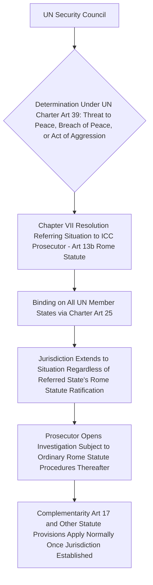

## UN Security Council Referral Power Under Rome Statute Article 13(b) and Its Politics

### Doctrinal Foundation: Article 13 and the Three Jurisdictional Triggers

**Article 13** of the Rome Statute establishes three distinct mechanisms by which the Court may exercise jurisdiction over a situation, corresponding to three different actors capable of initiating the Court's involvement: (a) referral of a situation by a **state party**; (b) referral of a situation by the **UN Security Council**, acting under Chapter VII of the UN Charter; and (c) initiation of an investigation by the **Prosecutor proprio motu** (on the Prosecutor's own initiative), subject to Pre-Trial Chamber authorization under Article 15. This item addresses the second of these — the **Security Council referral power** under Article 13(b) — which occupies a jurisdictionally unique position among the three triggers because, unlike state-party referrals and proprio motu investigations (both of which remain subject to the ordinary Article 12 territoriality/nationality consent-based preconditions), a Security Council referral **displaces the ordinary consent requirement entirely**.

### Key Points: The Legal Basis for Bypassing Article 12's Consent Framework

Recall that Article 12(2) ordinarily confines the Court's jurisdiction to situations where either the territorial state or the accused's state of nationality is a party to the Rome Statute (or has accepted jurisdiction under Article 12(3)). A Security Council referral under Article 13(b) operates **outside this framework**: the Statute's text does not condition a Security Council referral's validity on the referred state's own Rome Statute ratification status, meaning the Council can refer a situation occurring in, or involving nationals of, a **non-states-party state**, extending the Court's jurisdiction to a state that has never consented to the Rome Statute at all.

The doctrinal justification for this arrangement lies not within the Rome Statute's own consent-based architecture but in a **separate source of binding authority**: the UN Security Council's Chapter VII powers under the UN Charter. Article 25 of the UN Charter obligates all UN member states to accept and carry out Security Council decisions, and Article 39 empowers the Council to determine the existence of a threat to the peace, breach of the peace, or act of aggression, and to decide what measures shall be taken under Articles 41 and 42 to maintain or restore international peace and security. A Security Council referral of a situation to the ICC Prosecutor is understood as one such Article 41 measure (a non-forcible measure available to the Council in addressing a threat to or breach of the peace) — meaning the referral's binding force on the referred state derives from the **UN Charter's own supremacy** (Article 103 of the Charter provides that Charter obligations prevail over conflicting obligations under any other international agreement) rather than from the referred state's consent to the Rome Statute, a doctrinal construction distinct from, though sometimes conflated with, the separate "delegated territorial sovereignty" rationale that justifies ordinary Article 12(2)(a) territorial jurisdiction over non-party nationals.

### Mechanism: The Two Invoked Referrals — Darfur and Libya

As of the present, the Security Council referral power has been exercised twice, both directed at non-states-party states:

- **Darfur, Sudan**: **Security Council Resolution 1593** (2005), adopted with the United States, China, and other Council members abstaining rather than exercising a veto (a significant political detail, since a US or Chinese veto would have blocked the referral outright, and the decision by both states to abstain rather than block reflected a specific and, at the time, notable political calculation regarding the gravity of the Darfur situation weighed against each state's general skepticism toward the Court). Sudan is not a state party to the Rome Statute, and this referral led to the ICC's investigation and subsequent arrest warrants against Sudanese President Omar al-Bashir, among others — the first instance of an ICC arrest warrant issued against a sitting head of state, generating substantial subsequent controversy regarding head-of-state immunity, addressed further below.
- **Libya**: **Security Council Resolution 1970** (2011), adopted unanimously in the early days of the Libyan uprising against the Gaddafi government, referring the situation to the ICC Prosecutor. Libya likewise is not a state party to the Rome Statute, and this referral led to arrest warrants against Muammar Gaddafi (proceedings terminated following his death), Saif al-Islam Gaddafi, and others, generating a subsequent, separately significant complementarity and admissibility dispute regarding Libya's own capacity to conduct domestic proceedings against Saif al-Islam Gaddafi.

### Doctrinal Content: Resource and Funding Limitations Attached to Security Council Referrals

A structurally significant, though less prominently discussed, feature of both referral resolutions is that each included language providing that the **costs of the referred investigation would not be borne by the United Nations**, but rather by the states parties to the Rome Statute and by voluntary contributions — a provision reflecting the political reality that Council members skeptical of or opposed to the ICC (including permanent members that are not themselves states parties) were willing to permit a referral to proceed but not to commit UN regular-budget resources to its implementation, a recurring point of practical friction given the Court's own resource constraints and the substantial cost of investigating and prosecuting situations, such as Darfur and Libya, involving extensive fieldwork in unstable or non-cooperative environments.

### Analytical Debate: The Veto Power as a Structural Constraint on the Referral Mechanism's Consistency

The most significant and persistent debate concerning Article 13(b) concerns the practical consequence of embedding the referral trigger within the Security Council's own decision-making procedure, which is governed by **Article 27 of the UN Charter**: a Security Council resolution on non-procedural matters (which a referral to the ICC unambiguously is) requires the affirmative vote or abstention of all five **permanent members** (China, France, Russia, the United Kingdom, and the United States), any one of which can **veto** a proposed referral.

**The critical position**, advanced extensively in scholarly and civil-society commentary and reflected in periodic diplomatic initiatives (including a long-standing, though not adopted, proposal advanced by France and Mexico, among others, for permanent members to voluntarily refrain from vetoing Security Council action in response to mass atrocity situations) argues that this veto structure produces a **fundamentally inconsistent and politically selective** referral practice: because any permanent member can block a referral affecting itself, an ally, or a state in which it has a significant strategic interest, the mechanism is structurally incapable of reaching precisely those situations involving the interests of the most powerful states — the Darfur and Libya referrals, on this view, are illustrative not of the mechanism's even-handed availability but of the narrow, politically permissive circumstances (situations involving states with comparatively little protection from permanent-member veto interests) in which the mechanism happens to be usable, while numerous other situations of comparable or greater documented gravity have never been referred, or have had referral attempts blocked by veto (Security Council resolutions proposing referral of the Syria situation to the ICC, for instance, were vetoed by Russia and China in 2014), precisely because they implicated a permanent member's own interests or those of its allies.

**The position defending the mechanism's continued value**, while generally not disputing the empirical pattern of selective and veto-constrained usage described above, argues that the referral power's availability — even if exercised inconsistently — represents a **net addition** to the international accountability architecture that would not otherwise exist: absent Article 13(b), the ICC would have **no jurisdictional pathway whatsoever** to reach non-states-party situations short of that state's own ad hoc Article 12(3) acceptance, meaning the referral mechanism, however constrained by the veto, has in the two instances of its actual use extended meaningful accountability efforts to situations (Darfur, Libya) that would otherwise have remained entirely outside the Court's jurisdictional reach, and the mechanism's design reflects the broader, pre-existing structural reality of Security Council decision-making generally (the veto being a foundational and non-negotiable element of the UN Charter's original post-1945 institutional design, not a defect specific to its application to ICC referrals) rather than a defect introduced specifically or uniquely by the Rome Statute's own drafters.

[Inference] This debate is closely related to, but analytically distinct from, the separate controversy (addressed elsewhere in this curriculum) concerning non-party states' objections to the ICC's ordinary territorial jurisdiction over their nationals: whereas that debate concerns the legitimacy of the Court's jurisdictional reach as such, the debate over Article 13(b)'s veto-constrained character concerns the **consistency and even-handedness** of one particular jurisdictional pathway's actual pattern of use, a critique that in principle could be levied even by a commentator who otherwise fully accepts the legitimacy of the Security Council referral mechanism as a matter of law, on the separate ground that its selective invocation in practice may undermine the broader perception of the Court's impartiality and universality, independent of any doubt about the mechanism's formal legal validity.

### Related Topics

- ICC jurisdiction ratione personae, loci, and temporis, and the problem of non-signatory states
- The complementarity principle and admissibility before the ICC
- Head-of-state immunity and its interaction with international criminal jurisdiction
- The UN Security Council's Chapter VII powers and the maintenance of international peace and security
- The veto power and Security Council reform proposals
- State cooperation obligations and non-cooperation under Part 9 of the Rome Statute