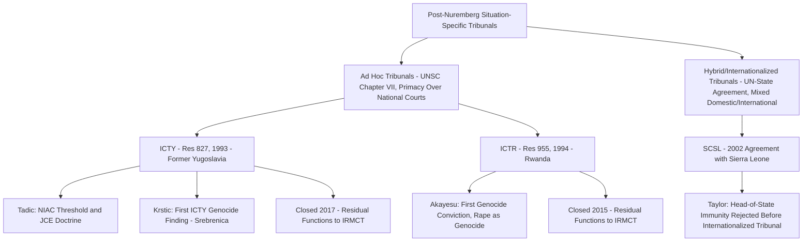

## Ad Hoc and Hybrid Tribunals: The ICTY, ICTR, and the Special Court for Sierra Leone

### Doctrinal Foundation: Tribunal Typology and the Path to a Permanent Court

Prior to the establishment of the International Criminal Court (ICC) in 2002, international criminal accountability for mass atrocity was pursued, following the post-World War II Nuremberg and Tokyo tribunals, through a succession of **situation-specific tribunals**, each created to address a particular conflict rather than through any standing institutional mechanism with general jurisdiction. These tribunals fall into two analytically distinct categories: **ad hoc international tribunals**, established directly by the UN Security Council under Chapter VII of the UN Charter and applying international law exclusively through an international bench and international procedure; and **hybrid (or "internationalized") tribunals**, established through an agreement between the United Nations and the affected state, combining international and domestic law, judges, and institutional elements. This item addresses the two principal ad hoc tribunals — the ICTY and ICTR — and one significant hybrid tribunal, the Special Court for Sierra Leone (SCSL), as illustrative of both models and of the broader jurisprudential legacy that shaped the Rome Statute's own eventual design.

### Key Points: The International Criminal Tribunal for the Former Yugoslavia (ICTY)

The **International Criminal Tribunal for the Former Yugoslavia** was established by **UN Security Council Resolution 827** on 25 May 1993, invoking the Council's Chapter VII authority to address the atrocities committed during the Yugoslav wars of dissolution, on the legal basis that the situation constituted a threat to international peace and security within the meaning of Article 39 of the UN Charter. Seated in The Hague, the ICTY possessed **primacy** over national courts (Article 9(2) of its Statute), meaning it could, at any stage, formally request that a national court defer to its concurrent jurisdiction — the opposite structural relationship from the ICC's later complementarity model, reflecting the ad hoc tribunal's more interventionist design in a context where national judicial systems in the former Yugoslavia were widely regarded, at the time, as incapable of delivering impartial accountability for the ongoing conflict.

The ICTY's jurisprudential legacy is substantial and has been referenced repeatedly elsewhere in this curriculum, including: the **Tadić Jurisdiction Decision** (1995), establishing the foundational two-part intensity/organization test for classifying non-international armed conflict; the **Tadić Appeals Judgment** (1999), articulating the doctrine of **joint criminal enterprise** as a mode of individual criminal liability; the **Galić** case, addressing the siege of Sarajevo and applying the proportionality and terror-prohibition standards under international humanitarian law; and the **Krstić** case (2001, 2004), the first ICTY judgment to find genocide had occurred, in relation to the July 1995 killings at Srebrenica, and to address the demanding specific-intent standard in that context. The ICTY completed its docket and formally closed in December 2017, with the residual functions of both the ICTY and ICTR transferred to the **International Residual Mechanism for Criminal Tribunals (IRMCT)**, established by Security Council Resolution 1966 (2010) to handle appeals, retrials, and enforcement matters after each tribunal's own closure.

### Key Points: The International Criminal Tribunal for Rwanda (ICTR)

The **International Criminal Tribunal for Rwanda** was established by **UN Security Council Resolution 955** on 8 November 1994, likewise invoking Chapter VII authority, to prosecute those responsible for genocide and other serious violations of international humanitarian law committed in Rwanda and by Rwandan citizens in neighboring states during 1994, seated in Arusha, Tanzania. Like the ICTY, the ICTR possessed primacy over national courts and shared, for a period, a common Appeals Chamber and Prosecutor with the ICTY, reflecting the two tribunals' close institutional and jurisprudential linkage.

The ICTR's most significant jurisprudential contribution is the **Akayesu judgment** (1998), the first judgment by an international tribunal to interpret and apply the crime of genocide as codified in the 1948 Genocide Convention, and notably the first international judgment to recognize that **rape and sexual violence** could constitute an act of genocide where committed with the requisite genocidal intent (as causing serious bodily or mental harm to members of a targeted group, or as a measure intended to prevent births within the group) — a doctrinally significant development extending genocide's scope beyond killing-centered conduct and substantially influencing the subsequent treatment of sexual violence in international criminal law, including its detailed codification as both a crime against humanity and a war crime in Rome Statute Articles 7 and 8. The ICTR formally closed in December 2015, with its residual functions likewise transferred to the IRMCT.

### Mechanism: The Special Court for Sierra Leone as Hybrid Model

The **Special Court for Sierra Leone (SCSL)** represents a structurally distinct institutional model from the ICTY and ICTR. Rather than being established by a Security Council resolution exercising Chapter VII authority, the SCSL was created through a **bilateral agreement between the United Nations and the Government of Sierra Leone**, signed in January 2002 pursuant to Security Council Resolution 1315 (2000), to prosecute those bearing the greatest responsibility for serious violations of international humanitarian law and Sierra Leonean law committed during the country's civil war (from 30 November 1996 onward). This treaty-based, rather than Chapter VII-imposed, foundation is the defining feature of the "hybrid" or "internationalized" tribunal category: the SCSL applied a **combination of international law and specified Sierra Leonean law**, its bench combined international and Sierra Leonean judges, and — significantly, unlike the purely international ICTY and ICTR — it was **seated in the affected country itself** (Freetown, with limited proceedings relocated to The Hague for security reasons in the case against Charles Taylor), a design intended to enhance the tribunal's proximity, accessibility, and perceived legitimacy for the affected domestic population, and reflecting broader post-ICTY/ICTR institutional learning about the comparative costs and benefits of situating international justice mechanisms closer to the affected society.

The SCSL's most significant jurisprudential contribution is the **Charles Taylor case** (2012 trial judgment, 2013 appeals judgment), in which the ever-sitting and then-former President of Liberia was convicted for aiding and abetting war crimes and crimes against humanity committed in Sierra Leone through his support for the Revolutionary United Front — the **first conviction of a former head of state by an international or internationalized tribunal since Nuremberg**. The case is also doctrinally significant for the SCSL Appeals Chamber's 2004 decision in *Prosecutor v. Taylor* rejecting Taylor's argument that his then-incumbent status as a sitting head of state entitled him to immunity from the Court's jurisdiction, reasoning that the principle of head-of-state immunity, whatever its continued application before **domestic** courts of another state, does not apply to bar prosecution before an **international** tribunal properly vested with jurisdiction over the individual — a ruling of direct relevance to, and frequently cited in connection with, the subsequent and structurally analogous controversy over head-of-state immunity arising from the ICC's own Bashir arrest warrant.

### Doctrinal Content: Comparative Institutional Assessment — Ad Hoc Versus Hybrid Design Trade-offs

[Inference] The comparative experience of the ICTY, ICTR, and SCSL is generally understood to have directly informed both the Rome Statute's own eventual complementarity-based design (discussed elsewhere in this curriculum) and subsequent institutional choices regarding further hybrid mechanisms (such as the Extraordinary Chambers in the Courts of Cambodia and the Special Tribunal for Lebanon, not addressed in comprehensive detail in this item but reflecting the same broader hybrid-model lineage), through several recognized trade-offs:

- **Cost and duration**: both the ICTY and ICTR became subject to sustained criticism regarding their considerable cost and lengthy duration relative to the number of individuals ultimately tried, a concern that contributed to the design emphasis, in both the SCSL and the later ICC, on more tightly focused prosecutorial strategies targeting those bearing the greatest responsibility rather than pursuing a broader universe of potential defendants.
- **Legitimacy and local ownership**: the SCSL's Freetown location and its combination of international and Sierra Leonean judges and law reflected a deliberate institutional response to critiques that the ICTY and ICTR's geographic and institutional remoteness from the affected societies (The Hague and Arusha, respectively) diminished local ownership, comprehension, and perceived legitimacy of the proceedings among the populations most directly affected by the underlying atrocities.
- **Consent and legal basis**: the ad hoc tribunals' Chapter VII foundation gave the ICTY and ICTR immediately binding jurisdiction, including primacy over domestic proceedings, without requiring the affected state's consent (a structurally available option only because both situations were, at the relevant time, treated by the Security Council as threats to international peace and security justifying Chapter VII action) — whereas the SCSL's consensual, agreement-based foundation reflects a different legitimacy premise, grounded in the affected state's own invitation and cooperation rather than externally imposed Council authority, a distinction with consequences for the tribunal's practical cooperation-dependent functioning (an ad hoc tribunal's Chapter VII-derived primacy compels cooperation from all UN member states in principle, whereas a hybrid tribunal's cooperation regime depends more heavily on the specific terms of its founding agreement and the continued cooperation of the host state and other relevant states).

### Analytical Debate: Did the Ad Hoc/Hybrid Era Achieve Its Deterrent and Reconciliation Aims?

[Speculation] A genuine and empirically contested debate, not fully resolved in the scholarly literature, concerns the degree to which the ICTY, ICTR, and SCSL achieved their broader stated goals of **deterrence, reconciliation, and contribution to sustainable peace** in their respective post-conflict societies, as distinct from their more narrowly measurable function of securing individual convictions. Proponents point to the substantial body of historical fact-finding and legal precedent these tribunals generated (including the first international genocide conviction, the elaboration of joint criminal enterprise and command responsibility doctrines, and the jurisprudential recognition of sexual violence as an instrument of genocide), and argue that this legacy has had lasting normative and educational value independent of any more diffuse and harder-to-measure deterrent or reconciliatory effect. Critics, drawing on subsequent survivor and affected-community research in both the former Yugoslavia and Rwanda, have raised more skeptical assessments regarding the tribunals' actual contribution to intercommunal reconciliation on the ground, noting persistent ethnic and political division in both regions notwithstanding decades of tribunal activity, and questioning whether the considerable financial and institutional resources devoted to these mechanisms might have achieved comparable or superior reconciliatory outcomes if directed toward domestic transitional justice mechanisms (truth commissions, local reparations programs, or community-based reconciliation initiatives) instead of, or in addition to, internationalized criminal prosecution — a debate that, given its dependence on complex and contested empirical claims about long-term social and political outcomes in specific post-conflict societies, resists a definitive resolution on the basis of legal analysis alone.

### Related Topics

- The Rome Statute and the four core crimes: genocide, crimes against humanity, war crimes, and aggression
- Modes of individual criminal liability: command responsibility and joint criminal enterprise
- Head-of-state immunity and its interaction with international criminal jurisdiction
- The complementarity principle and admissibility before the ICC
- The 1948 Genocide Convention and the crime of genocide
- Transitional justice mechanisms: truth commissions and reparations