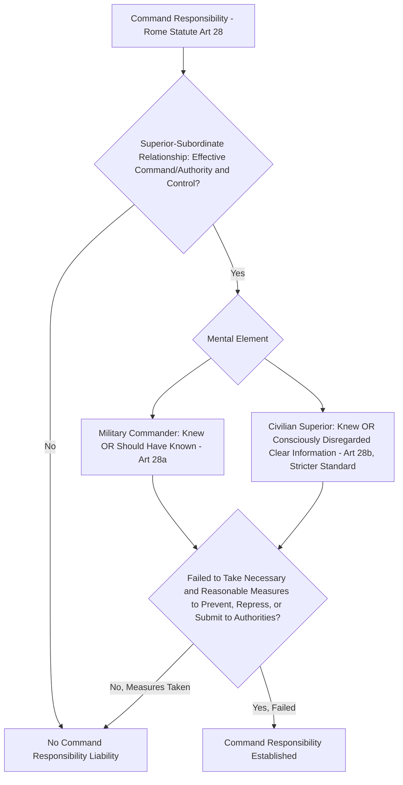

## Modes of Individual Criminal Responsibility: Command Responsibility and Superior Orders

### Doctrinal Foundation: Direct and Derivative Liability in International Criminal Law

International criminal law distinguishes between modes of liability that attach responsibility to a person for their own **direct** participation in a crime (planning, ordering, committing, or aiding and abetting) and a distinct category of liability that attaches responsibility to a **superior** for crimes committed by their **subordinates**, based on the superior's own failure to exercise proper control — a doctrine termed **command responsibility** (or superior responsibility). This item addresses command responsibility as a mode of liability, together with the doctrinally related but analytically distinct defense of **superior orders**, which addresses the converse scenario: whether a **subordinate** who committed a crime pursuant to a superior's order may thereby escape or mitigate their own individual criminal responsibility.

### Key Points: The Doctrinal Origins and Elements of Command Responsibility

Command responsibility traces its modern codification to the post-World War II *Yamashita* case (In re Yamashita, US Military Commission, 1946, affirmed by the US Supreme Court), in which a Japanese general was held responsible for atrocities committed by troops under his command in the Philippines, notwithstanding the absence of direct evidence that he had ordered or even known of the specific atrocities, on the theory that a commander bears an affirmative duty to control the conduct of forces under his command. This doctrine was subsequently codified in treaty form in **Article 87 of Additional Protocol I** (1977) to the Geneva Conventions, and given its most developed contemporary articulation in **Article 28 of the Rome Statute**, which distinguishes between military commanders and non-military superiors and establishes the following cumulative elements required to establish command responsibility:

1. **A superior-subordinate relationship**, involving **effective command and control**, or effective authority and control, over the forces or subordinates who committed the crime — a factual, functional test assessing the superior's genuine material ability to prevent or repress the subordinates' criminal conduct, rather than a purely formal or nominal hierarchical designation.
2. **A mental element**, which Article 28 formulates differently depending on whether the superior is a military commander or a civilian superior: a **military commander** is liable where he or she **knew or, owing to the circumstances at the time, should have known** that forces were committing or about to commit such crimes (Article 28(a)(i)) — a standard incorporating both actual knowledge and a **constructive knowledge** (negligence-based) component; a **civilian superior**, by contrast, is held to a stricter standard under Article 28(b)(i), liable only where he or she **knew, or consciously disregarded information which clearly indicated**, that subordinates were committing or about to commit such crimes — a formulation generally understood to exclude the military commander's broader "should have known" constructive-knowledge standard, reflecting the drafters' judgment that civilian superiors typically possess less direct and continuous operational control over subordinates than military commanders and should accordingly face a correspondingly higher mens rea threshold before criminal liability attaches.
3. **A failure to take necessary and reasonable measures**, either to **prevent** the commission of the crimes (where the superior had knowledge or should have had knowledge before the crimes occurred) or to **repress** their commission or **submit the matter to competent authorities for investigation and prosecution** (where the crimes have already occurred) — meaning liability attaches not merely to a superior's passive awareness, but specifically to the superior's failure to act on that awareness within the scope of measures genuinely available given the superior's actual authority and capacity.

### Mechanism: Command Responsibility as a Distinct Mode of Liability, Not Strict Liability

A critical doctrinal clarification, developed substantially through ICTY and ICTR jurisprudence and carried into the Rome Statute's Article 28 formulation, is that command responsibility is **not a form of strict or vicarious liability** — the superior is not held responsible for the subordinate's crime as though the superior had personally committed it, but rather is held liable for the superior's **own distinct failure**: the dereliction of the affirmative duty to prevent or punish. This distinction carries practical sentencing and characterization consequences: the ICTY Appeals Chamber, in *Prosecutor v. Hadžihasanović* and related jurisprudence, confirmed that a commander convicted under this doctrine is convicted for their **own** omission-based culpability, which may in appropriate circumstances be reflected in sentencing considerations distinct from those applicable to a direct perpetrator, even though the underlying substantive crime for which the superior is held responsible is the same crime the subordinates committed.

[Inference] The "should have known" constructive-knowledge standard applicable to military commanders under Article 28(a) has generated some interpretive debate regarding its precise evidentiary content — specifically, what information a commander must be shown to have had reasonably available, and what steps a commander must be shown to have failed to take to seek out further information, before constructive knowledge can properly be inferred — since the standard, unlike actual knowledge, necessarily depends on an assessment of what a reasonably diligent commander in the same operational circumstances would have ascertained, an inherently contextual and fact-intensive inquiry not reducible to a fixed evidentiary formula.

### Doctrinal Content: The Defense of Superior Orders

Distinct from command responsibility (which concerns a **superior's** liability for a **subordinate's** crime) is the defense of **superior orders**, which concerns whether a **subordinate** who commits a crime pursuant to an order from a superior may escape or mitigate liability for that crime on the ground that they were merely following orders. The modern treaty-law position, codified in **Article 33 of the Rome Statute**, establishes a **general rejection** of superior orders as a complete defense, subject to a narrow, cumulative three-part exception:

Article 33(1) provides that the fact a crime was committed pursuant to an order of a Government or a superior, whether military or civilian, **shall not relieve that person of criminal responsibility** unless: (a) the person was **under a legal obligation to obey** orders of the Government or superior in question; (b) the person **did not know that the order was unlawful**; and (c) the order was **not manifestly unlawful**. All three conditions must be satisfied cumulatively for the defense to succeed, and Article 33(2) forecloses the exception's practical availability for the two most serious core crimes by providing an **irrebuttable presumption**: orders to commit **genocide or crimes against humanity are deemed manifestly unlawful** as a matter of law, meaning condition (c) can never be satisfied for these two crime categories, leaving the Article 33 exception potentially available, at most, only in relation to certain war crimes where the unlawfulness of a specific order might genuinely be less than manifest to a reasonable subordinate in the circumstances.

### Key Points: The Historical Trajectory From Nuremberg to Article 33

The Rome Statute's restrictive approach to superior orders reflects a considered rejection of the broader defense that had existed in some prior formulations, tracing a doctrinal trajectory across three stages:

- **Pre-Nuremberg military law** in several states had historically recognized superior orders as something closer to a **complete defense**, reflecting the view that a soldier's duty of obedience should generally shield them from liability for following a lawful chain of command's instructions.
- The **Nuremberg Charter (1945)**, Article 8, adopted the opposite extreme position: superior orders **could not** serve as a defense at all, though the Charter permitted the tribunal to consider such orders **in mitigation of punishment** if the tribunal determined that justice so required — a formulation that rejected superior orders as an excuse for liability but preserved its relevance to sentencing.
- The **Rome Statute's Article 33** represents an intermediate position between these two historical poles: rather than a wholesale rejection of superior orders as a defense (as at Nuremberg) or a broad availability of the defense (as in earlier military law traditions), it establishes a **narrow, conditional exception**, itself further constrained to near-total unavailability for genocide and crimes against humanity by the Article 33(2) manifest-unlawfulness presumption, reflecting the drafters' judgment that some very limited scope for the defense might be doctrinally coherent (a subordinate under genuine legal compulsion to obey, genuinely and reasonably unaware of an order's unlawfulness, faced with an order not manifestly criminal on its face) without reopening the door to the broader superior-orders defense Nuremberg had specifically and deliberately foreclosed.

### Analytical Debate: The Coherence and Practical Scope of the Manifest Illegality Standard

A genuine debate exists regarding the practical coherence and scope of the "manifest unlawfulness" standard underlying both Article 33(1)(c)'s conditional exception and Article 33(2)'s categorical presumption for genocide and crimes against humanity.

**One position** argues that the manifest-illegality standard performs valuable doctrinal work by calibrating the superior-orders defense to a **subordinate's reasonably expected capacity for independent moral and legal judgment**: an order to, for example, execute unarmed civilian detainees or members of a protected group is understood to be so evidently and unmistakably contrary to basic legal and moral norms that no reasonable subordinate, regardless of military hierarchy or training, could credibly claim ignorance of its unlawfulness — meaning the manifest-illegality threshold appropriately distinguishes between orders whose illegality a subordinate might genuinely and reasonably fail to recognize (a technical or context-dependent violation of a specific IHL targeting rule, perhaps) and orders whose illegality is so self-evident that permitting a subordinate to disclaim awareness would improperly excuse what is, in substance, a choice not to exercise available moral judgment.

**The critical position** questions whether the manifest-illegality standard can be applied with genuine consistency across the widely varying institutional, cultural, and training contexts in which subordinates in different armed forces and different conflicts actually operate, noting that what might be "manifestly" unlawful to a subordinate trained in a rigorous IHL compliance culture may be considerably less self-evident to a subordinate embedded in an armed force or organized armed group with different institutional norms, indoctrination, or training — raising a concern that the standard's application may, in practice, depend heavily on assumptions about a generalized reasonable-subordinate standard that does not adequately account for this variation, while also noting the practical reality that, given Article 33(2)'s categorical foreclosure of the defense for genocide and crimes against humanity, and the demanding cumulative three-part test even for the narrower category of war crimes to which the defense might in principle apply, the practical scope within which Article 33(1)'s conditional exception could ever actually succeed before the ICC remains, as an empirical matter, extremely narrow — a point some scholars raise not as a criticism of the standard's coherence as such, but as an observation that the provision's practical function may be more symbolic (preserving a doctrinally coherent, narrowly-bounded space for the defense in principle) than operative (the defense being unlikely, in practice, to succeed in any specific prosecution before the Court).

### Related Topics

- The Rome Statute and the four core crimes: genocide, crimes against humanity, war crimes, and aggression
- Ad hoc and hybrid tribunals: the ICTY, ICTR, and the Special Court for Sierra Leone
- Head-of-state immunity and its interaction with international criminal jurisdiction
- Joint criminal enterprise and co-perpetration as modes of individual criminal liability
- The principle of legality (nullum crimen sine lege) under Rome Statute Article 22
- Additional Protocols I and II and the international versus non-international armed conflict distinction