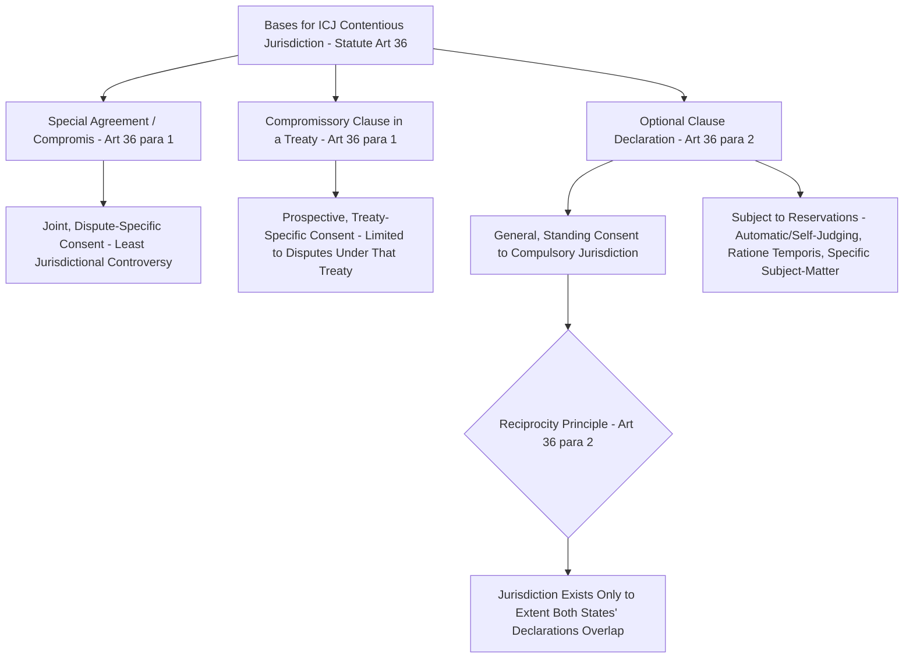

## The ICJ's Contentious Jurisdiction: Consent, Compromissory Clauses, and Article 36 Optional Declarations

### Doctrinal Foundation: Consent as the Foundational Premise of ICJ Jurisdiction

The International Court of Justice (ICJ), established by the UN Charter as the principal judicial organ of the United Nations and governed by the **Statute of the International Court of Justice** (annexed to and forming an integral part of the UN Charter under Article 92), exercises contentious jurisdiction — the authority to adjudicate disputes between states with binding effect — on a foundational premise fundamentally distinct from domestic court systems: **no state may be compelled to submit a dispute to the Court against its will**. This principle of **consent-based jurisdiction** reflects the basic structural feature of the international legal system addressed elsewhere in this curriculum: the absence of a global sovereign or centralized enforcement authority means that a state's own consent, given in one of several recognized forms, is the indispensable jurisdictional foundation for any ICJ contentious proceeding, mirroring the same consent-based logic underlying treaty obligation generally.

**Article 36 of the ICJ Statute** enumerates the primary bases on which this consent may be established, organized in this item around three principal mechanisms: (1) **special agreement** (compromis); (2) **compromissory clauses** embedded within a treaty; and (3) **optional declarations** under Article 36(2), the mechanism generating the most doctrinally intricate jurisprudence and known as the "**optional clause**" system.

### Key Points: Special Agreement (Compromis)

The most straightforward jurisdictional basis is the **special agreement**, or *compromis*, referenced in Article 36(1): two or more states, having a specific dispute already in existence, jointly agree by treaty to submit that particular dispute to the Court for resolution. This mechanism requires no prior or general jurisdictional commitment — the states' consent is given specifically and solely for the dispute in question, at the time the dispute is referred, and the case proceeds jointly as a matter the parties themselves have brought before the Court by mutual agreement, generally producing the least jurisdictional controversy of the three mechanisms, since consent is express, contemporaneous, and dispute-specific. Notable examples include the *Frontier Dispute* (Burkina Faso v. Mali, 1986) and numerous maritime and land boundary delimitation cases submitted by mutual agreement of the parties.

### Mechanism: Compromissory Clauses

A **compromissory clause** is a provision within a multilateral or bilateral treaty, agreed at the time the treaty itself is negotiated, by which the parties consent **in advance** that disputes concerning the interpretation or application of that treaty may be referred to the ICJ, typically at the unilateral request of any one party to the dispute (distinguishing this mechanism from the *compromis*, which requires the parties' joint agreement at the time of the specific dispute). This form of consent is therefore **prospective and treaty-specific**: it binds a state only with respect to disputes arising under the particular treaty containing the clause, not to disputes generally.

A frequently invoked example is **Article IX of the 1948 Genocide Convention**, which provides that disputes between the contracting parties relating to the interpretation, application, or fulfilment of the Convention shall be submitted to the ICJ at the request of any party to the dispute — the jurisdictional basis underlying *Application of the Genocide Convention* (Bosnia and Herzegovina v. Serbia and Montenegro, 2007) and, more recently, *The Gambia v. Myanmar* and *South Africa v. Israel*, among other Genocide Convention-based proceedings. Because compromissory clauses are treaty-specific, a state's consent given through such a clause can, depending on the treaty's own terms, potentially be limited through a **reservation** to that specific clause upon ratification of the underlying treaty (addressed further below as a significant limiting device), and the ICJ's jurisdiction founded on a compromissory clause extends only to the specific category of disputes ("relating to the interpretation, application, or fulfilment" of that particular convention, in the Genocide Convention's formulation) that the clause itself defines — a scope-of-consent question that has itself generated significant jurisdictional litigation in specific cases regarding whether a given dispute genuinely falls within the compromissory clause's terms.

### Doctrinal Content: The Optional Clause System Under Article 36(2)

The most doctrinally complex jurisdictional mechanism is the **optional clause**, established by **Article 36(2)** of the ICJ Statute, which permits a state party to the Statute to declare, at any time, that it recognizes as **compulsory ipso facto and without special agreement**, in relation to any other state accepting the same obligation, the Court's jurisdiction over specified categories of legal disputes (the legal categories enumerated in Article 36(2) include the interpretation of a treaty, questions of international law, the existence of a fact which, if established, would constitute a breach of an international obligation, and the nature or extent of reparation to be made for such breach).

The critical governing principle of the optional clause system is **reciprocity**: because a declaration under Article 36(2) is made unilaterally by each state, the Court's jurisdiction over a given dispute between two declarant states exists **only to the extent that the two states' respective declarations overlap** — meaning a respondent state can invoke, against the applicant state, **any limitation or reservation contained in the applicant's own declaration**, even where the respondent's own declaration contains no equivalent limitation, since jurisdiction under Article 36(2) is fundamentally a function of the mutual, overlapping scope of consent between the two specific states before the Court. This reciprocity principle was authoritatively confirmed by the ICJ in the *Right of Passage over Indian Territory* case (Portugal v. India, 1957) and has been repeatedly applied since.

### Key Points: Common Limitations and Reservations to Optional Declarations

States making Article 36(2) declarations frequently attach reservations narrowing their scope of consent, several categories of which recur across state practice and have generated significant jurisprudential attention:

- **Ratione temporis reservations**, limiting the declaration's application to disputes arising after a specified date, or excluding disputes arising from facts or situations predating a specified date — a reservation frequently litigated regarding the precise temporal scope of a "dispute" versus the underlying "facts or situations" giving rise to it.
- **Reservations excluding specific categories of dispute**, such as disputes concerning matters essentially within the reserving state's domestic jurisdiction, disputes with Commonwealth states (a reservation historically used by several Commonwealth states with respect to disputes among themselves, on the premise that such disputes should be resolved through other, non-ICJ Commonwealth mechanisms), or disputes concerning specific subject matters such as the use of nuclear weapons or matters connected with certain ongoing or previously-concluded armed conflicts.
- **The "automatic" or "self-judging" reservation**, most notably associated with the United States' now-withdrawn 1946 declaration (the **Connally Reservation**), which purported to exclude disputes concerning matters essentially within the domestic jurisdiction of the United States **as determined by the United States itself** — a self-judging formulation that generated substantial doctrinal controversy regarding its compatibility with the ICJ Statute's own Article 36(6), which provides that in the event of a dispute as to whether the Court has jurisdiction, the matter **shall be settled by the decision of the Court**, a provision seemingly in direct tension with a reservation purporting to reserve that very determination to the reserving state's own unilateral judgment. [Inference] The compatibility of self-judging reservations with Article 36(6) has never been definitively and generally resolved by the Court itself in a manner squarely addressing the reservation's validity as such, since the United States withdrew its Article 36(2) declaration altogether in 1985, following the *Nicaragua* case (addressed below), before the question could be tested to a final judicial determination — though the weight of scholarly opinion has generally been skeptical of self-judging reservations' compatibility with the Statute's own textual assignment of jurisdictional determinations to the Court itself.

### Analytical Debate: The Significance and Limits of the Optional Clause System in Practice

The doctrinal promise of the optional clause system — a mechanism by which the Court's jurisdiction could, over time, approach something closer to genuinely **compulsory** jurisdiction as more states accept Article 36(2) declarations without significant limiting reservations — has been the subject of a long-standing debate regarding how far this promise has actually been realized in practice.

**The more optimistic position** notes that a substantial number of states — currently under 75 of the UN's roughly 193 member states, a minority but nonetheless a meaningful cohort — maintain active Article 36(2) declarations, and that where two declarant states' declarations do sufficiently overlap, the mechanism provides a genuinely compulsory jurisdictional basis without need for the respondent's specific, case-by-case consent (in contrast to a *compromis*, which requires exactly such specific consent), representing a meaningful, if partial, advance toward the broader project of compulsory international adjudication envisioned by the Statute's drafters.

**The more skeptical position** emphasizes several persistent limitations: the minority of UN member states maintaining declarations at all (with several major and militarily significant powers, including the United States, China, and Russia, currently lacking active Article 36(2) declarations, following the US withdrawal after *Nicaragua* and China and Russia never having made comparable declarations of general compulsory jurisdiction), the frequent use of significant reservations by many declarant states that substantially narrow the practical scope of their nominal acceptance of compulsory jurisdiction, and the reciprocity principle's practical effect of permitting a respondent state to shelter behind even the applicant's own reservations — cumulatively meaning that, notwithstanding the optional clause's formal availability, a very substantial proportion of potential inter-state disputes remain, as a practical matter, outside any compulsory ICJ jurisdictional basis absent a specific compromissory clause or *compromis*, such that the *Nicaragua* case itself (Nicaragua v. United States, 1986, in which the Court found jurisdiction notwithstanding the US's attempted last-minute modification of its declaration shortly before the case was filed, a modification the Court found ineffective given the declaration's own six-months'-notice requirement for such modifications) is frequently cited as illustrative of precisely the kind of jurisdictional controversy and subsequent state withdrawal (the US departure from the optional clause system altogether following its unfavorable jurisdictional and merits rulings) that has, in practice, constrained rather than expanded the optional clause system's real-world reach over time.

### Related Topics

- State consent as the foundation of international legal obligation
- Sources of international law under Article 38 of the ICJ Statute
- The ICJ's advisory jurisdiction and its relationship to contentious jurisdiction
- UNCLOS Annex VII arbitration and the 2016 Philippines v. China South China Sea award
- The *Nicaragua* case and the use of force under customary international law
- State reservations to human rights treaties and their effect on enforceability