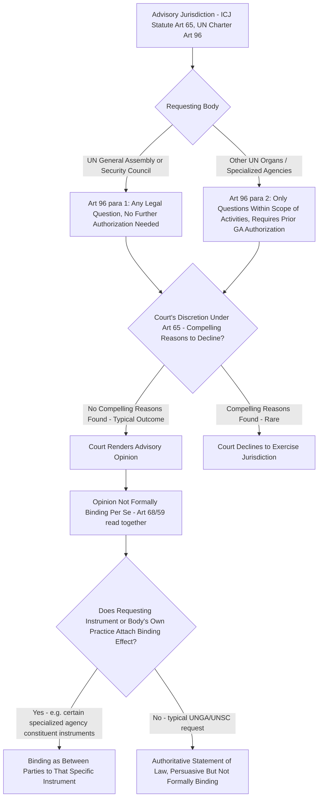

## The ICJ's Advisory Jurisdiction and Its Legal Effect on Requesting Organs

### Doctrinal Foundation: Advisory Jurisdiction as a Distinct Function From Contentious Jurisdiction

The International Court of Justice (ICJ) exercises two analytically distinct forms of jurisdiction under its Statute: **contentious jurisdiction**, addressing disputes between states with binding effect on the parties, and **advisory jurisdiction**, under which the Court renders a legal opinion on a question of law referred to it by an authorized UN organ or specialized agency, without any state being formally a "party" to the proceeding in the manner characteristic of contentious cases. The governing textual basis is **Article 65 of the ICJ Statute**, which provides that the Court **may** give an advisory opinion on any legal question at the request of whatever body may be authorized by or in accordance with the UN Charter to make such a request, read together with **Article 96 of the UN Charter**, which specifies who holds this authorization.

Article 96(1) grants the **UN General Assembly** and the **UN Security Council** unconditional authority to request an advisory opinion on **any legal question**. Article 96(2) extends a more limited authorization to **other organs of the UN and specialized agencies** (such as the World Health Organization or the International Labour Organization), which may request advisory opinions, but only on legal questions **arising within the scope of their activities**, and only where the General Assembly has specifically authorized that organ or agency to make such requests — a two-part limitation (subject-matter scope and prior General Assembly authorization) that does not constrain the General Assembly or Security Council's own broader Article 96(1) authority.

### Key Points: The Discretionary Character of the Court's Advisory Function

A significant doctrinal feature distinguishing advisory jurisdiction from contentious jurisdiction is that Article 65's use of the word "**may**" has been consistently interpreted by the Court itself as conferring a **discretion to decline** to render an advisory opinion even where a properly authorized organ has made a properly framed request — in contrast to the Court's essentially non-discretionary obligation to exercise jurisdiction once validly established in a contentious case. The Court has, however, exercised this discretion to decline **only very rarely** in its practice, and has articulated a consistently high threshold for doing so: in *Legality of the Threat or Use of Nuclear Weapons* (Advisory Opinion, 1996) and repeated in subsequent advisory proceedings, the Court held that only **"compelling reasons"** would justify a refusal to give an opinion requested by a competent UN organ, reflecting the Court's own stated view that, as the principal judicial organ of the United Nations, it should in principle be available to assist the political organs of the UN in the discharge of their own functions, absent some genuinely serious countervailing concern.

Considerations the Court has weighed, without ultimately finding them "compelling" in the great majority of instances, include: whether the request concerns a matter that is, in substance, a bilateral dispute between specific states that have not consented to the Court's jurisdiction (an argument the Court rejected, for instance, in the *Western Sahara* Advisory Opinion of 1975, distinguishing the advisory function's broader institutional purpose from the consent-based logic specifically governing contentious jurisdiction); whether the question posed is genuinely a **legal** question susceptible to a legal answer, as opposed to an essentially political question dressed in legal terminology (the Court has generally held that a question's political context or motivation does not deprive it of its legal character, so long as the question posed can genuinely be answered by reference to legal rules and principles); and whether rendering the opinion would have some improper or circumventing effect on an unresolved bilateral dispute — a concern raised, and ultimately not found compelling by the Court, in connection with the *Wall* Advisory Opinion, discussed further below.

### Doctrinal Content: The Non-Binding Character of Advisory Opinions, and Its Qualifications

The default legal character of an ICJ advisory opinion is **non-binding**. This follows from **Article 59** of the ICJ Statute (applicable to advisory proceedings by virtue of Article 68's direction that the Court shall be guided by the provisions of the Statute relating to contentious cases "to the extent to which it recognizes them to be applicable"), which provides that a decision of the Court "has no binding force except between the parties and in respect of that particular case" — a provision presupposing the existence of formal "parties" to a contentious case, a category that, strictly speaking, does not exist in the same sense in an advisory proceeding, since no state is a "party" bound by the outcome merely by virtue of having participated in advisory proceedings or being named or discussed in the opinion.

This general non-binding characterization is subject to an important **qualification**: certain treaties or constituent instruments of international organizations expressly provide, in advance, that an ICJ advisory opinion rendered on a question arising under that specific instrument **shall be accepted as binding** by the parties to a dispute under that instrument — meaning the binding effect in such cases derives not from the advisory opinion mechanism itself, but from the **separate, prior consent** of the states parties to that specific instrument to treat the resulting advisory opinion as binding, a construction analogous in its underlying consent-based logic to a compromissory clause conferring binding contentious jurisdiction, but achieving binding effect indirectly through the advisory mechanism rather than through the ordinary contentious jurisdiction and judgment process. Certain specialized agency constituent instruments and headquarters or privileges-and-immunities agreements have historically included such provisions, converting what would otherwise be a non-binding advisory opinion into a binding resolution of the specific dispute as between the parties to that particular instrument.

### Key Points: Practical and Authoritative Effect Notwithstanding Formal Non-Bindingness

[Inference] Notwithstanding the general absence of formal binding force, ICJ advisory opinions have, in practice, exercised very substantial **authoritative and normative influence**, for reasons parallel to those discussed elsewhere in this curriculum regarding non-binding instruments more generally (such as UN treaty body Views and General Comments): an advisory opinion represents the considered legal judgment of the UN's principal judicial organ, rendered after full written and oral proceedings in which interested states and organizations are typically invited to participate, and is accordingly treated by states, other international courts and tribunals, and subsequent ICJ benches themselves as a highly authoritative, if not formally binding, statement of the applicable international law — a status reflected in the frequency with which advisory opinions are cited as precedent-like authority in subsequent contentious and advisory proceedings, notwithstanding the ICJ Statute's own Article 59 stipulation (again applicable by extension) that the Court's decisions do not, strictly speaking, constitute binding precedent even as between contentious cases, let alone as between an advisory opinion and a later dispute.

Several advisory opinions illustrate this practical significance despite formal non-bindingness: the ***Reparation for Injuries* Advisory Opinion** (1949), requested by the General Assembly, established that the United Nations possesses international legal personality capable of bringing an international claim, a foundational holding for the law of international organizations generally, notwithstanding its advisory (and hence formally non-binding) character; the ***Legal Consequences of the Construction of a Wall in the Occupied Palestinian Territory* Advisory Opinion** (2004), requested by the General Assembly, addressed the legality under international law of Israel's construction of a barrier in the West Bank, including its application of the law of occupation and, as referenced elsewhere in this curriculum, its holding regarding the continued application of Geneva Convention IV protections notwithstanding disputes over the underlying territory's sovereign status — an opinion that, notwithstanding its formally non-binding character and Israel's own rejection of several of its central findings, has been repeatedly invoked in subsequent General Assembly resolutions, other international fora, and scholarly and diplomatic discourse as an authoritative statement of the relevant law.

### Analytical Debate: Does the Advisory Mechanism Function as a De Facto Route Around Consent-Based Contentious Jurisdiction?

A significant and recurring debate concerns whether the advisory jurisdiction mechanism, precisely because it does not require the consent of any specifically implicated state (unlike contentious jurisdiction, which as addressed elsewhere in this curriculum rests fundamentally on state consent through a *compromis*, a compromissory clause, or an Article 36(2) declaration), can function, in substance, as a means of obtaining an authoritative ICJ pronouncement on a matter that is, in reality, a bilateral or otherwise state-specific dispute — effectively circumventing the consent requirement that would otherwise govern if the same question were instead brought as a contentious case.

**The critical position**, articulated by states whose interests have been adversely affected by a particular advisory opinion (Israel's objections to the *Wall* opinion, and Morocco's more qualified engagement with certain aspects of the *Western Sahara* opinion, are illustrative), argues that where a General Assembly-requested advisory opinion in substance and effect resolves, or purports to authoritatively pronounce upon, the legal position of a specific state in what is genuinely a bilateral dispute with another state or non-state entity, permitting the Court to proceed via the advisory route allows the political organs of the UN — where a requesting majority can be assembled in the General Assembly, whose voting arrangements do not require the consent or even the participation of the specifically affected state — to obtain from the Court precisely the kind of authoritative legal pronouncement on that state's conduct that the ordinary consent-based contentious jurisdiction framework was specifically designed to make available only where the affected state has itself consented.

**The position defending the advisory mechanism's use in such cases**, reflected in the Court's own repeated jurisprudence rejecting consent-based objections to its advisory jurisdiction (most explicitly in *Western Sahara* and reaffirmed in the *Wall* opinion), rests on the doctrinal distinction between the **legal effect of the Court's opinion** and the **institutional function the advisory mechanism serves**: an advisory opinion, however substantively significant its content, remains formally non-binding on any state (absent the specific instrument-based exception discussed above) and does not purport to resolve a dispute between the affected states in the manner a contentious judgment would — its function, as a matter of the Charter's own institutional design, is to **assist a UN political organ** (typically the General Assembly) in the discharge of that organ's own separate, Charter-conferred functions (such as decisions regarding decolonization, the status of a territory, or other matters within the General Assembly's own competence), meaning the affected state's absence of consent to the advisory proceeding is not a jurisdictional defect in the same sense it would be for a contentious case, precisely because the advisory opinion does not adjudicate a dispute between that state and another party with binding force, but rather informs the requesting organ's own subsequent, separately-taken political decisions and resolutions.

[Inference] This doctrinal defense, while consistently accepted by the Court itself across its advisory jurisprudence, has not fully dissolved the underlying practical tension identified by critics: even a formally non-binding opinion carries, as illustrated by the sustained diplomatic and normative weight subsequently attached to opinions such as the *Wall* opinion, a significant real-world authoritative and reputational effect on the state whose conduct the opinion addresses, such that the formal non-bindingness/informing-function characterization, while doctrinally accurate as a matter of the advisory mechanism's technical legal architecture, may understate the practical, non-formal pressure such an opinion exerts on the affected state's international standing and subsequent diplomatic position, a gap between formal legal characterization and practical effect that recurs as a broader theme across several of the non-binding international law mechanisms addressed throughout this curriculum.

### Related Topics

- The ICJ's contentious jurisdiction: consent, compromissory clauses, and Article 36 optional declarations
- Protection of prisoners of war and civilians under occupation
- The international legal personality of international organizations
- The right to self-determination in international law
- UN treaty-body reporting mechanisms and their enforcement limitations
- Sources of international law under Article 38 of the ICJ Statute