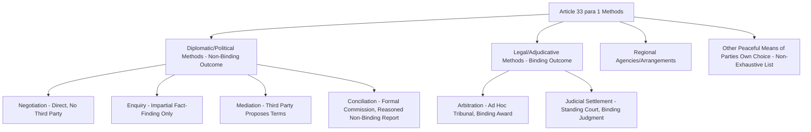

## Peaceful Settlement Methods Under UN Charter Article 33

### Doctrinal Foundation: The Charter's Obligation to Seek Peaceful Settlement

**Article 33 of the UN Charter**, situated within Chapter VI ("Pacific Settlement of Disputes"), establishes the foundational treaty-law obligation underlying the entire field of international dispute settlement: **Article 33(1)** provides that the parties to any dispute, the continuance of which is likely to endanger the maintenance of international peace and security, "shall, first of all, seek a solution" by a listed set of peaceful means: **negotiation, enquiry, mediation, conciliation, arbitration, judicial settlement, resort to regional agencies or arrangements, or other peaceful means of their own choice**. This provision operationalizes the broader Charter-level prohibition on the use of force articulated in Article 2(4) and the corresponding obligation in Article 2(3) that all UN members "shall settle their international disputes by peaceful means" — Article 33 supplies the enumerated toolkit through which that broader obligation is to be discharged.

A critical structural feature of Article 33 is that it does **not** rank or prioritize these methods relative to one another, nor does it specify which method must be used for a given dispute: the choice among the enumerated means (or "other peaceful means of their own choice," an express acknowledgment that the list is illustrative rather than exhaustive) is left to the **disputing parties themselves**, reflecting the same consent-based logic that pervades international dispute settlement more broadly — no external authority can compel states to adopt a specific peaceful settlement mechanism absent the states' own agreement to do so, whether ad hoc or through a prior treaty commitment.

### Key Points: Diplomatic (Non-Adjudicative) Methods

The first cluster of Article 33 methods are commonly grouped as **diplomatic** or **political** methods of settlement, characterized by the fact that they do not result in a legally binding third-party determination, and typically preserve the disputing parties' own control over the ultimate outcome:

- **Negotiation** is the most basic and most frequently employed method: direct discussion between the disputing parties themselves, without third-party involvement, aimed at reaching a mutually acceptable resolution. The ICJ has repeatedly emphasized negotiation's foundational role, holding in cases such as *North Sea Continental Shelf* (1969) that parties are often under an obligation to negotiate in good faith before or as an alternative to adjudication, particularly where a treaty's own dispute-resolution clause specifies negotiation as a required precursor to other methods.
- **Enquiry** (or fact-finding) involves an impartial international commission or body established to investigate and establish the facts underlying a dispute, without itself proposing a resolution — a method historically significant through the early 20th-century Hague Convention commissions of enquiry, premised on the recognition that many disputes originate in, or are substantially aggravated by, factual disagreement rather than purely legal or political disagreement, such that authoritative fact-finding alone can sometimes narrow or resolve the dispute.
- **Mediation** involves a third party (a state, an international organization, or an individual) actively proposing terms of settlement and facilitating communication between the disputing parties, going beyond enquiry's fact-finding function to include substantive involvement in shaping potential settlement terms, though the mediator's proposals remain non-binding recommendations the parties are free to accept or reject.
- **Conciliation** is generally understood as a more formalized and structured variant of mediation, typically involving a standing or ad hoc conciliation commission that examines the dispute (often including its factual and legal dimensions) and issues a formal, reasoned report containing proposed terms of settlement — the report and proposed terms remaining, as with mediation, **non-binding recommendations** rather than an adjudicated determination.

### Mechanism: Legal (Adjudicative) Methods — Arbitration and Judicial Settlement

The second cluster of Article 33 methods, **arbitration** and **judicial settlement**, are distinguished from the diplomatic methods above by producing a **legally binding** outcome, and by both requiring the disputing parties' consent to the specific adjudicative mechanism (through a *compromis*, a compromissory clause, or a standing acceptance of jurisdiction, as addressed in this curriculum's treatment of ICJ contentious jurisdiction).

**Arbitration** involves the disputing parties' submission of their dispute to an **ad hoc tribunal**, whose composition and procedure are typically specified by the parties themselves in their arbitration agreement (or by reference to a pre-existing arbitral framework such as UNCLOS Annex VII, addressed elsewhere in this curriculum, or the Permanent Court of Arbitration's own procedural rules), producing a binding **award**. Arbitration's defining characteristic relative to judicial settlement is this party-controlled, dispute-specific tribunal composition: the parties typically retain some degree of influence over who sits on the tribunal (subject to default appointment mechanisms, as in Annex VII, where a failure to agree triggers appointment by a specified neutral authority), a degree of party control generally absent from adjudication before a pre-existing standing court.

**Judicial settlement** involves submission of the dispute to a **standing, pre-established international court**, most prominently the International Criminal Court's civil-law counterpart in this context, the **International Court of Justice**, but also including other standing courts and tribunals such as the International Tribunal for the Law of the Sea (ITLOS) and various regional courts addressed elsewhere in this curriculum. Unlike arbitration, the bench is composed of judges elected or appointed through the court's own pre-existing institutional procedures, entirely independent of the specific dispute or the specific parties' composition preferences, and the court applies its own pre-existing rules of procedure rather than procedures negotiated afresh for each dispute.

### Doctrinal Content: Regional Agencies and Arrangements

Article 33(1)'s reference to "resort to regional agencies or arrangements" is elaborated further in **Chapter VIII of the UN Charter** (Articles 52–54), which expressly encourages UN member states to make use of **regional arrangements or agencies** for the pacific settlement of local disputes before referring them to the UN Security Council, provided such regional efforts are consistent with the Purposes and Principles of the United Nations. Article 52(2) specifically directs that members entering into such regional arrangements "shall make every effort to achieve pacific settlement of local disputes through such regional arrangements or by such regional agencies before referring them to the Security Council," reflecting a subsidiarity-oriented institutional design in which regional bodies (such as the Organization of American States, the African Union, or the Association of Southeast Asian Nations, among others) are envisioned as a **first-instance** resource for disputes with a genuinely regional or localized character, with UN-level mechanisms functioning as a broader backstop rather than the exclusive or primary forum for every dispute regardless of its regional dimension.

### Key Points: The Interaction Between Article 33 and Security Council Authority

Article 33(2) supplies an important institutional supplement: **"The Security Council shall, when it deems necessary, call upon the parties to settle their dispute by such means."** This provision confirms that the Security Council retains a supervisory and prompting role with respect to the peaceful-settlement obligation, capable of directing disputing parties toward the Article 33(1) mechanisms where the Council judges this necessary in the exercise of its broader Chapter VI functions (addressed further under Articles 34–38, which empower the Council to investigate disputes, recommend appropriate procedures or terms of settlement, and, under Article 36(3), to take into particular account that legal disputes should as a general rule be referred by the parties to the ICJ) — a role distinct from, and generally understood as preceding in the Charter's own institutional sequencing, the Council's separate and more coercive Chapter VII authority to determine threats to the peace and mandate binding measures, including the use of force, addressed elsewhere in this curriculum.

### Analytical Debate: The Adequacy of a Purely Consent-Based, Non-Hierarchical Framework

[Inference] A recurring debate concerning Article 33's overall design concerns whether its **deliberately non-hierarchical, consent-preserving structure** — leaving states entirely free to select among diplomatic and legal methods, or to decline any of them absent their own consent, with the Security Council's Article 33(2) role limited to "calling upon" rather than compelling a specific method — represents an appropriate and realistic accommodation of state sovereignty, or an inherent structural weakness limiting the peaceful-settlement framework's practical efficacy in disputes where one or both parties have little genuine interest in resolution.

**One position** defends the framework's consent-preserving, non-hierarchical design as a **necessary and realistic** accommodation of the fundamental structural feature of international law addressed throughout this curriculum — the absence of a centralized global sovereign or compulsory adjudicative authority — arguing that any attempt to impose a specific, mandatory sequence or hierarchy of dispute-settlement methods on sovereign states, absent their own consent, would be both practically unenforceable and inconsistent with the broader consensual foundation on which the international legal order as a whole rests, and that the framework's real value lies precisely in the flexibility it affords states to select the method genuinely best suited to the specific character of their dispute (a boundary dispute suited to arbitration or judicial settlement, a broader political or security disagreement perhaps better suited to mediation or negotiation), rather than in any illusory promise of guaranteed resolution.

**The critical position** notes that this same flexibility and consent-dependence means Article 33, standing alone, provides **no assurance of actual dispute resolution** in cases where one party has a strategic interest in prolonging or avoiding resolution altogether (a party benefiting from an unresolved status quo, for instance, has every incentive to decline consent to any binding adjudicative mechanism while nominally complying with Article 33's obligation merely to "seek" a solution through some listed means, however unproductive), and that the provision's obligation is, on close textual examination, an obligation of conduct (to "seek" a solution through some qualifying means) rather than an obligation of result (to actually achieve one), a structural limitation critics argue leaves Article 33 more as an **aspirational framework and toolkit** than as a mechanism genuinely capable of compelling resolution of disputes between parties not otherwise disposed to resolve them, with the Security Council's own Article 33(2) and broader Chapter VI powers themselves constrained by the same political and veto-related limitations addressed elsewhere in this curriculum's treatment of the Council's Article 13(b) ICC referral power, meaning the institutional backstop theoretically available where diplomatic methods fail is itself subject to significant, well-documented political constraint rather than functioning as a reliably available last resort.

### Related Topics

- The ICJ's contentious jurisdiction: consent, compromissory clauses, and Article 36 optional declarations
- UNCLOS Annex VII arbitration and the 2016 Philippines v. China South China Sea award
- UN Security Council referral power under Rome Statute Article 13(b) and its politics
- The prohibition on the use of force under UN Charter Article 2(4)
- Chapter VII enforcement action and the UN Security Council's peace and security mandate
- Regional organizations and collective security arrangements under UN Charter Chapter VIII