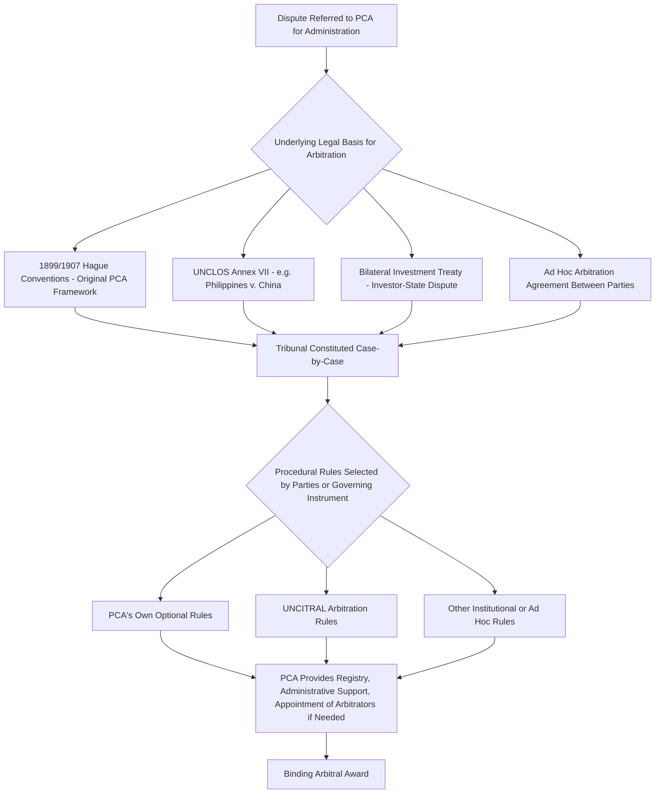

## Arbitration Under the Permanent Court of Arbitration and UNCITRAL Rules

### Doctrinal Foundation: The Permanent Court of Arbitration as Institutional Framework, Not Standing Tribunal

The **Permanent Court of Arbitration (PCA)**, established by the **1899 Hague Convention for the Pacific Settlement of International Disputes** (revised by a second Hague Convention in 1907), occupies a doctrinally distinctive position among international dispute-settlement institutions: despite its name, the PCA is **not a standing court** in the sense of the International Court of Justice (ICJ) or the International Tribunal for the Law of the Sea (ITLOS), each of which maintains a permanent, pre-composed bench of sitting judges. Rather, the PCA is an **administrative and institutional framework** — headquartered at the Peace Palace in The Hague (which it shares with, but is institutionally distinct from, the ICJ) — providing registry services, a panel of potential arbitrators from which disputing parties may select, procedural rules, and administrative support for **ad hoc arbitral tribunals** constituted afresh for each specific dispute submitted to it. This structural feature — administrative permanence combined with case-specific tribunal composition — is the doctrinal thread connecting the PCA to the broader category of **arbitration** as a mode of dispute settlement addressed elsewhere in this curriculum under Article 33 of the UN Charter, and distinguishes PCA-administered proceedings from judicial settlement before a genuinely standing court.

The PCA's original 1899/1907 design contemplated a **panel of arbitrators**: each contracting state nominates up to four persons of recognized competence in international law, of high moral reputation, and willing to accept the duties of an arbitrator, with the resulting composite list constituting the "Permanent Court" from which disputing parties select individual arbitrators for their specific case — a design historically distinguishing the PCA's model from a genuinely standing bench, and one that persists as an available (though not mandatory) mechanism for tribunal composition in contemporary PCA-administered cases.

### Key Points: The Scope of PCA Jurisdiction and Case Types

Unlike the ICJ, whose contentious jurisdiction is confined to disputes **between states**, the PCA's administrative and institutional services extend across a considerably broader range of dispute types and party configurations, reflecting the PCA's function as a flexible arbitral administrative body rather than a court limited to a single category of legal subject:

- **Inter-state disputes**, arbitrated under specific treaty-based compromissory clauses or ad hoc agreements between states, including — significantly for this curriculum's treatment of the Law of the Sea — **UNCLOS Annex VII arbitrations**, such as *The South China Sea Arbitration* (Philippines v. China), which, while constituted under UNCLOS Annex VII's own distinct legal framework rather than under the 1899/1907 Hague Conventions as such, was **administered by the PCA**, which served as registry for the proceedings, illustrating the PCA's function as a general-purpose administrative and registry resource available to arbitral tribunals constituted under a range of different underlying legal instruments, not only the PCA's own founding conventions.
- **Investor-state disputes**, arising under bilateral investment treaties (BITs) or multilateral investment instruments, in which a private investor brings a claim against a host state alleging a treaty breach — a substantial proportion of the PCA's contemporary caseload, reflecting the broader expansion of investor-state dispute settlement (ISDS) mechanisms since the latter half of the 20th century.
- **Disputes involving international organizations or other non-state entities** as a party, a category of dispute for which the ICJ's contentious jurisdiction (confined to states) is unavailable, but which the PCA's more flexible administrative framework can accommodate.

### Mechanism: The Relationship Between the PCA and UNCITRAL Arbitration Rules

The **United Nations Commission on International Trade Law (UNCITRAL)**, established by UN General Assembly resolution in 1966, is the principal UN body responsible for the progressive harmonization and modernization of international trade law, including through the promulgation of model laws, conventions, and — most significant for this item — **procedural arbitration rules**. The **UNCITRAL Arbitration Rules**, first adopted in 1976 and substantially revised in 2010 (with further amendments in 2013 and 2021, the latter addressing procedural matters including provisions on multiparty arbitration and expedited procedures), constitute a comprehensive, freestanding set of **procedural rules** governing the conduct of an ad hoc arbitration — covering matters such as the constitution of the tribunal, the conduct of proceedings, evidentiary matters, and the form and effect of the award — that disputing parties may adopt **by reference**, whether in a specific arbitration agreement, a treaty's compromissory clause, or a bilateral investment treaty's dispute-resolution provision.

The doctrinal relationship between the PCA and the UNCITRAL Rules is best understood as **complementary rather than competing**: the UNCITRAL Rules supply the **procedural rulebook** governing how an arbitration is conducted, while the PCA (where designated, as it frequently is, as the "appointing authority" or administering registry under the parties' agreement or the relevant treaty) supplies the **institutional and administrative infrastructure** — including, critically, serving as the **default appointing authority** empowered to appoint arbitrators where the parties' own agreed appointment mechanism fails to produce a complete tribunal within the specified time (a function paralleling, in the investor-state and general arbitration context, the role the President of ITLOS plays as a default appointing mechanism under UNCLOS Annex VII, addressed elsewhere in this curriculum). It is entirely standard practice for a specific arbitration to be conducted **under the UNCITRAL Rules** while being **administered by the PCA** — the two institutional and procedural layers operating together rather than as alternative, mutually exclusive choices, and this precise combination (UNCITRAL procedural rules, PCA administration) is one of the most frequently encountered configurations in contemporary treaty-based and investor-state arbitration.

### Doctrinal Content: Structural Features Common to PCA/UNCITRAL Arbitration

Several structural features recur across PCA-administered, UNCITRAL Rules-governed arbitrations, distinguishing this model from adjudication before a standing court:

- **Party autonomy in tribunal composition**: the parties typically each appoint one arbitrator, with the two party-appointed arbitrators then selecting a third, presiding arbitrator (or, where the parties cannot agree, the PCA or another designated appointing authority makes the necessary appointment) — a structural echo of the UNCLOS Annex VII default-appointment mechanism addressed elsewhere in this curriculum, reflecting a broader common pattern across ad hoc international arbitration generally in which party autonomy over tribunal composition is the starting default, with institutional intervention available as a backstop against deadlock or non-cooperation.
- **Confidentiality**, which, unlike ICJ contentious proceedings (which are, as a general rule, public), is frequently a **default or negotiated feature** of PCA/UNCITRAL arbitrations, particularly in the investor-state and commercial contexts, reflecting the historical origins of much of this arbitral practice in a commercial-dispute tradition where confidentiality is often a valued feature for the parties — though this default has itself become the subject of significant debate in the specific investor-state context, discussed further below, given the public-interest dimension of disputes involving sovereign regulatory measures.
- **Limited grounds for review or annulment of the award**: unlike a judgment subject to an ordinary appeal, an arbitral award rendered under the UNCITRAL Rules is generally **final and binding** on the parties, with any subsequent challenge confined to a narrow set of grounds (such as a fundamental procedural irregularity, a tribunal exceeding its jurisdiction, or a conflict with the public policy of the jurisdiction in which annulment or enforcement is sought) — the precise mechanism and grounds for challenge depending on the seat of arbitration and applicable domestic arbitration law (frequently informed by the UNCITRAL Model Law on International Commercial Arbitration, a separate but related UNCITRAL instrument distinct from the Arbitration Rules themselves), rather than on any general international law standard of appellate review.

### Analytical Debate: The Legitimacy and Transparency Critique of Investor-State Arbitration

[Inference] A significant contemporary debate concerning PCA/UNCITRAL-administered arbitration concerns its **application to investor-state disputes** specifically, a context in which the arbitral model's historically commercial and confidentiality-oriented design features have attracted sustained criticism when applied to disputes implicating a sovereign state's public regulatory measures (environmental regulation, public health measures, or other exercises of general regulatory authority that an investor alleges breach investment-protection standards under an applicable treaty).

**The critical position**, reflected in a substantial body of scholarship and in the diplomatic impetus behind UNCITRAL's own subsequent reform initiatives (including ongoing work of UNCITRAL Working Group III specifically addressing possible investor-state dispute settlement reform), argues that the traditional commercial-arbitration model's emphasis on confidentiality, ad hoc tribunal composition (raising concerns about arbitrator repeat-appointment patterns and perceived or actual conflicts of interest across a relatively small pool of frequently-appointed arbitrators), and the general absence of a genuine appellate mechanism (as opposed to only the narrow annulment/enforcement-stage review described above) sits uneasily with the public-interest character of disputes in which a private investor's claim may effectively second-guess a sovereign state's public regulatory choices, potentially generating a "regulatory chilling effect" if states become wary of adopting public-interest regulation for fear of triggering costly investor-state claims, and that these concerns collectively point toward a need for more court-like institutional features (a standing, appointed rather than ad hoc bench, a genuine appellate tier, enhanced transparency) than the traditional PCA/UNCITRAL ad hoc arbitration model was originally designed to provide.

**The position defending the continued use of the traditional arbitral model** argues that ad hoc arbitration's flexibility, party autonomy, and (where retained) confidentiality remain genuinely valuable features, particularly for investors and states alike who value the ability to select arbitrators with specific relevant expertise for a given dispute rather than being bound to a fixed standing bench, and that many of the specific legitimacy concerns raised by critics (arbitrator conflicts of interest, insufficiently reasoned awards, inconsistent outcomes across similar cases) are addressable through **incremental procedural reform within the existing ad hoc model** (enhanced disclosure and conflict-of-interest rules, increased transparency requirements such as those introduced by the **2014 UNCITRAL Rules on Transparency in Treaty-based Investor-State Arbitration**, itself illustrative of the model's capacity for internal reform) rather than requiring wholesale replacement of the ad hoc arbitral model with a standing court structure, a more far-reaching institutional reform (such as the EU's own proposed "Multilateral Investment Court" initiative, pursued in part through the UNCITRAL Working Group III process referenced above) that remains, as of the present, the subject of ongoing multilateral negotiation rather than settled or widely-adopted practice. [Speculation] Whether this UNCITRAL Working Group III reform process will ultimately produce a widely-adopted standing multilateral investment court, more modest incremental procedural reforms to the existing ad hoc model, or some combination of both, remains genuinely unresolved and subject to the ordinary uncertainties of a still-ongoing multilateral negotiation process.

### Related Topics

- Peaceful settlement methods under UN Charter Article 33
- UNCLOS Annex VII arbitration and the 2016 Philippines v. China South China Sea award
- The ICJ's contentious jurisdiction: consent, compromissory clauses, and Article 36 optional declarations
- Bilateral investment treaties and the standards of investor protection
- The UNCITRAL Model Law on International Commercial Arbitration
- Transparency and legitimacy reform in investor-state dispute settlement