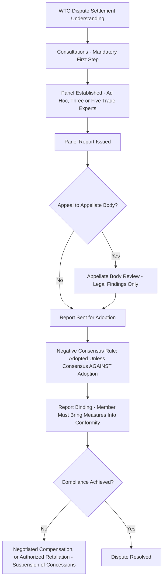
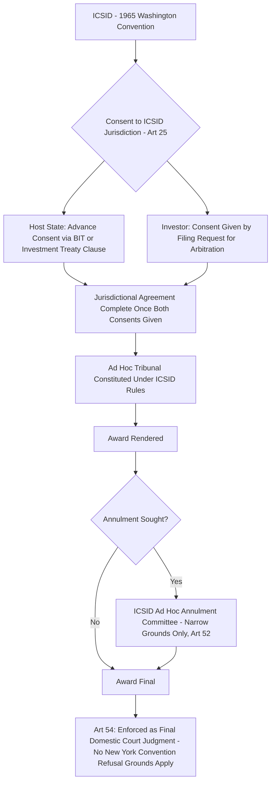

## Specialized Dispute Settlement: The WTO Dispute Settlement Understanding and ICSID Investor-State Arbitration

### Doctrinal Foundation: Specialized Regimes as Departures From General International Adjudication

Alongside the general-purpose dispute-settlement mechanisms addressed elsewhere in this curriculum — the International Court of Justice's consent-based contentious jurisdiction, and ad hoc arbitration under frameworks such as the Permanent Court of Arbitration and UNCITRAL Rules — international law has developed **specialized, treaty-specific dispute-settlement regimes** tailored to particular substantive fields, each with institutional features departing significantly from the general model. This item addresses two of the most institutionally developed such regimes: the **World Trade Organization's Dispute Settlement Understanding (DSU)**, governing trade disputes between WTO member states, and the **International Centre for Settlement of Investment Disputes (ICSID)**, the principal institutional framework for investor-state arbitration. Both regimes illustrate a broader trend in contemporary international law toward **compulsory, specialized adjudication** within a defined subject-matter domain, in some respects a marked departure from the more consent-fragmented, case-by-case jurisdictional architecture characteristic of general international dispute settlement.

### Key Points: The WTO Dispute Settlement Understanding — Structure and Compulsory Jurisdiction

The **DSU**, formally the Understanding on Rules and Procedures Governing the Settlement of Disputes, is one of the annexed agreements constituting the WTO framework established by the 1994 Marrakesh Agreement. Its most doctrinally significant feature, distinguishing it sharply from the ICJ's consent-based model addressed elsewhere in this curriculum, is that WTO dispute settlement jurisdiction is **automatically compulsory** for all WTO members with respect to disputes arising under the WTO's covered agreements — a member's ratification of the WTO Agreement itself constitutes advance, standing consent to the DSU's dispute-settlement procedures for any dispute concerning those agreements, with **no separate optional declaration, compromissory clause acceptance, or case-specific consent** required, a structural design placing WTO dispute settlement considerably closer to a genuinely compulsory adjudicative system than the ICJ's own optional-clause-dependent jurisdiction.

The DSU process proceeds through a structured sequence:

1. **Consultations**: a complaining member must first request consultations with the responding member, providing an initial opportunity for a negotiated resolution before formal adjudicative proceedings begin.
2. **Panel establishment and proceedings**: failing consultation, the complaining member may request establishment of a **panel** — a three-member (or, by party agreement, five-member) ad hoc body of trade experts, appointed for the specific dispute — which examines the matter and issues a panel report containing findings and recommendations.
3. **Appellate review**: either party may appeal a panel report's legal findings (though not its factual findings) to the WTO's **Appellate Body**, a standing body originally comprising seven members serving four-year terms, addressed further below given its more recent and significant institutional difficulties.
4. **Adoption and the "negative consensus" rule**: perhaps the DSU's single most distinctive procedural innovation is the **negative consensus (or reverse consensus) rule** governing adoption of panel and Appellate Body reports: under Article 16.4 and Article 17.14 of the DSU, a report is automatically adopted by the WTO's Dispute Settlement Body **unless there is a consensus against adoption** — meaning any single member, including the prevailing complainant, can block a reversal of the outcome by simply not joining a consensus against adoption, a structural inversion of the ordinary consensus requirement that in practice renders adoption of panel and Appellate Body reports **virtually automatic**, since the losing party alone cannot realistically secure the unanimous consensus (including the winning party's own agreement) that blocking adoption would require.
5. **Implementation and, where necessary, retaliation**: a member found in violation is expected to bring its measures into conformity within a reasonable period of time; failing that, the DSU provides for negotiated compensation or, failing agreement on compensation, **authorized retaliation** — the complaining member may request DSB authorization to suspend concessions or other obligations (commonly, the imposition of retaliatory tariffs) against the non-complying member, calibrated to be equivalent to the level of trade nullification or impairment caused by the violation.

### Doctrinal Content: The Appellate Body Crisis and Its Jurisdictional Consequences

[Inference] A significant and consequential recent development affecting the WTO system's institutional functioning concerns the **Appellate Body's practical incapacitation**, arising from the sustained blocking, principally by the United States across multiple administrations beginning in 2017, of the consensus required under DSU rules to appoint or reappoint Appellate Body members, on the stated basis of long-standing US objections to aspects of the Appellate Body's practice (including, among other concerns raised by the United States, objections to Appellate Body decisions addressing matters beyond what the US position characterized as the strict legal-interpretation mandate assigned to it under the DSU). As a consequence, the Appellate Body has lacked a sufficient quorum of members to hear new appeals since December 2019, creating a phenomenon sometimes termed **"appeals into the void"**: a losing party at the panel stage can file a notice of appeal that cannot actually be heard by a functioning Appellate Body, with the practical effect that panel reports subject to such an appeal remain in a state of **legal limbo**, neither properly adopted (since an appeal has been filed) nor capable of substantive appellate resolution.

In response to this institutional impasse, a subset of WTO members has established the **Multi-Party Interim Appeal Arbitration Arrangement (MPIA)**, a voluntary alternative appellate mechanism operating under DSU Article 25 (which permits arbitration as an alternative means of dispute settlement) among its participating members, intended to preserve a functioning two-tier, binding dispute-settlement system as between those specific members pending resolution of the broader Appellate Body appointment impasse. [Unverified] The precise current membership of the MPIA and the broader trajectory of Appellate Body reform negotiations continue to evolve, and the current status of these developments should be verified against current WTO records rather than assumed static, given the sustained institutional uncertainty surrounding the issue.

### Key Points: ICSID as the Principal Institutional Framework for Investor-State Arbitration

The **International Centre for Settlement of Investment Disputes (ICSID)**, established by the **1965 Washington Convention** (formally the Convention on the Settlement of Investment Disputes between States and Nationals of Other States), operating under the auspices of the World Bank Group, constitutes the most institutionally developed and most frequently invoked forum specifically dedicated to investor-state dispute settlement, distinguishing it both from the PCA/UNCITRAL ad hoc arbitration model addressed elsewhere in this curriculum and from the WTO's exclusively state-to-state DSU framework.

Several structural features distinguish ICSID arbitration:

- **Standing party access for private investors**: unlike the WTO's DSU (state-to-state only) or the ICJ's contentious jurisdiction (states only), ICSID arbitration permits a **private investor** (a natural or juridical person) to bring a claim **directly against a host state**, without requiring the investor's home state to formally espouse the claim on the investor's behalf — a significant departure from the traditional customary international law doctrine of diplomatic protection, under which a state's espousal of its national's claim against another state was historically the primary mechanism for vindicating an individual's rights at the international level.
- **Consent through multiple instruments**: ICSID jurisdiction under Article 25 of the Washington Convention requires the **written consent** of both the host state and the investor to submit the specific dispute to ICSID — but this consent is frequently given **in advance**, and separately by each party, through: (a) the host state's consent expressed in a bilateral investment treaty (BIT) or multilateral investment instrument (such as, historically, the Energy Charter Treaty) containing an ICSID arbitration clause; and (b) the investor's own consent, typically given at the time the specific dispute arises by the investor's act of filing a request for arbitration invoking the treaty's standing offer — a "arbitration without privity" structure (so termed in influential scholarship) under which the state's consent is given once, generically, in the underlying treaty, while the investor's matching consent completes the jurisdictional agreement only later, dispute-specifically.
- **Self-contained annulment mechanism**: distinctively, ICSID awards are **not subject to review or annulment by domestic courts** of the state where enforcement is sought (unlike ordinary UNCITRAL Rules or other non-ICSID arbitral awards, which are generally subject to the domestic arbitration law and judicial oversight of the seat of arbitration, and to potential resistance to recognition under the 1958 New York Convention on the Recognition and Enforcement of Foreign Arbitral Awards); instead, Article 52 of the Washington Convention provides for annulment only through a **specialized, internal ICSID ad hoc annulment committee**, applying a narrow set of grounds (including improper constitution of the tribunal, manifest excess of powers, corruption, a serious departure from a fundamental rule of procedure, or failure to state reasons) — a self-contained review mechanism intended to provide the enhanced predictability and enforceability the ICSID system's drafters regarded as important to encouraging cross-border investment.
- **Direct enforceability of awards**: Article 54 of the Washington Convention requires each contracting state to **recognize an ICSID award as binding and enforce the pecuniary obligations it imposes as if it were a final judgment of a court in that state**, a notably strong enforceability provision bypassing the ordinary grounds for refusing enforcement of a foreign arbitral award available under the New York Convention, reflecting the Washington Convention's specific institutional design choice to maximize the practical enforceability of ICSID awards specifically.

### Analytical Debate: Comparing the Compulsory-Consent Models and Their Respective Legitimacy Pressures

[Inference] Both regimes examined in this item depart from the ICJ's fragmented, optional-clause-dependent consent model by embedding a **more robust and predictable form of compulsory jurisdiction** — the WTO's automatic jurisdiction flowing from WTO membership itself, and ICSID's "arbitration without privity" structure flowing from a state's advance treaty-level consent — and both have, notwithstanding this shared design feature aimed at enhancing predictability and enforceability, faced **significant and analytically related legitimacy pressures** in recent years, illustrating that compulsory or quasi-compulsory jurisdictional design does not, by itself, immunize a specialized dispute-settlement regime from broader legitimacy contestation.

For the **WTO system**, the Appellate Body crisis discussed above reflects, at least in part, an underlying substantive concern (articulated most persistently by the United States) that the Appellate Body's practice had, in the view of some members, expanded beyond a narrowly textual application of the covered agreements into a more expansive, quasi-legislative interpretive role — a concern with some structural parallel to debates addressed elsewhere in this curriculum regarding the proper interpretive latitude of international courts and treaty bodies more generally, here manifesting specifically as a powerful member's willingness to use its effective veto over Appellate Body appointments (itself made possible by the DSU's own consensus-based appointment procedure, a feature of the underlying institutional design rather than a departure from it) to constrain the appellate mechanism's practical functioning, notwithstanding the DSU's own negative-consensus rule for adopting substantive dispute outcomes.

For the **ICSID/investor-state system**, the legitimacy critique — substantially overlapping with, though institutionally distinct from, the parallel critique addressed elsewhere in this curriculum regarding UNCITRAL/PCA-administered investor-state arbitration — centers on concerns regarding the perceived imbalance of a system in which only investors (not states) can initiate claims, the potential regulatory-chilling effect of exposing sovereign public-interest regulation to investor claims, and concerns about arbitrator independence and consistency given the relatively concentrated pool of frequently-appointed ICSID arbitrators; several states, in response to these concerns, have taken the further step of **withdrawing from the Washington Convention altogether** (Bolivia, Ecuador, and Venezuela each denounced the Convention in the years following 2007) or terminating some or all of their BITs containing ICSID consent clauses, a more far-reaching form of legitimacy contestation than the WTO context has generated, where no member has withdrawn from WTO membership itself over Appellate Body concerns, instead channeling the underlying dissatisfaction into blocking the specific appellate appointment mechanism while remaining within the broader system. [Speculation] Whether these distinct but analogous legitimacy pressures on both regimes will be resolved through the incremental institutional reforms each system has pursued (the MPIA for WTO appellate review; ongoing ICSID rules amendments and the broader UNCITRAL Working Group III multilateral investment court discussions for investor-state arbitration) or will instead produce more fundamental structural change or continued fragmentation, remains an open question given the still-unresolved and evolving state of both reform processes.

### Related Topics

- Arbitration under the Permanent Court of Arbitration and UNCITRAL rules
- Peaceful settlement methods under UN Charter Article 33
- The ICJ's contentious jurisdiction: consent, compromissory clauses, and Article 36 optional declarations
- Bilateral investment treaties and the standards of investor protection
- Diplomatic protection and the espousal of claims in customary international law
- The New York Convention on the Recognition and Enforcement of Foreign Arbitral Awards