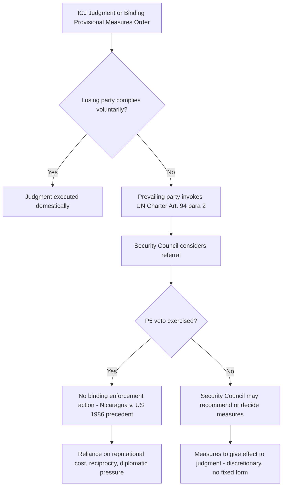

## Provisional Measures and Enforcement of ICJ Judgments under UN Charter Article 94

### Legal Basis for Provisional Measures

The International Court of Justice (ICJ) derives its power to indicate provisional measures from **Article 41 of the ICJ Statute**, which provides that the Court has the power to indicate, if it considers that circumstances so require, any provisional measures which ought to be taken to preserve the respective rights of either party. This power is elaborated procedurally in **Articles 73–78 of the Rules of Court**.

Provisional measures are interim, precautionary orders issued before the Court has determined the merits of a dispute, or sometimes even before it has confirmed it has jurisdiction to hear the case at all. Their purpose is not to resolve the underlying dispute but to prevent irreparable harm to the rights in contention while the litigation proceeds.

**Jurisdictional threshold.** A request for provisional measures does not require the Court to have already established definitive jurisdiction over the merits. The Court applies a lower threshold: it need only be satisfied that the provisions invoked by the applicant *appear, prima facie*, to afford a basis on which its jurisdiction could be founded. This prima facie standard was applied in *LaGrand (Germany v. United States)*, Provisional Measures Order of 3 March 1999, and reaffirmed in numerous subsequent cases.

### The Legal Test for Indicating Provisional Measures

The Court has developed a four-part cumulative test, refined primarily through its post-2000 jurisprudence:

1. **Prima facie jurisdiction** — the Court must have at least a plausible basis for jurisdiction over the merits.
2. **Plausibility of rights** — the rights asserted by the requesting party must be at least plausible under the treaty or rule invoked, and there must be a link between those rights and the measures requested. This "plausibility" standard was articulated in *Belgium v. Senegal (Questions relating to the Obligation to Prosecute or Extradite)*, 2009, and has since become a fixture of the Court's provisional measures jurisprudence, including in *The Gambia v. Myanmar (Application of the Genocide Convention)*, Order of 23 January 2020.
3. **Real and imminent risk of irreparable prejudice** — the harm threatened must be irreparable, meaning damage that could not be adequately remedied by an award of compensation or restitution after the merits are decided.
4. **Urgency** — the risk must be such that action may be taken before the Court is able to render its final decision. Urgency and irreparable prejudice are treated as substantively linked criteria.

**[Inference]** Commentators frequently describe this framework as functionally analogous to interim injunctive relief in domestic legal systems, though the Court itself does not use that comparative framing in its orders.

### Binding Character of Provisional Measures Orders

For much of the Court's history, whether provisional measures orders were legally binding (as opposed to merely hortatory) was a genuinely disputed question, since Article 41's French and English texts diverged: the English text used the word "indicate," which suggested recommendation, while other language raised interpretive ambiguity.

This was authoritatively resolved in ***LaGrand (Germany v. United States)*, Judgment of 27 June 2001**. The Court held that provisional measures orders under Article 41 are **binding** on the parties, reasoning that:

- The object and purpose of the Statute is to enable the Court to fulfil its function of judicial settlement of disputes.
- Article 41 exists to prevent the Court's exercise of jurisdiction on the merits from being frustrated by unilateral action.
- The French text ("*doivent être prises*" — "must be taken") supports a binding interpretation.

This holding was reaffirmed in *Avena and Other Mexican Nationals (Mexico v. United States)*, Judgment of 31 March 2004, where the Court found the United States had again breached binding provisional measures by executing a national in violation of an outstanding order.

### Enforcement Mechanism: UN Charter Article 94

**Article 94 of the UN Charter** governs compliance with ICJ decisions and reads, in relevant part:

> "1. Each Member of the United Nations undertakes to comply with the decision of the International Court of Justice in any case to which it is a party.
>
> 2. If any party to a case fails to perform the obligations incumbent upon it under a judgment rendered by the Court, the other party may have recourse to the Security Council, which may, if it deems necessary, make recommendations or decide upon measures to be taken to give effect to the judgment."

Several doctrinal points require precise unpacking:

**"Decision" versus "judgment."** Article 94(1) refers broadly to "decisions," which the prevailing (and *LaGrand*-endorsed) interpretation treats as encompassing binding provisional measures orders, not only final judgments on the merits. Article 94(2), however, refers narrowly to "judgment," creating textual uncertainty over whether the Security Council enforcement mechanism formally extends to non-compliance with provisional measures orders as opposed to final judgments. **[Unverified]** — there is no definitive ICJ or Security Council ruling settling whether Article 94(2) enforcement applies to provisional measures orders; state practice on this point is thin because Council referrals under Article 94(2) have occurred at all only once.

**The structural enforcement gap.** Article 94(2) enforcement is discretionary and politically constrained in two ways:

- The Security Council "may" act — there is no obligation to do so.
- Any of the five permanent members (China, France, Russia, the United Kingdom, the United States) can **veto** an enforcement resolution under Article 27(3) of the Charter, including where the non-complying party is itself a P5 member or a P5 ally.

This creates the often-cited feature of international law: a binding judicial pronouncement with a non-self-executing enforcement pathway contingent on great-power political consent.

**Practical precedent: *Nicaragua v. United States* (1986).** After the Court found the United States in breach of customary international law and the 1956 Treaty of Friendship, Commerce and Navigation for its support of the Contras and mining of Nicaraguan harbors, Nicaragua invoked Article 94(2) and brought the non-compliance to the Security Council. The United States vetoed the resulting draft resolution. Nicaragua's parallel attempt to secure General Assembly action produced only non-binding resolutions under the Assembly's "Uniting for Peace" type mechanisms, which lack Article 94(2)'s enforcement character. This episode is the paradigmatic illustration of the veto-constrained nature of ICJ judgment enforcement.

### Alternative and Informal Enforcement Pathways

Given the structural weakness of Article 94(2), compliance with ICJ decisions in practice relies on several non-Charter mechanisms:

- **Reciprocity and reputational cost.** States generally comply with ICJ judgments to preserve their standing as law-abiding actors and to maintain the reciprocal expectation that other states will honor rulings favorable to them in future disputes.
- **Diplomatic and economic pressure** exerted bilaterally or through regional organizations, outside the formal Article 94(2) channel.
- **Domestic implementing legislation or executive action**, where a losing state voluntarily gives effect to a judgment through internal legal processes (e.g., legislative amendment, administrative reversal).
- **General Assembly resolutions**, which carry only political rather than binding legal force, but can shape international opinion and isolate a non-complying state.

**[Inference]** The empirical compliance record with ICJ judgments is generally regarded by international law scholars as comparatively high relative to popular perception, though rigorous compliance rates are contested depending on how "compliance" is operationalized (full compliance vs. partial or delayed compliance).

### Application to the South China Sea Context

Although the *Philippines v. China* arbitration (2016) was conducted under **UNCLOS Annex VII**, not before the ICJ, and therefore falls outside Article 94 entirely, it is the leading illustration for Philippine practitioners of the same structural enforcement problem. The Annex VII Tribunal's Award of 12 July 2016 was final and binding under **UNCLOS Article 296** and **Annex VII Article 11**, but UNCLOS contains no equivalent to Article 94(2) — there is no Security Council referral mechanism for Annex VII awards. China's non-participation in the proceedings and subsequent rejection of the Award illustrate, by structural analogy, the same underlying principle relevant to ICJ enforcement: a binding judicial outcome under international law does not carry automatic coercive enforcement absent state consent or a functioning collective security mechanism.

**[Inference]** This parallel is pedagogically useful precisely because it shows the enforcement gap is not unique to the ICJ but is a structural feature of international adjudication generally, rooted in the absence of a supranational executive authority.

### Diagram: Enforcement Pathway under Article 94

### Key Points

- Provisional measures rest on ICJ Statute Article 41 and require prima facie jurisdiction, plausibility of rights, and risk of irreparable, urgent harm.
- *LaGrand* (2001) settled that provisional measures orders are legally binding, not merely recommendatory.
- Article 94(1) obliges compliance with ICJ "decisions"; Article 94(2) creates a discretionary, veto-susceptible Security Council enforcement pathway limited textually to "judgments."
- The *Nicaragua v. United States* case is the canonical example of Article 94(2)'s practical limits due to the P5 veto.
- Actual compliance with ICJ rulings depends substantially on non-Charter mechanisms: reciprocity, reputational cost, and diplomatic leverage.

**Related Topics**

- Jurisdiction of the ICJ: consent-based bases (special agreement, compromissory clauses, optional clause declarations under Article 36(2))
- The *Nicaragua v. United States* merits judgment and its treatment of customary international law on the use of force
- UNCLOS Annex VII arbitration and the *Philippines v. China* South China Sea Award
- The role and limits of the UN Security Council under Chapter VII versus Article 94(2)
- State responsibility and remedies in international law (restitution, compensation, satisfaction)