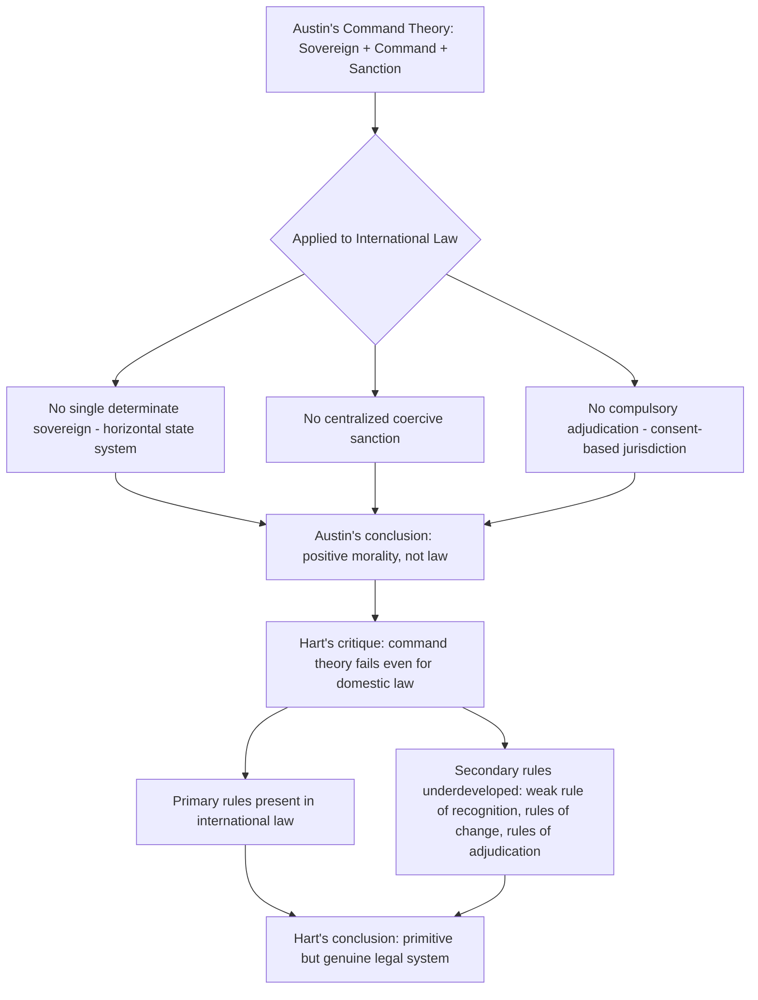

## The Austinian Critique and the Question of Whether International Law Is Law Without a Sovereign Enforcer

### The Austinian Command Theory of Law

John Austin, in *The Province of Jurisprudence Determined* (1832), articulated a **command theory of law**: law properly so-called is a command issued by a political sovereign, backed by a credible threat of sanction, and habitually obeyed by the bulk of a given society. Under this framework, three elements are necessary for a rule to qualify as "law": (1) a **sovereign** — a determinate, habitually obeyed superior who is not in the habit of obedience to any other superior; (2) a **command** issued by that sovereign; and (3) a **sanction**, meaning a credible threat of coercive enforcement attached to disobedience.

Applying this test to international law, Austin concluded that what is called "international law" is not law in the strict, technical sense but rather a system of **"positive morality"** — rules that states generally observe, akin to rules of etiquette or honor among individuals, but lacking the defining coercive structure of true law. Austin's core objections, restated precisely, are:

1. **No identifiable sovereign.** International law has no single determinate superior habitually obeyed by all states; the system is horizontal (states as formal equals) rather than vertical (a superior commanding subordinates).
2. **No centralized sanction.** There is no standing coercive apparatus analogous to a domestic police force or judiciary with compulsory jurisdiction and enforcement power.
3. **No compulsory adjudication.** States are not generally compellable to submit disputes to a court against their will (a feature rooted in the consent-based structure of international jurisdiction, discussed further below).

### H.L.A. Hart's Critique of the Austinian Model

H.L.A. Hart, in *The Concept of Law* (1961), mounted an internal critique of the command theory as applied to *domestic* legal systems before extending the analysis to international law. Hart argued that Austin's model fails even to describe municipal law correctly, because it cannot account for **power-conferring rules** (rules that enable people to make contracts, wills, or marriages) as distinct from **duty-imposing rules** backed by sanctions, and it cannot explain the **continuity of legal authority** across a change of sovereign (a new legislature is obeyed immediately, without the "habit of obedience" Austin's theory requires).

Hart's alternative model rests on the union of primary and secondary rules:

- **Primary rules** impose duties or confer powers directly on subjects (e.g., a treaty obligation not to use force).
- **Secondary rules** are rules *about* primary rules, and Hart identifies three types:
  - The **rule of recognition** — the master rule that identifies which norms count as valid law within the system (e.g., in a domestic system, "whatever Parliament enacts is law").
  - **Rules of change** — rules specifying how primary rules are created, modified, or repealed (e.g., legislative procedure).
  - **Rules of adjudication** — rules specifying how disputes about the application of primary rules are authoritatively settled (e.g., courts with compulsory jurisdiction).

Hart's diagnosis of international law is that it possesses a rich set of **primary rules** (treaty and customary obligations) but lacks a clearly unified, secondary **rule of recognition**, and is **markedly underdeveloped** in rules of change and rules of adjudication, since treaty-making requires state consent rather than centralized legislative procedure, and adjudication before bodies like the ICJ is likewise consent-based rather than compulsory. Hart's conclusion, however, differs sharply from Austin's: he characterizes international law as a genuine but **"primitive" or undeveloped legal system** — analogous to primary rules operating without the full secondary-rule superstructure — rather than dismissing it as mere positive morality. For Hart, the absence of a sovereign enforcer means international law is *sociologically* a different kind of legal order, not that it fails to be law altogether.

### Structural Features of International Law Responsive to the Austinian Critique

**1. Consent as the basis of obligation.** Because there is no international legislature, international law binds states primarily through their own **consent**. This operates through two principal source-categories under **Article 38(1) of the ICJ Statute**, which is the standard (though not exhaustive) enumeration of the sources the Court applies: (a) international conventions (treaties), whether general or particular, establishing rules expressly recognized by contesting states; (b) international custom, as evidence of a general practice accepted as law; (c) general principles of law recognized by civilized nations; and (d) judicial decisions and the teachings of highly qualified publicists as subsidiary means for determining rules of law.

**Treaty law** binds states who ratify or accede, per the consent principle codified in the **Vienna Convention on the Law of Treaties (VCLT) 1969**, Article 26, which provides that every treaty in force is binding upon the parties and must be performed in good faith (the **pacta sunt servanda** principle — "agreements must be kept").

**Customary international law (CIL)** requires two cumulative elements, per the ICJ's articulation in *North Sea Continental Shelf Cases (Germany v. Denmark; Germany v. Netherlands)*, 1969:

- **State practice** — a general and consistent practice of states.
- ***Opinio juris sive necessitatis*** — the subjective belief that the practice is followed out of a sense of legal obligation, not mere habit, courtesy, or convenience.

Both elements are necessary; practice alone (however widespread) does not generate a binding customary rule absent the accompanying legal conviction.

**2. Horizontal versus vertical enforcement.** Because international law lacks Austin's centralized sanctioning sovereign, compliance is secured through a horizontal, decentralized structure:

- **Reciprocity** — states comply because non-compliance invites reciprocal non-compliance by others (especially salient in law of treaties and diplomatic law).
- **Countermeasures** — a state injured by another state's internationally wrongful act may take otherwise-unlawful measures against the wrongdoing state to induce compliance, subject to the proportionality and other conditions codified in the **International Law Commission's Articles on State Responsibility (ARSIWA) 2001**, Articles 49–54.
- **Reputational cost** and the value states place on being perceived as law-abiding within the international community.
- **Institutionalized but limited coercion**, chiefly the **UN Security Council's Chapter VII powers** (Articles 39–42 of the UN Charter), which authorize binding measures — including the use of force — in response to threats to or breaches of international peace and security, but which are themselves constrained by the **P5 veto** under Article 27(3), reproducing a structural enforcement gap rather than eliminating it.

**3. Compulsory versus consensual adjudication.** Unlike domestic courts, the ICJ has no inherent compulsory jurisdiction over all states. Jurisdiction arises only through state consent, expressed via: a special agreement (*compromis*) between parties; a compromissory clause in a treaty conferring jurisdiction over disputes arising under it; or a unilateral declaration accepting the Court's **compulsory jurisdiction under the "Optional Clause,"** Article 36(2) of the ICJ Statute, which as of the present remains accepted by fewer than a third of UN member states, and frequently with significant reservations.

### The Strongest Form of Each Side of the Debate

**The strongest Austinian-style position (law skepticism):** Even granting Hart's refinement, a critic can maintain that a system whose primary compliance mechanisms are voluntary reciprocity and politically contingent Security Council action is functionally closer to a system of political morality than to law, particularly because powerful states can and do violate core rules (e.g., the prohibition on the use of force under **UN Charter Article 2(4)**) without facing anything resembling a legal sanction, and enforcement asymmetry means the same rule binds weak and powerful states very differently in practice. **[Inference]** This line of critique is most associated with realist international relations theory, which treats international law as epiphenomenal to state power rather than as an independent constraint on state behavior, though this is a contested empirical claim rather than a settled finding.

**The strongest response (legal positivist/institutionalist position):** The rule of recognition objection misconceives what makes a rule "law" — obligation does not require a coercive sanction, only a social practice among the relevant actors (here, states, and the officials and courts who apply the rules) of treating the rule as binding and using it to justify and criticize conduct. States overwhelmingly comply with the vast bulk of international legal rules (most of treaty law, diplomatic law, and law of the sea) as a matter of routine, unremarked practice — non-compliance draws attention precisely because it is the exception rather than the norm, and states virtually never assert a *right* to disregard obligations, but instead offer legal justifications for their conduct (a practice consistent with genuine rule-following, not mere self-interested calculation). Under this view, associated with modern legal positivists building on Hart (e.g., the "law as social fact" tradition), the absence of a Leviathan-style sovereign is a structural feature distinguishing international law from municipal law, not evidence against its status as law at all.

### Diagram: Austin's Command Theory Applied to International Law

### Key Points

- Austin's command theory requires a sovereign, a command, and a sanction; applying this test, Austin classified international law as "positive morality," not true law.
- Hart's critique shows the command theory fails to explain even domestic legal systems and offers the primary/secondary rules model instead.
- International law has developed primary rules extensively but remains underdeveloped in secondary rules — rule of recognition, rules of change, and rules of adjudication.
- Consent (treaty ratification, acceptance of custom via state practice plus *opinio juris*, and jurisdictional consent under the ICJ Optional Clause) substitutes structurally for Austin's missing centralized command authority.
- Enforcement operates horizontally through reciprocity, countermeasures, and reputational cost, supplemented by the politically constrained UN Security Council mechanism.
- The debate remains genuinely contested: realist/Austinian skepticism versus positivist/Hartian acceptance of international law as a distinct but authentic legal order.

**Related Topics**

- Sources of international law under ICJ Statute Article 38(1): treaties, custom, general principles
- The formation and identification of customary international law: the ILC's 2018 Draft Conclusions on Identification of Customary International Law
- State responsibility and countermeasures under the ILC Articles on State Responsibility (2001)
- UN Security Council Chapter VII powers and the P5 veto as an enforcement constraint
- Provisional measures and enforcement of ICJ judgments under UN Charter Article 94