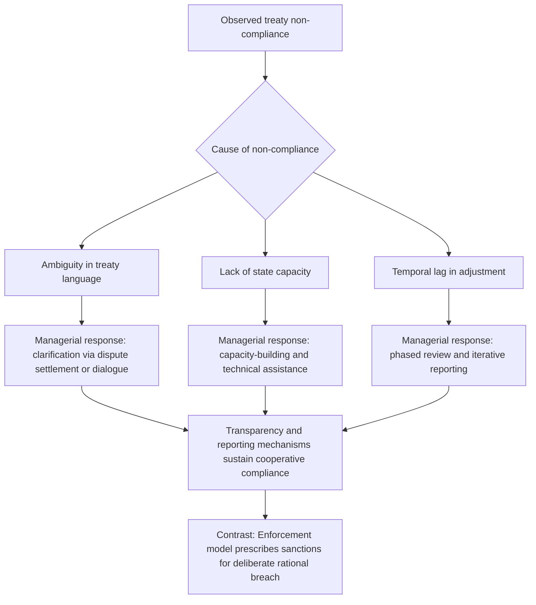

## Chayes and Chayes' Managerial Model of Treaty Compliance

### Origins and Core Thesis

Abram Chayes and Antonia Handler Chayes developed the **managerial model of treaty compliance** primarily in their 1993 article "On Compliance" (*International Organization*) and their 1995 book *The New Sovereignty: Compliance with International Regulatory Agreements*. The model was formulated as a direct response to the enforcement-centric assumption — traceable to the Austinian tradition discussed under the rubric of whether international law can be law without a sovereign enforcer — that treaty compliance must be secured through coercive sanctions for violations to be meaningful.

The Chayeses' central empirical claim is that **most states comply with most of their treaty obligations most of the time**, and that this baseline level of compliance occurs *without* resort to coercive enforcement. From this observation, they argue that the enforcement model misdiagnoses the actual sources of non-compliance and consequently prescribes the wrong remedy. Where the enforcement model treats non-compliance as a rational, self-interested breach requiring deterrence through sanctions, the managerial model treats non-compliance as arising predominantly from **incapacity or ambiguity rather than a deliberate decision to violate the rule**.

### The Three Sources of Non-Compliance

The managerial model identifies three principal, non-mutually-exclusive causes of treaty non-compliance, none of which involve a considered decision by the state to disregard its obligations:

1. **Ambiguity and indeterminacy of treaty language.** Treaty text is frequently the product of multilateral negotiation and deliberate compromise, producing provisions that are vague, open to multiple good-faith interpretations, or silent on the specific factual scenario a state later confronts. Apparent non-compliance may simply reflect a state's reasonable, if ultimately contested, interpretation of an ambiguous obligation rather than willful breach.
2. **Limitations on state capacity.** Many states, particularly those with weaker administrative, financial, technical, or regulatory infrastructure, may lack the practical ability to implement or monitor compliance with a treaty obligation even where the political will to comply is present. This is especially salient in technical regulatory regimes (e.g., environmental, health, or trade-related treaties) that require sophisticated domestic monitoring or enforcement capacity that not all state parties possess.
3. **The temporal dimension of compliance ("the problem of time").** Because circumstances change over the life of a treaty and negotiated obligations are often designed with a longer time horizon or phased implementation in mind, some deviations reflect a lag in the process of adjustment rather than a rupture of the obligation itself.

**[Inference]** This diagnostic framework implies that the appropriate policy response to non-compliance should be diagnostic and corrective rather than punitive, a point the Chayeses make explicit in their prescriptive framework below.

### The Prescriptive Managerial Toolkit

Because the model attributes non-compliance chiefly to ambiguity and incapacity, its prescribed remedies are managerial rather than punitive, centering on **iterative, cooperative processes** embedded within treaty regimes:

- **Transparency and reporting requirements.** Many treaty regimes build in mandatory self-reporting by states on their implementation measures (e.g., periodic national reports under environmental or human rights treaties), which the Chayeses argue functions less as a policing mechanism and more as a tool that surfaces compliance problems early, allowing for a cooperative response before a dispute crystallizes.
- **Dispute settlement and clarification mechanisms** used primarily to resolve interpretive ambiguity, rather than to adjudicate blame — treating adjudicatory bodies as clarifying institutions within an ongoing cooperative relationship rather than as courts imposing sanctions on wrongdoers.
- **Capacity-building assistance.** Where non-compliance stems from a state's technical or financial incapacity, the appropriate response is to supply the resources, technology transfer, or technical assistance needed to bring the state into compliance, rather than to penalize it for a failure it could not have avoided. This logic underlies mechanisms such as the **Multilateral Fund for the Implementation of the Montreal Protocol**, which finances compliance by developing states with the ozone-depleting-substance phase-out obligations under the **Montreal Protocol on Substances that Deplete the Ozone Layer (1987)**.
- **Iterative discourse and justificatory dialogue.** The managerial model emphasizes the normative pressure generated by a state having to publicly justify its conduct to other treaty parties and international bodies — the practice of offering legal and policy justifications for one's conduct is itself understood as evidence of, and a mechanism reinforcing, a compliance-oriented (rather than purely self-interested) orientation toward treaty obligations.

### Theoretical Positioning Against the Enforcement Model

The **enforcement model**, associated with rational-choice and realist analyses of international law, treats states as unitary rational actors that will violate a treaty obligation whenever the expected benefit of doing so exceeds the expected cost of a sanction, and it therefore prescribes strong, centralized, punitive enforcement mechanisms (analogous to Austin's sanction requirement) as the necessary condition for meaningful compliance.

The managerial model's central point of departure is empirical rather than purely normative: the Chayeses observe that most multilateral regulatory treaties do not in fact contain robust sanctioning mechanisms, and yet compliance rates remain comparatively high, which they argue is difficult to explain on enforcement-model assumptions alone. If states were purely calculating the risk of sanction against the benefit of breach, the absence of meaningful sanctions in most treaty regimes should predict widespread defection; the Chayeses contend the empirical compliance record does not bear this out, and that the explanation lies instead in the ambiguity/incapacity diagnosis above, reinforced by a state's general interest in maintaining its reputation as a reliable treaty partner within an interdependent, iterated system of international cooperation.

**Genuine theoretical debate — strongest form of each side:**

*In favor of the managerial model:* Treaty regimes that rely heavily on reporting, review, and technical assistance (e.g., the Montreal Protocol, and — as a treaty-based framework using nationally determined commitments and a transparency-and-review architecture rather than binding sanctions — the **Paris Agreement (2015)** under the UNFCCC) have achieved substantial compliance and behavioral change without coercive sanctions, suggesting the managerial diagnosis captures real-world compliance dynamics in technical regulatory regimes.

*Against the managerial model:* Critics (notably drawing on rational-design and enforcement-oriented scholarship) argue the model understates the role of **deliberate, interest-driven non-compliance** in security-related and high-stakes political treaties, where states calculate strategic advantage rather than merely lacking capacity or facing ambiguity (e.g., alleged violations of arms control or non-proliferation obligations). Critics also note the model may struggle to explain compliance variation *across* states facing the same ambiguous or capacity-constrained treaty text, since not all states with comparable capacity constraints comply at comparable rates, suggesting factors beyond ambiguity and incapacity — including power, interest, and domestic political economy — remain analytically necessary. **[Inference]** This critique is most associated with scholars in the "rational design" tradition of international institutions (e.g., work following Koremenos, Lipson, and Snidal), who argue that treaty design features (including sanctions, escape clauses, and flexibility mechanisms) are themselves the product of states' rational anticipation of compliance problems, rather than compliance being explicable through managerial dynamics alone.

### Diagram: Managerial Model Compliance Logic

### Key Points

- The managerial model, developed by Chayes and Chayes (1993, 1995), holds that most states comply with most treaty obligations most of the time without coercive enforcement.
- Non-compliance is attributed primarily to treaty ambiguity, limited state capacity, and the temporal lag of adjustment — not deliberate, calculated breach.
- Prescriptive tools are cooperative and managerial: transparency/reporting requirements, clarificatory dispute settlement, capacity-building assistance, and iterative justificatory dialogue.
- The model stands in direct theoretical opposition to the enforcement model, which assumes rational, interest-driven breach requiring deterrent sanctions.
- The debate remains active: the managerial model fits technical regulatory regimes well but faces strongest criticism in security and high-stakes political treaty contexts where deliberate strategic non-compliance is more plausible.

**Related Topics**

- The Austinian critique and the question of whether international law is law without a sovereign enforcer
- Rational design theory of international institutions (Koremenos, Lipson, and Snidal)
- The Montreal Protocol and the Multilateral Fund as a compliance case study
- The Paris Agreement's transparency and review framework under the UNFCCC
- Countermeasures and state responsibility under the ILC Articles on State Responsibility (2001)