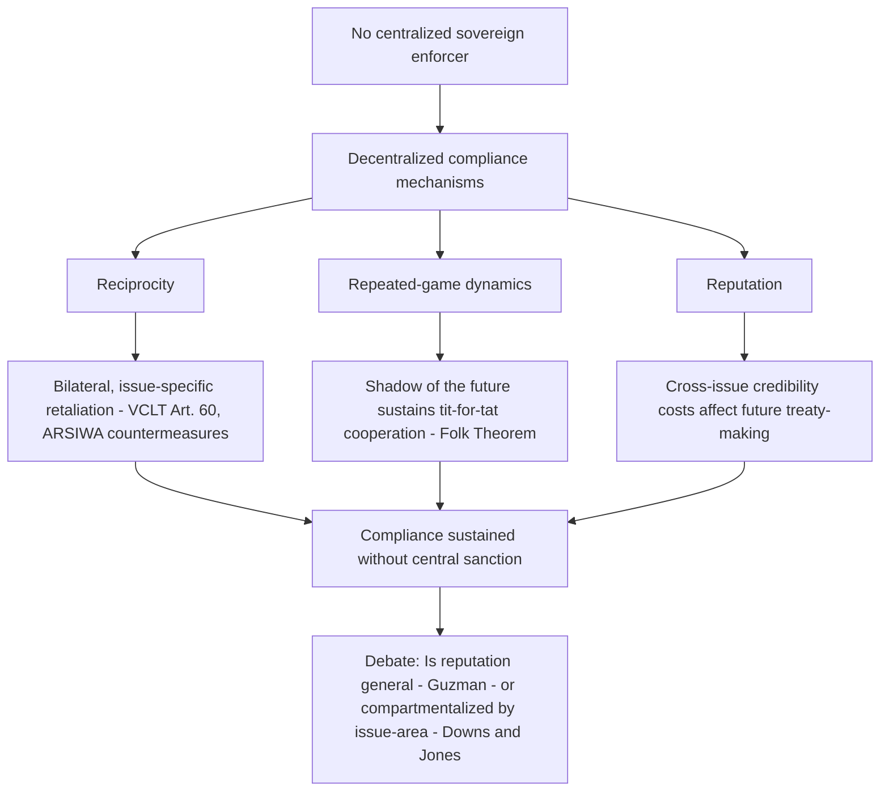

## Reputation, Reciprocity, and Repeated-Game Theories of State Compliance

### Theoretical Foundations: Compliance Without Centralized Sanction

Reputation, reciprocity, and repeated-game theories form a family of explanations for state compliance with international law that share a common starting premise: because international law lacks a centralized coercive enforcer (the structural gap examined under the Austinian critique of international law as law without a sovereign), compliance must be explained by mechanisms internal to the decentralized, horizontal structure of the state system itself. These theories are largely rooted in rational-choice institutionalism and game theory as applied to international relations, and they treat states as self-interested actors whose compliance decisions are nonetheless shaped by the structure of repeated interaction, not merely by the fear of a one-off sanction.

### Reciprocity as a Compliance Mechanism

**Reciprocity** refers to the expectation that a state's treatment of another state — favorable or unfavorable, compliant or non-compliant — will be met with treatment in kind. In the absence of centralized enforcement, reciprocity functions as a **self-help mechanism**: a state complies with an obligation partly because it expects that its compliance will be matched by the compliance of other states, and, conversely, that its own non-compliance will trigger reciprocal non-compliance by others, imposing a cost on itself.

International law formalizes reciprocity in several doctrinal contexts:

- **Reciprocal denunciation and termination.** Under the **Vienna Convention on the Law of Treaties (VCLT) 1969, Article 60**, a material breach of a treaty by one party entitles the other party or parties to invoke the breach as a ground for terminating or suspending the treaty in whole or in part, formalizing the reciprocal structure of treaty obligation: continued performance by one party is legally conditioned on continued performance by others.
- **Countermeasures**, codified in the **International Law Commission's Articles on State Responsibility (ARSIWA) 2001, Articles 49–54**, permit an injured state to take measures that would otherwise be unlawful, in response to another state's internationally wrongful act, subject to proportionality and other conditions, precisely to induce the wrongdoing state back into compliance through reciprocal pressure rather than centralized sanction.
- **Diplomatic and consular law reciprocity.** Diplomatic immunities under the **Vienna Convention on Diplomatic Relations (1961)** are widely observed substantially because states recognize that mistreating another state's diplomats invites reciprocal mistreatment of their own — a self-enforcing structure independent of any external sanctioning body.

Reciprocity operates most powerfully in **bilateral or reciprocal-obligation treaties** (e.g., trade agreements, extradition treaties, investment treaties), where each party's performance is a direct precondition or inducement for the other's. It is comparatively weaker in **multilateral, integral (non-reciprocal) obligation regimes**, such as human rights treaties, where State A's violation of its human rights obligations toward its own population does not directly injure State B in a way that gives State B an equivalent reciprocal lever — a distinction the International Law Commission itself recognized in distinguishing "reciprocal" from "integral" or "interdependent" treaty obligations under the law of treaty breach and state responsibility.

### Repeated-Game Theory and the Shadow of the Future

**Repeated-game theory**, drawn from game theory (particularly the iterated Prisoner's Dilemma literature associated with Robert Axelrod's *The Evolution of Cooperation*, 1984), models state interactions not as isolated, one-shot decisions but as part of an indefinitely repeated relationship. The core insight is that cooperation (compliance) can be a rational equilibrium strategy in a repeated game even among purely self-interested actors, provided the game is repeated with sufficiently high probability and the actors sufficiently value future payoffs relative to present ones — a condition often described as a long **"shadow of the future."**

Key mechanisms within this framework:

- **Tit-for-tat and conditional cooperation.** A state's strategy of matching the prior move of its counterpart (cooperating if the other cooperated, defecting if the other defected) can sustain stable cooperation over repeated interactions, because each side recognizes that a single defection will be punished by reciprocal defection in future rounds, making short-term gains from breach unattractive relative to the long-term cost of losing the cooperative relationship.
- **Discount rates and time horizons.** The theory predicts that states with a longer time horizon (a lower discount rate on future interactions) are more likely to comply, since they weight future reciprocal costs more heavily; conversely, states facing an unstable political horizon, an imminent existential threat, or a terminal interaction (the "end-game problem," analogous to the final round of a finitely repeated game where the incentive to defect is strongest since no future retaliation is possible) are theorized to be more prone to defection.
- **The Folk Theorem** (a general game-theoretic result) establishes that in an indefinitely repeated game, a wide range of cooperative outcomes — including full compliance with a mutually beneficial rule — can be sustained as equilibrium strategies, provided players are sufficiently patient, because deviation can always be met with a credible future punishment strategy.

**[Inference]** Applied to international law, this suggests that treaty regimes anticipating long-term, iterated engagement between the same set of states (e.g., regional trade blocs, alliance structures) are structurally more conducive to durable compliance than regimes involving states with unstable governments, short political horizons, or infrequent interaction, though this remains a theoretical prediction rather than a uniformly confirmed empirical regularity across all issue-areas.

### Reputation as a Compliance Mechanism

**Reputational theories** of compliance hold that states value being perceived by other states as reliable, law-abiding treaty partners because a reputation for compliance is a valuable, cross-cutting asset that lowers the transaction costs of future cooperation across multiple issue-areas and counterparties, while a reputation for non-compliance ("cheating") imposes costs extending beyond any single bilateral relationship.

The theoretical mechanism operates through **information and inference**: because other states cannot directly observe a state's underlying intentions or trustworthiness, they infer future reliability from a state's past compliance record, particularly in contexts of incomplete information. A single instance of non-compliance is therefore costly not merely because it may trigger reciprocal retaliation from the immediately affected counterparty (as under strict reciprocity theory), but because it may degrade a state's reputation with **third parties** who were not party to the breached obligation at all, raising the cost of the state's future treaty-making and cooperative endeavors generally.

**Reputational sanctions differ from reciprocity-based sanctions** in scope and mechanism:

- Reciprocity operates primarily **bilaterally** and **issue-specific** — non-compliance with treaty X invites retaliation concerning treaty X (or a closely linked issue-area) from the immediate counterparty.
- Reputation operates **generally and cross-issue** — non-compliance in one area can affect a state's credibility as a treaty partner across unrelated future negotiations and with states not directly involved in the original obligation.

**Genuine theoretical debate.** A significant empirical and theoretical dispute exists over how **compartmentalized** state reputation actually is.

*The strongest form of the "reputation matters broadly" position* (associated with scholars such as Andrew Guzman, who developed a formal reputational theory of compliance in *How International Law Works*, 2008) holds that reputation functions as a general, fungible asset: a state that breaches a trade agreement suffers credibility costs that spill over into how other states assess its reliability in unrelated security or environmental commitments, because reputation serves as a proxy for a state's general disposition toward honoring its word.

*The strongest form of the "reputation is compartmentalized" position* (associated with scholars such as George Downs and Michael Jones) holds that state reputations are **issue-area specific** rather than general: other states primarily update their beliefs about a state's reliability within the same or closely related regime (e.g., trade reputation is assessed largely independently of human rights reputation), because the domestic institutions, bureaucracies, and political incentives governing compliance differ substantially across issue-areas, making cross-issue reputational inference an unreliable signal. Under this view, the practical deterrent effect of reputational concerns is real but considerably narrower than the general-reputation account suggests.

### Interaction With Other Compliance Frameworks

These theories are complementary to, rather than exclusive of, other frameworks. They can be distinguished from the **managerial model of treaty compliance** (Chayes and Chayes), which attributes non-compliance chiefly to ambiguity and incapacity and prescribes cooperative, capacity-building remedies rather than framing compliance as a strategic equilibrium sustained by reciprocal retaliation or reputational cost. Reputation and reciprocity theories, by contrast, retain the rational-actor assumption central to the enforcement model but relocate the source of "enforcement" away from a centralized sanctioning authority and toward the decentralized, self-help structure of the horizontal state system — offering a rational-choice explanation for compliance that does not require Austin's missing sovereign, while still preserving the assumption that states are calculating self-interested actors rather than norm-internalizing ones (a further point of contrast with constructivist theories of compliance grounded in the internalization of legal norms rather than strategic calculation).

### Diagram: Reciprocity and Reputation as Decentralized Enforcement Substitutes

### Key Points

- Reciprocity, repeated-game, and reputational theories explain state compliance with international law as a rational equilibrium sustained by decentralized, self-help mechanisms rather than centralized sanction.
- Reciprocity is formalized doctrinally in VCLT Article 60 (material breach) and ARSIWA countermeasures, and operates most strongly in bilateral or reciprocal-obligation regimes, less so in integral obligation regimes like human rights treaties.
- Repeated-game theory (drawing on Axelrod's iterated Prisoner's Dilemma and the Folk Theorem) predicts that a sufficiently long "shadow of the future" sustains cooperation through strategies like tit-for-tat, while short time horizons or end-game dynamics predict defection.
- Reputational theories (Guzman) hold that non-compliance imposes cross-cutting credibility costs beyond the immediate counterparty, though this is contested by scholars (Downs and Jones) who argue reputation is compartmentalized by issue-area.
- These theories retain a rational-actor framework, distinguishing them from the managerial model's incapacity/ambiguity diagnosis and from constructivist norm-internalization accounts of compliance.

**Related Topics**

- The Austinian critique and the question of whether international law is law without a sovereign enforcer
- Chayes and Chayes' managerial model of treaty compliance
- Countermeasures and proportionality under the ILC Articles on State Responsibility (2001)
- Material breach and treaty termination under VCLT Article 60
- Constructivist theories of norm internalization in international law compliance