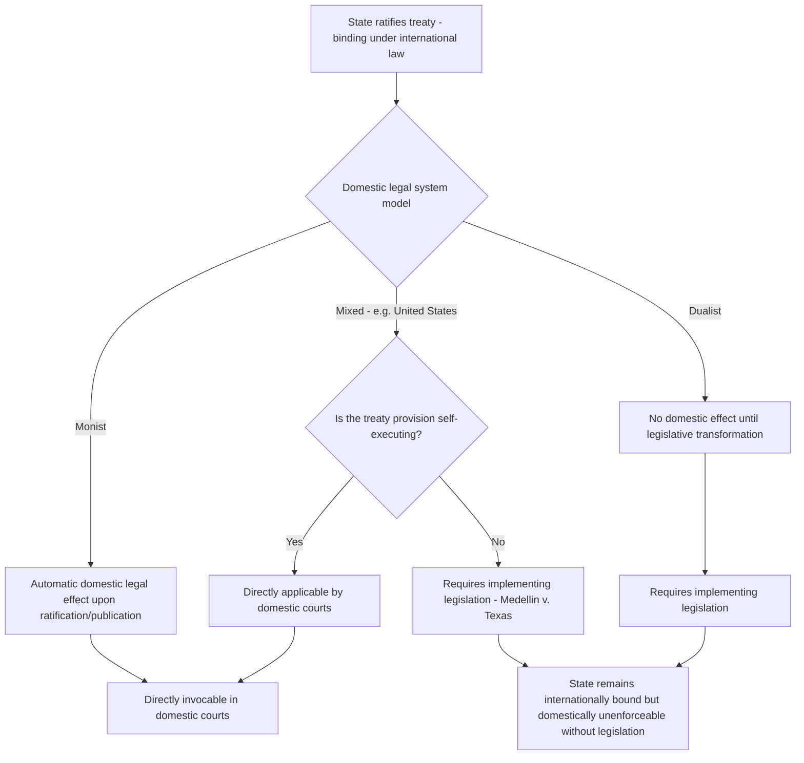

## Domestic Incorporation of International Law: Monism, Dualism, and Self-Executing Treaties

### The Underlying Problem: Two Legal Systems, One State

International law binds states as subjects of the international legal order, but the practical application of international obligations frequently requires action by domestic organs — courts, legislatures, and administrative agencies — operating within a separate, municipal legal order. **Domestic incorporation theory** addresses the doctrinal question of how, and to what extent, international law becomes part of the law applicable within a state's own domestic courts and institutions. This question sits downstream of the broader debate over whether international law is law without a sovereign enforcer, because a state's willingness to give direct domestic effect to international obligations is itself one of the mechanisms — alongside reciprocity, reputation, and managerial compliance dynamics — by which international legal rules acquire practical bite despite the absence of centralized international enforcement.

Two principal theoretical models describe the relationship between international and domestic law: **monism** and **dualism**. A third, more practically oriented doctrine — the distinction between **self-executing and non-self-executing treaties** — operates largely within (and is most developed in) dualist or mixed systems, and governs the specific question of whether a particular treaty provision can be applied directly by domestic courts without further legislative action.

### Monism

**Monism** holds that international law and domestic law form a **single, unified legal system**, with international law occupying a superior position in the hierarchy of norms. Under a strict monist theory (associated with the Austrian jurist Hans Kelsen's *Pure Theory of Law*), international law is automatically part of domestic law upon the state's assumption of the international obligation, without need for any separate act of domestic legislative transformation; a rule of international law that conflicts with domestic law prevails over it as a matter of legal hierarchy, at least in the strongest form of the theory.

**Practical features of monist systems:**

- Treaties, once validly ratified under the state's constitutional procedure, take automatic effect as part of the internal legal order and may be directly invoked before domestic courts without an intervening act of parliament to "transform" them into domestic law.
- Many monist constitutions nonetheless establish a **rank** for international law within the domestic hierarchy — commonly subordinate to the constitution itself but superior to ordinary domestic statutes (an arrangement often described as **"moderate monism"** to distinguish it from Kelsen's strict theoretical primacy of international law over the constitution itself).
- Illustrative example: **France**, under **Article 55 of the French Constitution of 1958**, provides that duly ratified or approved treaties or agreements have, upon publication, an authority superior to that of statutes, subject to reciprocal application by the other party.

### Dualism

**Dualism** treats international law and domestic law as **two separate, independent legal systems**, each with its own sources, subjects, and spheres of validity. Under dualist theory (associated with the German jurist Heinrich Triepel and the Italian jurist Dionisio Anzilotti), international law binds the state only on the plane of international relations, as an obligation owed to other states; it has **no automatic effect within the domestic legal order** and cannot be applied directly by domestic courts or relied upon by individuals in domestic litigation unless and until it has been **transformed** into domestic law through an act of the competent domestic law-making organ (ordinarily the legislature).

**Practical features of dualist systems:**

- A ratified treaty binds the state as a matter of international law (engaging state responsibility for non-compliance) even where it has no domestic legal effect at all, because ratification and domestic incorporation are treated as entirely distinct acts.
- Domestic courts in a dualist system will apply an unincorporated treaty only indirectly — for instance, as an interpretive aid where domestic legislation is ambiguous — but will not treat it as directly enforceable law creating rights or obligations for individuals.
- Illustrative example: the **United Kingdom** follows a dualist approach rooted in the constitutional principle that treaty-making is an exercise of the Crown's prerogative power in the sphere of foreign affairs, while law-making is reserved to Parliament; a treaty therefore requires implementing legislation before it has effect in UK domestic courts. This was affirmed in ***R (Miller) v. Secretary of State for Exiting the European Union* [2017] UKSC 5**, where the UK Supreme Court held that the prerogative could not be used to alter domestic law or nullify rights that Parliament had granted through the European Communities Act 1972, precisely because treaty-making and domestic law-making are constitutionally distinct powers under the dualist model.
- Customary international law's status differs even within dualist systems from that of treaties: many common law dualist jurisdictions apply a doctrine of **incorporation** for custom (customary international law is treated as automatically part of the common law, absent conflict with a statute or binding domestic precedent), while treaties remain subject to the stricter **transformation** requirement — reflecting the different constitutional actors historically responsible for making custom (state practice generally) versus treaties (the executive).

### Mixed and Intermediate Systems

Most states in practice do not adopt a pure monist or pure dualist model but a **mixed approach**, often differentiated by the type of international law source involved.

- **The United States** presents a mixed system with a formally monist textual foundation but significant dualist-style qualifications in practice. **Article VI, Clause 2 of the U.S. Constitution (the Supremacy Clause)** declares treaties made under the authority of the United States to be part of the "supreme Law of the Land," suggesting automatic domestic effect analogous to monism. In practice, however, U.S. courts distinguish between **self-executing** and **non-self-executing** treaties (discussed below), meaning the formally monist constitutional text is substantially qualified by a judicially developed doctrine that functions much like a dualist transformation requirement for a significant category of treaties.
- **The Philippines**, under **Article II, Section 2 of the 1987 Constitution**, adopts the "doctrine of incorporation," providing that the Philippines adopts the generally accepted principles of international law as part of the law of the land — a monist-style formulation for customary international law — while treaty ratification separately requires concurrence of at least two-thirds of the Senate under **Article VII, Section 21**, and the domestic application of treaty provisions in Philippine courts has, in practice, drawn on both incorporation and transformation reasoning depending on the treaty and provision at issue. **[Unverified]** — the precise doctrinal characterization of Philippine treaty practice as more monist or more dualist in specific applications is a matter of ongoing scholarly and judicial elaboration rather than a single settled rule, and would require verification against current Philippine Supreme Court jurisprudence for any specific treaty.

### Self-Executing and Non-Self-Executing Treaties

The **self-executing/non-self-executing distinction** is the doctrine that determines, within a legal system, whether a particular treaty (or provision thereof) can be applied and enforced directly by domestic courts, upon ratification, without the need for implementing legislation.

A treaty or treaty provision is generally considered **self-executing** where:

- Its text is sufficiently precise and complete to be applied by a court as a rule of decision without further legislative elaboration.
- The competent treaty-making authority (in U.S. practice, the President and Senate in giving advice and consent) intended the provision to have direct domestic effect without additional implementing legislation.
- It does not require the exercise of a power (such as appropriating funds or defining a criminal offense) that the domestic constitutional order reserves exclusively to the legislature.

A treaty or provision is **non-self-executing** where it requires further legislative action before domestic courts may give it direct legal effect — commonly because the provision is phrased as a promise of future legislative or executive action, is insufficiently precise for direct judicial application, or touches a subject matter (e.g., criminal law, appropriations) reserved to the legislature under the domestic constitutional structure.

**Leading U.S. doctrinal statement:** *Medellín v. Texas*, 552 U.S. 491 (2008). The U.S. Supreme Court held that even a treaty obligation that is binding on the United States as a matter of international law — in that case, the **International Court of Justice's judgment in *Avena and Other Mexican Nationals (Mexico v. United States)*, 2004**, which found the U.S. in breach of consular notification obligations under the **Vienna Convention on Consular Relations, Article 36** — does not automatically create domestically enforceable law in U.S. courts unless the underlying treaty obligation (**UN Charter Article 94**, requiring compliance with ICJ decisions) is itself self-executing. The Court held that Article 94 was **not self-executing**, and that implementing legislation from Congress, or another basis in domestic law, was required before a U.S. court could give the ICJ's *Avena* judgment binding domestic effect — notwithstanding that the United States remained bound as a matter of international law and in continuing breach of its Article 94 obligation. *Medellín* is the paradigmatic illustration of the doctrinal gap that self-executing treaty doctrine can create between a state's binding international obligation and its enforceable domestic legal effect.

### Interaction With Enforcement and Compliance Theory

The monism/dualism/self-execution framework has direct significance for the broader enforcement and compliance debate. A state may be in full, binding breach of an international obligation as a matter of international law — triggering state responsibility under the customary rules on state responsibility — while facing **no domestic legal consequence whatsoever**, because the relevant treaty provision lacks domestic legal status under the state's own constitutional doctrine (dualist transformation failure, or a judicial finding of non-self-execution). This illustrates concretely how the absence of a centralized international enforcer (the structural feature underlying the Austinian critique) is compounded by domestic constitutional doctrines that can further insulate a state's internal legal order from the practical consequences of its own binding international commitments, reinforcing reliance on the reputational, reciprocal, and managerial compliance mechanisms discussed elsewhere in this chapter rather than on domestic judicial enforcement as a compliance-inducing mechanism.

### Diagram: Pathways from Treaty Ratification to Domestic Legal Effect

### Key Points

- Monism treats international and domestic law as a single unified system, with treaties (and often custom) taking automatic domestic effect upon ratification, subject to a hierarchical rank vis-à-vis the constitution and ordinary statutes.
- Dualism treats international and domestic law as separate systems; treaties require legislative transformation before domestic courts can apply them directly, illustrated by the UK's constitutional approach in *R (Miller) v. Secretary of State for Exiting the European Union*.
- Most states adopt mixed systems; the U.S. Supremacy Clause is formally monist in text but is substantially qualified by the judicially developed self-executing/non-self-executing distinction.
- *Medellín v. Texas* is the leading illustration of the gap between binding international obligation (there, under UN Charter Article 94 following the ICJ's *Avena* judgment) and enforceable domestic legal effect where the underlying treaty provision is held non-self-executing.
- Domestic incorporation doctrine compounds the broader enforcement gap in international law: a state can be in full international breach while facing no domestic judicial consequence, reinforcing the practical importance of reputational, reciprocal, and managerial compliance mechanisms.

**Related Topics**

- Provisional measures and enforcement of ICJ judgments under UN Charter Article 94
- The Austinian critique and the question of whether international law is law without a sovereign enforcer
- The Vienna Convention on the Law of Treaties: ratification, reservations, and entry into force
- State responsibility for internationally wrongful acts under the ILC Articles on State Responsibility (2001)
- Constitutional treaty-making procedures: executive prerogative versus legislative concurrence