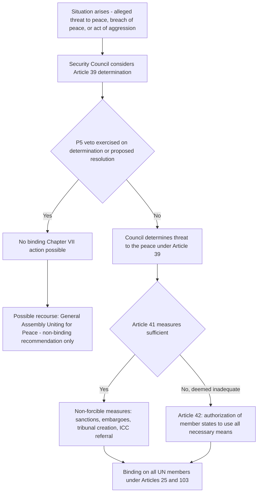

## UN Security Council Enforcement Powers Under Chapter VII and Their Selective Application

### The Chapter VII Framework: Legal Basis

**Chapter VII of the UN Charter**, comprising Articles 39 through 51, establishes the principal mechanism by which the UN Charter system departs from the purely decentralized, self-help structure of general international law and vests **binding, potentially coercive enforcement authority** in a centralized political organ — the Security Council. Chapter VII's significance for the broader enforcement and compliance debate is that it represents the closest institutional analogue within the international system to Austin's requirement of a sanction-backed sovereign command, and its selective, politically contingent application is frequently cited as the central empirical illustration of why that analogy remains incomplete.

**Article 39** is the threshold, triggering provision: the Security Council must first **determine the existence of any threat to the peace, breach of the peace, or act of aggression**, before it may proceed to make recommendations or decide what measures to take under Articles 41 and 42. This determination is a matter of Security Council political discretion — the Charter supplies no exhaustive definition of "threat to the peace," and the Council has, over time, interpreted the term to extend well beyond inter-state armed conflict to include internal humanitarian crises, terrorism, and even (more controversially) public health emergencies and the proliferation of weapons of mass destruction. **[Inference]** This interpretive elasticity is itself a significant point of doctrinal debate, since an expansive reading of "threat to the peace" correspondingly expands the scope of matters over which the Council may exercise binding Chapter VII authority, potentially at the expense of the domestic jurisdiction reservation in **Article 2(7)** of the Charter (which does not apply to the application of Chapter VII enforcement measures, per the Article 2(7) proviso itself).

### Article 41: Measures Not Involving the Use of Armed Force

**Article 41** authorizes the Security Council to decide what measures not involving the use of armed force are to be employed to give effect to its decisions, and to call upon UN member states to apply such measures. The Article provides a non-exhaustive illustrative list: complete or partial interruption of economic relations, rail, sea, air, postal, telegraphic, radio and other means of communication, and severance of diplomatic relations.

**Key doctrinal features:**

- Measures adopted under Article 41 are **binding** on all UN member states by virtue of **Article 25** of the Charter, which provides that members agree to accept and carry out the decisions of the Security Council in accordance with the Charter, combined with **Article 103**, which provides that Charter obligations prevail over any conflicting obligations under other international agreements.
- Contemporary practice has expanded Article 41 measures well beyond the Charter's illustrative list to include **targeted ("smart") sanctions** against designated individuals and entities (asset freezes, travel bans), arms embargoes, and the establishment of **international criminal tribunals** — the Security Council created the **International Criminal Tribunal for the former Yugoslavia (ICTY)** by Resolution 827 (1993) and the **International Criminal Tribunal for Rwanda (ICTR)** by Resolution 955 (1994), both expressly invoking Chapter VII as the legal basis for their binding, compulsory jurisdiction over the situations concerned — a notable use of Article 41 to create judicial rather than purely economic or diplomatic enforcement mechanisms.
- The Security Council has also used Chapter VII to **refer situations to the International Criminal Court** under **Article 13(b) of the Rome Statute**, notwithstanding that the referred state may not itself be a party to the Rome Statute — illustrated by **Resolution 1593 (2005)**, referring the situation in Darfur, Sudan (a non-party to the Rome Statute) to the ICC, and **Resolution 1970 (2011)**, referring the situation in Libya.

### Article 42: Measures Involving the Use of Armed Force

**Article 42** authorizes the Security Council, where it considers Article 41 measures would be or have proved to be inadequate, to take such action by air, sea, or land forces as may be necessary to maintain or restore international peace and security. This is the Charter's most significant departure from the general prohibition on the use of force in **Article 2(4)**, and constitutes one of only two accepted exceptions to that prohibition under the contemporary jus ad bellum framework (the other being individual or collective self-defense under **Article 51**).

**The unrealized standby force system.** The Charter's original design contemplated that Article 42 action would be carried out by UN forces made available to the Council under **special agreements concluded pursuant to Article 43**, establishing a standing UN military capability. These Article 43 agreements were never concluded due to Cold War-era great-power disagreement, meaning the Charter's own contemplated mechanism for direct UN military enforcement has never become operative in practice.

**The "authorization" practice as a substitute mechanism.** In the absence of a functioning Article 43 system, Security Council practice since the 1990 Gulf War has developed an alternative model: rather than commanding forces directly, the Council **authorizes** willing member states, coalitions, or regional organizations to use "all necessary means" (the customary diplomatic formula for authorizing force) to achieve a specified Chapter VII objective, with the authorized states retaining command and control over their own forces. This practice was inaugurated by **Security Council Resolution 678 (1990)**, authorizing member states cooperating with Kuwait to use all necessary means to compel Iraqi withdrawal following Iraq's invasion of Kuwait, and has since become the dominant model for Chapter VII-authorized enforcement action (e.g., the NATO-led intervention in Libya authorized by **Resolution 1973 (2011)**, which authorized member states to take all necessary measures to protect civilians).

### The Veto and the Structural Constraint on Selective Application

**Article 27(3)** of the Charter requires that decisions of the Security Council on non-procedural matters be made by an affirmative vote of nine members, including the concurring votes of the five permanent members (China, France, Russia, the United Kingdom, and the United States) — the **veto power**. This provision is the principal structural mechanism producing the selective and politically contingent application of Chapter VII enforcement that is central to critiques of the Council as an effective centralized enforcer.

**Mechanisms and consequences of selectivity:**

1. **Direct veto of proposed enforcement action.** Any P5 member can block a proposed Chapter VII resolution outright, including where the P5 member is itself implicated in the underlying situation or shields an ally from enforcement action. This is the same structural feature examined in the context of ICJ judgment enforcement under **UN Charter Article 94(2)**, where the *Nicaragua v. United States* case produced a U.S. veto of a Council resolution intended to give effect to the ICJ's judgment — illustrating that the veto constrains not only new Chapter VII enforcement initiatives but also the Council's discretionary Article 94(2) role in enforcing ICJ judgments.
2. **Non-referral and selective triage of situations.** Because Article 39's threshold determination is itself a Council decision subject to the veto, the Council can be blocked even from formally characterizing a situation as a threat to the peace, preventing any Chapter VII response from being considered at all — producing marked asymmetry in which crises receive binding Council attention and which do not, largely tracking the interests and alliances of the P5.
3. **Comparative practice illustrating selectivity.** The Council's willingness to authorize robust Chapter VII enforcement in Iraq (1990–91) and Libya (2011) is frequently contrasted with its repeated inability to adopt binding measures in response to allegations of comparably serious violations of international humanitarian law in Syria, where Russian (and, on certain resolutions, Chinese) vetoes blocked multiple proposed Chapter VII resolutions over the course of the Syrian civil war. **[Inference]** This contrast is commonly invoked in the scholarly and policy literature as the paradigmatic illustration of Chapter VII's selective, power-contingent application, though characterizing the underlying political motivations for any specific veto involves contestable political judgments beyond the scope of strict doctrinal analysis.
4. **The Uniting for Peace mechanism as a partial, non-binding workaround.** Where Council action is blocked by veto, **General Assembly Resolution 377A (V), "Uniting for Peace" (1950)**, provides a procedural mechanism by which the Assembly may consider the matter and make recommendations to member states, including recommendations for collective measures. Critically, Uniting for Peace resolutions are **not binding** in the manner of a Chapter VII Security Council decision under Article 25, and do not restore the coercive, obligatory character of Council enforcement action — they function as a political and normative pressure mechanism rather than a genuine substitute for binding Chapter VII enforcement.

### The Responsibility to Protect and Its Interaction With Selectivity

The **Responsibility to Protect (R2P)** doctrine, endorsed in the **2005 World Summit Outcome Document** (paragraphs 138–139), articulates a normative expectation that the international community, through the Security Council, bears responsibility to take timely and decisive collective action, through Chapter VII, when a state manifestly fails to protect its population from genocide, war crimes, ethnic cleansing, and crimes against humanity. R2P is best understood as a **political and normative framework endorsed by the General Assembly**, not a freestanding source of binding legal obligation independent of the Charter's own Chapter VII procedures — meaning R2P's practical application remains fully subject to the same Article 27(3) veto constraint as any other proposed Chapter VII action, a limitation vividly illustrated by the Council's invocation of R2P language in authorizing intervention in Libya (Resolution 1973, 2011) alongside its repeated inability to secure comparable action in Syria despite ongoing R2P advocacy.

### Diagram: Chapter VII Enforcement Pathway and the Veto Constraint

### Key Points

- Chapter VII authorizes binding enforcement action once the Security Council makes an Article 39 threat-to-the-peace determination, proceeding to non-forcible measures under Article 41 or armed force under Article 42.
- The Charter's original Article 43 standby force system was never implemented; contemporary practice instead relies on Council "authorization" of willing states or coalitions to use "all necessary means," inaugurated by Resolution 678 (1990).
- Article 41 practice has expanded beyond economic sanctions to include creation of international criminal tribunals (ICTY, ICTR) and Chapter VII referrals of situations to the ICC under Rome Statute Article 13(b) (Darfur, Libya).
- The Article 27(3) veto is the principal mechanism producing selective application, illustrated by the contrast between robust Chapter VII enforcement in Iraq (1990–91) and Libya (2011) versus repeated deadlock over Syria.
- The Responsibility to Protect doctrine articulates a normative expectation of Council action but remains fully subject to the same veto constraint, and Uniting for Peace offers only a non-binding political workaround, not a substitute for binding Chapter VII authority.

**Related Topics**

- Provisional measures and enforcement of ICJ judgments under UN Charter Article 94
- The Austinian critique and the question of whether international law is law without a sovereign enforcer
- The jus ad bellum: Article 2(4), self-defense under Article 51, and exceptions to the prohibition on the use of force
- Security Council referrals to the International Criminal Court under Rome Statute Article 13(b)
- The Responsibility to Protect doctrine and its normative versus legal status