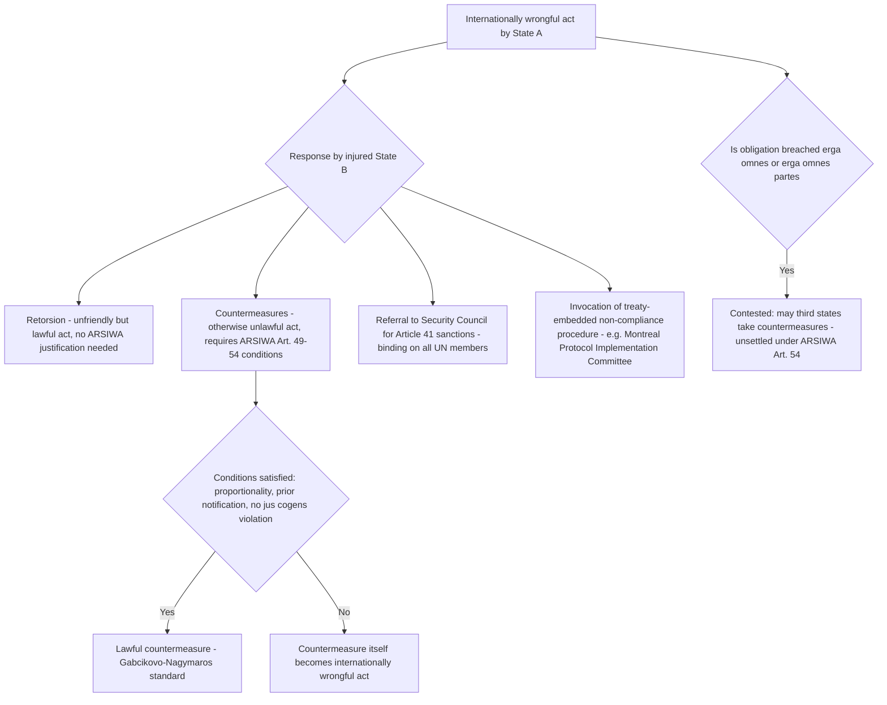

## Countermeasures, Sanctions, and Non-Judicial Enforcement Mechanisms in Practice

### Overview: Enforcement Outside Adjudication

Because binding third-party adjudication before bodies such as the ICJ requires state consent and covers only a fraction of international disputes, and because centralized enforcement through the UN Security Council under Chapter VII is constrained by the Article 27(3) veto and applied selectively, the great majority of practical enforcement of international legal obligations occurs through **non-judicial, self-help, and institutional mechanisms** operating outside any court or tribunal. This item examines the doctrinal architecture of the principal non-judicial enforcement tools: countermeasures, retorsion, unilateral and multilateral sanctions, and institutional compliance mechanisms embedded directly within treaty regimes.

### Countermeasures: Doctrinal Foundations

**Countermeasures** are actions by an injured state, which would otherwise be unlawful under international law, taken in response to another state's prior internationally wrongful act, for the purpose of inducing that state to comply with its international obligations. Countermeasures are codified in the **International Law Commission's Articles on Responsibility of States for Internationally Wrongful Acts (ARSIWA), 2001, Articles 22 and 49–54**. Although ARSIWA is not itself a binding treaty, it is widely regarded as substantially reflective of customary international law on state responsibility, and its provisions on countermeasures were significantly informed by the ICJ's earlier judgment in ***Gabčíkovo-Nagymaros Project (Hungary/Slovakia)***, Judgment of 25 September 1997.

**Conditions for lawful countermeasures under ARSIWA:**

1. **Prior internationally wrongful act.** A countermeasure is lawful only in response to a genuine, prior breach of an international obligation owed to the injured state by the target state (ARSIWA Article 49(1)). A state that takes a "countermeasure" in response to a merely alleged or mistaken breach bears the risk that its own action will itself constitute an internationally wrongful act if the predicate breach is not established.
2. **Purpose limited to inducing compliance.** Countermeasures must be directed at inducing the responsible state to comply with its obligations (cessation and, where relevant, reparation); they may not be punitive in character (ARSIWA Article 49(1)).
3. **Proportionality.** Countermeasures must be **commensurate with the injury suffered**, taking into account the gravity of the internationally wrongful act and the rights in question (ARSIWA Article 51). The ICJ applied this proportionality requirement in *Gabčíkovo-Nagymaros*, finding that Czechoslovakia's unilateral diversion of the Danube (the "Variant C" project) was disproportionate to the injury caused by Hungary's suspension and abandonment of the joint barrage project, and therefore did not qualify as a lawful countermeasure.
4. **Temporary and reversible character.** Countermeasures must, as far as possible, be taken in a manner that permits the resumption of performance of the obligations in question upon compliance by the responsible state (ARSIWA Article 49(3)); they are not intended to produce permanent or irreversible effects.
5. **Prior notification and offer to negotiate.** ARSIWA Article 52 requires the injured state, before taking countermeasures, to call upon the responsible state to fulfil its obligations, notify the responsible state of any decision to take countermeasures, and offer to negotiate, except for such urgent countermeasures as are necessary to preserve its rights.
6. **Categorical prohibitions.** ARSIWA Article 50 provides that countermeasures may not affect: (a) the obligation to refrain from the threat or use of force under the UN Charter; (b) obligations for the protection of fundamental human rights; (c) obligations of a humanitarian character prohibiting reprisals; and (d) other obligations under peremptory norms of general international law (**jus cogens** — a peremptory norm from which no derogation is permitted, and which can be modified only by a subsequent norm of the same character, as defined in **VCLT Article 53**).

**Countermeasures distinguished from retorsion.** **Retorsion** refers to unfriendly but *lawful* acts taken by one state against another in response to a prior unfriendly or unlawful act — for example, the reduction of diplomatic relations, expulsion of diplomats within the bounds otherwise permitted by law, or withdrawal of voluntary aid. Because retorsion involves no departure from an otherwise applicable legal obligation, it requires no ARSIWA justification at all and is not subject to the proportionality or notification conditions governing countermeasures; the distinction turns entirely on whether the responding measure would, absent the predicate wrongful act, itself be unlawful.

### Collective (Third-Party) Countermeasures

A significant and unresolved doctrinal question is whether states **not directly injured** by a breach — but which have a legal interest in compliance because the obligation breached is owed to the international community as a whole (an **erga omnes** obligation — an obligation owed by a state to the international community as a whole, such that every state has a legal interest in its performance, as articulated by the ICJ in ***Barcelona Traction, Light and Power Company, Limited (Belgium v. Spain)***, 1970) — may lawfully take countermeasures in response.

ARSIWA Article 54 addresses this only obliquely, preserving the right of states other than an injured state to take "lawful measures" against a responsible state to ensure cessation of the breach and reparation in the interest of the injured state or the beneficiaries of the obligation breached, without either affirmatively endorsing or denying that such measures may include countermeasures proper (as opposed to retorsion). **This remains a genuinely contested question in international law.**

*Strongest form of the position favoring third-party countermeasures:* Obligations erga omnes and erga omnes partes (obligations owed to all parties to a particular treaty regime collectively, as recognized by the ICJ in ***Belgium v. Senegal (Questions relating to the Obligation to Prosecute or Extradite)***, 2012, in the context of the Convention Against Torture) would be systematically under-enforced if only a directly injured state could respond with countermeasures, since many of the gravest violations of international law (genocide, aggression, systematic human rights violations) injure the international community as a whole rather than a single identifiable state; permitting third-party countermeasures is therefore necessary to give these obligations practical effect in a system lacking centralized enforcement.

*Strongest form of the position against (or requiring caution toward) third-party countermeasures:* Extending the right to take countermeasures to any state asserting a community interest risks significant abuse and destabilization, since it removes the disciplining function that direct injury and proportionality-to-one's-own-injury otherwise provide, and there is limited, inconsistent state practice actually asserting a right to third-party countermeasures (as opposed to retorsion or Security Council-authorized sanctions) — meaning the customary status of a general right to third-party countermeasures remains doctrinally unsettled rather than established.

### Sanctions: Unilateral, Plurilateral, and Multilateral

**"Sanctions"** is used descriptively across international practice for restrictive measures imposed on a target state, entity, or individual, and it is important to distinguish the source of legal authority for different categories:

1. **UN Security Council sanctions**, adopted under **Article 41 of the UN Charter**, are binding on all UN member states pursuant to Article 25 and require no separate act of countermeasure justification, since they derive their legal authority directly from the Charter's collective security system rather than from the bilateral law of state responsibility.
2. **Unilateral or plurilateral sanctions** imposed by an individual state or group of states (e.g., autonomous EU restrictive measures, or U.S. sanctions programs administered by the Treasury Department's Office of Foreign Assets Control) outside any Security Council authorization occupy a more doctrinally contested position. Where such sanctions involve measures that would otherwise breach an obligation owed to the target state (e.g., suspension of a trade agreement's preferential terms), they must be justified as lawful countermeasures under the ARSIWA framework described above to avoid themselves constituting an internationally wrongful act; where they involve only the withdrawal of a discretionary benefit not otherwise owed as a matter of legal obligation (e.g., ending voluntary preferential trade treatment that was never legally guaranteed), they may instead be characterized as lawful retorsion requiring no countermeasure justification at all.
3. **[Inference]** The proliferating practice of unilateral sanctions by major economic powers (the United States and European Union prominently among them) has generated sustained academic debate over their consistency with the countermeasures framework, particularly regarding whether a state may lawfully impose measures in response to a breach of an obligation owed to a *third* state rather than to itself — a fact pattern implicating precisely the unsettled third-party countermeasures question addressed above.

### Institutional Compliance Mechanisms Within Treaty Regimes

Distinct from countermeasures and sanctions, many contemporary multilateral treaties embed **institutionalized, non-judicial compliance mechanisms** directly within the treaty structure, reflecting the cooperative, managerial logic associated with the Chayes and Chayes managerial model of treaty compliance rather than the adversarial logic of countermeasures:

- **Non-compliance procedures (NCPs)**, pioneered by the **Montreal Protocol on Substances that Deplete the Ozone Layer (1987)**, establish a standing Implementation Committee that reviews reported or alleged instances of non-compliance and recommends facilitative responses (technical or financial assistance, revised timetables) rather than punitive sanctions, operationalizing the managerial diagnosis that non-compliance frequently stems from capacity limitations rather than deliberate breach.
- **Reporting and periodic review mechanisms**, such as the **Universal Periodic Review** conducted by the UN Human Rights Council, or state party reporting obligations under human rights treaties (e.g., under the **International Covenant on Civil and Political Rights, Article 40**), function as transparency-based compliance tools rather than adjudicatory or coercive mechanisms, relying on peer scrutiny and reputational pressure rather than sanction.
- **Trade dispute settlement with authorized retaliation**, exemplified by the **World Trade Organization's Dispute Settlement Understanding**, occupies a hybrid position: it is adjudicatory (a panel and Appellate Body process, historically) but its enforcement mechanism ultimately authorizes the prevailing member to suspend concessions (a WTO-sanctioned form of countermeasure) against the non-complying member where compliance is not achieved within a reasonable period, illustrating how judicial and non-judicial enforcement logics can be combined within a single treaty regime.

### Diagram: Enforcement Pathways Outside Adjudication

### Key Points

- Countermeasures under ARSIWA Articles 49–54 must respond to a prior wrongful act, aim only at inducing compliance (not punishment), be proportionate, remain reversible where possible, and follow prior notification, as illustrated by the ICJ's proportionality analysis in *Gabčíkovo-Nagymaros*.
- Retorsion (unfriendly but lawful acts) requires no countermeasure justification, unlike countermeasures, which involve conduct that would otherwise be unlawful.
- Whether states not directly injured may take countermeasures in response to breaches of erga omnes or erga omnes partes obligations remains a genuinely unsettled question under ARSIWA Article 54.
- Sanctions vary in legal basis: UN Security Council sanctions under Article 41 are Charter-based and binding; unilateral and plurilateral sanctions must be justified as lawful countermeasures or retorsion to avoid themselves breaching international law.
- Institutional, non-judicial compliance mechanisms (Montreal Protocol non-compliance procedures, UN human rights reporting, WTO-authorized retaliation) supplement countermeasures and sanctions with facilitative, transparency-based, or hybrid adjudicatory-enforcement tools.

**Related Topics**

- Chayes and Chayes' managerial model of treaty compliance
- UN Security Council enforcement powers under Chapter VII and their selective application
- Jus cogens norms and their relationship to treaty invalidity under VCLT Article 53
- Erga omnes obligations and standing to invoke state responsibility
- The World Trade Organization Dispute Settlement Understanding and authorized retaliation