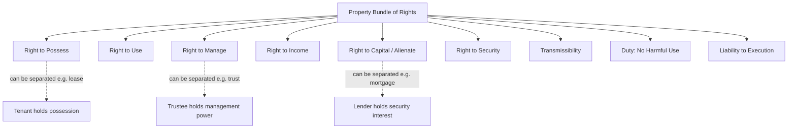

## Concept and Theories of Property

### Definition and Scope

Property, in legal terms, is not the physical object itself but the bundle of legally enforceable rights, powers, and relationships a person holds with respect to a thing, whether tangible (land, chattels) or intangible (patents, shares, choses in action). Law does not protect "things" — it protects claims to things that are recognized and enforced by the state against others.

**Key Points**

- Property is relational: it describes a relationship between persons regarding a resource, not merely a relationship between a person and an object.
- Property rights are enforceable against either a specific person (in personam) or the world at large (in rem).
- The subject matter of property can be corporeal (land, goods) or incorporeal (easements, intellectual property, debts).

### The Bundle of Rights Theory

The dominant Anglo-American conception treats property as a "bundle of sticks" rather than a single, unified right of ownership. Each stick represents a distinct incident of ownership that can be separated, transferred, or extinguished independently.

**Key Points**

- **Right to possess** — the right to exclusive physical control.
- **Right to use** — the right to personal enjoyment and exploitation of the thing.
- **Right to manage** — the right to decide how and by whom the thing shall be used.
- **Right to income** — the right to derive economic benefit (rents, profits).
- **Right to the capital** — the power to alienate, consume, waste, destroy, or transfer.
- **Right to security** — immunity from expropriation without due process.
- **Transmissibility** — the right to pass the interest on death (devise or intestacy).
- **Absence of term** — many property interests (e.g., fee simple) have no inherent time limit.
- **Prohibition of harmful use** — the duty not to use the property to injure others.
- **Liability to execution** — the interest can be taken to satisfy debts.
- **Residuary character** — on the expiry of lesser rights, the interest reverts to the holder of the larger bundle.

This framework, most associated with A.M. Honoré's incidents of ownership, explains phenomena like leases, easements, mortgages, and trusts: each is simply a redistribution of some sticks from the bundle while other sticks remain with the original owner.

### Major Theories of Property

**Key Points**

**1. Natural Rights / Labor Theory (Locke)**

Property arises from the application of labor to unowned resources. By mixing one's labor with nature, a person acquires a natural right to the product, subject to the "Lockean proviso" that enough and as good must be left for others.

- Strength: Explains first possession and homesteading doctrines.
- Critique: The proviso is difficult to satisfy once resources become scarce; does not explain inherited property well.

**2. Utilitarian Theory (Bentham, Posner)**

Property exists because it maximizes aggregate social welfare by creating incentives for productive use, investment, and exchange. Property rights are instrumental, not natural — they are justified only insofar as they produce efficient outcomes.

- Strength: Underpins modern law and economics analysis (e.g., the [Coase Theorem](https://en.wikipedia.org/wiki/Coase_theorem) and efficient allocation of resources).
- Critique: Can justify redistribution or abolition of property rights if shown to be inefficient; provides no inherent limit on state interference.

**3. Personality Theory (Hegel, Radin)**

Property is an extension of the individual's will and personhood into the external world. Certain property (a family home, a wedding ring) is "constitutive" of personal identity and deserves stronger protection than purely fungible property (cash, commodities).

- Strength: Explains heightened protections for the home (e.g., homestead exemptions) and moral objections to forced sales of sentimental property.
- Critique: Difficult to operationalize a bright-line distinction between "personal" and "fungible" property.

**4. Social Function / Institutional Theory**

Property is a social institution shaped by law to serve collective goals; ownership carries correlative social obligations (e.g., environmental stewardship, land reform). Rights are not absolute but calibrated to social utility.

- Reflected in constitutional provisions of many jurisdictions (e.g., property "shall not be used contrary to the public interest," as under the Philippine Constitution, Art. XII, and land reform statutes).

**5. Economic (Law and Economics) Theory**

Focuses on property as a mechanism to internalize externalities and reduce transaction costs, following Ronald Coase and Harold Demsetz. Property rights emerge when the benefits of internalization exceed the costs of establishing and enforcing them.

**6. Positivist Theory (Austin, Bentham)**

Property rights exist only because the sovereign/state creates and enforces them through law; there is no property "in nature" — only claims validated by a legal system backed by coercive power.

### Classification of Property

**Key Points**

- **Real property (immovable)** vs. **personal property (movable/chattels)** — the classic common law division, historically tied to differing remedies (real actions recovering the land itself vs. personal actions for damages).
- **Corporeal** (tangible, physically possessable) vs. **incorporeal** (rights without physical substance, e.g., easements, franchises, intellectual property).
- **Public property** (owned by the state for public use, e.g., roads, forests) vs. **private property** (held by individuals or private entities) vs. **common property** (held collectively, e.g., ancestral domains, commons).
- **Movable vs. immovable**, the civil law equivalent distinction, turning on whether the property can be transported without altering its substance.

### Modes of Acquisition of Property

**Key Points**

- **Occupation** — acquiring ownership of a thing with no owner (res nullius), such as wild game or abandoned goods.
- **Accession** — ownership extends to what is produced by or incorporated into the property (e.g., alluvium, fruits, buildings on land).
- **Prescription** — acquisition (or loss) of rights through the passage of time coupled with possession (acquisitive prescription) or non-use (extinctive prescription).
- **Tradition/Delivery** — transfer of ownership through actual or constructive delivery pursuant to a valid title (sale, donation, exchange).
- **Succession** — transfer of property upon death, by will (testate) or by operation of law (intestate).
- **Law** — certain property rights are created directly by statute (e.g., statutory easements, homestead patents).

### Theoretical Justifications for Limiting Property

No theory of property is absolute; all major frameworks recognize inherent limitations:

- **Police power** — the state may regulate property use to protect health, safety, morals, and general welfare without compensation.
- **Eminent domain** — the state may take private property for public use upon payment of just compensation.
- **Taxation** — property may be subjected to levies to fund government functions.
- **Escheat** — property reverts to the state in the absence of legal heirs.
- **Nuisance doctrine** — an owner's use right is bounded by the maxim *sic utere tuo ut alienum non laedas* (use your own property so as not to injure another's).

### Illustrative Diagram: Bundle of Rights

### Comparative Table of Theories

| Theory | Core Justification | Primary Weakness | Legal Application |
| --- | --- | --- | --- |
| Labor (Locke) | Labor mixed with resource creates entitlement | Proviso fails under scarcity | First possession, homesteading |
| Utilitarian | Maximizes social welfare | Justifies redistribution | Law and economics, efficient breach |
| Personality | Extension of self/will | Vague personal/fungible line | Homestead protection, moral rights |
| Social Function | Property serves collective good | Can erode security of tenure | Land reform, zoning, CARP-type statutes |
| Economic/Coasean | Internalizes externalities | Ignores distributive justice | Transaction-cost analysis of easements, nuisance |
| Positivist | State-created and enforced | No limit on state power absent constitution | Registration systems (Torrens title) |

### Practical Example

A landowner (A) grants a right of way (easement) to a neighbor (B) across A's lot, while retaining the fee simple title. Under the bundle-of-rights theory, A has transferred one "stick" — a limited right of use — while retaining possession, management, income, and the capital value of the land. B's right is proprietary (binding on successors-in-interest of A, not merely personal to A), illustrating how incorporeal property rights can be carved out of a larger corporeal estate without transferring ownership itself.

### Conclusion

No single theory fully explains modern property law; courts and legislatures draw eclectically on labor-desert, utilitarian efficiency, personhood, and social-function rationales depending on the context — vindicating first possession in one case, permitting regulatory takings in another, and protecting the family home with special solicitude in a third. Understanding these theoretical foundations is essential before examining specific property regimes such as ownership, co-ownership, possession, and — most relevant to this course — easements and other real rights over another's property (jura in re aliena).

**Related Topics**

- Classification of Property (Real vs. Personal, Movable vs. Immovable)
- Modes of Acquiring Ownership
- Possession and Its Legal Effects
- Ownership vs. Other Real Rights (*Jus in re propria* vs. *Jus in re aliena*)
- The Torrens System and Land Registration
- Police Power, Eminent Domain, and Taxation as Limitations on Property
- Introduction to Easements and Servitudes
- Co-ownership and Condominium Regimes