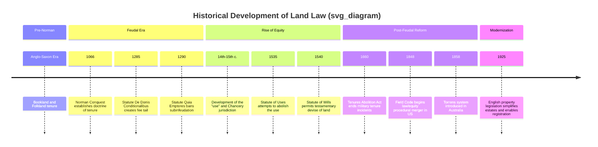
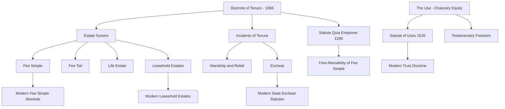

## Historical Development of Land Law

### Overview

Land law as practiced today is the accumulated product of centuries of legal evolution, primarily rooted in English common law, which was subsequently exported to and adapted by common law jurisdictions including the United States, Canada, Australia, and others. Understanding this historical trajectory is essential because modern land rights and easement doctrines are not arbitrary rules but the residue of feudal land tenure systems, equity courts, and statutory reforms that progressively dismantled feudal incidents while retaining core conceptual structures like the estate system and the law/equity distinction.

### Pre-Feudal and Early Foundations

**Anglo-Saxon Land Tenure**

Before the Norman Conquest of 1066, land in England was held under systems that varied by region, broadly divided into:

- **Bookland**: Land granted by charter (a "boc"), often to the Church or favored individuals, which could generally be alienated (transferred) by the holder.
- **Folkland**: Land held according to customary/folk law, generally inherited within kinship groups and not freely alienable.

These systems lacked the unifying conceptual apparatus of later feudal tenure but established the basic idea that land rights could be documented, inherited, and subject to differing rules of transferability.

### The Norman Conquest and Feudal Tenure (1066 onward)

**The Doctrine of Tenure**

William the Conqueror's assertion of ownership over all English land upon conquest is the foundational event of English land law. Under the resulting feudal system:

- The King became the ultimate/paramount owner of all land (*allodial* ownership resided solely in the Crown).
- All other landholders held their land *from* someone above them in a hierarchical chain — this is the doctrine of **tenure** (from Latin *tenere*, "to hold").
- No subject could "own" land outright in the way understood today; instead, subjects held an **estate** in the land — a bundle of rights measured by duration and conditions.

This produced two foundational and enduring conceptual splits in land law:

1. **Tenure** — the relationship/terms under which land was held (largely abolished in substance but conceptually persistent).
2. **Estates** — the temporal quantum of interest held in the land (still central to modern property law).

**Types of Tenure**

Feudal tenures were categorized as free (*libera tenura*) or unfree, and further subdivided by the services owed:

- **Knight service**: Military service owed to the lord.
- **Serjeanty**: Personal service (e.g., ceremonial duties).
- **Frankalmoign**: Free alms tenure, held by religious institutions in exchange for spiritual services (prayers).
- **Socage**: Tenure involving fixed agricultural or monetary payments rather than military service; this became the dominant and most "modern" form, as it was the most easily converted into simple economic obligations.
- **Copyhold and villeinage**: Unfree tenures held by peasants, evidenced by entry in the manorial court roll (a "copy" of which the tenant held), subject to the lord's customary demands.

**Incidents of Tenure**

Tenure carried "incidents" — feudal dues owed by the tenant to the lord, which were a major source of lordly revenue and later a major target of reform:

- **Homage and fealty**: Oaths of loyalty and service.
- **Relief**: A payment owed by an heir to take possession of inherited land.
- **Wardship and marriage**: The lord's right to control a minor heir's estate and arrange (or profit from) their marriage.
- **Escheat**: Reversion of land to the lord if the tenant died without heirs or committed treason/felony.
- **Aids**: Financial contributions owed for specific lordly needs (e.g., ransom, knighting the lord's son).

### Development of the Estate System

**The Concept of Seisin**

Because the King held ultimate ownership, subjects could not be said to "own" land in fee; instead, they had **seisin** — actual possession under a claim of freehold right. Seisin, not abstract title, was the central organizing concept of medieval land law, and many procedural rules (e.g., the old real actions) were built around protecting or recovering seisin.

**Freehold Estates**

The common law developed a hierarchy of estates defining how long an interest in land would last:

- **Fee simple (absolute)**: The largest estate, potentially infinite in duration, freely inheritable and (eventually) freely alienable.
- **Fee tail**: An estate limited to inheritance by lineal descendants only, created by the statute *De Donis Conditionalibus* (1285), designed to keep land within a family line; later substantially curtailed through the legal fiction of "common recovery" and, in most U.S. jurisdictions, abolished or converted into fee simple by statute.
- **Life estate**: An estate lasting for the life of a specified person (the life tenant, or *pur autre vie* if measured by another's life).

**Non-Freehold (Leasehold) Estates**

Leasehold interests developed later and separately, initially treated as personal property (chattels real) rather than "real property," because leaseholders lacked seisin. Types included:

- Estate for years
- Periodic tenancy
- Tenancy at will
- Tenancy at sufferance

This freehold/leasehold and real/personal property distinction remains embedded in modern classification, even though leaseholds are now treated with substantial procedural parity to freehold interests in many respects.

### The Statute of Quia Emptores (1290)

This statute prohibited **subinfeudation** (a tenant granting land to a new sub-tenant while remaining a tenant themselves, thereby inserting a new rung in the feudal ladder) and instead required that any transfer of the entire fee simple be by **substitution** — the transferee stepping into the transferor's position in the tenurial chain directly under the same lord.

**Significance**:

- Prevented the indefinite proliferation of tenurial layers, which had been eroding lords' revenue from incidents.
- Accelerated the practical freedom to alienate land, contributing to fee simple becoming a freely transferable commodity rather than a personal bond between lord and tenant.
- Notably, Quia Emptores did not apply to the King's own tenants-in-chief, and its influence on U.S. law is indirect since it was never uniformly "received," though its substitution principle is embedded in modern conveyancing.

### Rise of Equity and the Use

**The Problem Equity Solved**

Common law courts rigidly enforced legal title, which created two persistent problems:

1. Land held at law could not easily be devised by will (common law generally did not permit testamentary disposition of freehold land until the Statute of Wills 1540).
2. Feudal incidents (especially wardship and relief) were burdensome, and landholders sought ways to avoid them.

**The Use**

Landowners began conveying legal title to a group of trusted friends ("feoffees to uses") who held the land "to the use of" a beneficiary (the *cestui que use*). The feoffees held legal title; the beneficiary held only an equitable interest recognized not by the common law courts but by the **Court of Chancery**, applying principles of conscience and fairness.

This arrangement:

- Allowed land to pass to whomever the settlor wished, effectively achieving testamentary freedom.
- Avoided many feudal incidents because the feoffees (often a rotating group, or including the King's own officials) never "died" holding sole seisin in a way that triggered wardship/relief in the same manner.
- Created the foundational split between **legal title** and **equitable/beneficial interest** — the direct ancestor of the modern trust.

**The Statute of Uses (1535)**

Henry VIII, losing substantial feudal revenue due to the widespread use of "uses," enacted the Statute of Uses, which attempted to "execute the use" — automatically converting the beneficiary's equitable interest into full legal title, thereby collapsing the use and restoring the Crown's incident revenue.

**Consequences and Loopholes**:

- Lawyers quickly developed the "use upon a use" (a second use layered on the first), which Chancery eventually again recognized as valid equitable interests, effectively reviving the modern trust concept the statute had tried to eliminate.
- The Statute of Uses is also the historical origin of the ability to convey a freehold estate to commence in the future (a "shifting" or "springing" use), which fed directly into the development of legal future interests such as the executory interest.

### The Statute of Wills (1540) and Tenures Abolition Act (1660)

- **Statute of Wills (1540)**: Granted landowners the statutory right to devise land by will, partially compensating for the loss of the use as a testamentary device and cementing testamentary freedom over real property.
- **Tenures Abolition Act (1660)**: Abolished feudal military tenures (knight service and its onerous incidents like wardship and marriage) and converted virtually all free tenure into **free and common socage** — effectively ending the practical burden of feudalism while leaving the *conceptual* doctrine of tenure technically intact (it survives today only as a legal fiction/historical relic in England, and was expressly or implicitly abolished/replaced by allodial ownership concepts in most U.S. states).

### Registration, Reform, and the 1925 Property Legislation (England)

By the 19th and early 20th centuries, English land law had become notoriously complex, burdened by:

- Multiple overlapping legal and equitable interests
- Difficulty verifying title (requiring lengthy chains of historical deeds)
- Numerous archaic and unfamiliar estate types

**The 1925 Property Legislation** (a package including the Law of Property Act 1925, Land Registration Act 1925, Settled Land Act 1925, Trustee Act 1925, and Administration of Estates Act 1925) undertook the most significant modernization of English land law:

- Reduced legal estates in land to only two: the **fee simple absolute in possession** and the **term of years absolute** (leasehold).
- Converted all other freehold interests (life estates, fees tail, etc.) into **equitable interests**, enforceable only behind a trust.
- Simplified conveyancing and introduced/expanded systems of **land registration**, gradually replacing the historical reliance on unregistered title deeds with a state-guaranteed register of title (a process still ongoing via compulsory first registration triggers).
- Standardized rules for mortgages, easements, and covenants to align with the simplified estate structure.

### Divergence in the United States

**Reception of English Common Law**

American colonies and subsequently U.S. states generally "received" English common law as of a fixed date (often the date of independence or a specific colonial charter date), subject to modification by local statute and constitutional principles. However, U.S. land law diverged from English law in several structural ways:

- **Abolition of feudal tenure in substance and largely in form**: Most U.S. states adopted **allodial ownership** as the constitutional or statutory baseline — meaning private landowners hold title directly, not "from" a sovereign lord in a tenurial chain (though the state retains residual powers like eminent domain, taxation, and escheat for want of heirs, which are functional echoes of the old incidents).
- **Abolition or restriction of the fee tail**: Most states either abolished the fee tail outright (converting it to fee simple) or severely limited it (e.g., converting it to a fee simple after the first generation), rejecting the English preoccupation with dynastic land control.
- **Recording acts instead of registration**: Rather than adopting title registration akin to the English Torrens-influenced system, most U.S. jurisdictions developed **recording acts** (race, notice, and race-notice statutes), which record evidence of transactions in public land records but do not themselves guarantee title the way a Torrens/registered title system does — necessitating title insurance as a risk-management mechanism unique to (though not exclusive to) the American system.
- **Merger of law and equity**: Most U.S. states (following the Field Code reforms beginning in New York in 1848) procedurally merged courts of law and equity, though the *substantive* distinction between legal and equitable interests in land persists.

**The Torrens System**

Some U.S. states and other common law jurisdictions (notably Australia, where it originated in 1858) adopted or experimented with the **Torrens system** of title registration, under which the register itself (rather than a chain of deeds) is the conclusive source of title, backed by state guarantee/indemnity for registration errors. Its adoption in the U.S. has been limited and uneven compared to Australia, where it is the dominant system nationally.

### Timeline Diagram

### Structural Diagram: Legal Concepts Descending from Feudalism

### Key Points

- Modern land law's core structures — the estate system, the law/equity split, and the concept of title as a "bundle of rights" — derive directly from the feudal tenure system imposed after 1066, even though the substantive burdens of feudalism have been abolished.
- The tension between free alienability of land and control over its future disposition (fee tail, uses, trusts) is a recurring historical theme that reappears in modern doctrines like the Rule Against Perpetuities and restraints on alienation.
- Equity's intervention via the "use" is the direct historical ancestor of the modern trust and of the split between legal and equitable ownership that persists in easement, mortgage, and co-ownership law today.
- The U.S. diverged from England primarily by adopting allodial ownership, abolishing/limiting the fee tail, and relying on recording acts and title insurance rather than a Torrens-style registration guarantee (though Torrens systems exist in limited U.S. jurisdictions and dominate in places like Australia).

**[Inference]** The characterization of certain U.S. state approaches (e.g., precise treatment of fee tail conversion or which states retain limited Torrens registration) can vary significantly by jurisdiction and should be verified against the specific state's statutes, as this overview describes general historical trends rather than a jurisdiction-by-jurisdiction survey.

### Related Topics

- The Doctrine of Estates in Land (Fee Simple, Fee Tail, Life Estates)
- Freehold vs. Leasehold Estates
- The Law of Trusts and Equitable Interests
- Recording Acts vs. Title Registration (Torrens) Systems
- The Rule Against Perpetuities
- Feudal Incidents and Their Modern Statutory Analogues (Escheat, Eminent Domain)
- Origins and Classification of Easements in Common Law
- Co-ownership: Joint Tenancy, Tenancy in Common, and Their Historical Roots