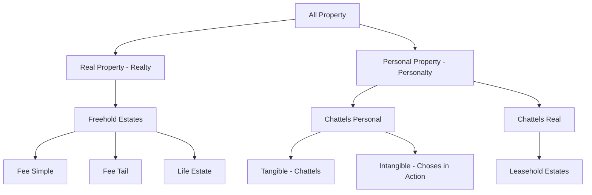
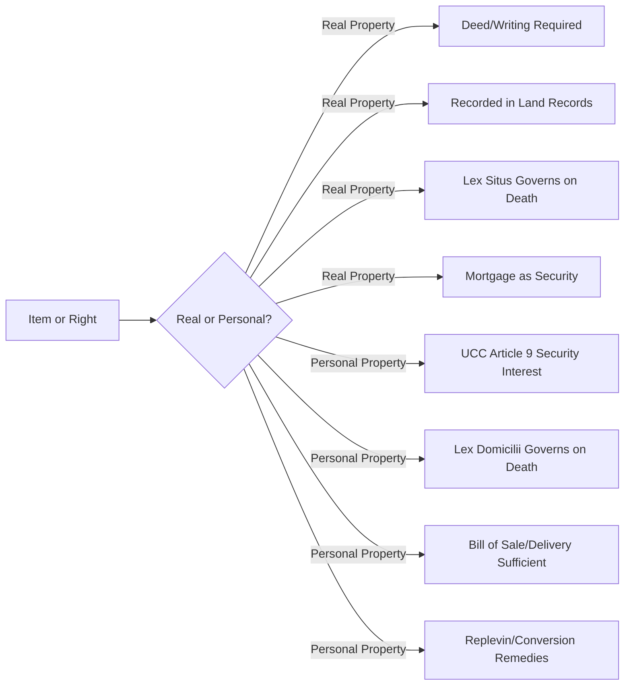

## Real Property versus Personal Property

### Overview

The distinction between real property and personal property is one of the most foundational classifications in Anglo-American law, determining which substantive rules, procedural remedies, courts, and statutory regimes apply to a given item or interest. The distinction originated in the historical divergence of medieval English legal remedies (real actions versus personal actions) and persists today despite the substantive convergence of many procedural rules, because it still governs core questions such as inheritance rules, conveyancing formalities, taxation, secured transactions, and the applicability of easement and land-use doctrines.

### Historical Origin of the Distinction

**Real Actions vs. Personal Actions**

In medieval English common law, the classification of property followed from the *remedy* available, not from any inherent physical characteristic of the item itself:

- **Real property** ("realty"): Property recoverable through a **real action**, meaning a successful plaintiff could recover the specific thing itself (the land). This was possible because land is immovable, permanent, and specifically identifiable.
- **Personal property** ("personalty"): Property recoverable only through a **personal action**, meaning a successful plaintiff could recover damages (monetary compensation) but not necessarily the specific item itself.

**Chattels Real**

Leasehold interests occupy a historically anomalous middle position. Although a lease concerns land, it was originally protected only by personal actions (since leaseholders lacked *seisin*), making leaseholds technically personal property — classified specifically as **chattels real** (as opposed to **chattels personal**, i.e., ordinary movable property). This classification is a direct historical relic:

### Defining Real Property

**Core Components**

Real property generally encompasses:

1. **Land itself**: The soil and surface.
2. **Fixtures**: Items of personal property that have become sufficiently attached to or integrated with land or a structure that the law treats them as part of the realty.
3. **Airspace rights**: Rights extending above the land, subject to limitations (e.g., navigable airspace easements).
4. **Subsurface rights**: Rights extending below the surface, including minerals, oil, gas, and groundwater, subject to severance and regulatory limits.
5. **Appurtenances**: Rights that "run with the land" and pass automatically with a conveyance, including easements appurtenant, real covenants, and profits.

**The "Bundle of Rights" Framing**

Real property is conventionally described as a "bundle of rights" rather than a single monolithic entity, including (non-exhaustively):

- The right to possess
- The right to exclude
- The right to use and enjoy
- The right to alienate (transfer)
- The right to devise (leave by will)

This framing matters for easement law specifically, because an easement represents the severance of a single "stick" from that bundle (the right to use for a specific purpose) without transferring the underlying fee.

### The Fixture Doctrine: Where the Line Is Drawn

The classification of an item as a fixture (real property) versus a chattel (personal property) is one of the most litigated boundary questions in property law, since it determines what passes automatically upon sale of land, what a tenant may remove at lease end, and what is covered by a real property mortgage versus a personal property security interest (UCC Article 9).

**Common Law Test Factors**

Courts traditionally weigh multiple factors, no single one of which is dispositive:

| Factor | Description |
| --- | --- |
| **Annexation** | Degree of physical attachment to the realty (bolted, embedded, or merely resting by gravity) |
| **Adaptation** | Whether the item is specially fitted or adapted to the particular use of the real property |
| **Intent** | The objectively manifested intent of the annexor regarding permanence (often treated as the paramount factor in modern courts) |
| **Damage on removal** | Whether removing the item would cause significant harm to the item or the realty |
| **Relationship of parties** | Courts apply more lenient removal standards for tenants ("trade fixtures") than for buyers/sellers or mortgagor/mortgagee |

**Trade Fixtures Exception**

Items installed by a commercial tenant for purposes of their trade or business (e.g., restaurant equipment, retail shelving) are generally removable by the tenant at the end of the tenancy, even if annexed to the realty, provided removal does not cause substantial damage to the premises — an equitable exception favoring commercial enterprise over strict fixture doctrine.

**Example**

- A built-in dishwasher wired into a home's electrical and plumbing systems: **fixture** (real property) — annexed, adapted to the specific space, and objectively intended as permanent.
- A window air-conditioning unit resting in a window frame, easily removed: generally **personal property**, absent strong contrary intent evidence.
- Custom walk-in refrigeration units installed by a restaurant tenant: likely a **removable trade fixture**, despite significant annexation, due to the tenant-trade-fixture exception.

**[Inference]** Precise outcomes in fixture disputes are highly fact-specific and jurisdiction-dependent; the factors above represent the generally accepted common law framework, but courts weigh them with varying emphasis, and some jurisdictions have modified the test by statute (particularly regarding agricultural and manufactured/mobile homes).

### Defining Personal Property

**Chattels Personal**

- **Tangible personal property**: Physically movable items (furniture, vehicles, equipment, livestock).
- **Intangible personal property**: Non-physical property rights, including:
  - **Choses in action**: Enforceable rights to sue or claim payment (e.g., debts, stock shares, insurance policy proceeds, contract rights).
  - Intellectual property rights (patents, copyrights, trademarks).

**Distinguishing Governing Regimes**

Personal property transactions are generally governed by different statutory frameworks than real property:

- **Article 9 of the Uniform Commercial Code (UCC)**: Governs security interests in personal property (secured transactions), as opposed to mortgages/deeds of trust, which govern security interests in real property.
- **Statute of Frauds**: Applies differently — most jurisdictions require real property contracts to be in writing regardless of value, while personal property contracts often trigger writing requirements only above a certain value threshold (e.g., UCC § 2-201 for goods over $500).

### Practical Legal Consequences of the Classification

The real/personal distinction is not academic; it drives numerous substantive outcomes:

| Issue | Real Property Rule | Personal Property Rule |
| --- | --- | --- |
| **Transfer formalities** | Deed, typically requiring writing, signature, and often notarization/recording | Often transferable by delivery, bill of sale, or informal agreement |
| **Governing law on death (intestacy)** | Traditionally governed by the law of the **situs** (location) of the land (*lex situs* / *lex loci rei sitae*) | Traditionally governed by the law of the decedent's **domicile** |
| **Security interests** | Mortgage or deed of trust, recorded in land records | UCC Article 9 security interest, perfected typically by filing a financing statement |
| **Adverse possession** | Applies (subject to statutory periods) | Generally does not apply in the same form; personal property has separate doctrines (e.g., conversion, statutes of limitations, discovery rule) |
| **Recording/registration** | Recorded in county/local land records or land registry | Generally no equivalent public recording system except for specific asset classes (vehicles, UCC filings) |
| **Taxation** | Real property tax (ad valorem, tied to land/improvements) | Personal property tax (where imposed), often on business equipment or vehicles |
| **Remedies for wrongful taking** | Ejectment, quiet title, trespass to land | Replevin, conversion, trover |

### Severance and Conversion Between Categories

Property can move between the real and personal categories, which is directly relevant to easement and land rights practice:

- **Fixture-to-chattel**: An item can be "de-fixturized" (e.g., a tenant properly removing a trade fixture), converting it back to personal property.
- **Chattel-to-fixture**: A mobile home permanently affixed to a foundation, connected to utilities, and titled as real property under state statute converts from personal to real property (often requiring formal statutory steps like surrendering the vehicle title).
- **Severance of mineral/timber rights**: Standing timber and unsevered minerals are generally treated as real property, but once severed (cut or extracted), they become personal property (goods) — a distinction with major consequences for UCC applicability, taxation, and contract classification (e.g., under UCC § 2-107, a contract for the sale of minerals or timber to be severed by the seller is treated as a contract for the sale of goods).
- **Emblements doctrine**: Annual cultivated crops (fructus industriales) are treated as personal property even before severance, in contrast to naturally occurring vegetation (fructus naturales), which is real property until severed — historically significant for protecting a tenant's right to harvest crops planted before an uncertain tenancy ends.

### Relevance to Easements and Land Rights

The real/personal distinction underpins easement law in several direct ways:

1. **Easements are interests in real property**, not merely contractual/personal rights, which is why they must generally satisfy the Statute of Frauds, can "run with the land" to bind successor owners, and are recorded in land records.
2. **Fixtures attached pursuant to an easement** (e.g., utility poles, pipelines installed under a utility easement) generally remain the personal property of the easement holder despite attachment to the servient land, provided this is expressly reserved in the easement grant — an important drafting point to avoid inadvertent fixture-doctrine transfer of ownership to the landowner.
3. **Distinguishing a license from an easement** often turns partly on whether the arrangement creates an interest in real property (irrevocable, assignable, running with land) versus a mere personal, revocable permission (a personal property-like contractual right).

### Diagram: Consequences Flowing from Classification

### Key Points

- The real/personal distinction originated from the historical availability of real actions (recovery of the thing itself) versus personal actions (damages only), not from an item's inherent physical nature.
- Leaseholds are historically classified as personal property ("chattels real") despite concerning land, a legacy of the medieval seisin requirement.
- The fixture doctrine (annexation, adaptation, intent, and the tenant trade-fixture exception) is the primary mechanism by which items migrate between the personal and real property categories.
- The classification carries substantial practical consequences across transfer formalities, choice-of-law rules on death, secured transaction regimes, tax treatment, and available remedies.
- Easements are real property interests, and careful drafting is needed to prevent equipment installed under an easement from being absorbed into the servient landowner's real property via the fixture doctrine.

### Related Topics

- The Fixture Doctrine in Depth (Trade Fixtures, Agricultural Fixtures, Manufactured Homes)
- Choses in Action and Intangible Property Rights
- UCC Article 9 Secured Transactions versus Real Property Mortgages
- Severance of Mineral, Oil, Gas, and Timber Rights
- Easements Appurtenant versus Easements in Gross
- Licenses versus Easements: Distinguishing Real Property Interests from Personal Permissions
- Choice-of-Law Rules: Lex Situs versus Lex Domicilii in Property Succession
- Emblements and the Doctrine of Fructus Industriales