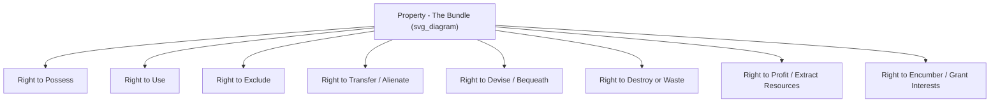
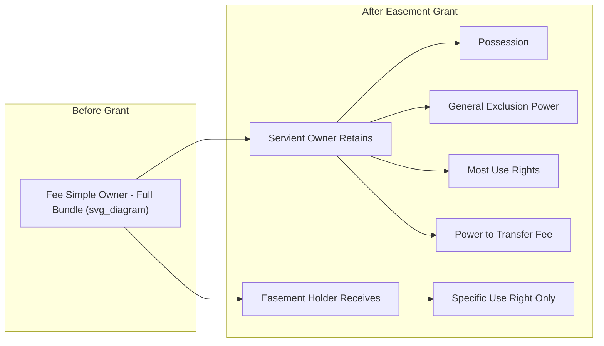

## The Bundle of Rights Theory

### Overview

The bundle of rights theory is the dominant conceptual model in Anglo-American property law for understanding what "ownership" actually means. Rather than treating property as a single, unified, absolute claim over a thing, the theory conceives of property as a collection ("bundle") of distinct, separable legal rights, privileges, powers, and immunities that a person may hold with respect to a resource. This framework is foundational to land rights and easement law because it explains how an owner can transfer, retain, or encumber individual "sticks" from the bundle — such as granting an easement — without transferring the entire bundle (fee simple ownership) itself.

### Conceptual Origins

**Hohfeldian Analysis**

The theoretical backbone of the bundle of rights metaphor traces to the work of American legal scholar **Wesley Newcomb Hohfeld** (early 20th century), who argued that legal relations should be broken down into precise, paired jural correlatives and opposites rather than loose, undifferentiated concepts like "ownership" or "right." Hohfeld's scheme identifies four basic jural relations:

| Right-Holder Has | Correlative (Other Party Has) | Opposite (Right-Holder Lacks) |
| --- | --- | --- |
| **Right (claim)** | Duty | No-right |
| **Privilege (liberty)** | No-right | Duty |
| **Power** | Liability | Disability |
| **Immunity** | Disability | Liability |

**Application to Property**: Under Hohfeldian analysis, "owning" land is not one right but a composite of many distinct jural relations — e.g., a *privilege* to use the land in certain ways, a *right* (claim) that others not enter without permission (correlative to their *duty* not to trespass), a *power* to transfer the land to another, and an *immunity* from having that power extinguished by a private party.

**Legal Realism**

The bundle metaphor gained prominence through the **Legal Realist** movement of the 1920s–1930s, which sought to demystify formal legal categories by showing that concepts like "property" were not fixed, natural, or self-evident but were social/legal constructs assembled from discrete, individually justiciable entitlements. Realist scholars used the bundle metaphor to argue that courts and legislatures could adjust individual "sticks" (e.g., regulate use, impose easements, limit alienability) without necessarily destroying "property" as a whole — a foundational premise for modern regulatory and eminent domain jurisprudence.

### The Core Metaphor: Sticks in a Bundle

Each "stick" can, in principle, be:

1. **Held** by the owner as part of full/fee simple ownership.
2. **Transferred** separately to another party (e.g., granting an easement transfers the "use for a specific purpose" stick without transferring possession or the power to exclude generally).
3. **Restricted or removed** by law, regulation, court order, or private agreement (e.g., zoning restricts the use stick; a restrictive covenant restricts it further; a conservation easement may remove the development-use stick entirely).

### The Traditionally Recognized Core Sticks

While formulations vary, most treatments of the bundle include the following as central incidents of property ownership:

1. **Right to possess**: The right to occupy and physically control the property.
2. **Right to use and enjoy**: The right to use the property for lawful purposes, including deriving income or benefit from it.
3. **Right to exclude**: The right to prevent others from entering or using the property — frequently identified by courts (notably in *Kaiser Aetna v. United States* and *Loretto v. Teleprompter Manhattan CATV Corp.*) as one of the most fundamental sticks, such that a permanent physical invasion authorized by government even of minimal size can constitute a per se taking.
4. **Right to transfer (alienate)**: The power to sell, gift, or otherwise convey the property inter vivos.
5. **Right to devise/bequeath**: The power to direct disposition of the property upon death, via will or intestate succession.
6. **Right to encumber**: The power to grant lesser interests to third parties — mortgages, liens, easements, leases, licenses, and covenants — without transferring the entire fee.
7. **Right to destroy or commit waste** (in some formulations): Subject to significant common law and statutory limitations, particularly where a lesser estate holder (like a life tenant) owes duties to future interest holders.

**[Inference]** The precise enumeration and labeling of "sticks" varies across scholars and casebooks; there is no single canonical, universally agreed list, and different sources emphasize different subsets or add additional sticks (e.g., a separate "right to receive income" or "right of subjacent/lateral support").

### Why the Bundle Metaphor Matters for Land Rights and Easements

**Severability as the Central Insight**

The theory's central practical contribution is establishing that ownership is *divisible* — individual sticks can be separated from the bundle and held, transferred, or regulated independently, while the underlying fee simple ownership continues to exist in the grantor (now diminished by the granted stick).

**Direct Application to Easements**

An easement is best understood, under this theory, as the permanent or long-term severance and transfer of a narrow "use" stick (a specific right to use land for a defined purpose, such as passage or utility lines) from the servient owner's bundle to the easement holder, while:

- The servient owner *retains* the possession stick, most use rights not inconsistent with the easement, the power to exclude third parties (but not the easement holder, within the scope of the grant), and the power to transfer the underlying fee (subject to the easement).
- The easement holder acquires *only* the specific use stick granted — not possession, not the general right to exclude others, and not the power to use the land for unrelated purposes.

This is why an easement holder cannot eject the servient owner, cannot exclude the servient owner from the burdened land generally, and is limited strictly to the scope of the granted use — the bundle metaphor explains this cabined relationship far more precisely than treating the easement as a vague "partial ownership."

**Application to Regulatory Takings Doctrine**

The bundle metaphor underlies the U.S. Supreme Court's approach to regulatory takings under the Fifth Amendment:

- In *Penn Central Transportation Co. v. New York City* (1978), the Court applied an ad hoc, multi-factor balancing test partly premised on the idea that a regulation affecting only one "stick" (e.g., limited development rights) does not necessarily destroy "property as a whole" and therefore may not require compensation.
- In *Lucas v. South Carolina Coastal Council* (1992), the Court held that a regulation depriving land of *all* economically viable use is treated as a categorical (per se) taking — implicitly recognizing that removing the entire economic-use bundle is qualitatively different from removing a single stick.
- In *Loretto v. Teleprompter Manhattan CATV Corp.* (1982), a permanent physical occupation — even trivial in size — was held to be a per se taking specifically because it invades the **right to exclude**, treated as such a fundamental stick that its removal is categorically different from removal of use-restriction sticks.

**[Unverified]** The exact doctrinal weight courts assign to the bundle-of-rights framing versus a more unitary conception of property has been the subject of ongoing academic and judicial debate (including some scholars and at least one Supreme Court justice's separate writings questioning over-reliance on the metaphor); this remains a live area of jurisprudential discussion rather than settled doctrine.

### Criticism and Alternative Views

**The "Exclusion" Theory Counter-Model**

Some property theorists (notably associated with scholars like Thomas Merrill and Henry Smith) have argued for an alternative or complementary model emphasizing the **right to exclude** as the single unifying core of property, rather than treating property as an undifferentiated bundle of equally weighted sticks. Under this view, the bundle metaphor risks obscuring the coherence and *in rem* (against the world) character of property rights by reducing them to a mere aggregation of interchangeable entitlements.

**Practical Critique**

Critics of the bundle metaphor argue that:

- It can be used to justify extensive regulatory intervention by framing any single restriction as merely removing "one stick," understating cumulative regulatory burdens.
- It underspecifies which sticks are essential to "property" as a constitutional matter, creating unpredictability in takings jurisprudence.

### Illustrative Example: Severing Sticks Through a Conservation Easement

Consider a landowner who owns land in fee simple absolute (the full bundle) and grants a **conservation easement** to a land trust:

1. **Sticks transferred to the land trust**: The right to prevent development, the right to enforce restrictions on land use (a negative easement/covenant-like right), and often the right to monitor and inspect for compliance.
2. **Sticks retained by the landowner**: Possession, the right to exclude third parties (other than the land trust's monitoring access), the right to farm or otherwise use the land consistently with the easement, the right to sell the land (subject to the easement running with the land), and the right to devise the land.
3. **Sticks extinguished entirely (not merely transferred)**: The right to subdivide or develop, often permanently, even as against future owners.

This illustrates that a bundle-of-rights transaction can (a) transfer sticks to another party, (b) retain sticks with the original owner, and (c) permanently extinguish sticks altogether — three distinct outcomes the bundle theory helps distinguish clearly.

### Diagram: Sticks Distributed via an Easement Grant

### Key Points

- The bundle of rights theory conceives of property ownership as a collection of separable legal entitlements (possess, use, exclude, transfer, devise, encumber) rather than a single indivisible right.
- Hohfeld's jural relations (right/duty, privilege/no-right, power/liability, immunity/disability) provide the analytical foundation for precisely describing what each "stick" entails.
- The theory directly explains how an easement can sever and transfer a narrow use-right from the bundle without disturbing the underlying fee ownership.
- U.S. regulatory takings doctrine (*Penn Central*, *Lucas*, *Loretto*) is substantially structured around bundle-of-rights reasoning, particularly regarding whether a regulation removes one stick versus the entire economically viable bundle.
- The theory has notable critics who argue the right to exclude, not an undifferentiated bundle, is the true conceptual core of property.

### Related Topics

- Hohfeldian Analysis of Jural Relations in Property Law
- Regulatory Takings Doctrine: *Penn Central*, *Lucas*, and *Loretto*
- Easements Appurtenant versus Easements in Gross
- Conservation Easements and Permanent Extinguishment of Development Rights
- The Right to Exclude as a Fundamental Property Interest
- Restrictive Covenants and Servitudes as Partial Transfers of the Bundle
- Eminent Domain and Just Compensation Analysis