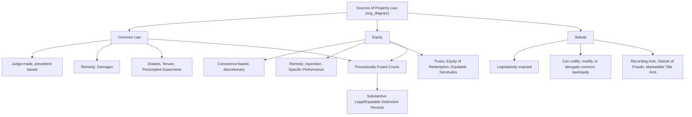
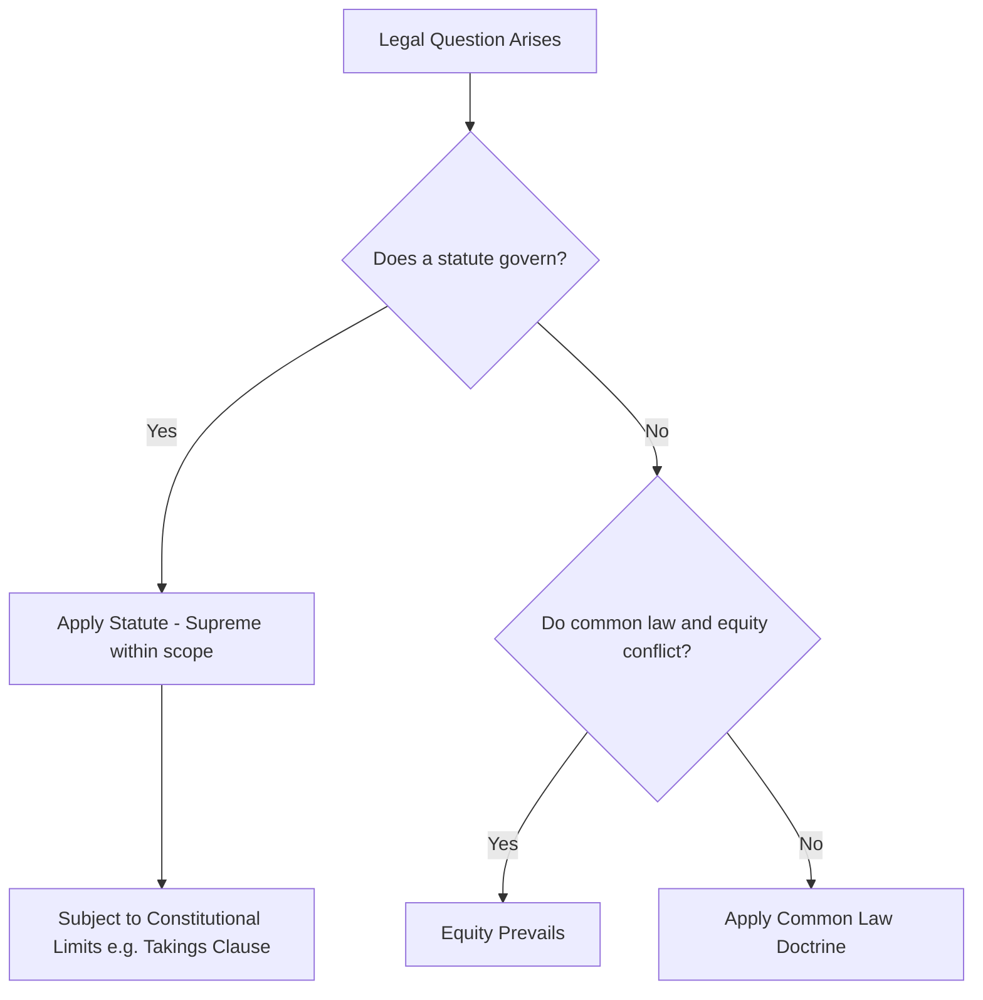

## Sources of Property Law: Common Law, Equity, and Statute

### Overview

Property law, particularly land rights and easement law, is not derived from a single unified source but from the interaction of three historically distinct streams of legal authority: the **common law** (developed by law courts through case-by-case adjudication), **equity** (developed by the Court of Chancery to remedy the rigidity and limitations of common law), and **statute** (legislative enactments that codify, modify, or displace judge-made rules). Understanding how these three sources interact — and which prevails in conflict — is essential to correctly analyzing any land rights or easement problem, since a single question (e.g., whether an easement exists) may require applying rules drawn from all three sources simultaneously.

### The Common Law Source

**Nature and Development**

The common law is judge-made law developed through the doctrine of **stare decisis** (precedent), whereby courts decide cases by applying and refining principles established in prior decisions. In property law, the common law originated in the medieval royal courts (King's Bench, Common Pleas, Exchequer) and developed the foundational architecture still in use:

- The doctrine of estates (fee simple, fee tail, life estate)
- The doctrine of tenure (historically)
- Legal remedies such as ejectment, trespass, and replevin
- Core easement doctrines: easements by necessity, by prescription, and by implication were substantially common-law creations

**Characteristics**

- **Rigid, formalistic remedies**: Historically limited to specific writs and forms of action; a plaintiff whose claim did not fit an existing writ had no remedy at common law.
- **Remedy**: Primarily **damages** (monetary compensation).
- **Precedential and incremental**: Common law rules evolve gradually through accumulated case law rather than wholesale legislative redesign, meaning many "black letter" property rules (e.g., the four-unities test for joint tenancy, or the elements of adverse possession) were built up doctrine-by-doctrine over centuries.

**Example in Easement Law**: The common law rule that an easement by prescription requires **open, notorious, continuous, and adverse use for the statutory period** is a judicially developed doctrine with no single originating statute, refined through generations of case law by analogy to adverse possession.

### The Equity Source

**Historical Origin**

Equity developed because the rigid, writ-based common law system frequently produced unjust or inadequate results — a plaintiff might have a legitimate grievance but no matching writ, or the only available remedy (damages) might be inadequate to the harm (e.g., where land, being unique, cannot be adequately compensated by money). Aggrieved parties petitioned the King directly for relief "in conscience," and this jurisdiction was delegated to the **Lord Chancellor**, whose court became the **Court of Chancery**.

**Characteristics**

- **Discretionary and conscience-based**: Equity operates according to maxims (e.g., "equity will not suffer a wrong to be without a remedy," "he who seeks equity must do equity," "equity regards as done that which ought to be done," "equity acts in personam").
- **Remedy**: Primarily **injunctions**, **specific performance**, **rescission**, **reformation**, and the recognition and enforcement of **trusts**.
- **Equity acts in personam**: Historically, equity's power was directed at compelling a specific defendant's conduct (e.g., ordering a person to convey land) rather than adjudicating title in rem, which shaped its remedial style.

**Direct Contributions to Property Law**

1. **The trust**: Equity's recognition of the "use" (and later, the modern trust) created the enduring split between **legal title** (held by the trustee) and **equitable/beneficial title** (held by the beneficiary) — foundational to modern land trusts, co-ownership arrangements, and mortgage law (the "equity of redemption").
2. **The equity of redemption**: Equity intervened to allow a defaulting mortgagor to redeem (reclaim) mortgaged land even after the strict common law deadline for repayment had passed, on the basis that forfeiture of valuable land for a comparatively minor default was unconscionable — this became a permanent, non-waivable feature of mortgage law (the maxim "once a mortgage, always a mortgage").
3. **Specific performance of land contracts**: Because land is considered legally **unique** (no substitute parcel is truly equivalent), equity will order specific performance of a real estate purchase contract rather than limiting the buyer to money damages, reflecting equity's core role in supplementing common law's inadequate remedy.
4. **Equitable servitudes**: Equity developed the doctrine of the equitable servitude (originating in *Tulk v. Moxhay*, 1848) to enforce restrictive covenants against successors in title even where the strict common law privity requirements for a covenant "running with the land" were not satisfied — directly relevant to modern restrictive covenant and easement analysis.
5. **Equitable easements/estoppel**: Courts of equity developed doctrines such as easement by estoppel, recognizing informally created use rights where strict legal formalities were not observed but where it would be unconscionable to deny the right (e.g., where a landowner permitted a neighbor to invest substantially in reliance on a promised right of way).

### Fusion of Law and Equity

**English Judicature Acts (1873–1875)**

Historically, common law and equity were administered by entirely separate courts (King's Bench/Common Pleas/Exchequer versus Chancery), often producing conflicting outcomes on the same facts. The English Judicature Acts of 1873–1875 **procedurally merged** the courts of law and equity into a single court system empowered to apply both bodies of rules, with a clear rule that **where the rules of common law and equity conflict, equity prevails**.

**U.S. Merger (Field Code, 1848 onward)**

Beginning with New York's Field Code of Civil Procedure (1848), most U.S. states similarly merged law and equity procedurally into a single court system (a small minority retain some separate equity court vestiges, e.g., Delaware's Court of Chancery for corporate/business matters, though even there equitable jurisdiction is now largely specialized rather than a survival of the historical dual-court system).

**Persistence of the Substantive Distinction**

Critically, procedural fusion did **not** eliminate the *substantive* distinction between legal and equitable rights and remedies:

- Legal vs. equitable **title** remains distinct (e.g., a trust beneficiary holds only equitable title).
- Legal vs. equitable **remedies** remain distinct, and the choice matters (e.g., the right to a jury trial in U.S. courts under the Seventh Amendment generally attaches to legal claims/remedies but not equitable ones — a live and litigated distinction in modern federal practice).
- Legal vs. equitable **interests in land** remain distinct, particularly regarding priority disputes, notice requirements under recording acts, and the enforceability of restrictive covenants as equitable servitudes.

### The Statutory Source

**Role of Statute in Property Law**

Statutes serve several distinct functions relative to common law and equity:

1. **Codification**: Restating and formalizing existing common law or equitable rules (e.g., many states' adverse possession statutes codify the common law elements while specifying a statutory limitations period).
2. **Modification**: Altering common law rules that legislatures determine are outdated or produce undesirable results (e.g., statutes abolishing or limiting the fee tail, or modifying the common law's harsh joint tenancy severance rules).
3. **Displacement/Abrogation**: Wholesale replacement of common law doctrine (e.g., the Statute of Frauds requiring most interests in land to be evidenced in writing, displacing the common law's tolerance of oral conveyances).
4. **Gap-filling in areas common law never addressed**: Zoning and land-use regulation, environmental easement/conservation statutes, condominium and common-interest-community statutes, and landlord-tenant statutory codes are largely creatures of 20th-century statute with limited common law antecedents.

**Key Statutory Categories in Land Rights and Easement Law**

| Statute Type | Function |
| --- | --- |
| **Statute of Frauds** | Requires most interests in land (including many easements) to be in writing to be enforceable |
| **Recording Acts** (race, notice, race-notice) | Govern priority between competing claimants to the same land interest and protect bona fide purchasers |
| **Marketable Title Acts** | Extinguish old, stale interests in land (including ancient easements) after a defined period to simplify title searches |
| **Statutes governing adverse possession/prescription** | Set the statutory limitations period and specific elements required |
| **Zoning and land-use codes** | Regulate permissible uses independent of, and sometimes overriding, private easement/covenant arrangements |
| **Conservation and agricultural easement enabling statutes** | Authorize and regulate a category of easement (conservation easements) that did not exist at common law |
| **Uniform Acts** (e.g., Uniform Easement Relocation Act, Uniform Common Interest Ownership Act) | Model statutes promulgated by bodies like the Uniform Law Commission, adopted (often with modification) by individual states |

**Statute as Superior Authority**

Where validly enacted, statute is **supreme** over both common law and equitable doctrine within its scope — legislatures can abrogate, modify, or codify judge-made rules (subject to constitutional constraints, such as the Contracts Clause or Takings Clause where a statute purports to retroactively extinguish vested property rights). Courts, however, apply a **presumption against implied abrogation** of common law rights — statutes are generally construed not to eliminate common law remedies or doctrines unless the legislative intent to do so is clear.

### Hierarchy and Interaction: Resolving Conflicts

When common law, equity, and statute appear to conflict, courts generally apply the following resolution framework:

1. **Statute prevails over both common law and equity**, within its scope and subject to constitutional limits — a validly enacted statute displaces inconsistent judge-made rules.
2. **Equity prevails over common law** where they directly conflict on the same matter (post-fusion rule, inherited from the Judicature Acts tradition and generally followed in U.S. jurisdictions).
3. **Common law fills gaps** left by both statute and equity — where no statute addresses an issue and no equitable doctrine is implicated, common law principles (often as refined by extensive case law) govern.

### Illustrative Example: An Oral Easement Promise

Consider a scenario integrating all three sources:

- **Facts**: Landowner A orally promises neighbor B a permanent right of way across A's land. B, relying on the promise, builds a driveway and invests substantially. No written instrument is ever executed. A later attempts to revoke the arrangement.
- **Common law analysis**: An easement is an interest in land; the common law (as codified by the Statute of Frauds, a statutory source) generally requires a writing for its valid creation, so a purely oral grant would ordinarily fail.
- **Statutory analysis**: The Statute of Frauds statute in the jurisdiction is the controlling source rendering the oral grant unenforceable *as a legal easement*.
- **Equitable analysis**: Despite the Statute of Frauds bar, equity may nonetheless enforce the arrangement under the doctrine of **easement by estoppel** (or, in some jurisdictions, via the doctrine of part performance), because B reasonably relied on A's representation to their detriment, and it would be unconscionable to allow A to revoke.
- **Resolution**: The statute (Statute of Frauds) governs the *legal* enforceability question, but equity supplies an independent basis for relief that operates *despite* the statutory writing requirement — illustrating that equity often functions specifically as a check on unjust outcomes that strict statutory or common law rules would otherwise produce.

**[Inference]** Whether a jurisdiction recognizes easement by estoppel, part performance, or a similar equitable exception to the Statute of Frauds — and precisely what elements it requires — varies significantly across states and should be verified against the specific jurisdiction's case law.

### Key Points

- Common law, equity, and statute are historically and functionally distinct sources of property law, each contributing different doctrines, remedies, and modes of reasoning.
- Common law developed the estate system and remedies like damages through case-by-case precedent; equity developed trusts, specific performance, and equitable servitudes to correct common law's rigidity; statute codifies, modifies, or displaces both.
- Procedural fusion of law and equity (via the Judicature Acts in England and the Field Code tradition in the U.S.) did not eliminate the substantive legal/equitable distinction, which still matters for jury trial rights, priority rules, and remedy availability.
- In conflicts, statute generally prevails within its scope, equity prevails over conflicting common law, and common law fills remaining gaps.
- Real-world easement and land rights problems frequently require synthesizing all three sources simultaneously, as illustrated by the interaction between the Statute of Frauds and equitable estoppel doctrines.

### Related Topics

- The Statute of Frauds and Its Exceptions in Land Transactions
- Equitable Servitudes and *Tulk v. Moxhay*
- Easement by Estoppel and Part Performance Doctrine
- The Equity of Redemption in Mortgage Law
- Recording Acts and Priority of Competing Land Interests
- Marketable Title Acts and Extinguishment of Stale Interests
- Uniform Acts in American Property Law (Uniform Law Commission Model Statutes)
- Historical Development of Land Law (Feudal Origins of the Common Law Estate System)