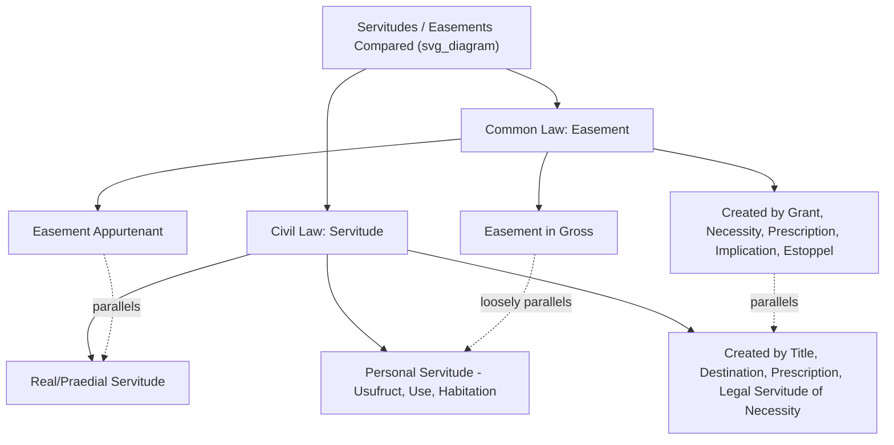

## Common Law and Civil Law Traditions in Land Law

### Overview

Land law across the world's legal systems is shaped predominantly by two major legal traditions: the **common law tradition**, originating in medieval England and spread through colonization to jurisdictions including the United States, Canada, Australia, and India; and the **civil law tradition**, rooted in Roman law and codified systems developed in continental Europe (notably France and Germany), spread through colonization and legal transplantation to much of Latin America, continental Europe, parts of Africa, and East Asia. These traditions differ fundamentally in their conceptual structure, sources of law, and treatment of core land rights concepts including ownership, easements (servitudes), and registration — differences with direct practical consequences for cross-border transactions, comparative legal analysis, and the drafting of international agreements involving land.

### Foundational Structural Differences

| Dimension | Common Law Tradition | Civil Law Tradition |
| --- | --- | --- |
| **Primary source of law** | Judicial precedent (case law), supplemented by statute | Comprehensive written codes (civil codes), with case law as persuasive, not strictly binding |
| **Conceptual starting point** | Estates in land (temporal division of interests: fee simple, life estate, leasehold) | Unitary ownership (*dominium* / *propriété* / *Eigentum*) with a closed list of lesser real rights |
| **Historical root** | Feudal tenure and the doctrine of estates | Roman law (*ius civile*), particularly Justinian's *Corpus Juris Civilis* |
| **Judicial role** | Courts make law through precedent (*stare decisis*) | Courts primarily interpret and apply the code; precedent is influential but not formally binding in most systems |
| **Legal reasoning style** | Inductive, case-by-case, analogical reasoning from precedent | Deductive, reasoning from general code principles to specific facts |

### The Common Law Approach to Land Ownership

**No Direct "Ownership" — The Estate System**

As explored in the historical development of land law, common law jurisdictions do not (in pure doctrinal form) recognize direct, absolute private "ownership" of land in the Roman/civilian sense. Instead, land law is built around the concept of an **estate** — a temporally defined interest (fee simple, fee tail, life estate, leasehold) held either directly (historically, from the Crown/sovereign) or, in most U.S. states today, on an allodial basis approximating full ownership in substance while formally retaining estate terminology.

**Numerus Apertus (Open List) Tendency**

Common law systems have historically permitted greater flexibility in creating new types of property interests and estates through judicial recognition and private innovation (e.g., the historical proliferation of future interests, the modern recognition of conservation easements, or novel forms of co-ownership), though this flexibility is constrained by doctrines like the numerus clausus principle as it has been imported into common law property theory (limiting the *types* of estates and interests courts will enforce, to preserve marketability and clarity of title).

### The Civil Law Approach to Land Ownership

**Unitary Ownership (*Dominium*)**

Civil law systems, following Roman law, generally recognize a single, unified concept of ownership (*propriété* in French law, *Eigentum* in German law, *dominio* in Spanish/Italian law) that is presumptively absolute, exclusive, and perpetual, subject only to specifically enumerated limitations. This contrasts with the common law's inherently divisible, temporally layered estate system.

**Numerus Clausus (Closed List) Principle**

Civil law jurisdictions apply the **numerus clausus** ("closed number") principle rigorously: only a fixed, legislatively defined list of real rights (*iura in re aliena* — rights in another's property) may be created, and private parties cannot invent new types of property interests by contract. Standard civilian real rights typically include:

- **Ownership** (*dominium*/*propriété*)
- **Usufruct** (*usufructus*) — the right to use and derive income from property owned by another, without consuming or destroying its substance
- **Servitudes** (*servitutes*/*servitudes*) — the direct civilian analogue to the common law easement
- **Superficies** — the right to own a building or structure on land owned by another
- **Emphyteusis** — a long-term, heritable right to use and derive profit from another's land, subject to a fee
- **Pledge and mortgage/hypothec** — security interests in property

**Practical Consequence**: A civil law jurisdiction will generally refuse to enforce a novel property interest invented by contract that does not fit within this closed list, treating it instead as a purely personal (contractual) obligation binding only the original parties — a sharp contrast to common law's greater (though not unlimited) tolerance for judicially recognized new categories of interests running with the land.

### Servitudes: The Civilian Analogue to Easements

**Roman Law Origins**

Both the common law easement and the civilian servitude trace conceptually to Roman law's **servitutes praediorum** (praedial/land servitudes), reflecting a shared ultimate ancestry even though the two traditions developed the concept along different paths.

**Classification in Civil Law**

Civil codes typically classify servitudes along dimensions closely paralleling (and historically informing) common law easement classification:

- **Real (praedial) servitudes**: Attached to and benefiting a dominant estate, burdening a servient estate — directly analogous to the common law's **easement appurtenant**.
- **Personal servitudes**: Attached to a specific person rather than a dominant estate (e.g., usufruct, use, habitation) — loosely analogous to the common law's **easement in gross**, though civilian personal servitudes are typically non-transferable and extinguish upon the death of the beneficiary, a stricter limitation than most common law easements in gross.
- **Apparent vs. non-apparent servitudes**: Distinguished by whether the servitude is evidenced by visible, permanent works (e.g., a visible roadway) — relevant to rules on acquisition by prescription or destination, paralleling the common law's requirement of open and notorious use for prescriptive easements.
- **Continuous vs. discontinuous servitudes**: Continuous servitudes (e.g., a drainage servitude operating without human intervention) versus discontinuous servitudes (e.g., a right of way requiring an act of use each time) — a classification largely without a direct formal common law counterpart, though functionally relevant to similar prescription rules.

**Creation of Servitudes in Civil Law**

Civil codes typically enumerate specific modes of servitude creation, commonly including:

1. **By title (contract or will)** — analogous to express grant/reservation.
2. **By destination of the father of the family** (*destination du père de famille*) — a distinctively civilian doctrine where a servitude arises when a single owner who has established an apparent, permanent arrangement between two parts of their land subsequently divides ownership between two people, and the arrangement continues as a servitude by operation of law upon division — closely analogous to, and the likely conceptual relative of, the common law doctrine of **easement by implication from prior use** (also called "quasi-easement").
3. **By prescription (acquisitive prescription)** — analogous to prescriptive easements, typically requiring continuous and apparent use for a statutory period, though civil codes often impose stricter requirements (e.g., some civil codes only permit prescriptive acquisition of *apparent* servitudes, wholly barring non-apparent ones from prescriptive creation regardless of duration of use).
4. **By necessity (legal servitude)**: Many civil codes impose a **statutory right of way for landlocked (enclosed) land** as a matter of law, functioning similarly to the common law easement by necessity, but civilian codes typically frame it as a *legal servitude* imposed by the code itself (often with a compensation requirement running to the servient owner) rather than as an implied grant inferred from the parties' presumed intent.

### Land Registration Systems: A Key Divergence

**Civil Law: The Grundbuch / Land Book Model**

Many civil law jurisdictions, particularly Germany (*Grundbuch* system) and other jurisdictions influenced by German law, employ highly developed, state-guaranteed land registration systems in which:

- The register is the definitive and conclusive source of title (a "curtain principle" — the register conclusively reflects the current legal state of title, and purchasers need not investigate the historical chain of prior transactions).
- Registration itself has **constitutive effect** in many civilian systems — meaning the real right (including many servitudes/mortgages) does not fully arise as an *in rem* right until registered, in contrast to common law systems where the underlying interest can often exist validly between the parties even before recording, with recording primarily affecting priority against third parties.

**Common Law: Recording Acts vs. Torrens**

As covered in the historical development discussion, most common law jurisdictions (notably most U.S. states) rely on **recording acts**, which are evidentiary and priority-determining rather than title-guaranteeing, necessitating supplementary mechanisms like title insurance. Some common law jurisdictions (Australia comprehensively; England increasingly since 1925; limited U.S. states) have adopted **Torrens-style title registration**, which more closely approximates the civilian register's conclusive/guaranteed character — illustrating that the common law/civil law divide on registration is a tendency rather than an absolute rule.

**[Inference]** The precise "constitutive versus declaratory" effect of registration varies meaningfully even among civil law jurisdictions (e.g., French law's registration system, while robust, differs in structure and effect from the German *Grundbuch* model), so generalizations about "the" civil law approach should be treated as describing a common tendency rather than a universal, uniform rule.

### Mixed and Hybrid Jurisdictions

Some jurisdictions blend both traditions, producing legally significant hybrid land law systems:

- **Louisiana (USA)**: Retains a civil law-based property code (rooted in French and Spanish colonial law) within an otherwise common law federal system, resulting in Louisiana's distinctive use of civilian terms like "usufruct" and "servitude" (rather than "life estate" and "easement") in its state property law.
- **Quebec (Canada)**: Operates under the Civil Code of Québec (a direct civilian codification, historically rooted in the *Coutume de Paris* and the French Napoleonic Code tradition) within the otherwise common law Canadian federation.
- **South Africa, Scotland, Sri Lanka, and the Philippines**: Each reflect varying degrees of Roman-Dutch, civilian, or mixed influence layered with common law or other overlays, producing hybrid servitude and ownership doctrines.
- **Puerto Rico**: Retains a civil law property code influenced by Spanish law, operating within the U.S. federal common law system.

### Practical Implications for Comparative and Cross-Border Practice

1. **Contract drafting**: An easement/servitude arrangement enforceable under a common law numerus-apertus-influenced approach may be unenforceable as a real right in a strict civilian numerus clausus jurisdiction if it does not correspond to a recognized code category — requiring careful restructuring (e.g., as a usufruct or a registered real servitude) rather than direct transplantation of common law drafting language.
2. **Title due diligence**: Reliance on a civilian land register's conclusive character may be misplaced if uncritically applied to a common law recording-act jurisdiction, where the register is merely evidentiary and requires supplementary title insurance or attorney title opinion.
3. **Terminology traps**: Terms such as "usufruct," "easement," "servitude," and "ownership" are not perfectly interchangeable across traditions; precise translation requires understanding the underlying doctrinal structure, not merely linguistic equivalence.

### Key Points

- Common law land law is built on a temporally divisible estate system with historically flexible recognition of new property interest types; civil law is built on unitary ownership (*dominium*) with a rigid numerus clausus limiting real rights to a fixed statutory list.
- The civilian servitude and the common law easement share Roman law ancestry and functionally parallel categories (real/praedial servitude ≈ easement appurtenant; personal servitude ≈ easement in gross), but differ in transferability, duration, and modes of creation.
- Civil law's "destination of the father of the family" doctrine closely parallels the common law's easement by implication from prior use, and civilian "legal servitudes of necessity" parallel common law easements by necessity, though civilian codes typically frame these as direct statutory impositions rather than inferred intent.
- Land registration tends toward state-guaranteed, conclusive registers with constitutive effect in many civil law systems (e.g., the German *Grundbuch*), versus evidentiary recording acts requiring title insurance in most common law (especially U.S.) jurisdictions, though Torrens systems show this is a tendency rather than an absolute divide.
- Mixed jurisdictions (Louisiana, Quebec, South Africa, Scotland, Puerto Rico, the Philippines) demonstrate that the two traditions are not mutually exclusive and can coexist within a single legal system.

### Related Topics

- Roman Law Foundations of Servitudes (*Servitutes Praediorum*)
- The Numerus Clausus Principle in Property Law
- Usufruct, Use, and Habitation as Civilian Personal Servitudes
- The German *Grundbuch* and Torrens Title Registration Compared
- Louisiana Civil Law Property Concepts within the U.S. Legal System
- Easement by Implication from Prior Use ("Quasi-Easements")
- Comparative Analysis of Easement by Necessity across Legal Traditions
- Historical Development of Land Law (Common Law Feudal Origins)