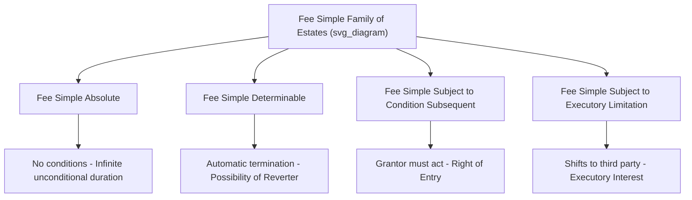

## Fee Simple Absolute

### Overview

The fee simple absolute is the largest, most complete, and least restricted estate recognized in Anglo-American property law. It represents the closest common law equivalent to unrestricted "ownership" in the civilian sense — potentially infinite in duration, freely alienable, freely devisable, and freely inheritable, subject to no special limitation or condition on its continuation. It is the default estate presumed to be conveyed absent language indicating a lesser estate, and it serves as the conceptual baseline against which all other, "lesser" estates (fee tail, life estate, defeasible fees, leaseholds) are measured and defined.

### Defining Characteristics

**Duration**

A fee simple absolute has **potentially infinite duration**. It does not terminate upon any person's death, upon the occurrence of any specified event, or after any fixed term. It continues indefinitely, passing by inheritance, intestate succession, or devise (will) whenever a holder dies without having otherwise transferred it, and it never automatically reverts to a prior grantor or transfers to a third party based on a condition.

**Alienability**

The fee simple absolute is **freely alienable**: the holder may transfer it during life (inter vivos) by sale or gift, without needing anyone else's consent, and without the transfer being restricted by the terms of the original grant. Historical attempts to restrain alienation of a fee simple absolute (through disabling restraints, forfeiture restraints, or promissory restraints imposed in the granting instrument) are generally **void as against public policy** under the common law rule against restraints on alienation, because such restraints on the fee simple are considered incompatible with the very nature of the estate.

**Devisability and Inheritability**

The holder may freely **devise** the fee simple absolute by will to any beneficiary. If the holder dies without a valid will (intestate), the fee simple absolute passes according to the jurisdiction's **intestate succession statute** to the holder's heirs — it does not escheat to the state unless no qualifying heirs can be identified.

**No Conditions or Limitations**

Critically, a fee simple absolute is subject to **no special condition or limitation** that could cause it to end early or shift to another party. This distinguishes it sharply from the defeasible fees (discussed below), which, while also potentially infinite in duration, are contingent on the non-occurrence (or occurrence) of some specified future event.

### Words of Purchase and Words of Limitation

Historically, creating a fee simple absolute at common law required precise language:

- **Common law rule**: A conveyance "to A" alone, without more, created only a **life estate** in A at common law — the words "and his heirs" were required as essential **words of limitation** (defining the *duration* of the estate) to create a fee simple. The word "heirs" here did not give A's heirs any interest; it merely signaled that A's estate was to last as long as A had heirs to inherit it (i.e., potentially forever), while "A" alone constituted the **words of purchase** (identifying *who* receives the interest).
- **Modern rule (nearly universal in the U.S. today)**: Statutes and the modern default rule of construction **reverse the common law presumption**: a conveyance "to A" (without any limiting language) is now presumed to convey a **fee simple absolute**, on the theory that a grantor intends to convey their entire interest unless the instrument clearly states otherwise. Express words of inheritance ("and his heirs") are no longer legally necessary to create a fee simple, though they may still appear in older-style drafting or formal instruments as a matter of convention.

**Example**

- *Historical common law*: "O conveys Blackacre to A" → A receives only a **life estate**; the fee reverts to O's estate upon A's death.
- *Historical common law, properly drafted*: "O conveys Blackacre to A and his heirs" → A receives a **fee simple absolute**; "and his heirs" are words of limitation, not a grant to A's heirs.
- *Modern U.S. default rule*: "O conveys Blackacre to A" → A receives a **fee simple absolute** automatically, without any need for the phrase "and his heirs."

### Fee Simple Absolute versus Defeasible Fees

The fee simple absolute must be distinguished from the family of **defeasible fees** — estates that are also potentially infinite in duration but are subject to a special condition or limitation that can cut the estate short:

| Estate Type | Duration | Terminating Event | Future Interest Created |
| --- | --- | --- | --- |
| **Fee Simple Absolute** | Infinite, unconditional | None | None |
| **Fee Simple Determinable** | Automatically ends upon stated event | Event stated in durational language ("so long as," "while," "during") | Possibility of reverter (in grantor) |
| **Fee Simple Subject to Condition Subsequent** | Continues until grantor exercises right to terminate | Grantor must affirmatively act to reclaim | Right of entry / power of termination (in grantor) |
| **Fee Simple Subject to Executory Limitation** | Automatically shifts upon stated event | Event stated in durational or conditional language | Executory interest (in a third party, not the grantor) |

A grant such as "O conveys Blackacre to A **and his heirs**" (with no further conditional language) is the paradigm example of a fee simple absolute, whereas "O conveys Blackacre to A and his heirs **so long as the land is used for a school**" creates a fee simple determinable, not a fee simple absolute, because the italicized durational language limits the estate's potential duration.

### Rights Held Under a Fee Simple Absolute

Applying the bundle of rights framework, the holder of a fee simple absolute holds effectively the **complete bundle** available under the estate system:

- Full right to possess
- Full right to use and enjoy (subject only to external limitations like zoning, nuisance law, and easements/covenants validly burdening the land — not limitations inherent in the estate itself)
- Full right to exclude others
- Full right to alienate (sell or gift) without restriction
- Full right to devise by will
- Full right to grant lesser interests carved out of the fee (leases, easements, mortgages, life estates) without losing the underlying fee simple reversion in those cases where a lesser estate is carved out (e.g., granting a life estate to another still leaves the original grantor, or their successors, holding a reversion in fee simple)

### Modern Statutory Context in the United States

**Presumption of Fee Simple Conveyance**

Virtually all U.S. states have enacted statutes reversing the common law presumption, providing that a conveyance is presumed to pass the grantor's entire estate (i.e., a fee simple absolute, if that is what the grantor holds) unless the deed expressly limits the estate granted.

**Restraints on Alienation**

Courts and the Restatement (Third) of Property generally void:

- **Disabling restraints**: Attempts to prohibit transfer outright (e.g., "to A and his heirs, but A may never sell the property").
- **Forfeiture restraints**: Attempts to cause forfeiture of the fee if the holder attempts to transfer it.
- **Promissory restraints**: Attempts to bind the holder by covenant not to transfer.

Courts apply the strictest scrutiny to restraints on a fee simple absolute (given its nature as the most complete estate), though **reasonable restraints** limited in time, purpose, and scope are sometimes upheld in specific contexts (e.g., certain rights of first refusal, or restraints in commercial/condominium contexts that serve a legitimate, narrowly tailored purpose) — a notable point of tension and jurisdictional variation in modern property law.

**[Inference]** The precise degree of scrutiny applied to partial restraints on alienation (as opposed to complete/absolute restraints) varies meaningfully by jurisdiction and by context (residential versus commercial, direct restraint versus rights of first refusal), and specific outcomes should be verified against the controlling jurisdiction's case law and the Restatement (Third) of Property: Servitudes.

### Relevance to Easement Law

The fee simple absolute is the essential doctrinal baseline for easement analysis because:

1. **The servient estate is typically held in fee simple absolute** (or a lesser defeasible/life estate) by the burdened landowner, and the easement represents a carve-out from that fee's otherwise-complete bundle of rights.
2. **A grantor holding fee simple absolute has full legal capacity to grant an easement**, since the grantor's unrestricted alienation power extends to granting partial interests (like easements) as well as the whole fee.
3. **Easements survive changes in fee ownership**: Because a fee simple absolute is freely transferable and passes to heirs, devisees, or purchasers, an easement appurtenant validly burdening the servient fee simple **runs with the land**, binding all successive fee simple holders regardless of how many times the underlying fee changes hands — this permanence is precisely why an easement is classified as an interest in real property rather than a personal, non-binding arrangement between the original parties.

### Key Points

- The fee simple absolute is the largest estate in land: potentially infinite in duration, freely alienable, freely devisable, and subject to no conditions or limitations.
- At common law, creating a fee simple required the specific words of limitation "and his heirs"; the modern default rule in nearly all U.S. jurisdictions now presumes a fee simple absolute is conveyed unless the instrument expressly limits the estate.
- The fee simple absolute must be distinguished from defeasible fees (determinable, subject to condition subsequent, subject to executory limitation), which share potentially infinite duration but are contingent on a stated terminating event.
- Restraints on alienation of a fee simple absolute (disabling, forfeiture, and promissory) are generally void as against public policy, though reasonable, narrowly tailored restraints are sometimes upheld depending on jurisdiction and context.
- The fee simple absolute is the typical form of the servient estate in easement law, and its free transferability is what allows an appurtenant easement to run with the land through successive owners.

### Related Topics

- Defeasible Fees: Determinable, Subject to Condition Subsequent, and Subject to Executory Limitation
- Words of Purchase versus Words of Limitation in Deed Construction
- The Rule Against Restraints on Alienation
- Life Estates and the Doctrine of Waste
- Future Interests: Reversions, Remainders, and Executory Interests
- Fee Tail and Its Statutory Abolition/Conversion
- Easements Appurtenant and the Requirement of a Dominant and Servient Estate
- The Bundle of Rights Theory (Foundational Framework)