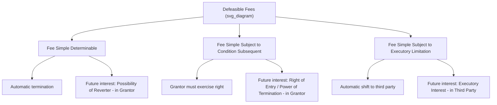

## Defeasible Fees

### Overview

Defeasible fees are fee simple estates that, unlike the fee simple absolute, are subject to a special condition or limitation capable of cutting the estate short before its otherwise-infinite duration would naturally continue. They share the fee simple's potentially infinite duration and broad transferability, but each type carries a built-in mechanism — durational language, a condition, or a shifting event — that can terminate the current holder's interest and transfer possession either back to the grantor or forward to a third party. Defeasible fees are central to land-use planning, charitable and conservation transfers, and easement-adjacent drafting, because they allow a grantor to impose durable, running restrictions on land use while still conveying a fee-level estate.

### The Three Types of Defeasible Fees

### Fee Simple Determinable

**Definition and Mechanics**

A fee simple determinable is an estate that **automatically terminates** upon the occurrence of a stated event, with the estate reverting immediately and automatically to the grantor (or the grantor's heirs/successors) — no action by the grantor is required to reclaim the property; termination occurs by operation of law the instant the triggering event occurs.

**Characteristic Durational Language**

Courts look for language indicating that the grant is limited in *duration* rather than subject to a separate condition. Classic signal words include:

- "so long as"
- "while"
- "during"
- "until"

**Example**: "O conveys Blackacre to the City **so long as** the land is used as a public park."

**Future Interest Created**: A **possibility of reverter**, retained automatically by the grantor, requiring no express reservation in the deed — it arises by operation of law whenever a fee simple determinable is created.

**Consequence of Breach**: If the City stops using Blackacre as a public park, title reverts **automatically and instantaneously** to O (or O's successors) at that moment, without any need for O to sue, take action, or even be aware the triggering event has occurred — although in practice a quiet title action is typically needed to formally clear the record and confirm the reversion against a possessor who disputes it.

### Fee Simple Subject to Condition Subsequent

**Definition and Mechanics**

A fee simple subject to condition subsequent is an estate that **continues** despite the occurrence of a stated condition **unless and until** the grantor affirmatively exercises a retained right to terminate it. Unlike the determinable fee, termination is **not automatic** — the grantor (or successor) must take some action (traditionally, "re-entry," though modern practice generally requires a formal legal action such as an ejectment or declaratory judgment suit) to end the estate.

**Characteristic Conditional Language**

Courts look for language framing the grant as subject to a **condition**, followed by an express reservation of a right to terminate. Classic signal phrases include:

- "provided that"
- "on condition that"
- "but if"
- combined with an express reservation: "...and if [condition occurs], grantor **may re-enter and terminate** the estate" (or similar language reserving a right of entry)

**Example**: "O conveys Blackacre to the City, **on condition that** the land is used as a public park, **but if** the land ceases to be so used, **O may re-enter and reclaim** the premises."

**Future Interest Created**: A **right of entry** (also called a **power of termination**), which — unlike the possibility of reverter — must generally be **expressly reserved** in the granting instrument; some jurisdictions will not recognize the interest if the deed does not affirmatively reserve it, even where conditional language is present.

**Consequence of Breach**: If the City stops using the land as a park, O's estate does **not** automatically end. O merely gains the **option** to terminate the City's estate; the City's fee simple subject to condition subsequent continues indefinitely if O chooses not to exercise that right (or fails to do so within an applicable limitations period, discussed below).

### Distinguishing Determinable from Condition Subsequent

This distinction is one of the most heavily tested and practically significant boundary questions in estates law, primarily because the consequence for the current holder differs dramatically (automatic loss versus a mere risk of loss contingent on the grantor's choice to act).

| Feature | Fee Simple Determinable | Fee Simple Subject to Condition Subsequent |
| --- | --- | --- |
| **Termination mechanism** | Automatic, by operation of law | Requires grantor's affirmative exercise of right |
| **Signal language** | "so long as," "while," "during," "until" | "provided that," "on condition that," "but if" + express reservation |
| **Future interest** | Possibility of reverter (implied, no express reservation needed) | Right of entry / power of termination (generally must be expressly reserved) |
| **Effect of statute of limitations** | Limitations period for ejectment typically begins running immediately upon breach (since title has already reverted) | Limitations period typically does not begin running until the grantor actually exercises the right of entry |
| **Judicial preference** | Disfavored by courts due to harsh, automatic forfeiture | Generally preferred by courts where language is ambiguous, since it gives the grantor discretion rather than imposing automatic forfeiture |

**Judicial Construction Rule**: Because automatic forfeiture is considered a harsh result, courts applying ambiguous or borderline language **generally construe the grant as a fee simple subject to condition subsequent** rather than a fee simple determinable, absent clear durational language. This canon of construction reflects a broader property law policy disfavoring forfeitures.

### Fee Simple Subject to Executory Limitation

**Definition and Mechanics**

A fee simple subject to executory limitation is an estate that, upon the occurrence of a stated event, **automatically shifts** — not back to the original grantor, but forward to a **third party** (someone other than the grantor). This estate can carry either durational or conditional language, since the defining feature is *who* receives the property upon the triggering event (a third party), not the grammatical structure of the triggering language.

**Example**: "O conveys Blackacre to the City so long as the land is used as a public park, **and if it ceases to be so used, to the Historical Society**."

**Future Interest Created**: An **executory interest**, held by the third party (here, the Historical Society) — a future interest that, unlike a reversionary interest, cuts short (divests) a preceding fee simple estate rather than following its natural expiration.

**Historical Origin**: The executory interest was made possible by the **Statute of Uses (1535)**, which recognized shifting and springing future interests in third parties — interests that common law courts had historically refused to recognize because they could "cut short" a prior fee simple, something the strict common law system of estates originally disallowed outside the grantor's own reversionary interest.

**Rule Against Perpetuities Exposure**: Executory interests are the future interest type most frequently invalidated under the **Rule Against Perpetuities**, because they are contingent future interests in a third party (not a vested remainder or a retained reversionary interest held by the grantor, both of which are exempt from the Rule). Any drafting involving an executory interest requires careful RAP analysis to ensure the interest is certain to vest, if at all, within the perpetuities period.

### Comparative Example Across All Three Types

Consider three variations of a conveyance from O to a City for use as a public park:

1. **"To the City so long as used as a public park"** → Fee simple determinable; possibility of reverter in O; automatic reversion to O upon breach.
2. **"To the City, provided that if the land ceases to be used as a public park, O may re-enter and retake possession"** → Fee simple subject to condition subsequent; right of entry in O; O must act to reclaim.
3. **"To the City so long as used as a public park, then to the Historical Society"** → Fee simple subject to executory limitation; executory interest in the Historical Society; automatic shift to the Historical Society upon breach (subject to Rule Against Perpetuities scrutiny).

### Relevance to Land Rights and Easement Law

Defeasible fees intersect with easement and land-use practice in several important ways:

1. **Conservation and charitable transfers**: Landowners transferring land to conservation organizations, municipalities, or charities frequently use a fee simple determinable or subject to condition subsequent to ensure the land is permanently dedicated to a specific use (park, conservation, historical preservation), functioning as a durable land-use control mechanism alternative or complementary to a conservation easement.
2. **Distinguishing defeasible fees from covenants and easements**: A defeasible fee condition and a restrictive covenant can create functionally similar practical restrictions (e.g., "may only be used as a park"), but carry sharply different remedies — breach of a defeasible fee condition results in loss of title (reversion or executory shift), whereas breach of a covenant or easement condition typically results only in damages or injunctive relief, with title remaining with the covenantor. Careful drafting is essential to select the correct instrument for the client's intended remedy.
3. **Marketability of title**: Defeasible fees, particularly fee simple determinable estates with a lurking possibility of reverter, can create serious title marketability problems, since a title search may not readily reveal a decades-old durational condition that could trigger automatic reversion — a key reason many states have enacted **statutes limiting or extinguishing stale possibilities of reverter and rights of entry** after a defined statutory period (often paralleling Marketable Title Act mechanisms).

### Key Points

- Defeasible fees share the fee simple's potentially infinite duration but are subject to a special limitation or condition that can terminate the estate early.
- Fee simple determinable terminates automatically upon the stated event, creating a possibility of reverter in the grantor; signal language includes "so long as," "while," "during," and "until."
- Fee simple subject to condition subsequent continues until the grantor affirmatively exercises a reserved right of entry; signal language includes "provided that" or "on condition that," generally paired with an express reservation of the right to re-enter.
- Fee simple subject to executory limitation automatically shifts to a third party (not the grantor) upon the stated event, creating an executory interest subject to the Rule Against Perpetuities.
- Courts generally disfavor automatic forfeiture and will construe ambiguous language as creating a fee simple subject to condition subsequent rather than a fee simple determinable.
- Defeasible fees function as an alternative land-use control mechanism to restrictive covenants and conservation easements, but carry the more severe remedy of loss of title rather than damages or injunction.

### Related Topics

- Future Interests: Possibility of Reverter, Right of Entry, and Executory Interests
- The Rule Against Perpetuities and Its Application to Executory Interests
- Statutory Limitations on Stale Possibilities of Reverter and Rights of Entry
- Restrictive Covenants versus Defeasible Fees as Land-Use Control Mechanisms
- Conservation Easements and Charitable Land Transfers
- Fee Simple Absolute (Comparative Baseline)
- The Statute of Uses and the Origin of Shifting/Springing Interests
- Marketable Title Acts and Title Search Risk