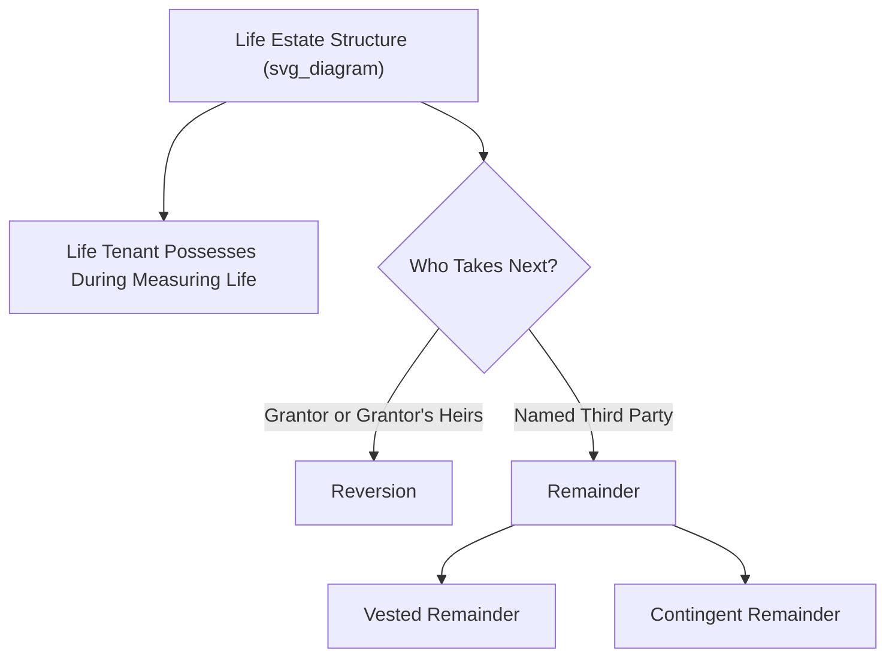

## Life Estates

### Overview

A life estate is an estate in land whose duration is measured by the life (or lives) of one or more specific individuals, rather than by a fixed term of years or a potentially infinite duration. It represents the classic example of a "lesser" freehold estate carved out of a fee simple, entitling the life tenant to possess, use, and enjoy the land for the measuring life, after which the estate automatically ends and possession passes to whoever holds the following future interest (a reversion in the grantor or a remainder in a third party). Life estates are foundational to trusts and estate planning, marital property arrangements (historically dower and curtesy), and remain directly relevant to easement law through the doctrine of waste and the limited scope of a life tenant's power to burden the land.

### Creation and Classification

**Life Estate Measured by the Tenant's Own Life**

The most common form: "O conveys Blackacre to A for life." A holds a life estate that automatically terminates upon **A's own death**.

**Life Estate *Pur Autre Vie* ("For the Life of Another")**

A life estate can instead be measured by the life of someone other than the life tenant. Example: "O conveys Blackacre to A for the life of B." Here, A holds a life estate *pur autre vie* — A's estate lasts as long as **B** lives, regardless of whether A dies first. If A dies before B, A's interest passes to A's heirs or devisees for the **remainder of B's life** (since the measuring life, B, has not yet ended), a somewhat unusual situation historically productive of disputes and now generally addressed by statute or careful will/estate drafting.

**Legal versus Equitable Life Estates**

Since the widespread adoption of statutes modeled on reforms like England's 1925 property legislation (and analogous approaches in many U.S. states through the doctrine of equitable conversion via trusts), life estates in practice are frequently created as **equitable interests behind a trust** rather than as legal freehold estates directly conveyed by deed — allowing a professional trustee to manage the property (sell, reinvest, maintain) for the life tenant's benefit while avoiding the practical rigidities of a direct legal life estate (discussed under "Modern Practical Disfavor" below).

### The Future Interest Following a Life Estate

- If the grant does not specify who takes the property after the life estate ends, the interest **reverts to the grantor** (or the grantor's heirs/estate if the grantor has died) — this retained future interest is called a **reversion**.
- If the grant specifies a third party to take possession after the life estate ends (e.g., "to A for life, then to B"), B holds a **remainder** — either **vested** (B is ascertained and there is no condition precedent to B's taking, other than the natural termination of the life estate) or **contingent** (B is unascertained, or B's taking is subject to a condition precedent).

### Rights and Duties of the Life Tenant

**Rights**

The life tenant is entitled to:

- Full possession and exclusive use of the property during the measuring life
- All ordinary income and profits generated by the land during that period (rents, crops, etc.)
- The right to transfer (sell, lease, or mortgage) their life estate interest to a third party — but the transferee receives only what the life tenant had: an interest lasting no longer than the original measuring life (a transferee cannot receive a greater interest than the life tenant possessed)

**Duties: The Doctrine of Waste**

Because a life tenant possesses the property only temporarily while future interest holders (reversioners or remaindermen) hold a stake in the property's condition upon the life estate's termination, the common law imposed the **doctrine of waste** to balance the life tenant's present enjoyment against the future interest holders' expectation of receiving the property in reasonably unimpaired condition.

| Type of Waste | Description | Example |
| --- | --- | --- |
| **Voluntary (affirmative) waste** | Active, deliberate conduct that decreases the property's value | Demolishing a building, cutting down timber for sale beyond normal use, extracting minerals not previously being extracted |
| **Permissive waste** | Passive failure to act, allowing the property to deteriorate | Failing to make ordinary repairs, failing to pay property taxes or mortgage interest, allowing the property to be lost to tax sale or foreclosure |
| **Ameliorative waste** | Affirmative change to the property that arguably *increases* its value but alters its character | Demolishing an outdated structure to build a more valuable one, without the future interest holders' consent |

**Modern Treatment of Ameliorative Waste**: Historically treated strictly (any unauthorized change was actionable waste regardless of whether it increased value), but the modern trend — reflected in the Restatement (Third) of Property — is more permissive, often allowing ameliorative changes where the property's character has substantially changed such that continued use in its original form is no longer economically reasonable, provided all future interest holders can be identified or adequately protected.

**Open Mines Doctrine**: An exception permitting a life tenant to continue extracting minerals or timber from operations that were **already open and ongoing** at the time the life estate was created, on the theory that the life tenant is merely continuing an established use rather than initiating a new exploitation of the corpus of the estate.

### The Life Tenant's Limited Power to Grant Easements

This is a critical point of intersection with easement law: **a life tenant cannot grant an easement (or any other interest) that survives beyond the duration of the life estate**, because a grantor cannot convey a greater interest than they hold (*nemo dat quod non habet* — "no one gives what they do not have").

- If a life tenant purports to grant a permanent easement across the land, the grant is valid **only for the duration of the life estate** — the easement automatically terminates when the life estate ends (i.e., upon the measuring life's death), unless the future interest holder (reversioner or remainderman) separately joins in or ratifies the grant to bind the fee.
- For an easement to permanently bind the fee (surviving the life tenant's death), it must typically be granted by, or with the joinder of, whoever holds the fee simple — which may require the life tenant and the remainderman/reversioner to act together, or may require a court proceeding (e.g., in some jurisdictions, a partition or judicial sale mechanism) if the future interest holders are unascertained, minors, or otherwise unable to consent.
- Granting an easement inconsistent with the future interest holders' expectations (e.g., one causing lasting physical damage to the servient estate) may itself constitute actionable **waste**, exposing the life tenant to liability even independent of the easement's own validity.

### Practical and Modern Disfavor of Legal Life Estates

Despite their doctrinal importance, direct legal life estates are now relatively **disfavored in modern estate planning practice** for several practical reasons:

1. **Marketability problems**: A legal life estate splits legal ownership between the life tenant and the future interest holder(s), often making the property difficult to sell, mortgage, or improve without the consent (and full cooperation) of all interest holders.
2. **Waste litigation risk**: The doctrine of waste generates friction and potential litigation between life tenants and remaindermen/reversioners over maintenance, improvements, and use decisions.
3. **Preference for trusts**: Modern estate planning generally achieves the same economic goal (providing lifetime benefit to one person, with the remainder passing to others) through a **trust**, in which a trustee holds legal title and manages the property for the equitable life beneficiary and remainder beneficiaries — avoiding the rigidities of the legal life estate/waste framework while providing greater flexibility (e.g., the trustee can sell the property and reinvest proceeds, something a legal life tenant generally cannot do unilaterally without remainderman consent or court approval).

**[Inference]** The degree to which any given jurisdiction still recognizes and actively enforces classic legal life estate/waste doctrine (as opposed to channeling most such arrangements through trusts) can vary, and specific procedural mechanisms (e.g., statutory sale-and-reinvestment powers for life tenants) differ by state; this should be verified against the specific jurisdiction's probate and property code.

### Historical Marital Life Estates: Dower and Curtesy

Historically, the common law provided automatic, non-barrable life estate interests to surviving spouses:

- **Dower**: A widow's automatic life estate in one-third of the real property her husband held in fee simple or fee tail during the marriage (subject to specific historical qualifications).
- **Curtesy**: A widower's automatic life estate in the entirety of his wife's real property, historically conditioned on the birth of a live child of the marriage.

Both doctrines have been **abolished or substantially replaced** in virtually all U.S. states by modern **elective share statutes**, which give a surviving spouse a statutory right to claim a percentage of the deceased spouse's estate (rather than an automatic life estate in specific real property), reflecting a broader shift from real-property-specific spousal protection to a more flexible, estate-wide statutory entitlement.

### Key Points

- A life estate is measured by a specific life (the tenant's own, in *pur autre vie* by another's life) and automatically terminates upon that measuring life's end, at which point a reversion (to the grantor) or remainder (to a third party) takes effect.
- The life tenant holds full possessory and income rights during the measuring life but is constrained by the doctrine of waste (voluntary, permissive, and ameliorative), which protects the interests of future interest holders.
- A life tenant cannot grant an easement or other interest that survives beyond the life estate's duration, since a grantor cannot convey a greater interest than they hold; permanently binding the fee requires the participation of the future interest holders.
- Modern estate planning generally favors trusts over direct legal life estates due to marketability constraints and waste-related friction, though legal life estates remain doctrinally significant and occasionally used.
- Historical automatic marital life estates (dower and curtesy) have been largely supplanted by modern elective share statutes in most U.S. jurisdictions.

### Related Topics

- The Doctrine of Waste: Voluntary, Permissive, and Ameliorative
- Future Interests: Reversions and Remainders (Vested and Contingent)
- Fee Simple Absolute and Defeasible Fees (Comparative Estates)
- Trusts as an Alternative to Legal Life Estates
- Elective Share Statutes and Modern Spousal Property Protection
- Life Tenant's Limited Power to Grant Easements and Leases
- The Open Mines Doctrine and Natural Resource Extraction by Life Tenants
- Nemo Dat Quod Non Habet and the Limits of a Grantor's Conveying Power