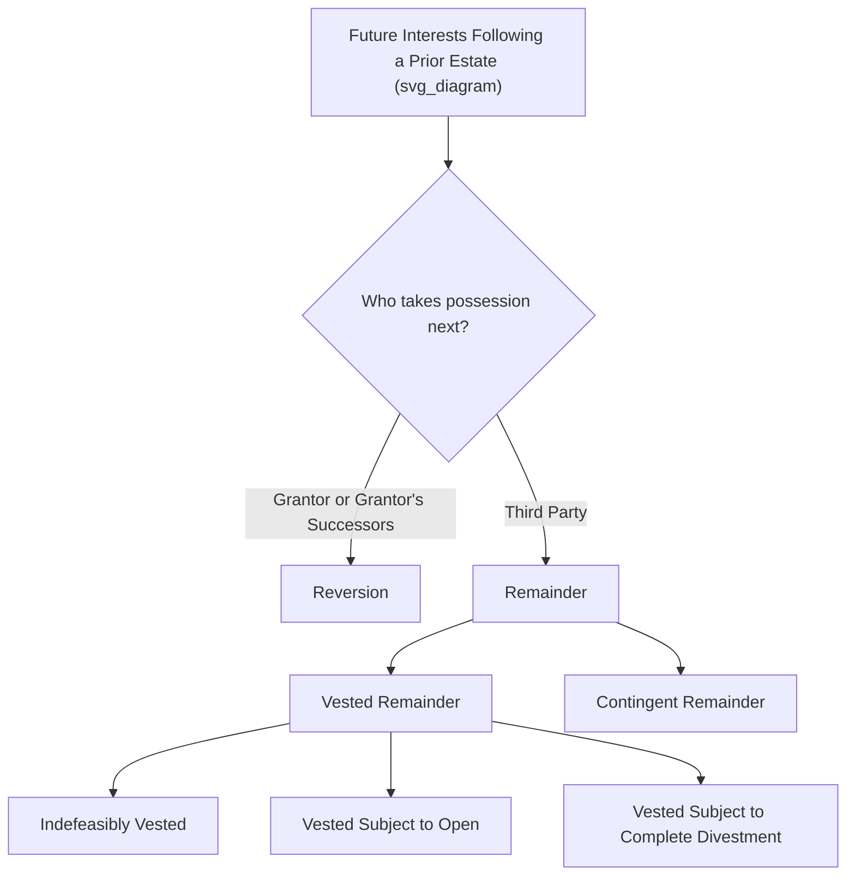

## Reversions and Remainders

### Overview

Reversions and remainders are the two principal categories of **future interests** that follow a lesser estate (typically a life estate or a term of years) and determine who takes possession once that prior estate naturally ends. Together with the defeasible-fee future interests (possibility of reverter, right of entry, and executory interest), they complete the common law's system for tracking present and future rights in land across time. Understanding the precise classification of a future interest matters because it determines transferability, subjection to the Rule Against Perpetuities, and the interest holder's rights and remedies while the prior estate is ongoing — including their standing to object to or ratify easements, waste, or other burdens placed on the land.

### The Fundamental Distinction: Who Takes, and From Whom

The single most important classificatory question for any future interest following a life estate or term of years is: **does the property return to the original grantor, or pass to a third party?**

### Reversions

**Definition**

A **reversion** is the future interest retained by a grantor (or the grantor's heirs/successors) when the grantor conveys an estate of lesser duration than what the grantor originally held, and does not expressly grant the remaining interest to anyone else. It "reverts" back to the grantor automatically upon the natural expiration of the prior estate.

**Key Characteristics**

- **Arises by operation of law**, not by express grant — a reversion need not be, and typically is not, expressly stated in the conveying instrument; it exists automatically whenever a grantor conveys less than their entire estate without specifying who takes next.
- **Always vested** (this is a foundational classificatory point): because a reversion is held by the grantor, who is by definition already an ascertained person, and is not subject to a condition precedent (the property simply reverts upon the natural expiration of the prior estate), a reversion is never classified as "contingent" in the way a remainder can be.
- **Freely transferable** during the grantor's life, and devisable/inheritable upon the grantor's death.
- **Exempt from the Rule Against Perpetuities**: Because it is a vested interest retained by the grantor, the reversion is not subject to RAP scrutiny (RAP concerns only certain contingent future interests, primarily contingent remainders and executory interests).

**Example**: "O conveys Blackacre to A for life." O has conveyed only a life estate; O retains a **reversion** in fee simple, which will become possessory automatically upon A's death (assuming O has not separately died and passed the reversion to O's own heirs or devisees in the meantime).

### Remainders

**Definition**

A **remainder** is a future interest created in a **third party** (someone other than the grantor) that is expressly designed to become possessory immediately upon the natural expiration of the preceding estate (typically a life estate or term of years). Unlike an executory interest, a remainder does not "cut short" or divest the prior estate — it waits patiently for the prior estate to end naturally and then takes effect.

**Two Requirements for a Valid Remainder**

1. It must be created in the **same instrument** as the preceding estate.
2. It must be capable of becoming possessory **immediately upon** the natural termination of the preceding estate (it cannot be designed to "cut short" the prior estate early — that would instead be an executory interest).

### Vested Remainders

A remainder is **vested** if (a) the remainderman is an ascertained, identifiable person, and (b) there is no condition precedent to the remainderman's right to possession other than the natural termination of the preceding estate.

**Subcategories of Vested Remainders**

1. **Indefeasibly vested remainder**: Certain to become possessory; no condition or event could divest or diminish it. Example: "To A for life, then to B." B holds an indefeasibly vested remainder, certain to take possession upon A's death.
2. **Vested remainder subject to open (subject to partial divestment)**: Held by a class of persons, at least one of whom is ascertained and entitled to take, but the class remains open to admit additional members (thereby diminishing each member's eventual share). Example: "To A for life, then to A's children." If A has one living child, C, at the time of the grant, C holds a vested remainder subject to open, since additional children born to A before A's death would also share in the remainder, reducing C's eventual share.
3. **Vested remainder subject to complete divestment (subject to condition subsequent)**: Vested in an ascertained person, but subject to a condition that could **completely** eliminate the interest before it becomes possessory. Example: "To A for life, then to B, but if B does not survive A, to C." B holds a vested remainder subject to complete divestment (by C's executory interest) if B fails to survive A.

### Contingent Remainders

A remainder is **contingent** if either (a) the remainderman is **unascertained** (not yet identified or not yet born), or (b) the remainder is subject to a **condition precedent** that must occur before the remainderman's right to possession arises (beyond the mere natural termination of the preceding estate).

**Examples**

- **Unascertained remainderman**: "To A for life, then to A's heirs." A's heirs cannot be determined until A actually dies (under the traditional rule, a living person has no "heirs," only "heirs apparent"), so the remainder is contingent until A's death.
- **Condition precedent**: "To A for life, then to B if B graduates from law school." B's remainder is contingent because B's right to possession depends on satisfying the stated condition (graduation) in addition to the natural termination of A's life estate.

**Alternative Contingent Remainders**: A grant can create two or more contingent remainders in the alternative, structured so that exactly one will vest depending on which condition occurs. Example: "To A for life, then to B if B survives A, but if B does not survive A, to C." Both B's and C's interests are contingent remainders (in the alternative) until A's death resolves which condition is satisfied.

**Rule Against Perpetuities Exposure**: Contingent remainders are directly subject to RAP scrutiny, since they are, by definition, not yet vested and depend on a future contingency; careful drafting must ensure the contingency is certain to resolve (if at all) within the perpetuities period (traditionally, lives in being plus 21 years).

### The Historical Destructibility Rule (and Its Modern Abolition)

At common law, a harsh doctrine known as the **destructibility of contingent remainders** rule provided that a contingent remainder was **destroyed** if it had not vested by the time the preceding freehold estate (typically a life estate) terminated. Example: "To A for life, then to B if B reaches age 21." If A died before B turned 21, B's contingent remainder was historically destroyed entirely, and the property reverted to the grantor (or grantor's heirs), permanently defeating B's interest even if B later did reach 21.

**Modern Abolition**: Virtually all U.S. states have **abolished the destructibility of contingent remainders rule** by statute or judicial decision. Today, if a contingent remainder has not vested by the time the preceding estate ends, the property reverts to the grantor (via a temporary **reversion**) until the condition is satisfied or becomes impossible, rather than permanently destroying the remainder — meaning B in the example above would retain the right to take the property upon reaching 21, with the grantor holding the interest in the interim.

### Comparative Table: Reversion versus Remainder versus Executory Interest

| Feature | Reversion | Remainder | Executory Interest |
| --- | --- | --- | --- |
| **Held by** | Grantor / grantor's successors | Third party | Third party |
| **Relationship to prior estate** | Follows natural expiration | Follows natural expiration | Cuts short / divests prior estate |
| **Always vested?** | Yes | Can be vested or contingent | No — inherently a form of contingent-style interest |
| **Subject to RAP?** | No (exempt) | Contingent remainders: yes; Vested remainders: no | Yes |
| **Origin** | Common law (always recognized) | Common law (always recognized) | Statute of Uses (1535) |

### Relevance to Land Rights and Easement Law

1. **Who must join in granting a permanent easement**: As discussed under life estates, a life tenant cannot bind the fee beyond their own measuring life. Whether the **reversioner** or the **remainderman** must join in an easement grant to make it permanently binding depends on which future interest exists — practitioners must correctly identify whether a reversion or remainder (and whether vested or contingent) follows the life estate before structuring a transaction involving the servient estate.
2. **Contingent remaindermen and standing**: Because a contingent remainderman may be unascertained (e.g., unborn heirs), transactions affecting land subject to a contingent remainder often require a **guardian ad litem** or court approval to protect the interests of remaindermen who cannot yet consent for themselves — directly relevant when negotiating or litigating easements over such land.
3. **Marketable title concerns**: Outstanding contingent remainders and reversions, like defeasible fee future interests, can create title marketability problems that title insurers and Marketable Title Acts specifically address, since a title search may not clearly reveal all persons whose future consent would be needed to convey a fully marketable, unencumbered fee.

### Key Points

- A reversion arises automatically in the grantor when a lesser estate is conveyed without specifying a third-party taker; it is always vested and exempt from the Rule Against Perpetuities.
- A remainder is a third-party future interest that waits for the natural expiration of the prior estate (never cutting it short); it can be vested (indefeasibly vested, subject to open, or subject to complete divestment) or contingent (unascertained taker or unmet condition precedent).
- Contingent remainders, unlike vested remainders and reversions, are subject to the Rule Against Perpetuities and require careful drafting to ensure timely vesting.
- The historical destructibility of contingent remainders rule (which permanently destroyed an unvested contingent remainder upon the prior estate's termination) has been abolished in virtually all U.S. jurisdictions, replaced by a temporary reversion to the grantor pending resolution of the condition.
- Correctly identifying whether a reversion or remainder (and its vested/contingent status) follows a life estate is essential for determining who must join in granting a permanently binding easement over the servient estate.

### Related Topics

- Executory Interests and the Statute of Uses
- The Rule Against Perpetuities: Application and Modern Reform
- Life Estates and the Life Tenant's Limited Conveying Power
- Vested Remainder Subject to Open and Class Gift Doctrine
- The Destructibility of Contingent Remainders (Historical Doctrine and Abolition)
- Fee Simple Determinable, Subject to Condition Subsequent, and Subject to Executory Limitation
- Guardian Ad Litem Representation of Contingent Future Interest Holders
- Marketable Title Acts and Stale Future Interests