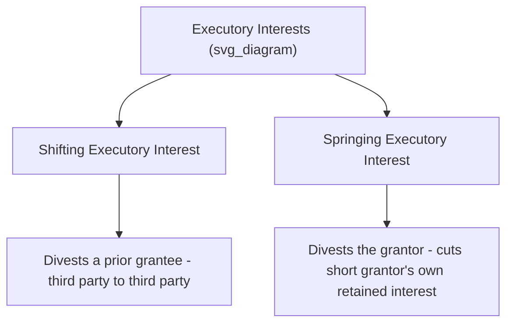

## Executory Interests

### Overview

An executory interest is a future interest held by a third party (someone other than the grantor) that, unlike a remainder, **divests or cuts short** a preceding estate rather than waiting for it to expire naturally. Executory interests are the youngest major category of future interest in the common law system, made possible only after the **Statute of Uses (1535)** forced common law courts to recognize interests that could spring up or shift ownership away from a current possessor before that possessor's estate would otherwise have ended. They remain the future interest most frequently implicated in Rule Against Perpetuities analysis and are central to modern drafting involving conditional gifts, defeasible fees, and executory limitations affecting land.

### Historical Origin: Why Executory Interests Did Not Exist at Pure Common Law

Prior to the Statute of Uses, the rigid common law system of estates recognized only future interests that **followed the natural termination** of a preceding estate (reversions and remainders). The common law refused to recognize any future interest capable of **cutting short** a prior vested freehold estate in favor of a third party, because doing so was seen as incompatible with the seisin-based system — an estate, once vested, could not simply be divested by operation of a future condition in favor of someone who was not the grantor.

The **"use"** (the historical trust-like arrangement in which feoffees held legal title for a beneficiary) allowed for far greater flexibility in equity, including shifting and springing interests that had no valid common law equivalent. When the Statute of Uses purported to "execute" the use (converting the beneficiary's equitable interest into direct legal title), it inadvertently imported the *flexibility* of equitable shifting and springing interests into the common law itself — legal future interests of this new type became known as **executory interests**, named for the fact that they "executed" (were created by, and inherited the flexible character of) a use.

### The Two Types of Executory Interests

**Shifting Executory Interest**

A shifting executory interest divests (cuts short) the interest of a **prior grantee** (another third party), transferring possession from one third party to another. It always "shifts" the estate from one grantee to a different grantee.

**Example**: "O conveys Blackacre to A and his heirs, but if A ever sells alcohol on the premises, then to B and his heirs." B holds a **shifting executory interest**, because B's interest divests A's fee simple (subject to executory limitation) and shifts possession from A (a grantee) to B (another grantee).

**Springing Executory Interest**

A springing executory interest divests (cuts short) an interest retained by the **grantor**, "springing" the estate forward out of the grantor and into a third party at a future date or upon a future event, without any intervening estate in another grantee.

**Example**: "O conveys Blackacre to A, if and when A marries." Until A marries, O retains a fee simple subject to A's springing executory interest (O effectively holds the property, or a reversion, in the interim). When A marries, A's interest "springs" forward, divesting O's retained interest and vesting possession in A.

### Executory Interests versus Remainders: The Critical Distinction

The defining test separating an executory interest from a remainder is **whether the third-party interest divests a prior estate early, or merely waits for it to expire naturally**:

| Feature | Remainder | Executory Interest |
| --- | --- | --- |
| **Timing relative to prior estate** | Takes effect only upon natural expiration of the prior estate | Cuts short (divests) the prior estate before its natural expiration point, or springs out of the grantor |
| **Who is divested** | No one — the prior estate simply ends on schedule | Either a prior grantee (shifting) or the grantor (springing) |
| **Historical validity** | Recognized at common law from early on | Only recognized after the Statute of Uses (1535) |
| **Typical accompanying estate** | Life estate or term of years (naturally expiring estates) | Fee simple subject to executory limitation, or a gap before a springing interest vests |

**Illustrative Comparison**

- "To A for life, then to B" → B holds a **remainder** (waits for A's life estate to end naturally).
- "To A for life, but if A remarries, then to B" → B holds a **shifting executory interest** (B's interest could cut short A's life estate *before* A's natural death, if A remarries; note this differs from a simple remainder because B's taking is not tied to the natural endpoint of A's estate but to an independent condition that could occur earlier).
- "To A, but if A ever stops farming the land, to B" → B holds a **shifting executory interest** cutting short A's fee simple subject to executory limitation.
- "To A when A turns 25" (with no prior grantee named) → A holds a **springing executory interest**, divesting whatever interest O retains in the interim (typically characterized as a fee simple subject to A's springing executory interest, with O holding the interim interest).

### Vesting Characteristics of Executory Interests

Executory interests are, by their nature, **never classified as "vested" in the same sense as a vested remainder** prior to actually becoming possessory, because they are inherently contingent on the occurrence of a divesting event (or, for springing interests, on the arrival of the specified future date/event) — this is a key reason they receive close scrutiny under the Rule Against Perpetuities.

**[Inference]** Some scholarly treatments distinguish nuances in how "vesting" language is applied to executory interests versus contingent remainders; the precise doctrinal framing can vary slightly across casebooks and jurisdictions, though the practical RAP consequence (treating executory interests as contingent-type interests requiring RAP analysis) is consistently applied.

### The Rule Against Perpetuities and Executory Interests

**Why Executory Interests Are Especially Vulnerable**

The classic common law Rule Against Perpetuities provides that a contingent future interest is void unless it is certain to **vest or fail, if at all, within 21 years after the death of some life in being** at the time the interest was created. Executory interests are the future interest type most frequently invalidated under this rule because:

1. They are, by definition, contingent (subject to a condition or future event) rather than vested.
2. They are often drafted with conditions that could theoretically extend indefinitely into the future (e.g., "so long as the land is used for X, then to B" — a condition with no inherent temporal limit).
3. Unlike reversions (always vested, exempt from RAP) and many remainders (vested remainders exempt from RAP), executory interests rarely benefit from any RAP exemption.

**Illustrative RAP Problem**: "O conveys Blackacre to A and his heirs, but if the land is ever used for other than residential purposes, then to B and his heirs." Because the condition (non-residential use) could occur at any point in the indefinite future — potentially centuries after all currently living persons have died — this shifting executory interest in B is **void under the common law Rule Against Perpetuities**, since it is not certain to vest or fail within the perpetuities period measured against any relevant life in being.

**Modern Reform Approaches**: Many U.S. states have softened the harsh common law "what might happen" approach through:

- **The "wait and see" (second-look) doctrine**: Validity is judged by what actually happens during the perpetuities period, rather than by all theoretically possible outcomes at the time of creation.
- **The Uniform Statutory Rule Against Perpetuities (USRAP)**: Adopts a wait-and-see approach with a flat alternative **90-year vesting period**, adopted in a substantial number of U.S. states, providing a more administrable and predictable alternative to the traditional "lives in being plus 21 years" analysis.
- **Cy pres reformation**: Courts are increasingly empowered to reform an offending instrument to approximate the grantor's intent while complying with RAP, rather than voiding the interest outright.

**[Inference]** The specific version of RAP reform adopted (common law, USRAP, wait-and-see, cy pres, or outright abolition of RAP for certain trust instruments) varies substantially by state, and specific outcomes require checking the controlling jurisdiction's current statute.

### Relevance to Land Rights and Easement Law

1. **Conditional easement grants**: An easement grant structured with a shifting condition (e.g., "easement to Utility Co., but if the utility ceases service for five years, the easement shall shift to Neighbor for private access") can itself raise RAP and executory interest classification issues, requiring the same careful analysis applied to defeasible fees.
2. **Development and subdivision conditions**: Executory interests are frequently used in land development agreements and conservation transactions with conditional future transfers (e.g., open space reverting or shifting if development conditions are violated), directly intersecting with the drafting concerns covered under defeasible fees.
3. **Title marketability**: Like other defeasible and conditional interests, outstanding executory interests can create significant title marketability problems, since a title searcher must trace whether any shifting or springing condition remains capable of divesting current ownership — a major justification for Marketable Title Acts that extinguish stale conditional and executory interests after a defined statutory period.

### Key Points

- An executory interest is a third-party future interest that divests a prior estate rather than waiting for its natural expiration; it was made possible only by the Statute of Uses (1535), which imported equity's flexible shifting/springing interests into the legal estate system.
- A shifting executory interest divests a prior grantee's estate in favor of another third party; a springing executory interest divests the grantor's own retained interest in favor of a third party.
- The critical distinguishing test versus a remainder is timing: a remainder waits for natural expiration, while an executory interest cuts the prior estate short (or springs out of the grantor).
- Executory interests are inherently contingent-type interests and are the future interest category most frequently invalidated under the Rule Against Perpetuities, though modern reforms (wait-and-see, USRAP's 90-year period, cy pres reformation) have substantially softened the common law's strict "what might happen" approach.
- Conditional easement and land development structures that incorporate shifting or springing conditions require the same executory interest and RAP analysis applied to defeasible fees generally.

### Related Topics

- The Rule Against Perpetuities: Common Law Rule, Wait-and-See, and USRAP
- Reversions and Remainders (Vested and Contingent) as Comparative Future Interests
- The Statute of Uses and the Historical Origin of Shifting/Springing Interests
- Fee Simple Subject to Executory Limitation
- Cy Pres Reformation of Perpetuities Violations
- Marketable Title Acts and Extinguishment of Stale Conditional Interests
- Conditional and Defeasible Easement Drafting
- Conservation and Development Agreements with Conditional Future Transfers