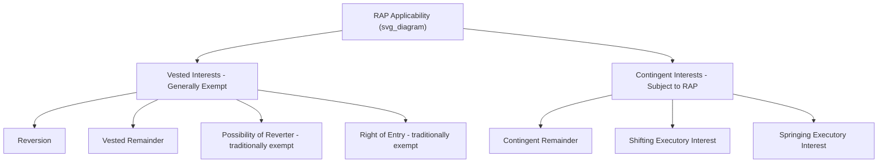
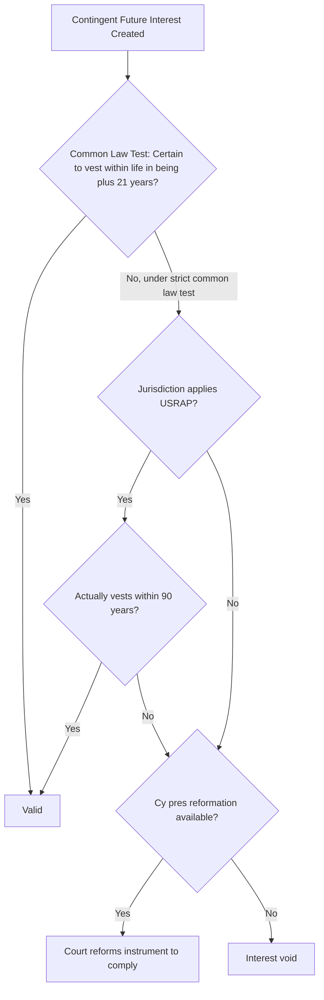

## The Rule Against Perpetuities

### Overview

The Rule Against Perpetuities (RAP) is one of the most notoriously complex doctrines in Anglo-American property law, designed to prevent grantors from controlling the disposition of property for an unreasonably long time into the future by tying up interests in a state of uncertainty. First clearly articulated in the English case *Duke of Norfolk's Case* (1682) and formalized in *Cadell v. Palmer* (1833), the rule reflects a fundamental policy tension between a grantor's freedom to dispose of property as they wish and society's interest in keeping land and other property freely alienable and productively used rather than perpetually encumbered by the "dead hand" of past generations.

### The Classic Common Law Statement of the Rule

**John Chipman Gray's Formulation**

The most widely cited statement of the traditional rule, from Gray's *The Rule Against Perpetuities* (1886):

> No interest is good unless it must vest, if at all, not later than twenty-one years after some life in being at the creation of the interest.

**Breaking Down the Formula**

1. **"No interest is good unless..."**: The rule is a rule of *invalidity* — an interest that fails the test is **void from the moment of creation**, not merely voidable or subject to later challenge.
2. **"...must vest, if at all..."**: The interest must be **certain** to either vest or fail entirely within the permitted period — mere probability or likelihood of timely vesting is insufficient; the classic common law approach requires certainty judged **at the time the interest is created**, considering all theoretically possible (however improbable) future scenarios.
3. **"...not later than twenty-one years after..."**: The permitted waiting period is 21 years, added on top of the relevant measuring life.
4. **"...some life in being at the creation of the interest"**: The measuring life ("validating life") must be a person alive (or conceived, under the "in gestation" rule) at the moment the interest is created, and the interest must be certain to vest (or fail) within 21 years after that person's death.

### Which Interests Are Subject to the Rule

RAP applies to certain **contingent future interests**, but not to all future interests:

| Interest Type | Subject to RAP? |
| --- | --- |
| **Reversion** | No — always vested, exempt |
| **Possibility of reverter** | Traditionally exempt (though some modern statutes impose RAP-like or separate durational limits) |
| **Right of entry / power of termination** | Traditionally exempt (same caveat as above) |
| **Vested remainder** (indefeasibly vested, subject to open, or subject to complete divestment) | Generally exempt, though a vested remainder subject to open can raise RAP issues regarding the closing of the class |
| **Contingent remainder** | Yes — directly subject to RAP |
| **Executory interest** (shifting or springing) | Yes — directly subject to RAP, and the interest type most frequently invalidated |
| **Options and rights of first refusal** (in some jurisdictions, particularly commercial ones) | Often yes, though many modern statutes carve out or relax RAP treatment for certain commercial options |

### The "What Might Happen" Common Law Methodology

The traditional common law approach to RAP is famously strict because it asks not what actually happens, but what **theoretically could** happen, evaluated at the moment the interest is created — a methodology that has generated notoriously counterintuitive results.

**The Fertile Octogenarian Problem**

Common law RAP analysis presumes that **any living person is capable of having children**, regardless of age, health, or biological plausibility. Example: "To A for life, then to A's children who reach age 25." If A is 90 years old, common law RAP analysis must still theoretically account for the possibility that A has another child *after* the interest is created — and since that after-born child's interest might not vest within 21 years of any currently-living measuring life (if A and all A's current children die shortly after the new child's birth, the new child would not reach 25 until 25 years after the death of everyone who was "a life in being"), the gift to "A's children" as a class can be invalidated in its entirety under the "all-or-nothing" class gift rule, even though the theoretical after-born child is biologically improbable.

**The Unborn Widow Problem**

Similarly, common law RAP analysis presumes a person's "widow" or "widower" is not conclusively identified until that person's death (since a current spouse could predecease them and be replaced by a new, potentially much younger or even not-yet-born, spouse) — creating RAP problems for gifts like "to A for life, then to A's widow for life, then to A's children," because A's eventual widow might not be a "life in being" at the time of the grant.

**[Inference]** These classic hypothetical problems (fertile octogenarian, unborn widow, and similar constructs like the "precocious toddler" or "slothful executor" problems) are standard illustrative devices used across property law casebooks to demonstrate the common law rule's rigidity; while their doctrinal validity as illustrations is well established, courts in individual real cases have increasingly relied on modern reform mechanisms (below) to avoid these harsh theoretical outcomes.

### The Purpose and Policy Behind the Rule

RAP serves several interrelated policy goals:

1. **Promoting alienability**: Property tied up in long chains of contingent future interests is difficult to sell or mortgage, since purchasers cannot obtain clear, marketable title without resolving or extinguishing every contingent interest.
2. **Limiting "dead hand" control**: The rule reflects a policy judgment that a grantor should not be permitted to control the disposition of property indefinitely into the future, particularly across generations far removed from the grantor's own direct knowledge or interests.
3. **Encouraging productive use of property**: Property subject to prolonged uncertainty about its ultimate ownership may be under-maintained or under-invested in, since no one holds an unqualified interest in improving it.

### Modern Reform Approaches

Widespread academic and judicial criticism of the common law rule's harsh, formalistic "what might happen" methodology led to substantial reform across most U.S. jurisdictions:

**The "Wait and See" (Second-Look) Doctrine**

Rather than judging validity based on all theoretically possible outcomes at the time of creation, the wait-and-see approach evaluates the interest based on **what actually happens** during the relevant perpetuities period. If the interest actually vests (or fails) within the period, in light of real-world events, it is valid — regardless of what might theoretically have occurred.

**The Uniform Statutory Rule Against Perpetuities (USRAP)**

Promulgated by the Uniform Law Commission and adopted (with variations) in a substantial number of U.S. states, USRAP provides an **alternative 90-year flat vesting period** as a backstop to the traditional common law "life in being plus 21 years" test: an interest is valid if it either satisfies the traditional common law test **or** actually vests (or fails) within 90 years of its creation, whichever the drafter or court finds applicable. This provides much greater administrability and predictability than case-by-case identification of measuring lives.

**Cy Pres (Judicial Reformation)**

Many jurisdictions now empower courts to **reform** an instrument that would otherwise violate RAP, modifying its terms (e.g., adjusting an age contingency from 25 to 21) to approximate the grantor's original intent as closely as possible while bringing the interest within the permitted period — a significant departure from the traditional "void ab initio" consequence.

**Perpetual (Dynasty) Trust Reforms**

A number of U.S. states have gone further and **abolished or dramatically extended the Rule Against Perpetuities for trust interests** specifically (sometimes called "dynasty trust" statutes), permitting trusts to continue in perpetuity or for extremely long periods (e.g., 360+ years or unlimited duration) — largely motivated by interstate competition for trust business and estate planning advantages, and representing a significant divergence between traditional real property RAP policy and modern trust-specific statutory treatment.

**[Inference]** The specific reform package adopted (common law, wait-and-see only, USRAP's 90-year alternative, cy pres availability, or full/partial abolition for trusts) varies substantially state by state, and precise current status should be verified against the applicable jurisdiction's statute, as this is an area of ongoing legislative change.

### Relevance to Land Rights and Easement Law

1. **Conditional and defeasible easements**: As noted in the discussion of executory interests, an easement structured with a shifting or springing condition (e.g., "the easement shall shift to Party B if Party A ceases commercial operation") must be analyzed under RAP to ensure the shifting condition is certain to resolve within the applicable perpetuities period.
2. **Options to purchase and rights of first refusal affecting land**: Many jurisdictions apply RAP (or a RAP-like durational statute) to commercial options and rights of first refusal tied to real property, meaning poorly drafted long-term or perpetual purchase options can be invalidated — a significant drafting concern in easement and land-use agreements that include future purchase rights.
3. **Conservation easements and perpetuity requirements**: Notably, federal tax law (IRC Section 170(h)) generally **requires** a conservation easement to be granted "in perpetuity" to qualify for a charitable deduction — creating an interesting tension where perpetual duration is a *requirement* for this specific instrument, distinct from RAP's general suspicion of perpetual or excessively long contingent interests; conservation easements are typically structured as a present, vested restriction (a real covenant or equitable servitude) rather than a contingent future interest, which is why they are not generally invalidated by RAP despite their intended permanence.

### Key Points

- The Rule Against Perpetuities voids a contingent future interest unless it is certain to vest or fail, if at all, within 21 years after some life in being at the interest's creation.
- The rule applies to contingent remainders and executory interests, but generally exempts vested interests including reversions, vested remainders, and (traditionally) possibilities of reverter and rights of entry.
- The classic common law methodology judges validity based on all theoretically possible future scenarios at the time of creation, producing notoriously counterintuitive results like the fertile octogenarian and unborn widow problems.
- Modern reforms — wait-and-see, USRAP's 90-year alternative vesting period, and cy pres judicial reformation — have substantially softened the rule's harsh common law application in most U.S. jurisdictions.
- Some states have abolished or greatly extended RAP specifically for trusts (dynasty trusts), while conservation easements are separately required to be perpetual under federal tax law and are analyzed as present vested servitudes rather than contingent future interests subject to RAP.

### Related Topics

- Executory Interests: Shifting and Springing (Primary RAP-Vulnerable Category)
- Reversions and Remainders: Vested versus Contingent Classification
- The Uniform Statutory Rule Against Perpetuities (USRAP)
- Dynasty Trusts and State Competition for Perpetual Trust Duration
- Cy Pres Doctrine in Perpetuities Reformation
- Conservation Easements and the Federal Perpetuity Requirement (IRC Section 170(h))
- Options to Purchase and Rights of First Refusal in Real Property
- Class Gifts and the All-or-Nothing Rule