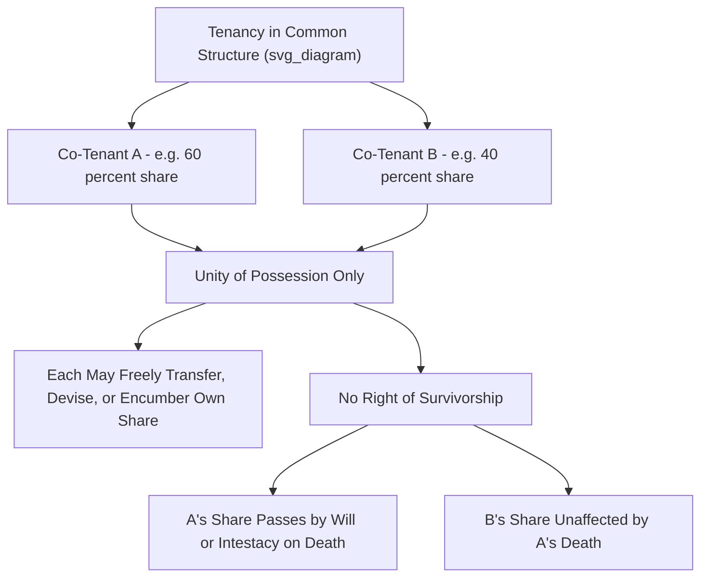

## Tenancy in Common

### Overview

Tenancy in common is the default, most flexible form of concurrent ownership in Anglo-American property law, under which two or more persons hold undivided interests in the same property simultaneously, with each co-tenant free to transfer, devise, or encumber their individual share independently, and with no right of survivorship. It stands as the modern statutory default whenever an ambiguous conveyance creates co-ownership, in contrast to the historically favored but now disfavored joint tenancy, and it is the form of co-ownership most frequently encountered in inherited property, unmarried co-purchasers, and investment property held by multiple owners.

### Defining Characteristics

**The Single Unity: Possession**

Tenancy in common requires only **one unity** — the **unity of possession**: each co-tenant has an equal right to possess and use the **entire** property, not merely a physically segregated portion corresponding to their fractional share. No co-tenant may exclude another co-tenant from any part of the property (absent a valid ouster or partition), even if their ownership percentages differ substantially.

**Unequal Shares Permitted**

Unlike joint tenancy, tenants in common **need not hold equal shares**. Co-tenants may hold any fractional interest (e.g., 70%/30%, or unequal shares among three or more co-tenants), and these percentages typically determine each co-tenant's proportional share of rents, profits, expenses, and proceeds upon sale or partition, though the **right to possess the whole property is unaffected by unequal percentage ownership**.

**No Right of Survivorship**

This is the most consequential distinguishing feature: upon a tenant in common's death, that co-tenant's interest **passes according to their will (devise) or, if they die intestate, according to the jurisdiction's intestate succession statute** — it does **not** automatically pass to the surviving co-tenants. Each co-tenant's interest in a tenancy in common is thus treated, for inheritance purposes, like any other individually owned asset.

**Separate, Freely Transferable Interests**

Each co-tenant may freely and unilaterally:

- **Sell or gift** their individual undivided interest to anyone, without needing the consent of the other co-tenants (the transferee simply becomes a new tenant in common alongside the remaining original co-tenants).
- **Mortgage or encumber** their individual interest (though this typically encumbers only that co-tenant's share, not the entire property).
- **Devise** their interest by will, or have it pass through intestate succession.

### Creation of a Tenancy in Common

**Modern Statutory Presumption**

Virtually all U.S. jurisdictions have reversed the historical common law preference for joint tenancy: a conveyance to two or more persons is now **presumed to create a tenancy in common** unless the instrument **clearly and expressly** indicates an intent to create a joint tenancy (or another form of concurrent ownership, such as tenancy by the entirety for married couples in jurisdictions recognizing it).

**Example**

- "O conveys Blackacre to A and B" → Under the modern default rule, A and B hold as **tenants in common**, each with an undivided one-half interest (absent evidence of a different intended split).
- "O conveys Blackacre to A and B as joint tenants with right of survivorship" → Express language required to overcome the modern statutory presumption and create a joint tenancy instead.

### Rights and Obligations Among Co-Tenants

**Right to Possess the Whole**

Each co-tenant is entitled to occupy and use the entire property, and mere occupancy by one co-tenant is **not**, by itself, a wrong against the others — courts require an actual **ouster** (a co-tenant's actions denying another co-tenant's equal right to possess) before a possessing co-tenant becomes liable to a non-possessing co-tenant for exclusive use.

**Rents and Profits from Third Parties**

If a co-tenant leases the property (or a portion of it) to a third party, the leasing co-tenant generally must **account to the other co-tenants** for their proportional share of the rent received, since the leasing co-tenant cannot unilaterally appropriate the value of the entire property (including the shares belonging to the other co-tenants) for exclusive personal benefit.

**Rents from a Co-Tenant's Own Occupancy (Absent Ouster)**

The majority common law rule is that a co-tenant in **sole possession**, absent an ouster of the other co-tenants, generally **owes no rent** to the non-possessing co-tenants merely for occupying the property, since each co-tenant already has an equal right to possess the whole — this often surprises non-possessing co-tenants and is a frequent source of dispute and litigation, particularly among family members holding inherited property.

**Contribution for Necessary Expenses**

- **Necessary repairs and mortgage/tax payments**: A co-tenant who pays more than their proportional share of necessary carrying costs (property taxes, mortgage interest, necessary repairs) generally has a right to **contribution** from the other co-tenants for their proportional share, enforceable at partition or through a separate action, though jurisdictions vary on whether contribution requires prior notice to the other co-tenants.
- **Improvements**: A co-tenant who makes discretionary improvements (as opposed to necessary repairs) generally has **no right to contribution** from other co-tenants for the cost, though at partition, the improving co-tenant may be entitled to any **increase in value** attributable to the improvement (and correspondingly bears the risk of any decrease in value the improvement might cause).

**Waste and Fiduciary-Like Duties**

Co-tenants owe each other a duty not to commit **waste** to the shared property (analogous to the life tenant/remainderman waste doctrine), and in some jurisdictions, co-tenants who acquire outstanding claims against the property (e.g., a tax lien or an outstanding mortgage) may be required to hold that acquired interest partially for the benefit of the other co-tenants rather than using it to unfairly acquire the whole property for themselves — reflecting a quasi-fiduciary undertone in co-tenancy relationships, particularly among family co-tenants.

### Partition: The Remedy for Ending Co-Ownership

Because tenants in common cannot be compelled to remain co-owners indefinitely, any co-tenant has an essentially **absolute right to seek partition** — judicial division or forced sale of the property — regardless of the wishes of the other co-tenants.

**Partition in Kind**

The traditionally preferred method: the court physically divides the property into separate parcels corresponding to each co-tenant's proportional interest, allowing each to become the sole owner of their own distinct parcel. This is generally feasible only for property that can be practically and equitably subdivided (e.g., a large tract of undeveloped land) without significantly diminishing the property's aggregate value.

**Partition by Sale**

Where physical division is impractical or would substantially diminish the property's value (e.g., a single-family house, or a small urban lot), courts order the property **sold** (typically at a judicial or private sale), with the proceeds divided among the co-tenants according to their proportional interests, after accounting for contribution/improvement adjustments.

**Modern Statutory Reform: The Uniform Partition of Heirs Property Act (UPHPA)**

In response to documented concerns about "heirs' property" (property inherited by multiple family members as tenants in common, often without formal estate planning, historically vulnerable to forced partition sales at below-market prices that disproportionately affected family wealth, particularly among Black landowning families in the U.S. South), the Uniform Law Commission promulgated the **UPHPA**, adopted in a substantial and growing number of U.S. states. Key UPHPA protections include:

- A **right of first refusal** allowing other co-tenants to buy out a co-tenant seeking partition, at a court-determined fair market value, before a forced sale proceeds.
- A **strong preference for partition in kind** where feasible, and specific factors courts must consider (including sentimental/historical value) before ordering partition by sale.
- Requirements for an **open-market sale process** (rather than a traditional auction-style sale, which historically often yielded prices well below fair market value) when partition by sale is ordered.

**[Inference]** Whether a specific state has adopted the UPHPA, and the precise scope of its protections, should be verified against that state's current statutes, as adoption has been ongoing and uneven across states since the Act's initial promulgation.

### Relevance to Easement Law

1. **Easement grants by co-tenants**: A single tenant in common generally **cannot unilaterally grant an easement binding the entire property** without the consent of the other co-tenants, because doing so would burden shares the granting co-tenant does not own; a co-tenant can, at most, grant an easement effective only as to their own undivided interest, which is often practically unworkable and rarely how easements affecting co-owned land are actually structured — typically, all co-tenants must join in the grant for a valid, binding easement over the whole property.
2. **Easements and partition**: When property subject to an easement is partitioned (in kind), courts must determine how the easement burden or benefit is allocated among the newly created separate parcels, an issue requiring careful judicial attention where the original easement's scope or location does not map cleanly onto the partition lines.
3. **Implied easements arising from partition**: Partition in kind of previously unified land can itself give rise to **implied easements** (e.g., a quasi-easement for access or utilities that existed while the land was held in common becoming a legally recognized implied easement once the land is divided into separate parcels) — directly connecting co-tenancy doctrine to the implied easement doctrines covered elsewhere in this material.

### Key Points

- Tenancy in common requires only unity of possession; co-tenants may hold unequal shares, and each co-tenant's interest passes by will or intestate succession rather than to the surviving co-tenants (no right of survivorship).
- Modern statutes presume a conveyance to multiple grantees creates a tenancy in common unless the instrument clearly expresses an intent to create a joint tenancy or other concurrent estate.
- A co-tenant in sole possession generally owes no rent to non-possessing co-tenants absent an ouster, but must account for rents collected from third parties and may seek contribution for necessary (but not merely discretionary) expenses.
- Any co-tenant has an essentially absolute right to seek partition (in kind or by sale), and the Uniform Partition of Heirs Property Act has introduced significant reforms (right of first refusal, preference for partition in kind, open-market sale requirements) to address historical abuses in forced partition sales of heirs' property.
- A single co-tenant generally cannot unilaterally grant an easement binding the entire co-owned property; all co-tenants typically must join in the grant, and partition of co-owned land can itself give rise to implied easements between the newly separated parcels.

### Related Topics

- Joint Tenancy and the Four Unities
- Tenancy by the Entirety (Marital Concurrent Ownership)
- Partition Actions: In Kind versus By Sale
- The Uniform Partition of Heirs Property Act (UPHPA)
- Ouster and Adverse Possession Among Co-Tenants
- Implied Easements Arising from Partition or Prior Common Ownership
- Contribution and Accounting Duties Among Co-Tenants
- Waste and Fiduciary-Like Duties in Concurrent Ownership