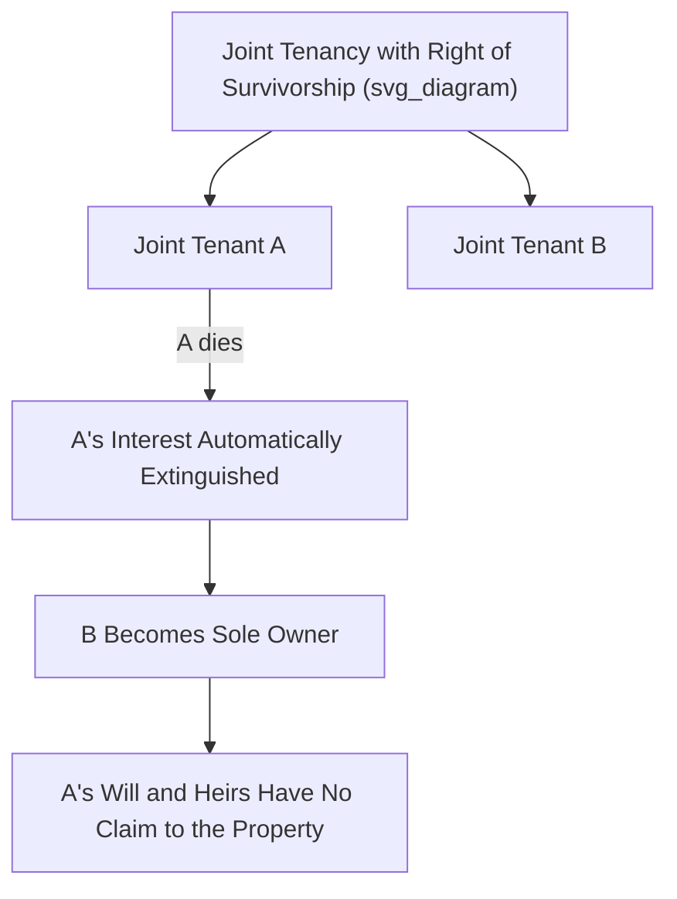
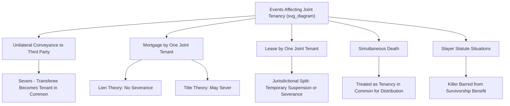

## Joint Tenancy and Right of Survivorship

### Overview

Joint tenancy is a form of concurrent ownership distinguished from tenancy in common by its defining feature: the **right of survivorship**, under which a deceased joint tenant's interest automatically passes to the surviving joint tenant(s), bypassing probate, wills, and intestate succession entirely. Historically favored at common law as promoting the consolidation of land ownership, joint tenancy has become the disfavored, non-default form of co-ownership in modern American law, requiring express language and strict adherence to formal creation requirements — the traditional **four unities** — to arise and to survive intact.

### The Right of Survivorship: The Defining Feature

**Mechanism**

Upon the death of one joint tenant, that tenant's interest **does not pass through their estate at all** — it is extinguished, and the surviving joint tenant(s) automatically hold the entire property, free of any claim by the deceased tenant's heirs, devisees, or creditors (subject to certain exceptions, such as liens properly attached and enforced before death in some jurisdictions).

**Practical Consequence**: A joint tenant **cannot devise their interest by will** — any attempted testamentary disposition of a joint tenancy interest is a legal nullity, because by the time the will would take effect (at the testator's death), the joint tenancy interest has already automatically passed to the survivor(s) by operation of law, extinguishing the interest the will purported to transfer.

### The Four Unities: Traditional Requirements for Creation

At common law, a valid joint tenancy required the simultaneous presence of **four unities** at the time of creation — a failure of any one unity meant the resulting co-ownership was, at most, a tenancy in common:

| Unity | Requirement |
| --- | --- |
| **Time** | All joint tenants must acquire their interests at the **same moment** |
| **Title** | All joint tenants must acquire their interests through the **same instrument** (the same deed or will) |
| **Interest** | All joint tenants must hold **equal, identical fractional shares** and identical types of estate (e.g., all fee simple, or all life estate — not a mix) |
| **Possession** | All joint tenants must have an **equal right to possess the whole** property (this unity, notably, is shared with tenancy in common) |

**Modern Statutory Relaxation**

Many U.S. jurisdictions have statutorily relaxed the strict four-unities requirement, particularly to permit a sole owner to create a joint tenancy with another person by direct conveyance to themselves and the other person as joint tenants (historically impossible at common law, which required a "straw man" intermediary conveyance to satisfy the unities of time and title, since a person cannot convey to themselves under strict common law logic).

### Creation of a Joint Tenancy: Express Language Required

**Modern Default Presumption Favors Tenancy in Common**

As discussed in the treatment of tenancy in common, virtually all U.S. states have reversed the historical common law preference and now presume a conveyance to multiple grantees creates a **tenancy in common** unless the granting instrument uses **clear and express language** indicating an intent to create a joint tenancy with right of survivorship.

**Typical Required Language**

- "To A and B as joint tenants with right of survivorship" — clearly sufficient in essentially all jurisdictions.
- "To A and B as joint tenants" (without the explicit survivorship phrase) — sufficiency varies by jurisdiction; many states require the explicit "with right of survivorship" language (or substantially equivalent wording) to avoid ambiguity, given the modern statutory presumption favoring tenancy in common.
- "To A and B" (with no further language) — creates a **tenancy in common** under the modern default rule in virtually all U.S. states.

**[Inference]** Because the precise statutory language required to unambiguously create a joint tenancy varies by state, and some states impose additional formal requirements (e.g., explicit recital of intent to avoid the tenancy-in-common presumption), specific drafting language should be verified against the controlling jurisdiction's statute and recording practice standards.

### Severance of Joint Tenancy

Because the right of survivorship is such a powerful and consequential feature, the common law developed detailed rules governing when an act by one joint tenant **severs** the joint tenancy — destroying the right of survivorship and converting the co-ownership into a tenancy in common (either entirely, or as to the severing tenant's share where three or more joint tenants exist).

**Unilateral Conveyance by One Joint Tenant**

A joint tenant may unilaterally convey (sell or gift) their interest to a third party **without the consent of the other joint tenants**. This conveyance:

- **Severs the unity of time and/or title** as between the transferee and the remaining original joint tenants, because the transferee acquires their interest at a different time and via a different instrument than the original joint tenants did.
- **Converts the transferee into a tenant in common** with the remaining original joint tenant(s).
- **Does not necessarily destroy joint tenancy among the remaining original joint tenants** where three or more joint tenants existed originally — if A, B, and C are joint tenants and A conveys to D, then D becomes a tenant in common as to a one-third share, while **B and C continue to hold a joint tenancy with each other** as to the remaining two-thirds share (since B and C's unities with each other remain intact).

**Mortgages and the Lien Theory versus Title Theory Split**

Whether a joint tenant's mortgage of their interest severs the joint tenancy depends on which theory of mortgages the jurisdiction follows:

- **Lien theory states** (the majority approach in the modern U.S.): A mortgage is treated merely as a **lien** securing the debt, not a transfer of title — therefore, a joint tenant mortgaging their interest generally does **not** sever the joint tenancy, since no unity is disturbed (title remains with the mortgagor joint tenant).
- **Title theory states** (a minority, historically more common approach): A mortgage is treated as an actual **transfer of legal title** to the mortgagee (subject to a right of redemption) — under this theory, a joint tenant's mortgage could sever the joint tenancy, since the unity of title as to that joint tenant's share would be disturbed.
- **Consequence of the majority lien-theory approach**: If a mortgaging joint tenant dies before the mortgage is paid off and before the joint tenancy is otherwise severed, the right of survivorship operates and the surviving joint tenant(s) typically take the property **free of the deceased joint tenant's mortgage** (since the mortgage was merely a lien on that now-extinguished interest) — a result that has generated significant litigation and lender concern, prompting some mortgage lenders to require joint tenants to sever the tenancy or take other protective measures as a condition of lending.

**Leases**

Jurisdictions are split on whether one joint tenant's lease of the property to a third party severs the joint tenancy; some treat a lease as only a temporary suspension of the joint tenancy (not a full severance) that resolves upon the lease's expiration, while others treat it as disturbing the unity of interest/possession sufficiently to sever, at least during the lease term.

**Simultaneous Death**

Under the **Uniform Simultaneous Death Act** (or similar state statutes), if joint tenants die simultaneously (or in circumstances where the order of death cannot be established), the property is generally treated **as if each joint tenant's share had been held as a tenant in common** — meaning each deceased joint tenant's proportional share passes through their own respective estate, rather than the survivorship mechanism operating unpredictably or arbitrarily.

**Murder of a Co-Tenant (Slayer Statutes)**

Under nearly universal **slayer statute** principles, a joint tenant who feloniously and intentionally kills another joint tenant is **barred from benefiting from the right of survivorship** — courts typically treat the situation as if the joint tenancy had been severed immediately before the killing, so the killer receives only their own original share (now as a tenant in common), while the victim's share passes through the victim's own estate rather than to the killer.

### Joint Tenancy versus Tenancy by the Entirety

Joint tenancy should be distinguished from **tenancy by the entirety**, a special form of co-ownership available only to married couples (and, in an increasing number of jurisdictions post-*Obergefell v. Hodges*, recognized without regard to the historical common law limitation to opposite-sex married couples) in a substantial minority of U.S. states:

| Feature | Joint Tenancy | Tenancy by the Entirety |
| --- | --- | --- |
| **Available to** | Any co-owners | Married couples only (jurisdiction-dependent) |
| **Right of survivorship** | Yes | Yes |
| **Unilateral severance by one co-tenant** | Generally permitted | Generally **not permitted** — requires both spouses' joint action, divorce, or death |
| **Creditor protection** | Individual joint tenant's share can generally be reached by that tenant's individual creditors | In many tenancy-by-the-entirety states, property is protected from the **individual** debts of just one spouse, since neither spouse alone holds a severable interest |

### Relevance to Easement Law

1. **Granting easements over joint tenancy property**: As with tenancy in common, a single joint tenant generally cannot unilaterally grant an easement binding the entire property without effectively severing their own interest and creating complications; typically, all joint tenants must join in the grant for a valid, permanently binding easement.
2. **Severance consequences for existing easements**: If a joint tenant's unilateral conveyance severs the joint tenancy (converting the transferee into a tenant in common with the others), any existing easement burdening or benefiting the property is unaffected by the severance itself (easements run with the land regardless of how the underlying co-ownership form changes), but the transaction may still require careful title review to confirm the easement's continued proper documentation against the newly mixed ownership structure.
3. **Practical estate planning interaction**: Because joint tenancy bypasses probate, land subject to long-term easements (e.g., conservation or utility easements) is sometimes deliberately held in joint tenancy specifically to simplify future transfer to a successor generation without probate delay, while the underlying easement obligations remain unaffected by the ownership transition.

### Key Points

- Joint tenancy's defining feature is the right of survivorship: a deceased joint tenant's interest automatically passes to the surviving joint tenant(s), bypassing wills, probate, and intestate succession.
- Common law required the four unities (time, title, interest, possession) for creation; modern statutes have relaxed some formal requirements but still generally require express survivorship language to overcome the default statutory presumption favoring tenancy in common.
- A joint tenant may unilaterally sever the joint tenancy by conveying their interest to a third party (converting the transferee into a tenant in common), while mortgages sever only in title-theory jurisdictions (a minority approach), not in the majority lien-theory jurisdictions.
- Simultaneous death and slayer statutes provide special rules preventing the ordinary survivorship mechanism from producing unjust or indeterminate results.
- Tenancy by the entirety, available only to married couples in a minority of states, provides survivorship similar to joint tenancy but with significantly stronger protection against unilateral severance and, in many states, protection from one spouse's individual creditors.

### Related Topics

- Tenancy in Common (Comparative Default Form of Co-Ownership)
- Tenancy by the Entirety and Marital Property Protections
- The Four Unities Doctrine and Its Modern Statutory Relaxation
- Lien Theory versus Title Theory of Mortgages
- The Uniform Simultaneous Death Act
- Slayer Statutes and Equitable Bars to Inheritance
- Probate Avoidance Strategies and Non-Probate Transfers
- Partition Actions as Applied to Joint Tenancy Property