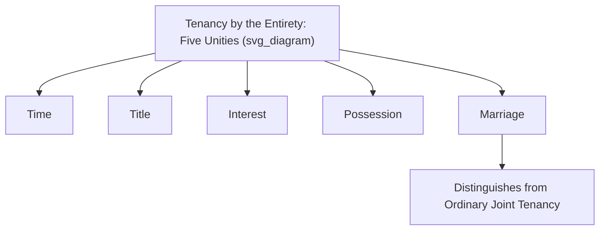
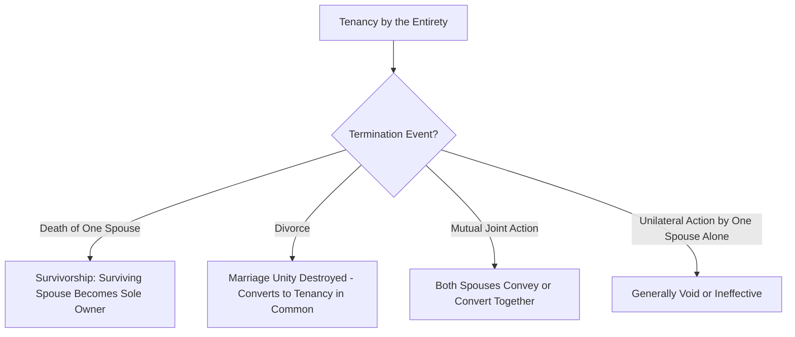

## Tenancy by the Entirety

### Overview

Tenancy by the entirety is a specialized form of concurrent ownership available exclusively to married couples in a minority (though substantial) number of U.S. states, combining the right of survivorship found in joint tenancy with a uniquely robust protection against unilateral severance by either spouse and, in most recognizing states, protection from the separate creditors of just one spouse. It is conceptually rooted in the common law fiction that a married couple constitutes a **single legal unit**, and it represents the strongest form of marital property protection available at common law, though it has been abolished, never adopted, or significantly modified in a majority of U.S. states.

### Historical and Conceptual Origin

**Unity of the Married Couple**

At common law, tenancy by the entirety rested on the fictional legal doctrine that husband and wife were a **single legal person** — reflected in the maxim that neither spouse held a separate, severable share, but rather each held the **whole** of an undivided, unified estate together. Historically, this fiction operated alongside (and was reinforced by) coverture doctrines that suppressed a married woman's independent legal capacity, meaning tenancy by the entirety's historical origins are entangled with now-repudiated common law disabilities imposed on married women.

**Modern Justification**

Modern retention of tenancy by the entirety in recognizing states is generally justified on different grounds than its historical origin: promoting marital financial unity, protecting family homes from the individual financial misconduct or debts of one spouse, and providing simplified survivorship transfer without probate — rather than the historical coverture-based rationale.

### The Five Unities (Traditional Formulation)

Tenancy by the entirety traditionally required the same **four unities** as joint tenancy (time, title, interest, possession), **plus a fifth unity**:

| Unity | Requirement |
| --- | --- |
| **Time** | Acquired at the same moment |
| **Title** | Acquired via the same instrument |
| **Interest** | Equal, identical shares and estate type |
| **Possession** | Equal right to possess the whole |
| **Marriage** (the fifth unity) | The co-owners must be **validly married** to each other at the time of acquisition |

**Modern Recognition Following Marriage Equality**

Following *Obergefell v. Hodges* (2015), which established a constitutional right to marriage regardless of the spouses' sex, tenancy by the entirety is now generally available to same-sex married couples on the same terms as opposite-sex married couples in every state that recognizes the tenancy, since the unity of marriage is satisfied by any legally valid marriage recognized under applicable law.

### Which States Recognize Tenancy by the Entirety

Tenancy by the entirety is recognized in roughly half of U.S. states (a number that has fluctuated slightly over time through legislative action), with substantial jurisdictional variation:

- Some recognizing states extend the tenancy to **both real and personal property** held by married couples.
- Some limit it to **real property only**.
- A subset of states (e.g., several extending strong protection) permit tenancy by the entirety to be presumed automatically for property conveyed to a married couple without express survivorship language, in contrast to the express-language requirement generally imposed for joint tenancy.

**[Inference]** Because the specific list of recognizing states, the scope (real property only versus real and personal property), and the applicable default presumption rules change periodically through state legislative action, the precise current status in any given state should be verified against that state's current statutes and case law rather than relied upon from general treatises alone.

### The Defining Feature: Protection Against Unilateral Severance

**No Unilateral Conveyance by One Spouse**

Unlike joint tenancy — where either co-tenant may unilaterally sever by conveying their interest to a third party — **neither spouse may unilaterally convey, mortgage, lease, or otherwise encumber the entirety property** without the **joinder (consent) of the other spouse**. A purported unilateral conveyance by one spouse alone is generally **void** (or at minimum ineffective to bind the entirety estate) as to the non-consenting spouse's interest, and in many jurisdictions ineffective altogether until both spouses join.

**Termination Events**

A tenancy by the entirety generally terminates only upon:

1. **Death of one spouse**: The right of survivorship operates, and the surviving spouse becomes sole owner (functionally identical in outcome to joint tenancy survivorship, but arrived at through a structurally different, indestructible-until-termination-event unity).
2. **Divorce**: Upon divorce, the marital unity is dissolved, and in most jurisdictions, the property **automatically converts to a tenancy in common** between the former spouses (absent a divorce decree or property settlement agreement providing otherwise) — since the fifth unity (marriage) no longer exists, the tenancy by the entirety cannot continue in its original form.
3. **Mutual agreement**: Both spouses may jointly agree to convey the property, sever the tenancy, or convert it to another form of ownership.

### Creditor Protection: The Most Distinctive Practical Feature

**Protection from Individual (Separate) Creditors**

In the majority of recognizing states, property held in tenancy by the entirety is **shielded from the claims of a creditor who holds a judgment against only one spouse individually** (as opposed to a joint debt owed by both spouses). Because neither spouse is deemed to hold a separate, severable interest that could be attached and sold by an individual creditor, the entirety property is effectively protected from that creditor's reach during the marriage (though the creditor may still attempt to collect from the debtor spouse's share upon a future divorce or the debtor spouse's survivorship interest arising after the non-debtor spouse's death, depending on the jurisdiction's specific rules).

**Federal Tax Liens: The *United States v. Craft* Exception**

A significant limitation to this protection arises from federal law: in *United States v. Craft* (2002), the U.S. Supreme Court held that a **federal tax lien** against one spouse individually **can attach** to that spouse's interest in tenancy by the entirety property, notwithstanding state law protections, because federal tax lien law looks to whether the debtor spouse holds "**property**" or "**rights to property**" under a federal standard, and the Court concluded that even the entirety interest constitutes sufficient "rights to property" to support attachment of a federal lien (leaving state-law entirety protection intact against private, non-federal creditors, but not against the IRS).

**Bankruptcy Treatment**

In federal bankruptcy proceedings, tenancy by the entirety property is generally **excluded from the bankruptcy estate** to the extent it would be exempt from the claims of the debtor spouse's individual creditors under applicable state law (per 11 U.S.C. § 522(b)(3)(B)), meaning the strength of this protection in bankruptcy directly depends on the scope of the underlying state law protection.

### Comparative Table: Joint Tenancy versus Tenancy by the Entirety

| Feature | Joint Tenancy | Tenancy by the Entirety |
| --- | --- | --- |
| **Eligible parties** | Any co-owners | Married couples only |
| **Unities required** | Four | Five (adds marriage) |
| **Right of survivorship** | Yes | Yes |
| **Unilateral severance by one co-tenant** | Permitted | Generally not permitted |
| **Individual creditor reach (state law)** | Generally reachable | Generally protected (majority of recognizing states) |
| **Federal tax lien reach** | Reachable | Reachable (per *Craft*) despite state law protection |
| **Effect of divorce** | N/A (not marriage-dependent) | Converts to tenancy in common |
| **Availability today** | All U.S. states | Roughly half of U.S. states |

### Relevance to Easement Law

1. **Joinder requirement for easements**: Because neither spouse may unilaterally encumber entirety property, granting an easement over land held in tenancy by the entirety **requires both spouses' joinder** in the granting instrument — a title examiner reviewing a proposed easement grant must confirm both spouses executed the instrument, or the easement risks being void or unenforceable as to the non-joining spouse's interest.
2. **Impact of divorce on existing easements**: An easement validly granted while property was held in tenancy by the entirety continues to run with the land notwithstanding a subsequent divorce and conversion to tenancy in common between the former spouses, since easements bind successive owners regardless of the underlying co-ownership form.
3. **Creditor and lien priority interaction**: Where a creditor's lien against one spouse individually cannot attach to entirety property (absent a federal tax lien), this can affect the practical enforceability of certain judgment-based encumbrances that might otherwise be relevant to a title search preceding an easement transaction, requiring careful confirmation of whether a recorded judgment lien actually attaches to entirety-held servient land.

### Key Points

- Tenancy by the entirety is available only to married couples in roughly half of U.S. states, combining joint tenancy's right of survivorship with a fifth "unity of marriage" requirement and a strong bar against unilateral severance by either spouse.
- The property generally cannot be unilaterally conveyed, mortgaged, or encumbered by one spouse alone; termination occurs primarily through death (triggering survivorship), divorce (converting to tenancy in common), or mutual spousal action.
- The most distinctive practical feature is protection of entirety property from the claims of a creditor holding a judgment against only one spouse individually, in the majority of recognizing states — though federal tax liens can still attach under *United States v. Craft*.
- Both spouses must join in granting an easement over entirety property, since neither spouse alone has the power to encumber the whole; an easement validly created during the marriage survives a subsequent divorce and conversion to tenancy in common.
- The precise scope of recognition (which states, real property only versus real and personal property, default presumption rules) varies and should be verified against current state law given ongoing legislative variation.

### Related Topics

- Joint Tenancy and Right of Survivorship (Comparative Analysis)
- Tenancy in Common (Default Form of Co-Ownership)
- Marital Property Regimes: Community Property versus Common Law/Separate Property States
- *United States v. Craft* and Federal Tax Lien Attachment to Entirety Property
- Bankruptcy Exemptions for Tenancy by the Entirety Property
- Divorce and the Conversion of Marital Concurrent Estates
- Joinder Requirements for Encumbering Marital Real Property
- *Obergefell v. Hodges* and Marriage Equality's Effect on Property Law