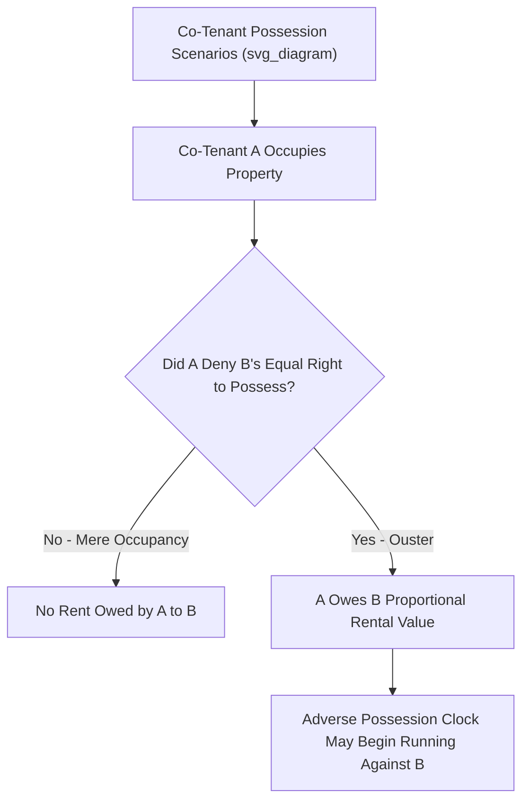

## Rights and Duties Among Cotenants

### Overview

Concurrent owners of land — whether tenants in common, joint tenants, or tenants by the entirety — share a distinctive web of mutual rights and duties that arise precisely because each co-tenant holds an undivided interest in the whole property alongside others with equal (or proportional) rights of possession. This body of doctrine addresses the practical friction inherent in shared ownership: who may possess and use the property, who must pay for its upkeep, how profits and losses are shared, and what remedies exist when one co-tenant's conduct harms another's interest. These rules apply substantially uniformly across the different forms of concurrent ownership (with some entirety-specific variations already addressed elsewhere), making this a unifying doctrinal framework for co-ownership generally.

### The Foundational Right: Possession of the Whole

**Equal Right to Occupy**

Every co-tenant, regardless of their proportional ownership share, has an equal right to **possess and use the entire property** — not merely a physically segregated portion proportional to their percentage interest. This follows directly from the unity of possession common to all forms of concurrent ownership.

**Mere Occupancy Is Not Wrongful**

A critical and frequently counterintuitive principle: **one co-tenant's occupancy of the property, standing alone, is not a wrong against the other co-tenants**, even if that co-tenant occupies the entire premises to the practical exclusion of the others' actual day-to-day use, because the occupying co-tenant is merely exercising a right they are equally entitled to exercise.

### Ouster: When Occupancy Becomes Wrongful

**Definition**

An **ouster** occurs when a co-tenant in possession **denies** another co-tenant's equal right to possess the property — through an explicit refusal of access, changing locks and denying entry, or other conduct manifesting an intent to exclude the other co-tenant(s) from their co-equal possessory rights.

**Consequences of Ouster**

1. **Rent liability**: Once ousted, the excluded co-tenant may recover from the ousting co-tenant their **proportional share of the reasonable rental value** of the property for the period of exclusion — a marked departure from the default rule that a co-tenant in sole possession owes no rent absent ouster.
2. **Adverse possession clock starts running**: An ouster is also generally the trigger that starts the statutory limitations period for **adverse possession** to run against the ousted co-tenant, since ouster supplies the "hostile" and "exclusive" elements otherwise difficult to establish between co-tenants who each independently have an equal right to possess.
3. **Partition as a remedy**: An ousted co-tenant retains the right to seek partition, though ouster may also support a separate accounting or ejectment-related claim depending on the jurisdiction's procedural framework.

### Accounting for Rents and Profits

**Rent Collected from Third Parties**

A co-tenant who leases all or part of the property to a **third-party tenant** must account to the other co-tenants for their **proportional share** of the rent actually received, since collecting the full economic benefit of the entire property (including shares the leasing co-tenant does not own) for exclusive personal retention would be inequitable.

**Profits from Use of the Land Itself**

A co-tenant who personally extracts profit from the land beyond ordinary occupancy — for example, by farming crops, extracting minerals, or harvesting timber — generally must account to the other co-tenants for their proportional share of the **net profits** from that exploitation, distinguishing this situation from mere personal residential occupancy (which, absent ouster, generates no accounting obligation).

**Waste**

Co-tenants owe each other a duty analogous to the life tenant/remainderman waste doctrine: no co-tenant may commit **voluntary waste** (affirmative destructive conduct) or, in many jurisdictions, unreasonably fail to prevent **permissive waste** (deterioration through neglect) to the shared property, since such conduct diminishes the value of the other co-tenants' undivided interests as well as their own.

### Contribution: Sharing the Costs of Ownership

**Necessary Expenses (Taxes, Mortgage, Necessary Repairs)**

A co-tenant who pays more than their proportional share of expenses **necessary to preserve the property** — property taxes, mortgage principal and interest, and necessary (not discretionary) repairs — generally has a right to seek **contribution** from the other co-tenants for their proportional share of those payments. This right can typically be enforced either through a direct action for contribution or, more commonly in practice, as an adjustment/offset in a partition proceeding.

**Discretionary Improvements**

By contrast, a co-tenant who makes **discretionary improvements** (renovations, additions, aesthetic upgrades not necessary to preserve the property) generally has **no independent right to contribution** from the other co-tenants for the cost of those improvements, since co-tenants should not be forced to subsidize improvements they did not request or agree to.

**Value Adjustment at Partition**

Even without a standalone contribution right, an improving co-tenant is typically entitled, at partition, to receive the **benefit of any increase in the property's value** attributable to their improvement (and correspondingly bears the risk of any decrease in value the improvement might have caused) — meaning the improving co-tenant's investment is not entirely unprotected, but is addressed through valuation at the point of division rather than through an immediate, independent debt owed by the other co-tenants.

| Expense Type | Right to Immediate Contribution? | Addressed at Partition? |
| --- | --- | --- |
| **Property taxes, mortgage payments** | Yes | Yes (as an offset/credit) |
| **Necessary repairs** | Yes (majority rule, though some require prior notice) | Yes |
| **Discretionary improvements** | No | Yes (credit for any resulting increase in value) |

### Adverse Possession and the Presumption of Permissive Possession

Because each co-tenant already has an independent legal right to possess the whole property, the ordinary elements of adverse possession (particularly "hostile" possession) are difficult to establish as between co-tenants. Courts generally apply a **presumption that a co-tenant in sole possession is possessing permissively**, on behalf of all co-tenants, **not adversely** — meaning the statutory limitations period for one co-tenant to adversely possess against another generally does not begin running merely from exclusive occupancy alone. An **ouster** (or, in some jurisdictions, sufficiently clear and unequivocal notice of a claim of exclusive, hostile ownership communicated to the other co-tenants) is typically required to overcome this presumption and start the adverse possession clock running against a non-possessing co-tenant.

### Fiduciary-Like and Good Faith Obligations

While co-tenants are not, strictly speaking, formal fiduciaries to one another in most jurisdictions, courts have imposed **quasi-fiduciary duties** in specific recurring situations:

- **Acquisition of outstanding claims or encumbrances**: If one co-tenant acquires an outstanding tax lien, mortgage, or adverse title claim affecting the co-owned property, many courts hold that co-tenant acquires that interest **partially for the benefit of the other co-tenants** (who may "buy in" by reimbursing their proportional share of the acquisition cost) rather than permitting the acquiring co-tenant to use the acquired interest to unfairly extinguish the others' ownership.
- **Family and inherited property contexts**: Courts have historically applied heightened scrutiny to co-tenant conduct among family members holding inherited "heirs' property," given the informal and often trust-based nature of such arrangements — a policy concern directly reflected in the Uniform Partition of Heirs Property Act's protective reforms discussed in the tenancy in common material.

### Relevance to Easement Law

1. **Easement use disputes among co-tenants**: Where an easement benefits or burdens co-owned land, disputes can arise over which co-tenant may use the easement, how associated maintenance costs are shared, and whether one co-tenant's exclusive use or blocking of an easement constitutes an ouster-like wrong against the others — the accounting and contribution principles discussed above extend naturally to easement-related expenses (e.g., shared driveway maintenance costs) among co-owners of the servient or dominant estate.
2. **Necessary versus discretionary easement-related expenditures**: Repairs to an easement roadway necessary for continued access may qualify as a "necessary expense" supporting a contribution claim among co-tenants of the dominant estate, whereas discretionary upgrades (e.g., paving a previously gravel easement road) would follow the discretionary-improvement rule, entitling the improving co-tenant only to a value-based credit at partition rather than immediate contribution.
3. **Partition and easement allocation**: As discussed in the tenancy in common material, partition of co-owned servient or dominant land requires careful allocation of easement rights and burdens among the newly separated parcels, and disputes over this allocation often implicate the same underlying good-faith and accounting principles governing co-tenant relations generally.

### Key Points

- Every co-tenant has an equal right to possess the entire property; mere occupancy by one co-tenant is not wrongful, but an ouster (denial of another co-tenant's equal right to possess) triggers rent liability and can start the adverse possession clock.
- A co-tenant collecting rent from third parties, or profiting from extraction/exploitation of the land itself, must account to the other co-tenants for their proportional share.
- Co-tenants may seek contribution for necessary expenses (taxes, mortgage payments, necessary repairs) but generally not for discretionary improvements, though improvements are typically credited at partition to the extent they increased the property's value.
- Courts presume a co-tenant's sole possession is permissive, not adverse, requiring an ouster or clear repudiation to start the adverse possession limitations period running against other co-tenants.
- Quasi-fiduciary duties arise in specific contexts, particularly regarding a co-tenant's acquisition of outstanding liens or claims against the property, and courts apply heightened protective scrutiny in family/heirs' property contexts.

### Related Topics

- Tenancy in Common and the Right to Partition
- Joint Tenancy and Right of Survivorship (Comparative Co-Ownership Form)
- Ouster and Its Role in Adverse Possession Between Co-Tenants
- The Uniform Partition of Heirs Property Act (UPHPA)
- Contribution and Reimbursement Claims in Property Law
- The Doctrine of Waste (Comparative Application to Life Tenants and Co-Tenants)
- Easement Maintenance Cost-Sharing Among Multiple Owners
- Adverse Possession: Elements and Special Rules in Co-Ownership Contexts