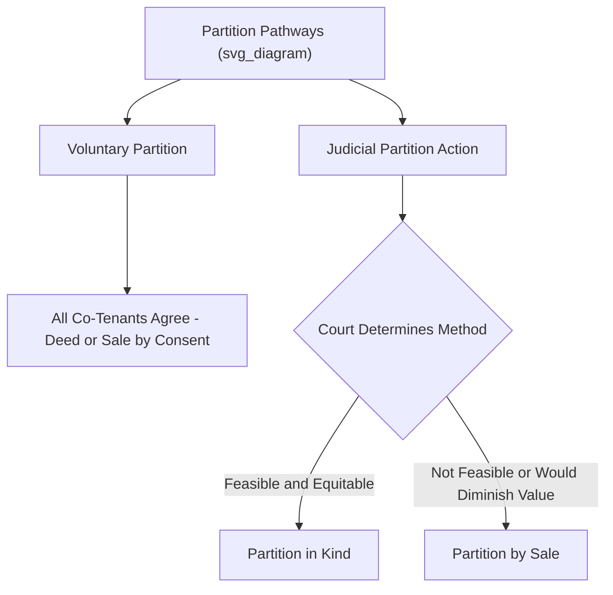
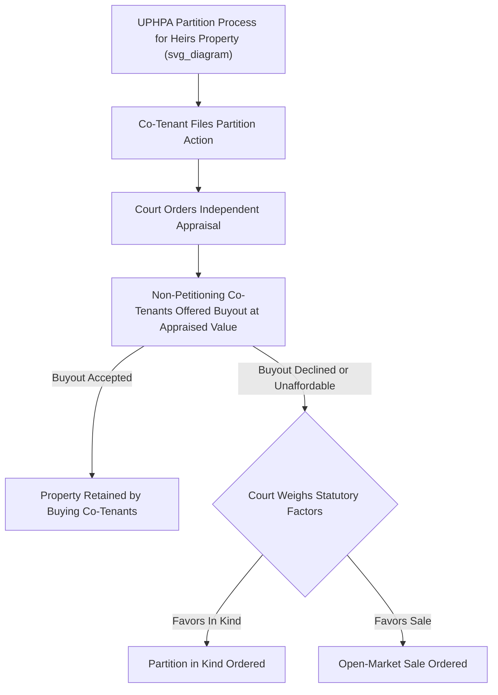

## Partition Actions

### Overview

Partition is the legal mechanism by which a co-tenant of jointly held property can compel the division or sale of that property, terminating the co-ownership relationship regardless of whether the other co-tenants consent. Rooted in the common law and equitable maxim that no one should be forced to remain in an undesired co-ownership relationship indefinitely, the right to partition is considered nearly absolute for tenants in common and joint tenants (though not for tenants by the entirety during an intact marriage). Partition law has undergone significant modern reform, particularly through the Uniform Partition of Heirs Property Act, in direct response to documented historical abuses in forced partition sales.

### The Nature and Availability of the Right to Partition

**A Nearly Absolute Right**

Any tenant in common or joint tenant generally has the right to demand partition **at any time**, for **any reason or no reason at all** — courts do not require the requesting co-tenant to show hardship, unfairness, or any particular justification, reflecting the strong common law policy against compelling indefinite co-ownership. This stands in contrast to tenancy by the entirety, where partition is generally unavailable during an intact marriage, since neither spouse may unilaterally act to divide or encumber the property.

**Voluntary versus Judicial Partition**

- **Voluntary partition**: Co-tenants may agree among themselves to divide the property (by mutual deed) or to sell it and divide the proceeds, without any court involvement, whenever all co-tenants consent.
- **Judicial partition**: Where co-tenants cannot agree, any co-tenant may file a partition action in court, which will adjudicate the appropriate method of division and oversee its execution.

### Partition in Kind

**Definition and Traditional Preference**

Partition in kind involves the **physical division** of the property into separate, distinct parcels, with each co-tenant receiving sole ownership of a parcel corresponding (as closely as practicable) to their proportional interest in the original undivided property. Historically, and still in many jurisdictions today, courts express a **preference for partition in kind** over partition by sale, reflecting a policy favoring the retention of property in specie (in its original physical form) where feasible, particularly to respect a co-tenant's desire to retain a family property or land with particular sentimental, agricultural, or historical significance.

**Feasibility Requirements**

Courts will order partition in kind only where:

1. The property can be **physically divided** in a manner that is practicable given its size, shape, and characteristics.
2. Division would **not substantially diminish the aggregate value** of the property compared to keeping it whole (e.g., dividing a large agricultural tract into smaller, still-viable parcels is often feasible; dividing a single-family house or a small urban commercial building generally is not).
3. The division can be accomplished **equitably**, accounting for differences in land quality, access, or improvements across the resulting parcels (sometimes requiring an "owelty" payment — a cash equalization payment from one co-tenant to another to offset any disparity in the value of the parcels received).

### Partition by Sale

**When Ordered**

Where partition in kind is impracticable, would substantially diminish the property's aggregate value, or would be significantly prejudicial to one or more co-tenants (e.g., a single-family residence, a small commercial lot, or land whose principal value depends on being kept as a unified whole), courts order **partition by sale**: the entire property is sold, typically to a third party, and the net proceeds are distributed among the co-tenants according to their proportional interests (after accounting adjustments for contribution, improvements, and any owed rents from ouster).

**Historical Concerns with Traditional Sale Procedures**

Traditional partition sale procedures in many jurisdictions historically relied on **public auction** processes (often conducted at a courthouse steps or through minimal public notice), which frequently produced sale prices **substantially below fair market value**, disproportionately harming co-tenants — particularly in cases involving **heirs' property** (land inherited by multiple family members, often without formal estate planning), where investors could acquire a minority interest and then force a low-value auction sale of the entire property, displacing family owners who had occupied and maintained the land for generations. This dynamic has been particularly well documented as a driver of Black land loss in the American South during the 20th century.

### The Uniform Partition of Heirs Property Act (UPHPA)

In direct response to these documented harms, the Uniform Law Commission promulgated the **UPHPA** (approved in 2010, with subsequent adoption spreading across a substantial and growing number of U.S. states), introducing significant procedural protections applicable specifically to qualifying "heirs' property" (generally defined as tenancy-in-common property where there is no agreement binding all co-tenants governing partition, and where at least a threshold percentage of the property is held by relatives or the property has been in the family for a defined period, with the exact statutory definition varying somewhat by state).

**Key UPHPA Reforms**

1. **Mandatory appraisal**: The court must order an independent appraisal to determine the property's fair market value before any partition proceeds.
2. **Right of first refusal (buyout option)**: Before ordering a sale, the court must give the **non-petitioning co-tenants** the opportunity to buy out the interest of the co-tenant(s) seeking partition, at the court-determined fair market value, allowing family or long-term co-owners to retain the property rather than losing it to a forced sale.
3. **Statutory factors favoring partition in kind**: The UPHPA directs courts to weigh specific factors — including whether the property has sentimental value, whether it has been in the family for a lengthy period, and the collective interests of the co-tenants — before ordering partition by sale rather than partition in kind, creating a stronger and more structured preference than the traditional common law approach.
4. **Open-market sale requirement**: If partition by sale is ultimately ordered, the UPHPA requires the sale to occur through an **open-market process** (broker-listed sale) rather than the traditional courthouse-steps auction, unless the court determines an auction sale would likely result in a higher price — directly targeting the below-market-value problem associated with traditional auction procedures.

**[Inference]** Because UPHPA adoption, the precise definition of qualifying "heirs' property," and the specific procedural details vary by state (and adoption has continued to spread since the Act's promulgation), the applicability and exact mechanics of these protections in any given case should be verified against that state's current statute.

### Accounting and Adjustments in Partition Proceedings

Partition proceedings typically resolve not only the physical or monetary division of the property itself but also **outstanding financial claims among the co-tenants**, incorporating the contribution and accounting principles discussed in the broader co-tenancy rights and duties material:

- **Credits for necessary expenses paid**: A co-tenant who paid more than their proportional share of taxes, mortgage payments, or necessary repairs typically receives a credit or offset in the final partition distribution.
- **Credits for improvements**: A co-tenant who made discretionary improvements typically receives credit only for the resulting **increase in value**, not the raw cost of the improvement.
- **Debits for ouster-related rent**: A co-tenant who wrongfully ousted another may be required to pay that co-tenant's proportional share of the reasonable rental value for the period of exclusion, offsetting that co-tenant's share of the sale proceeds or the value of the parcel received.
- **Owelty payments**: In partition in kind, a cash payment from one co-tenant to another to equalize otherwise unequal parcel values.

### Partition and Easements

Partition intersects directly with easement law in several significant ways:

1. **Creating implied easements upon division**: Where previously unified land served by an internal access road, driveway, or utility connection is partitioned in kind into separate parcels, courts frequently must determine whether an **implied easement** (by prior use/quasi-easement, or by necessity if a resulting parcel becomes landlocked) arises to preserve continued access or utility service across the newly created parcel boundaries — this is one of the most common practical settings in which implied easement doctrine is actually litigated.
2. **Allocating existing easement burdens and benefits**: If the original co-owned property was already subject to an easement (e.g., a utility easement or a right of way benefiting a neighboring property), the partition court must determine how that easement's burden (if the co-owned land was the servient estate) or benefit (if it was the dominant estate) is allocated among the newly divided parcels — sometimes requiring the court to specify which of several new parcels remains subject to or entitled to the pre-existing easement.
3. **Necessity created by the partition itself**: A partition in kind that results in one new parcel having no access to a public road (because the original parcel's only road frontage is allocated to a different resulting parcel) is one of the paradigm fact patterns supporting an **easement by necessity**, since the necessity was created by an act of division from common ownership — squarely fitting the traditional doctrinal requirement that easements by necessity arise from a severance of previously unified title.

### Key Points

- Any tenant in common or joint tenant has a nearly absolute right to demand partition at any time, without needing to show cause, though tenancy by the entirety generally cannot be unilaterally partitioned during an intact marriage.
- Courts traditionally prefer partition in kind (physical division) where feasible and not substantially value-diminishing, resorting to partition by sale (with proceeds divided proportionally) only when physical division is impracticable or unfair.
- Traditional partition sale procedures (often courthouse-steps auctions) historically produced below-market sale prices, disproportionately harming family and heirs' property owners, prompting the Uniform Partition of Heirs Property Act's reforms.
- The UPHPA introduces mandatory appraisal, a co-tenant buyout right of first refusal, statutory factors favoring partition in kind, and an open-market sale requirement for qualifying heirs' property in adopting states.
- Partition proceedings resolve accounting issues (contribution credits, improvement value credits, ouster-related rent debits, and owelty payments) alongside the physical or monetary division, and partition in kind is a frequent trigger for implied easements (by prior use or by necessity) where the division disrupts previously unified access or utility arrangements.

### Related Topics

- Tenancy in Common and the Right to Partition
- The Uniform Partition of Heirs Property Act (UPHPA) in Depth
- Rights and Duties Among Cotenants: Accounting, Contribution, and Ouster
- Easements by Necessity Arising from Severance of Common Ownership
- Implied Easements from Prior Use (Quasi-Easements) in the Partition Context
- Heirs' Property and Historical Black Land Loss in the American South
- Owelty Payments and Equitable Adjustment in Partition in Kind
- Joint Tenancy, Tenancy by the Entirety, and Their Divergent Partition Availability