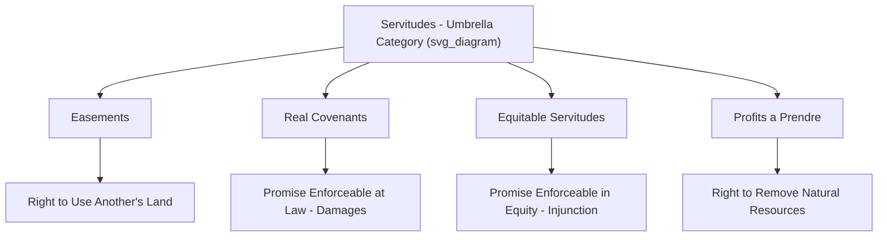
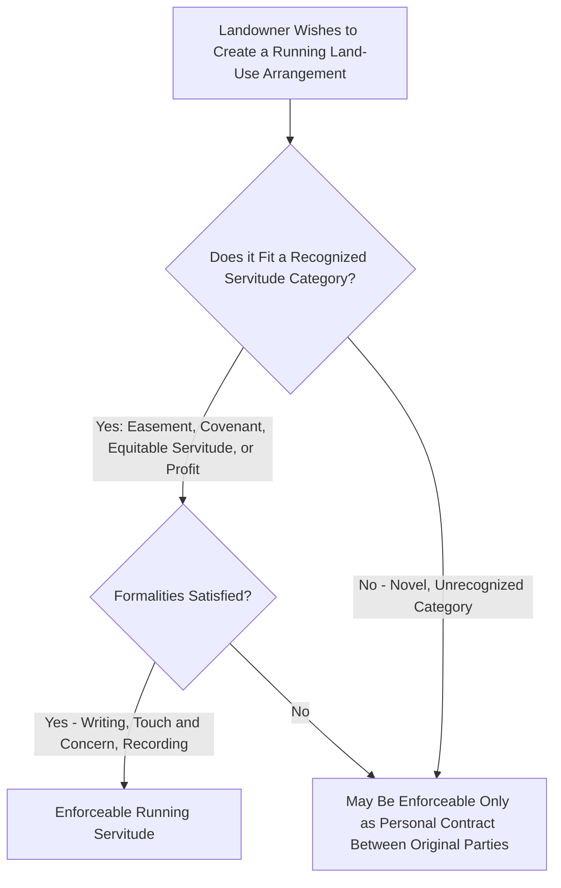

## Definition and Purpose of Servitudes

### Overview

A servitude is a legal device that allows one parcel of land, or a specific person, to hold enforceable rights concerning the use of another parcel of land, without transferring possession or ownership of that other parcel. Servitudes are the umbrella category encompassing easements, real covenants, and equitable servitudes — the primary mechanisms by which private parties create durable, running land-use arrangements that bind successive owners. Understanding servitudes as a unified conceptual category (rather than as isolated, unrelated doctrines) is essential because modern property law, particularly the Restatement (Third) of Property: Servitudes, has increasingly moved toward analyzing easements, covenants, and equitable servitudes under a single integrated framework, even though historical doctrine developed them along separate, often inconsistent paths.

### Defining the Servitude

**Core Definition**

A servitude is a **legal device that creates a right or obligation that runs with land or an interest in land**, meaning the right or obligation is not merely personal to the original parties who created it but is capable of binding or benefiting subsequent owners of the affected property. This "running" quality is the single most important defining feature distinguishing a servitude from an ordinary personal contract.

**The Restatement (Third) of Property: Servitudes Framework**

The American Law Institute's Restatement (Third) of Property: Servitudes (2000) represents a significant modern effort to unify and rationalize servitude law, defining a servitude broadly to include:

- **Easements**: The right to use another's land for a specific purpose.
- **Real covenants**: Promises concerning land use, enforceable at law (through damages) against successive owners.
- **Equitable servitudes**: Promises concerning land use, enforceable in equity (through injunction) against successive owners.
- **Profits (profits à prendre)**: The right to enter another's land and remove a natural resource.

The Restatement's approach substantially collapses the traditionally separate, doctrinally inconsistent rules governing real covenants versus equitable servitudes into a more unified analytical framework, reflecting a broader trend (not yet universally adopted by every state) toward simplifying servitude doctrine.

### The Two Estates: Dominant and Servient

Most servitudes (specifically, those classified as "appurtenant" rather than "in gross") involve two distinct parcels of land, related to each other through the servitude:

- **Dominant estate (or dominant tenement)**: The parcel that **benefits** from the servitude.
- **Servient estate (or servient tenement)**: The parcel that is **burdened** by the servitude.

**Example**: If Parcel A holds a right of way easement to cross Parcel B for access to a public road, Parcel A is the dominant estate (it benefits from the right of access), and Parcel B is the servient estate (it bears the burden of allowing the crossing).

Not all servitudes require two estates, however — a servitude can instead benefit a specific **person** rather than a piece of land (an "in gross" servitude, discussed further below and elsewhere in easement-specific material), meaning only a servient estate exists, with no corresponding dominant parcel.

### The Purpose and Function of Servitudes: Why the Law Permits Them

**Enabling Efficient Land Use Coordination**

Servitudes exist to solve a fundamental problem: land parcels frequently have interdependent uses that cannot be efficiently achieved if each parcel's owner is limited strictly to using only their own land in isolation. Servitudes allow neighbors and landowners to **privately negotiate and durably allocate** rights and burdens that maximize the collective value and usability of multiple parcels, without requiring a merger of ownership or continuous case-by-case renegotiation.

**Common Functional Categories**

1. **Access and passage**: Rights of way allowing landlocked or inconveniently situated parcels to reach public roads or other resources.
2. **Utility and infrastructure**: Rights allowing utility companies, pipelines, or shared infrastructure (wells, drainage systems) to cross private land.
3. **Support and lateral/subjacent rights**: Rights ensuring structures or land itself receive necessary physical support from adjoining or underlying land.
4. **Conservation and land-use control**: Restrictions preserving open space, agricultural use, historical character, or environmental features, increasingly formalized through conservation easements.
5. **Common scheme development**: Coordinated restrictions across a subdivision or planned community (setback requirements, architectural controls, use restrictions) that preserve the character and value of an entire development, typically implemented through real covenants or equitable servitudes rather than easements.
6. **Profit extraction**: Rights to enter and remove natural resources (timber, minerals, game) from another's land.

### Why the Law Requires Formalities and Limits: The Numerus Clausus Tension

**Balancing Private Ordering Against Marketability**

While servitudes serve important land-use coordination functions, the law does not permit landowners **unlimited freedom** to create any conceivable type of running interest, because excessive proliferation of idiosyncratic, hard-to-discover servitudes would undermine the fundamental policy of **marketable title** — the ability of future purchasers to reasonably investigate and understand what burdens and benefits attach to a parcel before acquiring it.

This tension produces several structural limitations woven throughout servitude law (elaborated in dedicated material on individual doctrines):

- **Formality requirements**: Most servitudes must satisfy the Statute of Frauds (writing requirement), subject to specific recognized exceptions (implication, necessity, prescription, estoppel).
- **Touch and concern requirement** (traditional covenant doctrine): A covenant must relate sufficiently to the use or enjoyment of the land itself, not merely create a personal, collateral obligation, to qualify as a running servitude rather than a purely personal contract.
- **Recording requirements**: Servitudes affecting land are generally required to be recorded in the public land records to bind subsequent bona fide purchasers without actual notice.
- **Numerus clausus tendencies**: Even within the flexible common law tradition, courts have historically limited the *types* of servitudes they will recognize as running with land, refusing to enforce entirely novel categories of burdens that do not fit within recognized doctrinal molds (easement, real covenant, equitable servitude, profit) — a policy echoing, though less rigidly than, the civil law's more formal numerus clausus principle for real rights.

### Servitudes versus Personal Contractual Arrangements

**The Central Distinguishing Question**

The most fundamental question in servitude law is whether an arrangement is a true **servitude** (running with the land, binding and benefiting successive owners automatically) or merely a **personal contract or license** (binding only the original parties, and not automatically transferring to successors).

**Consequences of the Distinction**

| Feature | Servitude (Running with Land) | Personal Contract/License |
| --- | --- | --- |
| **Binds successor owners automatically** | Yes | No — successors are not bound absent separate agreement |
| **Benefits successor owners automatically** | Yes | No |
| **Requires privity between enforcing parties** | Generally not required for equitable servitudes; historically required (horizontal and vertical privity) for real covenants at law | N/A — enforced only between original contracting parties |
| **Revocability** | Generally irrevocable absent specified termination event | Often freely revocable (particularly a bare license) |
| **Statute of Frauds** | Generally applies | May or may not apply, depending on contract subject matter |

### Historical Development Note

As covered in the broader historical development material, the servitude concept as a coherent category is itself a relatively modern academic and doctrinal synthesis — historically, easements, real covenants, and equitable servitudes developed as **separate, often doctrinally inconsistent bodies of law**, with real covenants emerging from common law contract and property principles (requiring strict privity), and equitable servitudes emerging from equity's intervention in *Tulk v. Moxhay* (1848) specifically to overcome the common law's privity limitations. The Restatement (Third)'s unified "servitudes" framework represents a modern scholarly and judicial effort to rationalize this historically fragmented doctrinal landscape, though many jurisdictions still apply the traditional separate doctrines rather than fully adopting the Restatement's unified approach.

**[Inference]** The degree to which any specific jurisdiction has formally adopted the Restatement (Third) of Property: Servitudes' unified framework, as opposed to continuing to apply traditional separate real covenant and equitable servitude doctrines, varies significantly by state and should be verified against that jurisdiction's current case law.

### Key Points

- A servitude is a legal device creating a right or obligation that runs with land, binding or benefiting successive owners rather than merely the original contracting parties.
- The Restatement (Third) of Property: Servitudes unifies easements, real covenants, equitable servitudes, and profits under a single conceptual framework, though many jurisdictions still apply the traditional separate doctrines.
- Most servitudes involve a dominant estate (benefited) and a servient estate (burdened), though in-gross servitudes benefit a specific person rather than a dominant parcel.
- Servitudes serve essential land-use coordination functions (access, utilities, support, conservation, common scheme development, resource extraction) that would be inefficient or impossible to achieve through isolated, unlinked land ownership alone.
- The law balances private ordering freedom against marketable title concerns through formality requirements, the touch-and-concern doctrine, recording requirements, and numerus-clausus-like limits on recognized servitude categories.

### Related Topics

- Easements: Definition, Classification, and Creation
- Real Covenants and the Requirement of Privity
- Equitable Servitudes and *Tulk v. Moxhay*
- The Restatement (Third) of Property: Servitudes
- Touch and Concern Doctrine in Covenant Law
- Licenses versus Easements: The Personal/Real Property Distinction
- Common Law and Civil Law Traditions in Land Law (Comparative Numerus Clausus)
- Conservation Easements and Modern Land-Use Coordination