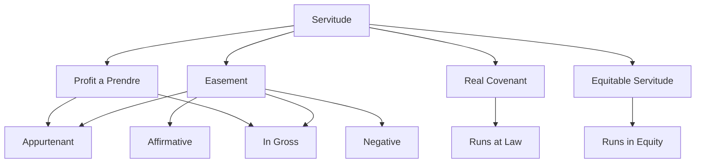

## Taxonomy of Servitudes

### Overview

A servitude is a legal device that burdens one parcel of land (or binds one person) for the benefit of another parcel or person, running with the land or the benefited party regardless of changes in ownership. The taxonomy of servitudes organizes these burdens along several intersecting axes: the nature of the benefit conferred, the mode of creation, the duration, and whether the burden is affirmative or negative. Common law and modern codifications (including the Restatement (Third) of Property: Servitudes) classify servitudes primarily into **easements**, **profits à prendre**, **real covenants**, and **equitable servitudes**, with licenses often discussed as a non-servitude comparator.

**Key Points**

- A servitude "runs with the land," meaning it binds successive owners, not just the original parties.
- The Restatement (Third) of Property: Servitudes (2000) consolidated easements, profits, and covenants into a unified conceptual framework, replacing older fragmented common-law categories.
- The primary distinguishing axes are: (1) affirmative vs. negative, (2) appurtenant vs. in gross, (3) legal vs. equitable enforcement, and (4) express vs. implied creation.

---

### Primary Classification by Legal Character

#### 1. Easements

An easement is a nonpossessory right to use another's land (the "servient estate") for a specific purpose, without the right to take anything from the soil.

- **Affirmative easement**: Grants the holder the right to do something on the servient land (e.g., a right-of-way to cross a neighbor's property).
- **Negative easement**: Restricts the servient owner from doing something otherwise lawful on their own land (e.g., an easement of light, air, or view). Negative easements were historically limited at common law to four categories: light, air, support, and flow of an artificial stream. [Inference] Modern jurisdictions have expanded recognized negative easements primarily through conservation and solar easement statutes, since courts remain reluctant to recognize novel negative easements outside statutory schemes.

#### 2. Profits à Prendre

A profit is the right to enter another's land and remove some resource — timber, minerals, oil, gas, game, or crops. Profits are structurally identical to easements in creation, transfer, and termination rules, differing only in that they authorize a physical taking. Under the Restatement (Third), profits are treated as a subcategory of easements rather than a wholly separate doctrine.

#### 3. Real Covenants

A real covenant is a promise concerning the use of land that is enforceable at **law** (typically through damages) against successors in interest, provided specific technical requirements are met (writing, intent, touch and concern, notice, and horizontal/vertical privity, depending on jurisdiction).

#### 4. Equitable Servitudes

An equitable servitude is a promise concerning land use enforceable in **equity** (typically through injunction) against successors who take with notice, without the rigid privity requirements demanded of real covenants. Equitable servitudes emerged from *Tulk v. Moxhay* (1848) to permit enforcement of restrictive covenants even absent privity of estate.

**Comparison Table: Core Distinctions**

| Feature | Easement | Profit | Real Covenant | Equitable Servitude |
| --- | --- | --- | --- | --- |
| Nature of right | Use land | Use + remove resource | Promise re: use | Promise re: use |
| Typical remedy | Injunction/damages | Injunction/damages | Damages | Injunction |
| Privity required | No | No | Often yes | No (notice-based) |
| Can be negative | Yes (limited categories) | N/A | Yes | Yes |
| Governing regime | Property law | Property law | Contract + property | Equity |

---

### Secondary Classification: Appurtenant vs. In Gross

#### Easements/Profits Appurtenant

Attached to and benefits a specific parcel of land (the "dominant estate"). The benefit passes automatically with transfers of the dominant estate, even if not mentioned in the deed, under the doctrine that "the benefit of an appurtenant easement runs with the dominant tenement."

- Requires two parcels: dominant (benefited) and servient (burdened).
- Presumed favored by courts when the language creating the servitude is ambiguous, since courts disfavor easements in gross when a plausible dominant estate exists.

#### Easements/Profits In Gross

Benefits a person or entity personally, without reference to ownership of any specific parcel (e.g., a utility company's right to run power lines).

- Historically, easements in gross were considered non-transferable at common law. Modern law, especially the Restatement (Third) §5.8, generally permits transfer and even divisibility of commercial easements in gross (e.g., utility, pipeline, and railroad easements), while personal/recreational easements in gross remain more restricted. [Unverified] Whether a particular non-commercial easement in gross is assignable often depends on the parties' intent and jurisdiction-specific statutes, so no universal rule can be stated.

---

### Classification by Mode of Creation

1. **Express easements**: Created by explicit written grant or reservation, subject to the Statute of Frauds.
2. **Implied easements**:
   - *Easement by necessity*: Arises when a parcel is landlocked following severance from a larger tract; requires strict necessity at the time of severance in most jurisdictions.
   - *Easement implied from prior use (quasi-easement)*: Arises when a formerly unified parcel is severed, and a use that was apparent, continuous, and reasonably necessary existed prior to severance.
3. **Prescriptive easements**: Acquired through use that is open, notorious, continuous, and adverse (hostile) for the statutory period, analogous to adverse possession but conferring only a use-right, not title.
4. **Easement by estoppel**: Arises where a servient owner permits use and the licensee reasonably and detrimentally relies on the continuation of that use.
5. **Statutory easements**: Created directly by legislation (e.g., conservation easements under the Uniform Conservation Easement Act, solar easements, or utility easements under state public utility codes).

**Example**

> Parcel A and Parcel B were once a single tract. Before subdivision, a driveway on what became Parcel A served both halves. Upon severance, if the use was apparent and continuous, courts may imply an easement by prior use benefiting Parcel B (dominant) and burdening Parcel A (servient), even absent an express grant.

---

### Classification by Duration

- **Perpetual (fee) servitudes**: No fixed termination; run indefinitely absent merger, abandonment, or other termination event.
- **Term/temporary servitudes**: Expire on a fixed date, condition subsequent, or the occurrence of a specified event.
- **Determinable servitudes**: Automatically terminate upon a stated condition (e.g., "easement terminates upon cessation of use as a public road").

---

### Termination Taxonomy (Cross-Cutting)

Servitudes terminate through several recognized mechanisms, often tested comparatively:

- **Merger**: Dominant and servient estates come under common ownership.
- **Release**: Express written relinquishment by the dominant owner.
- **Abandonment**: Requires both non-use and affirmative conduct evidencing intent to abandon; mere non-use is generally insufficient. [Inference] Courts are typically stricter about finding abandonment than release, since abandonment extinguishes a property right without the formality the Statute of Frauds would otherwise demand for its creation.
- **Prescription (extinguishment)**: Servient owner adversely and successfully blocks the easement for the statutory period.
- **Estoppel**: Servient owner reasonably relies on dominant owner's conduct suggesting non-enforcement.
- **Condemnation**: Government exercise of eminent domain over the servient estate.
- **Expiration**: Built-in term or condition lapses.

---

### Illustrative Diagram: Dominant/Servient Relationship (svg_diagram)

<svg xmlns="http://www.w3.org/2000/svg" viewBox="0 0 500 220">
<text x="250" y="20" font-size="14" text-anchor="middle" font-weight="bold">Dominant/Servient Estate Relationship (svg_diagram)</text>
<rect x="40" y="60" width="160" height="100" fill="#dbeafe" stroke="#1e3a8a" stroke-width="2" />
<text x="120" y="115" text-anchor="middle" font-size="13">Parcel A</text>
<text x="120" y="135" text-anchor="middle" font-size="11">(Servient Estate)</text>
<rect x="300" y="60" width="160" height="100" fill="#dcfce7" stroke="#166534" stroke-width="2" />
<text x="380" y="115" text-anchor="middle" font-size="13">Parcel B</text>
<text x="380" y="135" text-anchor="middle" font-size="11">(Dominant Estate)</text>
<line x1="200" y1="110" x2="300" y2="110" stroke="#000" stroke-width="2" marker-end="url(#arrow)" />
<text x="250" y="100" text-anchor="middle" font-size="11">Easement</text>
<text x="250" y="195" text-anchor="middle" font-size="11" font-style="italic">Burden runs with Parcel A; benefit runs with Parcel B</text>
</svg>

---

### Distinguishing Servitudes from Non-Servitude Interests

- **License**: A revocable, personal permission to use land that creates no interest in property and does not run with the land (absent estoppel). The touchstone distinction from an easement is *revocability*.
- **Lease/Possessory interest**: Confers exclusive possession, whereas a servitude confers only a limited use-right without ousting the possessory owner.
- **Fee simple determinable/condition subsequent**: Restricts *title* itself rather than imposing a use-burden on an otherwise unrestricted title.

---

### Related Topics

- Creation of Easements: Express Grant, Implication, Prescription, and Necessity
- Restatement (Third) of Property: Servitudes — Unified Doctrinal Framework
- Termination of Servitudes: Merger, Abandonment, and Estoppel
- Real Covenants vs. Equitable Servitudes: Privity and Touch-and-Concern Analysis
- Conservation Easements and Statutory Servitude Regimes
- Scope and Apportionment of Easements (Subdivision of Dominant Estate)