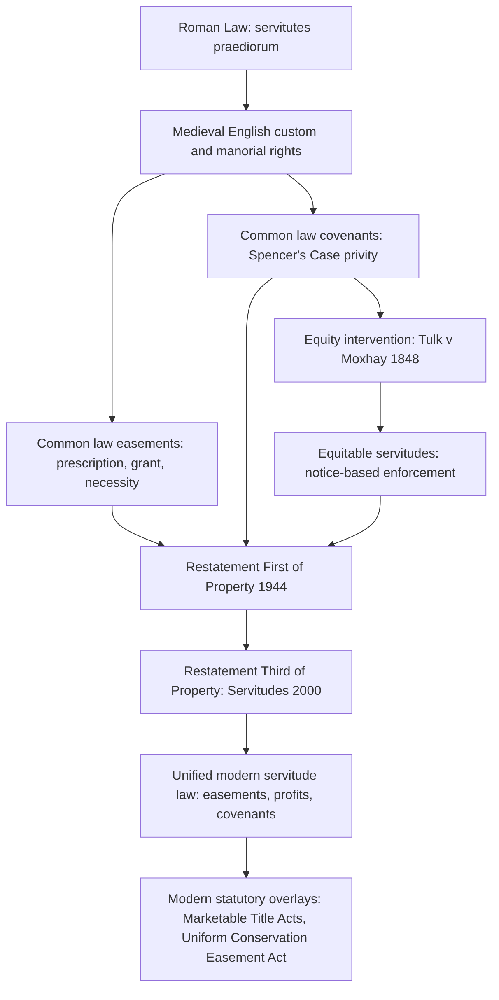

## Historical Evolution of Servitude Doctrine

### Overview

A servitude is a legal device that attaches rights or restrictions to land itself rather than to a particular owner, so that the burden or benefit runs with the land to successive owners. The modern law of easements, real covenants, equitable servitudes, and profits Ă prendre in common law jurisdictions traces back through Roman law, English feudal and equity practice, and American reception and reform. Understanding this lineage explains many doctrinal quirks that otherwise seem arbitrary, such as why some servitudes require "privity of estate" and others do not, or why courts distinguish "running with the land" from personal contractual obligations.

### Roman Law Origins

**Praedial servitudes (servitutes praediorum)**

Roman law is the taproot of servitude doctrine. Roman jurists classified *servitutes* as either personal (*servitutes personarum*, such as usufruct) or praedial/land-based (*servitutes praediorum*). Praedial servitudes required two tracts of land: a *praedium dominans* (dominant tenement) benefiting from the right, and a *praedium serviens* (servient tenement) burdened by it.

- **Rural servitudes (*servitutes praediorum rusticorum*)**: rights of way (*iter*, *actus*, *via*), rights to draw water (*aquaeductus*), rights to pasture (*pascendi*).
- **Urban servitudes (*servitutes praediorum urbanorum*)**: rights of support (*oneris ferendi*), rights to project a structure over neighboring land (*proiciendi*), rights to light and view (*luminum*, *prospectus*), and rights against obstruction of light.

**Key Points**

- Roman servitudes were created by formal modes such as *mancipatio*, *in iure cessio*, or later by simple agreement (*pactiones et stipulationes*) under Justinian's law.
- Servitudes had to satisfy *utilitas* (genuine utility to the dominant land, not merely personal convenience) — a principle that survives today in the common law requirement that an easement "touch and concern" the dominant estate.
- The maxim *servitus servitutis esse non potest* ("a servitude cannot be the object of a servitude") barred sub-servitudes, reflecting Roman insistence that these rights be tied directly to land.
- Servitudes were construed narrowly (*servitutes praediorum arto modo constitui debent*) — a canon of construction still cited by common law courts.

This Roman framework, transmitted through the *Corpus Juris Civilis* and medieval glossators, later shaped both continental civil codes and, indirectly through canon law and Bracton, English common law.

### Anglo-Saxon and Early Feudal England

Before the Norman Conquest, land-use arrangements among Anglo-Saxon communities were largely informal, governed by custom rather than a developed law of incorporeal rights. Feudal tenure after 1066 organized land through a hierarchy of estates rather than discrete property rights attached to parcels, which delayed the emergence of a distinct servitude doctrine in England compared to the Continent.

**Early recognized incidents**

- **Rights of common**: common pasture, common of estovers (wood-gathering), common of piscary (fishing), tied to manorial structures and villein tenure.
- **Rights of way**: recognized informally as appurtenant to messuages and closes.
- These rights functioned similarly to servitudes but were embedded in feudal and manorial custom rather than a generalized doctrine of "easement."

### Emergence of the Common Law Easement (12th–17th Centuries)

**From custom to writ**

The action of *quod permittat prosternere* and later trespass and nuisance writs allowed dominant owners to protect rights of way and watercourses. By the 13th century, treatises such as Bracton's *De Legibus et Consuetudinibus Angliae* began importing Roman servitude vocabulary and classification into English legal writing, even though English courts developed their own procedural forms.

**Prescription**

The doctrine of prescription — acquiring an easement by long, uninterrupted, open use — developed from the Roman concept of *usucapio* and *longi temporis praescriptio*, filtered through canon law limitation periods. English law crystallized this into:

- **Prescription at common law**: requiring use "since time immemorial" (fixed by statute as 1189, the start of the reign of Richard I).
- **Lost modern grant**: a legal fiction presuming a grant had once existed but was lost, developed by courts to avoid the practical impossibility of proving immemorial use.
- **Prescription Act 1832 (England)**: introduced statutory periods (20 years for most easements, 40 years for a stronger right, 30/60 years for light) as an alternative to common law prescription and lost modern grant, though it operated as a patchwork "gloss" on existing doctrine rather than a clean replacement.

**The essential characteristics doctrine**

By the 19th century (crystallized in *Re Ellenborough Park* [1956] in England, but reflecting centuries of prior case law), four characteristics were understood as necessary for an easement:

1. There must be a dominant and a servient tenement.
2. The easement must accommodate (benefit) the dominant tenement.
3. Dominant and servient owners must be different persons.
4. The right must be capable of forming the subject matter of a grant (sufficiently definite, not amounting to exclusive possession, and not requiring the servient owner to spend money).

### Divergence: Easements at Law vs. Covenants in Equity

A crucial historical fork occurred over how English law treated *negative* and *affirmative* promises regarding land use that were not easements (e.g., "I promise not to build above two stories" or "I promise to maintain this fence").

**Common law covenants and privity**

At common law, a covenant's burden generally could not run with the land to bind successors — only the benefit could, and only where there was privity of estate or privity of contract between the original parties (*Spencer's Case*, 1583, established the framework for when covenants in leases would bind assignees).

**The equitable servitude: *Tulk v Moxhay* (1848)**

The pivotal common law development was *Tulk v Moxhay* (1848) 2 Ph 774, in which the English Court of Chancery held that a restrictive covenant (not to build on Leicester Square) could bind a subsequent purchaser who took the land with notice of the covenant, even absent privity of estate. This created the **equitable servitude**, requiring:

- The covenant must be negative (restrictive) in substance.
- It must "touch and concern" the land.
- The original parties must have intended it to run.
- The successor must have notice (actual, constructive, or through registration).

This case is the doctrinal ancestor of the modern American **equitable servitude**, and it explains why, to this day, common law jurisdictions maintain parallel, only partially overlapping tracks: (1) easements, (2) real covenants at law, and (3) equitable servitudes — each with different formation and enforcement rules.

### Reception into American Law

**Colonial and early Republic period**

American colonies received English common law selectively, and courts adapted servitude doctrine to a landscape of privately negotiated land development rather than a feudal or manorial structure. Early American cases relied heavily on English precedent (*Tulk v Moxhay* was influential almost immediately).

**19th-century codification and case law**

- American courts absorbed the *Spencer's Case* privity framework for real covenants, producing the traditional American requirements for a covenant to "run with the land at law": (1) intent to run, (2) touch and concern, (3) privity (horizontal and vertical), and (4) notice.
- The rise of platted subdivisions and residential developments in the late 19th and early 20th centuries drove rapid expansion of equitable servitudes (restrictive covenants) as private land-use planning tools, often used alongside or instead of zoning.
- **[Unverified]** Restrictive covenants were also notoriously used to enforce racially discriminatory housing patterns; this practice was invalidated as unenforceable state action in *Shelley v. Kraemer*, 334 U.S. 1 (1948), which held that judicial enforcement of racially restrictive covenants violates the Equal Protection Clause.

**20th-century reform: the Restatement movement**

The historically confusing three-track system (easements / real covenants / equitable servitudes) prompted major reform efforts:

- **Restatement (First) of Property** (1944), Servitudes chapter: organized easements and profits with the traditional common law categories.
- **Restatement (Third) of Property: Servitudes** (2000): the most significant modern reform, collapsing real covenants and equitable servitudes into a single unified category called the "covenant running with the land," and treating easements, profits, and covenants under one integrated conceptual framework organized around creation, validity, and termination rather than historical procedural distinctions. It de-emphasized privity and formalistic touch-and-concern tests in favor of a general validity/public-policy standard.
- **[Inference]** Not all states have adopted the Restatement (Third) approach; many jurisdictions still apply the traditional privity and touch-and-concern tests derived from *Spencer's Case* and *Tulk v Moxhay*, so practitioners must check state-specific case law and statutes rather than assume uniform modern treatment.

**Uniform acts**

- **Uniform Easement Act** and related uniform law efforts sought to standardize creation and interpretation of easements across states.
- **Marketable Title Acts**, enacted in many states, extinguish very old servitudes not re-recorded within a statutory period, addressing historical accumulation of stale encumbrances on land records.
- **Conservation easement statutes**, largely modeled on the **Uniform Conservation Easement Act (1981)**, represent a modern, purpose-built servitude category that departs from traditional touch-and-concern requirements to allow "easements in gross" held by land trusts or governments for conservation purposes.

### Comparative Note: Civil Law Persistence of Roman Categories

Civil law jurisdictions (France, Germany, Louisiana, Quebec) retained the Roman dominant/servient tenement structure much more explicitly in their codes:

- **French Code civil**, Articles 637–710, define *servitudes* directly along Roman lines (natural, legal, and conventional servitudes).
- **Louisiana Civil Code** preserves "predial servitudes" (real, tied to land) and distinguishes them from "personal servitudes" (usufruct, habitation, right of use) — vocabulary lifted almost directly from Roman law, in contrast to the common law's easement/covenant bifurcation.

### Timeline Diagram

<svg xmlns="http://www.w3.org/2000/svg" viewBox="0 0 900 460" font-family="Helvetica, Arial, sans-serif">
<text x="450" y="28" text-anchor="middle" font-size="18" font-weight="bold" fill="#1a1a1a">Historical Evolution of Servitude Doctrine (svg_diagram)</text>
<line x1="60" y1="60" x2="60" y2="420" stroke="#555" stroke-width="2" />
<circle cx="60" cy="80" r="6" fill="#8b4513" />
<text x="80" y="75" font-size="13" font-weight="bold" fill="#1a1a1a">c. 450 BC – 6th c. AD</text>
<text x="80" y="93" font-size="12" fill="#333">Roman law: servitutes praediorum (rustic/urban),</text>
<text x="80" y="108" font-size="12" fill="#333">utilitas requirement, Corpus Juris Civilis (Justinian, 529–534 AD)</text>
<circle cx="60" cy="140" r="6" fill="#8b4513" />
<text x="80" y="135" font-size="13" font-weight="bold" fill="#1a1a1a">1066 – c. 1250</text>
<text x="80" y="153" font-size="12" fill="#333">Anglo-Norman feudal tenure; manorial rights of common;</text>
<text x="80" y="168" font-size="12" fill="#333">Bracton imports Roman servitude classification</text>
<circle cx="60" cy="200" r="6" fill="#2e5cb8" />
<text x="80" y="195" font-size="13" font-weight="bold" fill="#1a1a1a">1189 (fixed retroactively)</text>
<text x="80" y="213" font-size="12" fill="#333">Legal memory date for common law prescription</text>
<text x="80" y="228" font-size="12" fill="#333">("time immemorial")</text>
<circle cx="60" cy="255" r="6" fill="#2e5cb8" />
<text x="80" y="250" font-size="13" font-weight="bold" fill="#1a1a1a">1583</text>
<text x="80" y="268" font-size="12" fill="#333">Spencer's Case: privity framework for covenants</text>
<text x="80" y="283" font-size="12" fill="#333">running with leasehold estates</text>
<circle cx="60" cy="310" r="6" fill="#2e5cb8" />
<text x="80" y="305" font-size="13" font-weight="bold" fill="#1a1a1a">1832</text>
<text x="80" y="323" font-size="12" fill="#333">Prescription Act (England): statutory prescription periods</text>
<circle cx="60" cy="350" r="6" fill="#b8322e" />
<text x="80" y="345" font-size="13" font-weight="bold" fill="#1a1a1a">1848</text>
<text x="80" y="363" font-size="12" fill="#333">Tulk v Moxhay: birth of the equitable servitude</text>
<text x="80" y="378" font-size="12" fill="#333">(restrictive covenants bind successors with notice)</text>
<circle cx="60" cy="405" r="6" fill="#2e8b57" />
<text x="80" y="400" font-size="13" font-weight="bold" fill="#1a1a1a">1944 / 1948 / 2000</text>
<text x="80" y="418" font-size="12" fill="#333">Restatement (First) Property; Shelley v. Kraemer (1948);</text>
<text x="80" y="433" font-size="12" fill="#333">Restatement (Third) of Property: Servitudes (unification)</text>
</svg>

### Conceptual Structure Diagram

### Doctrinal Consequences of This History

**Key Points**

- The persistence of separate rules for easements, real covenants, and equitable servitudes in many U.S. jurisdictions is a direct artifact of the law/equity split that *Tulk v Moxhay* institutionalized, not a deliberate policy design.
- The touch-and-concern requirement is a lineal descendant of the Roman *utilitas* principle.
- Privity requirements for covenants at law (but not equitable servitudes) reflect the common law's historical insistence on direct legal relationships between parties, a constraint equity was created precisely to soften.
- Modern conservation and solar/wind easements, which are often held "in gross" (without a dominant tenement) by non-profit or governmental entities, represent a deliberate legislative departure from the traditional dominant/servient tenement requirement inherited from Roman law — illustrating how statutory law has begun to outpace common law categories.
- **[Inference]** Because the Restatement (Third) is influential but not binding, and adoption varies significantly by state, historical vocabulary ("real covenant," "equitable servitude," "negative easement") still appears in reported opinions even where the underlying analysis has been modernized.

**Next Steps**

- Classification of Servitudes: Easements, Profits, Covenants, and Equitable Servitudes
- Creation of Easements: Express Grant, Reservation, Implication, Necessity, and Prescription
- The Touch and Concern Requirement and Its Modern Critique
- Restatement (Third) of Property: Servitudes — Structure and Key Departures from Traditional Doctrine
- *Tulk v Moxhay* and the Doctrinal Foundations of Equitable Servitudes
- Termination of Servitudes: Merger, Abandonment, Release, and Changed Conditions
- Conservation Easements and Statutory Servitudes in Gross
- Comparative Servitude Law: Common Law vs. Civil Law Traditions