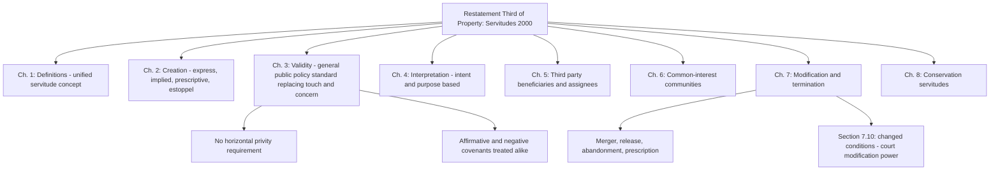

## The Restatement Third of Property on Servitudes

### Overview

The *Restatement (Third) of Property: Servitudes* (American Law Institute, 2000) is the most significant modern reform of American servitude law. It replaces the historically fragmented common-law categories — easements, profits Ă prendre, real covenants, and equitable servitudes — with a unified analytical framework organized around a single functional concept: the "servitude." The Restatement's core methodology is to treat all these devices as variations of one legal mechanism (a right or obligation running with land) and to evaluate their validity primarily through a general reasonableness/public-policy lens rather than the old formalistic requirements of privity and rigid touch-and-concern tests.

### Historical Motivation for the Restatement

**Key Points**

- Prior to 2000, American servitude law suffered from doctrinal fragmentation traceable to the law/equity split institutionalized by *Tulk v Moxhay* (1848) and the privity framework of *Spencer's Case* (1583).
- Courts and practitioners had to separately analyze whether a restriction was an easement, a real covenant enforceable at law, or an equitable servitude enforceable in equity — each with different formation requirements, remedies, and enforcement rules, despite often serving identical practical purposes.
- The *Restatement (First) of Property* (1944) had already organized servitudes but preserved the traditional tripartite structure; the Third Restatement's innovation was structural unification, not merely restatement of existing rules.
- **[Inference]** The drafters (principally Susan French as Chief Reporter) were explicitly responding to academic criticism that the touch-and-concern doctrine was indeterminate and that privity requirements served no coherent modern policy purpose.

### Structural Unification: The Single Category of "Servitude"

**Definition (§ 1.1)**

The Restatement defines a servitude broadly as a legal device that creates a right or an obligation that runs with land or an interest in land. This definition deliberately encompasses:

- Easements
- Profits Ă prendre
- Real covenants (traditionally enforceable at law)
- Equitable servitudes (traditionally enforceable in equity)

**Collapse of the law/equity distinction**

The Restatement's most consequential move is treating real covenants and equitable servitudes as a single category called the "covenant that runs with the land," eliminating the historical significance of whether a remedy sounds in law (damages) or equity (injunction). Under this approach:

- The availability of injunctive relief versus damages becomes a remedial question, not a threshold question of which doctrinal category applies.
- Both affirmative and negative covenants are treated under the same creation and validity rules (§§ 2.1–2.6), rejecting the older common law rule that only negative covenants' burdens could bind successors.

### Elimination and De-emphasis of Privity

**Traditional rule being replaced**

Under classical American common law (derived from *Spencer's Case*), a covenant's burden would run with the land only if there was:

- **Horizontal privity**: a specified property relationship between the original covenanting parties (e.g., grantor-grantee, landlord-tenant).
- **Vertical privity**: succession of the entire estate held by the original party to a later successor.

**Restatement approach (§ 2.4, § 2.5)**

The Restatement abolishes horizontal privity as a requirement for the burden or benefit of a covenant to run. It requires only:

1. The original parties intended the servitude to run with the land.
2. The servitude complies with the Statute of Frauds or an exception (implication, estoppel, prescription).
3. The servitude is not otherwise invalid under the general validity rules (§ 3.1).

**[Inference]** Because horizontal privity was traditionally justified as ensuring covenants were "attached" to genuine conveyancing transactions, its elimination reflects a policy judgment that intent and formal recording provide adequate safeguards without the historical formalism — though not all states have adopted this position, so practitioners must confirm current local law.

### Replacement of "Touch and Concern" with a General Validity Standard

**Traditional touch and concern test**

The common law required that a covenant's subject matter be sufficiently connected to the use, value, or enjoyment of the land (as opposed to being a purely personal obligation) — a notoriously indeterminate standard that produced inconsistent case outcomes.

**Restatement § 3.1: General validity rule**

The Restatement replaces touch-and-concern with a presumption of validity, providing that a servitude is valid unless it is illegal, unconstitutional, or violates public policy. Section 3.1 lists servitudes that are **invalid** as against public policy, including those that:

- Are arbitrary, spiteful, or capricious.
- Unreasonably burden a fundamental constitutional right.
- Impose an unreasonable restraint on alienation (§ 3.4–3.5).
- Impose an unreasonable restraint on trade or competition (§ 3.6).
- Are unconscionable.

**Restraints on alienation (§§ 3.4–3.5)**

The Restatement distinguishes:

- **Direct restraints** (e.g., outright prohibitions on transfer) — evaluated for reasonableness considering the restraint's purpose, duration, and scope.
- **Indirect restraints** (e.g., use restrictions that incidentally reduce marketability) — generally valid unless they lack a rational justification.

### Creation of Servitudes Under the Restatement

**Modes of creation (Chapter 2)**

| Mode | Restatement Provision | Key Requirement |
| --- | --- | --- |
| Express creation | § 2.1–2.2 | Complies with Statute of Frauds; instrument manifests intent to create a servitude |
| Implication from prior use | § 2.12 | Prior apparent, continuous use; reasonable necessity at severance |
| Implication from necessity | § 2.15 | Strict necessity at time of severance (landlocked parcel) |
| Implication from a general plan (common scheme) | § 2.14 | Common development plan with reciprocal negative servitudes |
| Estoppel | § 2.10 | Reasonable reliance on a represented or assumed servitude |
| Prescription | § 2.16–2.17 | Open, continuous, adverse use for the statutory period |
| Dedication | § 2.18 | Owner's manifestation of intent to dedicate land to public use, accepted by the public or a public body |

**Easements in gross**

The Restatement explicitly validates and provides rules for easements in gross (§ 2.6), including commercial easements in gross (utility lines, pipelines, telecommunications, conservation easements), reflecting the modern reality that many valuable servitudes lack a traditional dominant tenement. This is a notable departure from the strict Roman/English requirement that servitudes involve a dominant and servient estate.

### Interpretation Principles (Chapter 4)

**Key Points**

- § 4.1: Servitudes should be interpreted to give effect to the intent of the parties, ascertained from the language of the instrument and the circumstances surrounding its creation.
- This rejects the older common law canon of construing servitudes narrowly against the grantee (a Roman-derived rule, *servitutes praediorum arto modo constitui debent*) — the Restatement instead favors interpretation that serves the servitude's purpose.
- § 4.10: For servitudes created by a common plan (e.g., subdivision covenants), the instrument should be read in light of the general plan of development.
- Ambiguities are resolved by reference to the purpose the servitude was intended to serve, not through a categorical pro-grantor or pro-grantee bias.

### Servitudes Held by Common-Interest Communities and Owners' Associations

**Chapter 6**

A substantial portion of the Restatement addresses common-interest communities (condominiums, cooperatives, and planned communities governed by homeowners' associations), reflecting their explosive growth since the mid-20th century. It provides:

- Standards for the validity and interpretation of servitude-based governing documents (declarations, bylaws, rules).
- A reasonableness standard for board rule-making and rule enforcement (§ 6.7 et seq.), evaluating whether the association's action was arbitrary, capricious, or in bad faith.
- Rules on assessment liens, amendment procedures, and dispute resolution.

### Modification and Termination of Servitudes (Chapter 7)

**Modes of termination recognized**

- **Merger** (§ 7.5): unity of ownership of dominant and servient estates extinguishes an easement.
- **Release** (§ 7.1): express relinquishment by the benefited party.
- **Abandonment** (§ 7.4): conduct manifesting an intent to permanently relinquish the servitude, not mere nonuse.
- **Prescription (by servient owner)** (§ 7.7): where the servient owner adversely obstructs the servitude for the statutory period.
- **Changed conditions doctrine** (§ 7.10): allows courts to modify or terminate a servitude when changed circumstances make it impossible or highly impractical to accomplish the servitude's original purpose — the Restatement's most significant termination innovation, extending beyond the traditional narrow common-law "changed conditions" defense for restrictive covenants in a neighborhood.
- **Modification by the court** (§ 7.10): expressly empowers courts to reform a servitude to adapt it to changed circumstances rather than only invalidating it outright, provided the modification is as consistent as possible with the servitude's original purpose.

**[Inference]** Section 7.10's flexible modification power is one of the more debated provisions, as critics argue it gives courts substantial discretion to rewrite privately bargained-for terms; the degree to which state courts have embraced this provision varies.

### Conservation Servitudes (Chapter 8, and cross-reference to Uniform Conservation Easement Act)

**Key Points**

- The Restatement addresses conservation servitudes as a distinct category, given their frequent use of the "in gross" structure (held by land trusts, government agencies, or non-profits without a dominant tenement).
- These provisions interact with the **Uniform Conservation Easement Act (1981)**, adopted (with variations) in the majority of U.S. states, which independently validates such servitudes notwithstanding the traditional dominant/servient tenement requirement.
- The Restatement recognizes special rules for termination and modification of conservation servitudes given the public interest embedded in them (e.g., often requiring judicial cy pres-like modification rather than simple private release).

### Comparison Table: Traditional Common Law vs. Restatement (Third) Approach

| Issue | Traditional Common Law | Restatement (Third) |
| --- | --- | --- |
| Categories | Separate: easements, profits, real covenants (law), equitable servitudes (equity) | Unified: single "servitude" concept; covenants merged into one "covenant running with the land" |
| Horizontal privity | Required for covenant burden to run at law | Not required |
| Touch and concern | Required, indeterminate case-by-case test | Replaced by general validity/public policy standard (§ 3.1) |
| Negative vs. affirmative covenants | Only negative covenants' burdens ran at law | Both treated alike |
| Easements in gross | Historically disfavored, especially commercial | Explicitly validated (§ 2.6) |
| Changed conditions | Narrow defense to enforcement (neighborhood change) | Broad court power to modify or terminate (§ 7.10) |
| Interpretation canon | Construed narrowly against the grantee | Construed to give effect to intent and purpose |

### State Adoption and Practical Caveats

**[Unverified]** The Restatement (Third) of Property: Servitudes is not binding law in any jurisdiction; it functions as persuasive secondary authority that courts may adopt in whole, in part, or not at all. Some states (e.g., through case law citing the Restatement favorably) have embraced significant portions, particularly § 7.10's changed conditions/modification framework and the elimination of horizontal privity, while others continue to apply traditional *Spencer's Case*-derived privity and touch-and-concern analysis. Practitioners must verify the controlling law in the specific jurisdiction rather than assume the Restatement's rules apply automatically.

### Illustrative Example

**Example**

A subdivision declaration recorded in 1975 requires all homes to be single-family residences and imposes an assessment lien for common area maintenance, but does not use the word "covenant running with the land" or specify privity relationships in traditional form.

- **Under traditional common law analysis**: A court might scrutinize whether horizontal privity existed between the original developer and each lot purchaser, and whether the assessment obligation "touches and concerns" the land (affirmative obligations to pay money were historically more difficult to bind to successors than negative use restrictions).
- **Under Restatement (Third) analysis**: The court asks whether the declaration manifests intent that the obligation run with the land (§ 2.2), whether it was properly recorded, and whether enforcing it would violate public policy (§ 3.1) — the assessment lien is analyzed under the common-interest community provisions (Chapter 6) rather than through the older affirmative-covenant skepticism.

### Structural Diagram

**Next Steps**

- Classification of Servitudes: Easements, Profits, Covenants, and Equitable Servitudes
- The Touch and Concern Requirement and Its Modern Critique
- Horizontal and Vertical Privity: Origins and Contemporary Relevance
- Creation of Easements: Express Grant, Reservation, Implication, and Necessity
- Common-Interest Communities and Homeowners' Association Governance
- Conservation Easements and the Uniform Conservation Easement Act
- Termination and Modification of Servitudes Under Changed Conditions Doctrine
- State-by-State Adoption Patterns of the Restatement (Third) of Property: Servitudes