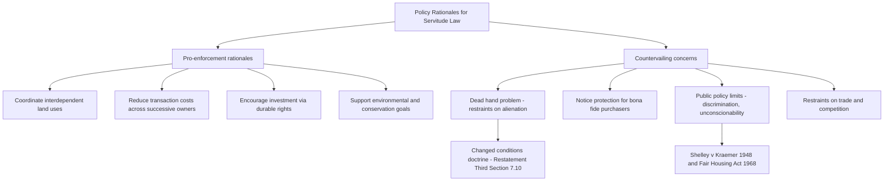

## Policy Rationales for Servitude Law

### Overview

Servitude law exists to solve a recurring economic and social problem: land is fixed in place, adjoining or nearby parcels are interdependent, and owners often need to bind not just themselves but future owners to arrangements that make land more useful or valuable. Because a servitude can restrict alienability, impose burdens on strangers to the original bargain, and persist indefinitely, courts and legislatures have developed a body of policy justifications and countervailing concerns that shape how servitude doctrine is structured. This entry surveys the principal rationales offered for enforcing servitudes, the competing concerns that limit them, and how doctrinal rules operationalize this balance.

### The Core Economic Rationale: Enabling Land Use Coordination

**Key Points**

- Land uses are frequently interdependent: a factory's noise affects a neighboring home; a landlocked parcel needs access across a neighbor's land; a subdivision's aesthetic value depends on all owners following shared design standards.
- Servitudes allow parties to internalize these externalities by contract, rather than relying solely on public regulation (zoning) or litigation (nuisance law) after the fact.
- **[Inference]** Law and economics scholarship (notably associated with commentators building on Coase's framework) frames servitudes as a mechanism for reducing transaction costs in recurring land-use bargains — once a servitude is created and recorded, subsequent owners do not need to renegotiate the arrangement with each transfer.
- Running with the land solves a coordination problem that a purely personal contract cannot: a personal covenant not to build a fence binds only the original promisor, so if that owner sells, the burden disappears unless a new device makes it binding on successors.

### Rationale 1: Facilitating Efficient Land Use and Development

**Subdivision and common-interest community planning**

Modern residential and commercial development depends heavily on servitudes (recorded declarations of covenants, conditions, and restrictions, or "CC&Rs") to:

- Maintain consistent aesthetic and use standards that preserve property values across an entire development.
- Fund and govern shared infrastructure (roads, drainage, recreational amenities) through assessment liens enforceable as servitudes.
- Allow developers to create master-planned communities where private governance substitutes for, or supplements, municipal zoning.

**Example**

A developer subdividing a 200-lot residential community records a declaration limiting structures to single-family residential use, imposing minimum setback requirements, and creating a homeowners' association with assessment power. Without the servitude running with each lot to bind all future purchasers, the developer's investment in a coherent, marketable community plan would unravel the first time any lot owner ignored the original informal understanding.

### Rationale 2: Reducing Transaction Costs and Enabling Efficient Bargaining

**Key Points**

- Once created, a properly recorded servitude eliminates the need for repeated renegotiation between neighbors each time either parcel changes hands.
- This is especially valuable for necessarily long-term arrangements like access easements, utility easements, and drainage rights, where the underlying need for the servitude (e.g., a landlocked parcel needing road access) does not disappear when ownership changes.
- **[Inference]** Some law and economics commentary argues that allowing servitudes to run with the land approximates what parties would bargain for if transaction costs were zero, since a rational purchaser of the servient estate would demand a lower price (or a rational purchaser of the dominant estate would pay more) reflecting the servitude's existence — meaning enforcement of the running servitude does not impose a true windfall or unbargained-for burden on informed subsequent purchasers.

### Rationale 3: Encouraging Investment by Assuring Durability

If a landowner grants a valuable right (e.g., a conservation easement, a utility easement, or a shared driveway easement) but that right could evaporate the moment either party sells, dominant estate owners and easement holders would be reluctant to invest in the arrangement, and grantors would receive less compensation for it. Allowing servitudes to run with the land:

- Assures easement or covenant beneficiaries (utilities, conservation organizations, adjoining owners) that their investment-backed expectations will be protected against changes in ownership.
- Encourages landowners to grant valuable rights (rights of way, conservation restrictions) because they can be compensated for a durable, transferable interest rather than a fragile personal license.

### Rationale 4: Environmental and Conservation Policy

**Conservation easements as a distinct modern rationale**

The rise of conservation easements (validated in most states via the Uniform Conservation Easement Act, 1981) reflects a policy rationale distinct from traditional neighbor-to-neighbor servitudes:

- They allow private landowners to permanently restrict development on their land in exchange for tax benefits, compensation, or personal conservation values, without requiring a dominant tenement.
- **[Inference]** Legislatures deliberately departed from the traditional common law dominant/servient tenement requirement because the public policy goal (permanent land preservation) is better served by allowing land trusts and government entities to hold these rights "in gross," even though this cuts against the historical Roman/English insistence that servitudes serve an adjoining estate.
- This rationale prioritizes long-term public and ecological benefit over the traditional concern that servitudes in gross are hard to identify, terminate, or bargain around.

### Countervailing Concern 1: The Dead Hand Problem and Restraints on Alienability

**Key Points**

- A central concern historically limiting servitude enforcement is the "dead hand" problem: a servitude created by a long-departed grantor can bind land indefinitely, potentially imposing outdated or economically inefficient restrictions on current owners who never agreed to them and cannot easily undo them.
- This concern underlies the traditional common law hostility toward:
  - **Restraints on alienation** (direct prohibitions on transfer, or unreasonable indirect burdens on transferability).
  - **Easements and covenants in gross** (traditionally disfavored because there is no natural mechanism, like a dominant estate transfer, to keep the servitude aligned with an evolving beneficial use).
- Courts historically applied narrow construction canons and the touch-and-concern doctrine partly as a check against overly broad or perpetual burdens on land that could not be easily justified to unwilling successors.
- The Restatement (Third)'s changed-conditions and modification doctrine (§ 7.10) is a direct doctrinal response to the dead hand problem: rather than treating old servitudes as immutable, courts are empowered to modify or terminate servitudes when circumstances have changed enough that their original purpose can no longer be reasonably served.

### Countervailing Concern 2: Notice and the Protection of Bona Fide Purchasers

**Key Points**

- Because servitudes bind successors who were not parties to the original agreement, the law requires mechanisms ensuring subsequent purchasers have fair notice before being bound.
- This rationale drives the recording acts, the requirement of actual, constructive, or inquiry notice for equitable servitudes (post-*Tulk v Moxhay*), and rules invalidating secret or unrecorded restrictions against bona fide purchasers for value without notice.
- **Inquiry notice** doctrines (e.g., visible evidence of a common scheme in a subdivision) exist precisely to balance the dead-hand concern against the coordination benefits of servitudes: a purchaser who could have discovered the restriction through reasonable diligence is not permitted to claim ignorance to escape a beneficial community-wide scheme.

### Countervailing Concern 3: Public Policy Limits — Discriminatory and Unconscionable Servitudes

**Historical misuse and correction**

**[Unverified]** Restrictive covenants were historically used, particularly in the early-to-mid 20th century United States, to enforce racially and ethnically discriminatory housing patterns by prohibiting the sale or occupancy of property to disfavored groups. This misuse illustrates why servitude law cannot rest solely on private ordering rationales — private "coordination" can encode and entrench unjust social arrangements.

- *Shelley v. Kraemer*, 334 U.S. 1 (1948), held that judicial enforcement of racially restrictive covenants constitutes unconstitutional state action under the Equal Protection Clause, even though the covenants themselves were privately created.
- The **Fair Housing Act of 1968** independently prohibits racially discriminatory covenants and provides for their unenforceability and, in many states, formal removal or redaction from public land records.
- The Restatement (Third) § 3.1 codifies the modern policy position by declaring servitudes that are "arbitrary, spiteful, or capricious," that unreasonably burden fundamental constitutional rights, or that are otherwise contrary to public policy, to be invalid.

**[Inference]** This history demonstrates that servitude law's policy framework is not purely about economic efficiency; it also incorporates a constraint that private land-use ordering must yield to fundamental antidiscrimination and constitutional norms, which the coordination and investment rationales alone do not adequately capture.

### Countervailing Concern 4: Anti-Competitive and Unreasonable Restraints on Trade

The Restatement (Third) § 3.6 addresses servitudes that impose unreasonable restraints on trade or competition (for example, a covenant preventing a parcel from ever being used to sell competing goods). Policy here mirrors general antitrust and restraint-of-trade principles: servitudes that entrench monopolistic arrangements in a market, disproportionate to any legitimate protectable interest, are disfavored even though they might otherwise satisfy formal creation requirements.

### Balancing Framework: How Doctrine Operationalizes These Policies

| Policy Goal | Doctrinal Mechanism |
| --- | --- |
| Enable coordination and durable investment | Allowing servitudes to run with the land to successors (abandonment of strict privity under Restatement Third) |
| Prevent dead-hand overreach | Changed conditions doctrine (§ 7.10); disfavoring perpetual restraints on alienation (§§ 3.4–3.5); merger and abandonment doctrines |
| Protect subsequent purchasers | Recording acts; notice requirements for equitable servitudes; bona fide purchaser doctrine |
| Prevent socially harmful private ordering | Invalidity of discriminatory covenants (*Shelley v. Kraemer*; Fair Housing Act); Restatement § 3.1 public policy invalidity rule |
| Support environmental and public-benefit goals | Conservation easement statutes permitting easements in gross; specialized modification rules for conservation servitudes |
| Prevent anti-competitive land control | Restatement § 3.6 restraint-on-trade limits |

### Illustrative Example: Competing Rationales in Tension

**Example**

A 1960s subdivision declaration imposes a covenant limiting each lot to a single detached home with a minimum 2,500 square foot floor area. By 2026, the surrounding area has been rezoned for higher-density housing to address a regional housing shortage, and several lot owners want to subdivide their parcels or build accessory dwelling units.

- **Coordination/investment rationale** supports enforcing the covenant: original purchasers paid a premium for the low-density character, and current owners bought with notice of the restriction.
- **Dead-hand rationale** cuts the other way: a 60-year-old restriction may no longer serve any purpose the current neighborhood values, and enforcing it could block housing supply the community and region now need.
- A court applying the Restatement (Third) § 7.10 changed-conditions framework would weigh whether the character of the neighborhood has changed so substantially that the covenant's original purpose (maintaining low-density residential character consistent with the surrounding area) can no longer be achieved, potentially modifying or terminating the restriction rather than either rigidly enforcing it or ignoring it outright.

### Policy Rationale Map

**Related Topics**

- The Dead Hand Problem and Restraints on Alienation in Servitude Law
- *Shelley v. Kraemer* and the Constitutional Limits on Enforcing Restrictive Covenants
- Notice Requirements and the Recording Acts in Servitude Enforcement
- Law and Economics Perspectives on Property Rights and Coase's Theorem
- Conservation Easements: Policy Design and the Uniform Conservation Easement Act
- Changed Conditions Doctrine and Judicial Modification of Servitudes
- Common-Interest Community Governance and Private Land-Use Ordering
- Comparing Servitudes to Zoning as Land-Use Control Mechanisms