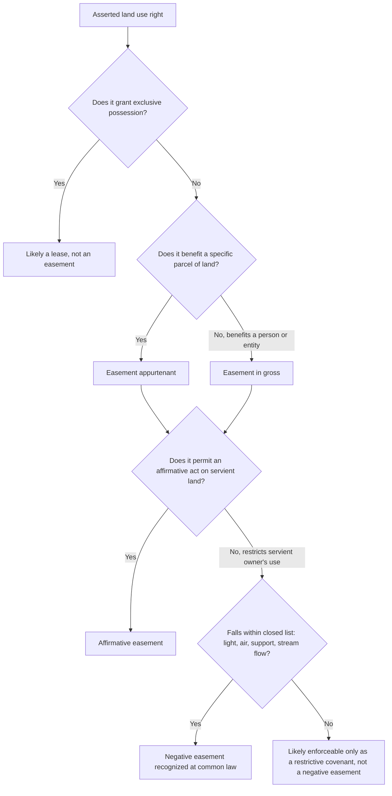

## Definition and Essential Characteristics of an Easement

### Overview

An easement is a nonpossessory interest in land that gives its holder the right to use another person's land for a specific purpose, or the right to prevent the landowner from using their own land in a particular way. Easements are the most doctrinally developed and frequently litigated category of servitude, and their essential characteristics distinguish them from other land-use arrangements such as licenses, leases, profits Ă prendre, and covenants. This entry defines the easement and works through the elements courts require before recognizing one.

### Core Definition

An easement is a nonpossessory right to use land in the possession of another for a specified purpose. Two features distinguish "nonpossessory" from a possessory interest:

- The easement holder does not have the right to exclude the servient owner from the land generally, only to use it consistently with the easement's specific purpose.
- The servient owner retains the right to use their land in any manner not inconsistent with the easement.

**[Inference]** This nonpossessory quality is what separates an easement from a lease (which grants exclusive possession for a term) and from a fee interest, even though both easements and leases can be freely negotiated, recorded, and enforced against successors.

### The Four Traditional Essential Characteristics

Common law and the modern Restatement recognize a converging (though not identical) set of core requirements. The traditional common law formulation, associated with cases like *Re Ellenborough Park* [1956] Ch 131 (England) and adopted broadly in American jurisdictions, identifies four characteristics for an easement appurtenant:

**1. There must be a dominant and servient tenement (for easements appurtenant)**

- The **dominant tenement** is the parcel benefited by the easement.
- The **servient tenement** is the parcel burdened by the easement.
- **Easements in gross** are the exception to this requirement — they benefit a person or entity rather than another parcel of land (e.g., a utility company's transmission line easement), and are increasingly common and judicially accepted, particularly for commercial and conservation purposes.

**2. The easement must accommodate the dominant tenement**

- The right must benefit the dominant land itself (its use and enjoyment), not merely confer a personal advantage on whoever happens to own it.
- This is the modern descendant of the Roman *utilitas* requirement and the common law "touch and concern" test.
- **Example**: A right to walk across a neighbor's land to reach the dominant parcel's back garden accommodates the dominant tenement. A right allowing the dominant owner (personally) to use the servient owner's swimming pool, unconnected to any use of the dominant land itself, more closely resembles a personal license or profit than a true appurtenant easement.

**3. Dominant and servient tenements must be owned or occupied by different persons**

- A landowner cannot hold an easement over their own land — this is the doctrine of unity of ownership; if the same person acquires both parcels, any pre-existing easement is extinguished by merger.
- **[Inference]** This requirement is more clearly essential for easements appurtenant than easements in gross, since an easement in gross by definition need not involve a second parcel at all.

**4. The right must be capable of forming the subject matter of a grant**

This is a bundle of sub-requirements courts apply to determine whether an asserted right is a legally cognizable easement:

- **Definiteness**: The right must be sufficiently certain in scope and description (e.g., a right of way of reasonably defined width and route), not so vague that a court could not enforce or a title examiner could not identify it.
- **Capable grantor and grantee**: Both parties must have the legal capacity to grant and receive the interest.
- **No exclusive possession**: A right amounting to full and unrestricted use excluding the servient owner is not an easement but may be a lease or a possessory estate — this is a frequently litigated boundary, especially for parking and storage easements.
- **No requirement of servient owner expenditure**: Traditionally, an easement cannot obligate the servient owner to spend money or take affirmative action (e.g., a duty to actively maintain a fence); such obligations are typically structured as covenants instead, though some modern easements combine an easement with an ancillary covenant to maintain.

### Restatement (Third) Formulation

The *Restatement (Third) of Property: Servitudes* § 1.2 defines an easement functionally: a nonpossessory right to use land in the possession of another for a specific purpose. The Restatement does not require the four-part *Ellenborough Park*-style test as rigid formal prerequisites; instead, it evaluates:

- Whether the arrangement functions as a nonpossessory use right (as opposed to full possession).
- The general validity standard under § 3.1 (not illegal, unconstitutional, or against public policy), rather than mechanical touch-and-concern analysis.

**[Inference]** In practice, most American courts continue to apply the traditional characteristics even where they nominally follow Restatement terminology, since these characteristics remain useful analytical tools for distinguishing easements from leases, licenses, and profits.

### Easement vs. Related Interests: Distinguishing Table

| Interest | Possessory? | Runs with Land? | Revocable? | Key Distinguishing Feature |
| --- | --- | --- | --- | --- |
| Easement | No | Yes (if properly created) | No (absent termination event) | Nonpossessory right to use servient land for a defined purpose |
| License | No | No (personal) | Yes, generally at will | Mere permission to use land; no interest in land created |
| Profit Ă prendre | No (but includes right to take resources) | Yes | No | Right to enter and remove something from the land (timber, minerals, game, crops) |
| Lease | Yes (exclusive possession) | Yes, as a leasehold estate | No, absent breach or term expiration | Grants exclusive possession for a term |
| Fee simple | Yes (full ownership) | N/A (it is the underlying estate) | No | Complete ownership interest |
| Real covenant / Equitable servitude | No | Yes (if requirements met) | No, absent termination event | Promise regarding land use, not a right to physically use the land |

### Affirmative vs. Negative Easements

**Affirmative easements**

Grant the holder the right to do something on the servient land — the vast majority of easements fall in this category:

- Rights of way (pedestrian, vehicular)
- Utility easements (power lines, pipelines, cables)
- Drainage and water flow easements
- Party wall easements

**Negative easements**

Grant the holder the right to prevent the servient owner from doing something on their own land that would otherwise be lawful. Historically, common law recognized only a narrow, closed list of negative easements:

- Easements of light (preventing the servient owner from blocking windows)
- Easements of air (preventing obstruction of airflow)
- Easements of support (preventing excavation that would undermine a building)
- Easements preventing interference with the flow of an artificial stream

**[Inference]** Modern American jurisdictions have generally not expanded this closed list at common law; instead, functionally negative restrictions (e.g., view easements, solar access easements) are more often created and enforced today as restrictive covenants or through specific statutes (e.g., solar easement statutes), because courts remain hesitant to create novel categories of negative easements outside the traditional list.

### Appurtenant vs. In Gross Easements

**Easement appurtenant**

- Benefits a specific parcel of land (the dominant tenement).
- Passes automatically with a conveyance of the dominant estate, even if not mentioned in the deed, unless expressly reserved or excluded.
- Cannot be severed from the dominant estate and transferred separately (the benefit is tied to the land, not to the owner personally).

**Easement in gross**

- Benefits a specific person or entity rather than a parcel of land.
- Historically disfavored and presumed not to have been intended absent clear language, because courts favored the more easily administrable appurtenant category.
- Modern law (Restatement § 2.6) freely recognizes commercial easements in gross (utility, pipeline, telecommunications, billboard, and conservation easements) as assignable and even divisible, reflecting the economic reality that many valuable easements do not require a benefited parcel at all.

**Key Points**

- Courts apply a presumption in ambiguous cases: if it is unclear from the instrument whether an easement is appurtenant or in gross, most jurisdictions presume appurtenant, because that interpretation better serves administrability (the easement's status follows the dominant estate automatically) and is thought to align generally with grantor intent.
- Personal easements in gross (as opposed to commercial ones) are more likely to be treated as non-assignable and may terminate on the holder's death, unless the creating instrument specifies otherwise.

### Illustrative Example

**Example**

Owner A grants Owner B, whose land lies behind A's parcel, "a right of way ten feet wide along the eastern boundary of A's lot for ingress and egress to and from B's property." Analysis:

- **Dominant and servient tenements**: B's land is dominant; A's land is servient.
- **Accommodation**: The right of way serves B's land directly by providing access, satisfying the accommodation requirement.
- **Different ownership**: A and B are different persons.
- **Capable of grant**: The easement is definite (ten feet wide, specific boundary location, specific purpose), does not grant B exclusive possession of A's land generally, and does not require A to spend money.
- **Classification**: This is an affirmative easement appurtenant, created expressly by grant, and will pass automatically to subsequent owners of B's parcel.

### Diagram: Easement Classification Logic

### Diagram: Dominant and Servient Tenement Relationship

<svg xmlns="http://www.w3.org/2000/svg" viewBox="0 0 700 300" font-family="Helvetica, Arial, sans-serif">
<text x="350" y="28" text-anchor="middle" font-size="17" font-weight="bold" fill="#1a1a1a">Dominant and Servient Tenement (svg_diagram)</text>
<rect x="60" y="70" width="220" height="160" fill="#dfeeff" stroke="#2e5cb8" stroke-width="2" />
<text x="170" y="60" text-anchor="middle" font-size="13" font-weight="bold" fill="#1a1a1a">Servient Tenement (Owner A)</text>
<text x="170" y="150" text-anchor="middle" font-size="12" fill="#333">Burdened land</text>
<text x="170" y="168" text-anchor="middle" font-size="12" fill="#333">(subject to right of way)</text>
<rect x="420" y="70" width="220" height="160" fill="#e6f7e6" stroke="#2e8b57" stroke-width="2" />
<text x="530" y="60" text-anchor="middle" font-size="13" font-weight="bold" fill="#1a1a1a">Dominant Tenement (Owner B)</text>
<text x="530" y="150" text-anchor="middle" font-size="12" fill="#333">Benefited land</text>
<text x="530" y="168" text-anchor="middle" font-size="12" fill="#333">(gains right of access)</text>
<line x1="280" y1="150" x2="420" y2="150" stroke="#b8322e" stroke-width="3" marker-end="url(#arrow)" />
<text x="350" y="135" text-anchor="middle" font-size="12" fill="#b8322e" font-weight="bold">10-ft right of way</text>
</svg>

**Next Steps**

- Easements Appurtenant vs. Easements in Gross: Transferability and Assignment
- Affirmative and Negative Easements: The Closed List Doctrine
- Distinguishing Easements from Licenses and Profits Ă Prendre
- Creation of Easements by Express Grant and Reservation
- Implied Easements: Prior Use, Necessity, and the Plat Doctrine
- Termination of Easements: Merger, Abandonment, and Prescription
- The Restatement (Third) Functional Definition of Easements
- Scope and Use Limitations of Express Easements