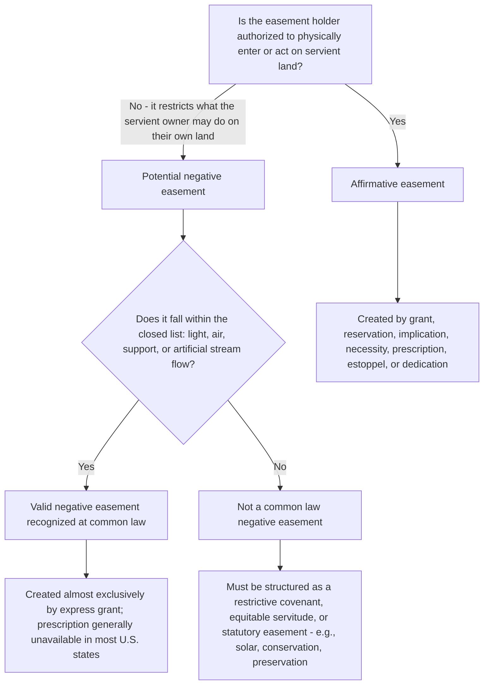

## Affirmative versus Negative Easements

### Overview

Easements are classified along a functional axis based on what the easement holder is permitted to do relative to the servient estate. An affirmative easement authorizes the holder to perform an act on the servient land that would otherwise constitute a trespass. A negative easement authorizes the holder to prevent the servient owner from performing an act on their own land that would otherwise be entirely lawful. This distinction matters because negative easements have historically been confined to a closed and narrow list of categories, while affirmative easements can be created for almost any purpose the parties can define with reasonable certainty.

### Affirmative Easements

**Definition**

An affirmative easement grants its holder the right to enter or use the servient tenement in a specified way. It authorizes conduct that would, absent the easement, constitute a trespass against the servient owner.

**Common types**

- **Rights of way**: pedestrian, vehicular, or shared driveway access across servient land.
- **Utility easements**: for electric transmission lines, gas pipelines, water and sewer lines, telecommunications cables, and related infrastructure.
- **Drainage and water flow easements**: allowing water to be channeled across or discharged onto servient land.
- **Party wall easements**: allowing a wall shared between two structures to be supported partly by each owner's land.
- **Easements to maintain encroaching structures**: such as an eave, cornice, or underground utility line that physically intrudes onto neighboring land.
- **Easements of access to light and air fixtures**, solar panel installations, or similar improvements (though the underlying "negative" restriction on the servient owner is treated separately, see below).

**Key Points**

- Affirmative easements are overwhelmingly the more common category in both historical and modern practice.
- The scope of an affirmative easement is defined by its purpose and the manner of use specified at creation (or, for implied and prescriptive easements, by the manner of use during the period giving rise to the easement).
- Courts generally allow "reasonable development" of an affirmative easement's use over time (e.g., a right of way for horse and carriage use may be reasonably adapted to accommodate motor vehicles), but will not permit expansion of use beyond what the easement's original purpose and scope can support, and will not permit use to benefit land other than the dominant tenement (the "no expansion to other property" rule).

### Negative Easements

**Definition**

A negative easement grants its holder the right to prevent the servient owner from doing something on the servient owner's own land — conduct that would be entirely lawful but for the existence of the easement. Because a negative easement restricts what an owner may otherwise freely do with their own property, common law treated the creation of new categories of negative easements with considerable suspicion.

**The closed list at common law**

Traditional English and American common law recognized only four categories of negative easements:

1. **Easement of light**: preventing the servient owner from erecting a structure or planting that blocks light to the dominant tenement's windows.
2. **Easement of air**: preventing obstruction of the flow of air to the dominant tenement.
3. **Easement of support** (lateral and subjacent): preventing the servient owner from excavating or removing support in a manner that would cause the dominant tenement's building or land to collapse or subside.
4. **Easement preventing interference with the flow of water in an artificial stream**: preventing the servient owner from obstructing or diverting an artificial watercourse benefiting the dominant tenement.

**[Inference]** This closed-list approach reflects a historical policy judgment that expanding negative easements too freely would create an unpredictable web of invisible restrictions on land that title examiners and purchasers could not easily discover, since negative easements (unlike affirmative ones) often leave no physical trace of their existence on the servient land itself.

### Why the Categories Are Treated Differently

| Consideration | Affirmative Easements | Negative Easements |
| --- | --- | --- |
| Visibility on the land | Often physically visible (a path, a pipeline, a driveway) | Often invisible — no physical trace |
| Historical judicial attitude | Freely recognized for any definite purpose | Confined to a closed list |
| Effect on servient owner | Requires tolerating specific entry or use | Restricts the servient owner's otherwise lawful development of their own land |
| Modern creation | By grant, reservation, implication, necessity, prescription | Primarily by express grant; new categories generally not created by prescription in most U.S. jurisdictions |
| Contemporary functional equivalents | N/A | Restrictive covenants and equitable servitudes now serve most "negative easement" functions beyond the closed list |

### Modern Expansion Through Alternative Doctrines

Because the negative easement category remained closed, American law developed the **restrictive covenant** and **equitable servitude** as the primary vehicles for achieving functionally negative restrictions that fall outside the traditional four categories:

- **View easements / view covenants**: restricting a servient owner from building structures or planting trees that obstruct a scenic view — generally not recognized as a common law negative easement, but readily created and enforced as a restrictive covenant.
- **Solar access restrictions**: some states have enacted specific **solar easement statutes** that authorize creation of an easement-like right to sunlight for solar energy collection, effectively legislating a new category of negative easement that the common law did not recognize.
- **Conservation restrictions**: restrictions preventing development, subdivision, or alteration of natural features are typically structured as **conservation easements** under the Uniform Conservation Easement Act rather than as traditional negative easements, since conservation easements are usually held in gross and serve broader statutory purposes.
- **Historic preservation restrictions**: similarly created by statute or as a form of conservation/preservation easement rather than as a common law negative easement.

**[Inference]** The practical effect of the closed list is that very few genuinely new negative easements have been recognized at common law in the past century; virtually all novel restrictions on a servient owner's development rights are now created either by restrictive covenant/equitable servitude or by specific enabling statute (solar easements, conservation easements, preservation easements), rather than through expansion of the common law negative easement categories themselves.

### Creation Method Differences

**Affirmative easements** can be created by any of the standard modes:

- Express grant or reservation
- Implication from prior use
- Implication from necessity
- Prescription (through open, continuous, adverse use for the statutory period)
- Estoppel
- Dedication

**Negative easements** are, in the great majority of American jurisdictions, created **only by express grant** (or occasionally by implication in very limited circumstances, such as certain support easements). Prescription generally cannot create a new negative easement because:

- Prescription is conceptually grounded in the servient owner's ability to observe adverse use and object; a landowner cannot readily "observe" that a neighbor is (for example) benefiting from unobstructed light and object to it in the same way they could object to someone walking across their land.
- **[Inference]** This is why jurisdictions that historically recognized "ancient lights" doctrine (allowing prescriptive acquisition of light easements after long, unobstructed enjoyment, as under the English Prescription Act 1832) are a notable historical exception; most American states never adopted the ancient lights doctrine, reflecting a policy preference for unrestricted development rights over protection of long-enjoyed light access.

### Illustrative Examples

**Example**

*Affirmative easement*: Owner A grants Owner B an easement to lay and maintain an underground water pipe crossing A's land to reach B's parcel. B may enter A's land periodically to inspect, repair, or replace the pipe. This is affirmative because B is authorized to do something (enter, dig, install, maintain) on A's land that would otherwise be a trespass.

**Example**

*Negative easement*: Owner A grants Owner B an easement of light providing that A may never construct any building on the portion of A's lot immediately south of B's windows that would block sunlight to those windows. A is not required to do anything and B never enters A's land — the easement operates purely as a restriction on what A may build. This falls within the traditional closed-list "easement of light" category.

**Example**

*Restriction outside the closed list, requiring a different doctrinal vehicle*: Owner A wants to bind Owner B (a neighboring hillside lot owner) to never build above a single story, in order to preserve A's ocean view. Because "view" is not one of the four traditional negative easement categories, A cannot create this as a common law negative easement; A must instead create it as a restrictive covenant or equitable servitude (satisfying intent, touch-and-concern or Restatement validity, and notice requirements) for it to bind B's successors.

### Diagram: Affirmative vs. Negative Easement Logic

### Diagram: The Closed List of Negative Easements

<svg xmlns="http://www.w3.org/2000/svg" viewBox="0 0 700 340" font-family="Helvetica, Arial, sans-serif">
<text x="350" y="28" text-anchor="middle" font-size="17" font-weight="bold" fill="#1a1a1a">Closed List of Common Law Negative Easements (svg_diagram)</text>
<rect x="60" y="60" width="580" height="240" rx="10" fill="#fdf3e7" stroke="#b8322e" stroke-width="2" />
<circle cx="130" cy="110" r="8" fill="#b8322e" />
<text x="155" y="115" font-size="14" fill="#1a1a1a">Light — prevents blocking of windows</text>
<circle cx="130" cy="160" r="8" fill="#b8322e" />
<text x="155" y="165" font-size="14" fill="#1a1a1a">Air — prevents obstruction of airflow</text>
<circle cx="130" cy="210" r="8" fill="#b8322e" />
<text x="155" y="215" font-size="14" fill="#1a1a1a">Support — prevents excavation undermining structures</text>
<circle cx="130" cy="260" r="8" fill="#b8322e" />
<text x="155" y="265" font-size="14" fill="#1a1a1a">Artificial stream flow — prevents diversion or obstruction</text>

<text x="350" y="320" text-anchor="middle" font-size="12" fill="#555" font-style="italic">All restrictions outside this list require a covenant or statute</text>

</svg>

**Next Steps**

- The Ancient Lights Doctrine and Its Rejection in American Law
- Restrictive Covenants and Equitable Servitudes as Substitutes for Negative Easements
- Solar Easement Statutes and Modern Legislative Expansion of Negative Rights
- Scope of Use and Permissible Development of Affirmative Easements Over Time
- Prescriptive Easements: Elements and Limits on Negative Easement Acquisition
- Conservation Easements and the Uniform Conservation Easement Act
- Support Easements: Lateral and Subjacent Support Doctrine
- Party Wall Easements and Shared Structural Support