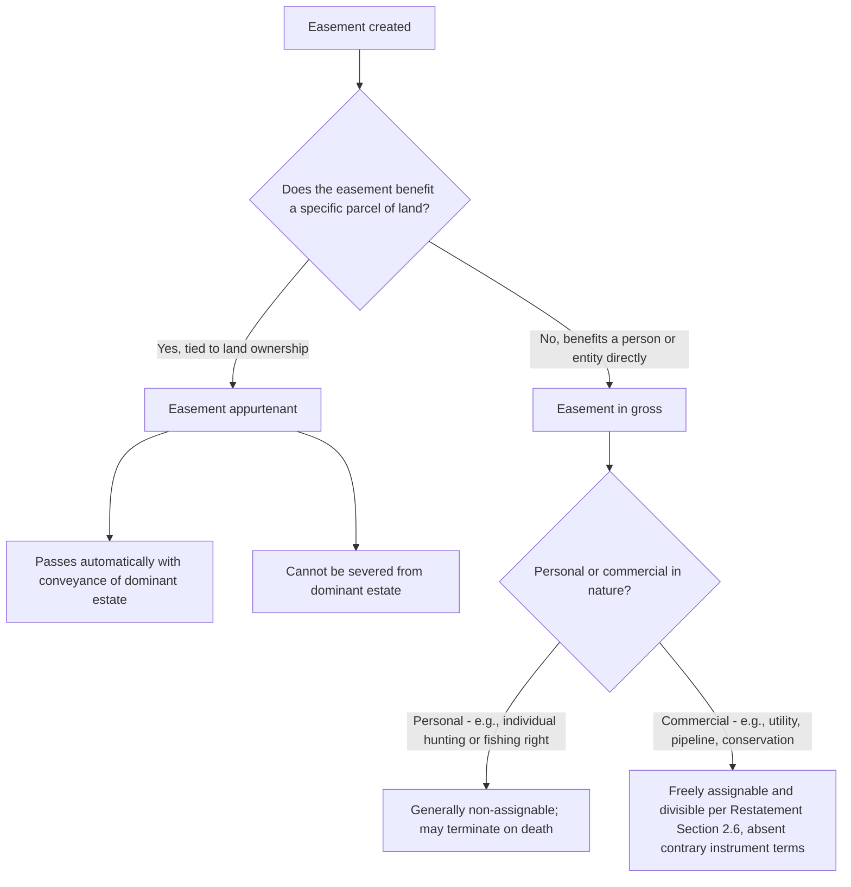

## Easements Appurtenant versus Easements in Gross

### Overview

Easements are classified according to whom they benefit. An easement appurtenant benefits a particular parcel of land — it is attached to that parcel and passes automatically with it. An easement in gross benefits a specific person or entity, independent of that person's ownership of any particular parcel. This distinction governs how each type is created, interpreted, transferred, divided, and terminated, and it has undergone significant modernization, particularly regarding the historical disfavor of commercial easements in gross.

### Easements Appurtenant

**Definition**

An easement appurtenant requires two parcels: a **dominant tenement**, which receives the benefit, and a **servient tenement**, which bears the burden. The easement's benefit is legally attached to the dominant estate rather than to the individual who happens to own it at any given time.

**Key structural features**

- **Runs with the land automatically**: Upon conveyance of the dominant tenement, the benefit of the easement passes to the new owner even if the deed does not mention it, unless the parties expressly agree otherwise.
- **Cannot be severed from the dominant estate**: The benefit cannot be sold, assigned, or retained separately from the dominant parcel itself; an owner cannot convey the dominant estate while personally keeping the easement, nor transfer the easement alone while keeping the dominant estate (subject to narrow exceptions for divided estates).
- **Burdens the servient estate regardless of ownership changes**: A new owner of the servient tenement takes subject to the recorded (or otherwise enforceable) easement.
- **Requires accommodation**: The right must genuinely benefit the use and enjoyment of the dominant tenement, not merely provide a personal advantage to its owner (the "touch and concern"/accommodation requirement).

**Common examples**

- A right of way benefiting a landlocked or difficult-to-access parcel.
- A shared driveway easement between adjoining residential lots.
- A drainage easement allowing water from an upper parcel to flow across a lower one.
- A view or light easement (where recognized) benefiting an adjoining structure.

### Easements in Gross

**Definition**

An easement in gross benefits a person or entity personally, without reference to that person's ownership of any dominant parcel. There is a servient tenement, but no corresponding dominant tenement.

**Historical treatment**

- Common law historically **disfavored** easements in gross, applying a strong interpretive presumption against finding one where the creating instrument was ambiguous, because appurtenant easements were considered more administrable (they automatically travel with identifiable land, whereas an easement in gross could persist independent of any land transaction and be harder to trace).
- Traditional common law treated **personal easements in gross** as generally non-assignable and non-inheritable absent express contrary intent, reasoning that the right was granted based on the specific identity or trustworthiness of the individual holder (e.g., a personal right to fish in a neighbor's pond).

**Modern treatment: commercial easements in gross**

The sharp historical hostility to easements in gross has substantially eroded, particularly for **commercial** easements in gross:

- **Utility easements**: electric transmission lines, gas and oil pipelines, water and sewer mains, and telecommunications cables are virtually always structured as easements in gross held by a utility company or infrastructure provider, since there is no natural "dominant tenement" — the benefit runs to the company's business operations, not to any parcel it owns.
- **Conservation easements**: held in gross by land trusts, nonprofit conservation organizations, or government agencies under the **Uniform Conservation Easement Act (1981)**, adopted with variations in most U.S. states, which explicitly validates easements in gross for conservation purposes notwithstanding the traditional dominant tenement requirement.
- **Billboard and advertising easements**, **cell tower easements**, and **solar/wind energy easements** are commonly structured as commercial easements in gross.
- The **Restatement (Third) of Property: Servitudes** § 2.6 explicitly validates and provides transfer/assignment rules for commercial easements in gross, treating them as freely transferable and divisible unless the creating instrument provides otherwise — a significant departure from the traditional personal-easement-in-gross presumption against assignability.

**Key Points**

- Modern courts increasingly distinguish **personal easements in gross** (still often treated as non-assignable and terminating on death absent contrary intent) from **commercial easements in gross** (freely assignable, divisible, and treated much like any other transferable property interest).
- **[Inference]** This bifurcation reflects a policy judgment that the traditional concerns motivating hostility to easements in gross (unpredictability, difficulty tracing successors, personal-trust-based grants) apply with much less force to commercial arrangements involving sophisticated business entities and formally recorded interests.

### Comparative Table

| Feature | Easement Appurtenant | Easement in Gross |
| --- | --- | --- |
| Beneficiary | Dominant tenement (a parcel of land) | A specific person or entity |
| Requires a dominant tenement | Yes | No |
| Passes automatically on conveyance of benefited land | Yes, with the dominant estate | N/A — no dominant estate to convey |
| Assignability of the benefit alone | No — cannot be severed from dominant estate | Personal: generally not assignable absent contrary intent. Commercial: freely assignable |
| Historical presumption in ambiguous cases | Favored interpretation | Disfavored interpretation |
| Termination on holder's death | N/A (tied to land, not a person) | Personal easements in gross often terminate; commercial easements in gross generally do not |
| Typical examples | Rights of way, shared driveways, drainage easements | Utility lines, pipelines, conservation easements, cell tower easements |
| Divisibility (splitting the benefit among multiple holders) | Governed by "one stock rule" — generally limited to prevent overburdening servient estate | Governed by Restatement § 5.9; commercial easements in gross may be divisible unless the instrument states otherwise or division would violate the "one stock rule" |

### The Presumption in Ambiguous Instruments

When an instrument granting an easement is silent or unclear as to whether the easement is appurtenant or in gross, most American jurisdictions apply an **interpretive presumption favoring appurtenant status**, based on:

- The general administrability advantage of tying the benefit to identifiable land.
- An inference that grantors more commonly intend to benefit land they are conveying or retaining than to benefit an individual grantee personally, independent of any land connection.
- The existence of a plausible dominant tenement in the grantor's or grantee's ownership at the time of the grant.

**[Inference]** Courts will look to surrounding circumstances — such as whether the grant references specific land, whether the grantee owned an adjoining parcel at the time, and the purpose of the easement — to determine whether the presumption favoring appurtenant status has been rebutted by contrary evidence of intent to create a personal, in-gross right.

### The "One Stock" Rule and Division of Easements in Gross

Where multiple entities seek to jointly use or divide a single easement in gross (for example, several utility companies wanting to run separate cables along a single right of way), courts apply the **"one stock" rule**:

- All co-holders must act together as a single unit in exercising the easement (as if it were "one stock"), unless the original grant permits independent, divided use.
- The purpose of this rule is to prevent overburdening the servient estate through unauthorized proliferation of independent uses that the servient owner never agreed to bear.
- The Restatement (Third) § 5.9 modernizes this by allowing courts to determine reasonable divisibility based on the parties' intent and the impact on the servient estate, rather than applying a rigid categorical bar.

### Illustrative Examples

**Example**

*Easement appurtenant*: Developer conveys Lot 1 to Buyer A and Lot 2 to Buyer B, granting Lot 2 (Lot B) a recorded right of way across Lot 1 for driveway access. When Buyer B later sells Lot 2 to a third party, the right of way automatically passes to the new owner as part of the dominant estate, even if the new deed does not explicitly mention the easement, because it is appurtenant to Lot 2.

**Example**

*Easement in gross*: A power utility acquires a recorded easement across a rural landowner's property to install and maintain a high-voltage transmission line. There is no dominant tenement — the benefit runs to the utility company's business operations. If the utility later merges with or is acquired by another energy company, the commercial easement in gross is generally freely assignable to the successor entity under Restatement § 2.6 principles, without the traditional non-assignability presumption that would apply to a purely personal easement in gross (such as a personal right to hunt on a friend's land).

**Example**

*Ambiguous case requiring presumption*: A deed grants "a right of way over the north field for access purposes" without specifying whether it benefits a named individual or an adjoining parcel the grantee owns. If the grantee owned an adjoining parcel at the time and the right of way plausibly serves that parcel's access needs, a court applying the presumption favoring appurtenant status would likely construe the easement as appurtenant to that adjoining parcel, absent clear contrary evidence of intent to create a purely personal right.

### Diagram: Classification Decision Logic

### Diagram: Appurtenant vs. In Gross Structure

<svg xmlns="http://www.w3.org/2000/svg" viewBox="0 0 760 320" font-family="Helvetica, Arial, sans-serif">
<text x="380" y="26" text-anchor="middle" font-size="17" font-weight="bold" fill="#1a1a1a">Appurtenant vs. In Gross Easement Structure (svg_diagram)</text>

<text x="190" y="55" text-anchor="middle" font-size="13" font-weight="bold" fill="`#2e5cb8`">Easement Appurtenant</text>

<rect x="80" y="70" width="120" height="90" fill="`#dfeeff`" stroke="`#2e5cb8`" stroke-width="2" />

<text x="140" y="120" text-anchor="middle" font-size="11" fill="#333">Servient</text>

<text x="140" y="134" text-anchor="middle" font-size="11" fill="#333">Tenement</text>

<rect x="260" y="70" width="120" height="90" fill="#e6f7e6" stroke="#2e8b57" stroke-width="2" />
<text x="320" y="120" text-anchor="middle" font-size="11" fill="#333">Dominant</text>
<text x="320" y="134" text-anchor="middle" font-size="11" fill="#333">Tenement</text>
<line x1="200" y1="115" x2="260" y2="115" stroke="#b8322e" stroke-width="3" marker-end="url(#arrow2)" />
<text x="230" y="180" text-anchor="middle" font-size="11" fill="#333">Benefit runs with land</text>

<text x="580" y="55" text-anchor="middle" font-size="13" font-weight="bold" fill="`#2e5cb8`">Easement in Gross</text>

<rect x="480" y="70" width="120" height="90" fill="`#dfeeff`" stroke="`#2e5cb8`" stroke-width="2" />

<text x="540" y="120" text-anchor="middle" font-size="11" fill="#333">Servient</text>

<text x="540" y="134" text-anchor="middle" font-size="11" fill="#333">Tenement</text>

<circle cx="680" cy="115" r="30" fill="#fdf3e7" stroke="#b8322e" stroke-width="2" />
<text x="680" y="112" text-anchor="middle" font-size="10" fill="#333">Utility Co.</text>
<text x="680" y="126" text-anchor="middle" font-size="10" fill="#333">(no land)</text>
<line x1="600" y1="115" x2="650" y2="115" stroke="#b8322e" stroke-width="3" marker-end="url(#arrow2)" />
<text x="625" y="180" text-anchor="middle" font-size="11" fill="#333">Benefit runs to a person/entity</text>
</svg>

**Next Steps**

- The "One Stock" Rule and Divisibility of Easements in Gross
- Commercial Easements in Gross: Utility, Pipeline, and Telecommunications Practice
- Conservation Easements Under the Uniform Conservation Easement Act
- Interpretive Presumptions in Ambiguous Easement Grants
- Assignability and Transfer of Easement Benefits
- Merger Doctrine and Termination When Dominant and Servient Estates Unite
- Scope of Use Limitations for Appurtenant Easements
- Restatement (Third) § 2.6 and the Modernization of Easements in Gross