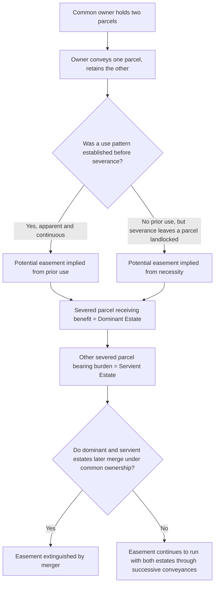

## Dominant and Servient Estates

### Overview

The dominant and servient estate framework is the structural backbone of easements appurtenant (and, more broadly, of many servitudes). The **dominant estate** (or dominant tenement) is the parcel that receives the benefit of an easement; the **servient estate** (or servient tenement) is the parcel that bears the corresponding burden. This entry examines how the relationship is defined, how it governs the scope and transfer of easements, and the doctrinal rules that depend on correctly identifying which estate is dominant and which is servient.

### Basic Definitions

**Dominant estate**

The parcel of land benefited by an easement. The owner of the dominant estate holds the right to use the servient estate for the easement's specified purpose (in an affirmative easement) or to prevent certain conduct on the servient estate (in a negative easement).

**Servient estate**

The parcel of land burdened by an easement. The owner of the servient estate must tolerate the dominant owner's specified use, or refrain from the restricted conduct, while retaining all other rights of ownership and use not inconsistent with the easement.

**[Inference]** This terminology traces directly to the Roman law concepts of *praedium dominans* (dominant land) and *praedium serviens* (servient land), preserved essentially unchanged through English and American common law reception.

### The Requirement of Two Distinct Estates

For an easement appurtenant to exist, there must be two separate parcels under separate ownership at the relevant time:

- **Separate ownership requirement**: If the same person owns both the would-be dominant and servient parcels, no easement can exist between them — an owner cannot hold an easement over their own land, since the underlying purpose of an easement (regulating the relationship between two different owners) is absent.
- **Effect of subsequent unity of ownership (merger)**: If a dominant and servient estate later come under common ownership, any existing easement between them is extinguished by the doctrine of **merger**. If the parcels are later resold separately, the previously extinguished easement does not automatically revive; a new easement would need to be created (though implication from prior use may apply if the elements are satisfied).
- Easements in gross do not require a dominant estate at all, since the benefit runs to a person or entity rather than to land — this is the key structural distinction between easements appurtenant and easements in gross.

### How Courts Identify the Dominant and Servient Estates

**From the instrument**

Where an easement is created by express grant or reservation, the creating instrument typically identifies both estates by legal description, plat reference, or metes and bounds. Courts give effect to this express identification.

**From context, when ambiguous**

Where the instrument is ambiguous, courts look to:

- Which parcel plausibly benefits from the described use (accommodation analysis).
- The parties' apparent purpose and the circumstances of the grant.
- Whether one party owned an adjoining parcel that would logically be the dominant estate.
- The presumption favoring appurtenant status (and, within that, favoring identification of a dominant estate) discussed in the appurtenant/in-gross classification analysis.

**In implied and prescriptive easements**

- **Implication from prior use**: The formerly unified parcel is severed into what becomes the dominant and servient portions at the moment of severance; the prior use pattern (before severance, when both were held by a common owner) determines which portion benefits and which is burdened.
- **Implication from necessity**: The landlocked parcel becomes the dominant estate; the parcel providing access becomes the servient estate.
- **Prescription**: The party engaging in the open, continuous, adverse use for the statutory period becomes the dominant estate's beneficiary; the estate over which the use occurred becomes servient.

### The Accommodation Requirement and Its Link to the Dominant Estate

A right can only be an easement appurtenant if it accommodates (benefits the use and enjoyment of) the dominant estate itself, not merely the personal convenience of whoever happens to own it. This has several doctrinal consequences:

- **No expansion to other property**: The dominant owner may use the easement only for the benefit of the dominant estate as originally defined — not to benefit additional land the dominant owner later acquires (the "no extension to after-acquired land" rule). If the dominant owner acquires an adjoining parcel and attempts to route traffic through the easement to serve the new parcel, this typically constitutes misuse of the easement and can be enjoined.
- **Geographic proximity is generally expected**, though not strictly required in every jurisdiction: some easements appurtenant have been recognized between non-adjoining parcels where the servient estate still meaningfully facilitates use of the dominant estate (for example, a right of way crossing an intervening third parcel to reach a somewhat distant dominant estate).
- **Personal benefits do not qualify**: A right that benefits the dominant owner personally, unconnected to their use of the land itself (for example, a right to use the servient owner's private swimming pool with no connection to the dominant land's own use or enjoyment), does not satisfy accommodation and is more likely a license or a personal easement in gross.

### Transfer and Succession Rules Tied to Each Estate

| Rule | Dominant Estate | Servient Estate |
| --- | --- | --- |
| Effect of conveyance | Benefit of easement passes automatically to new owner, even without explicit mention in the deed | Burden of a properly created and recorded (or otherwise enforceable) easement passes automatically to new owner |
| Effect of subdivision of the estate | Each newly created lot generally retains the benefit if the easement can serve each without overburdening the servient estate (subject to the "one stock" and no-overburdening limitations) | Subdivision does not eliminate the burden; the easement continues to burden whichever portion(s) of the servient land it physically occupies or affects |
| Notice to purchasers | Purchasers of the dominant estate benefit regardless of notice, since they are receiving a benefit | Purchasers of the servient estate are bound only if they had actual, constructive (recorded), or inquiry notice of the easement |
| Effect of a mortgage or lien | Generally unaffected — the benefit passes with foreclosure sales of the dominant estate | An easement predating a mortgage generally survives foreclosure; one created after typically does not survive foreclosure by a senior lienholder unless the lienholder consented |

### Overburdening the Servient Estate

A recurring issue is whether use of a dominant estate can expand — through subdivision, changed use, or increased intensity — so much that it overburdens the servient estate beyond what was originally contemplated.

**Key Points**

- Courts assess overburdening by comparing the current use's nature, frequency, and intensity against the easement's original purpose and scope, as fixed at creation (or, for implied/prescriptive easements, by the historical pattern of use).
- **Subdivision of the dominant estate** into multiple lots, each separately claiming the benefit of the same right of way, is a common source of overburdening disputes; many courts allow reasonable subdivision-related increases in use but will enjoin uses that impose a substantially different or more burdensome character of use than originally intended.
- The servient owner may seek injunctive relief or damages where overburdening is established, though courts are generally reluctant to terminate the easement outright for overburdening alone, preferring to limit or enjoin only the excessive use.
- **[Inference]** The Restatement (Third) § 4.10 and § 4.13 address these principles by directing courts to interpret the scope of a servitude in light of its purpose and to permit only those changes in use reasonably foreseeable at creation, or that do not impose an unreasonable additional burden on the servient estate.

### Illustrative Examples

**Example**

*Basic dominant/servient relationship*: Owner A's landlocked parcel (Lot 2) is granted a right of way across Owner B's parcel (Lot 1) to reach the public road. Lot 2 is the dominant estate because it receives the benefit of access; Lot 1 is the servient estate because it bears the burden of the crossing.

**Example**

*Merger extinguishing the relationship*: If Owner A later purchases Lot 1 from Owner B, uniting ownership of both the dominant and servient estates in Owner A, the easement is extinguished by merger. If Owner A subsequently sells Lot 1 alone to a new buyer without re-establishing the right of way, no easement automatically exists for Lot 2 across Lot 1 unless a new one is created (though the elements for implication from prior use might be met if Owner A used the same path for access during the period of common ownership).

**Example**

*No expansion to after-acquired land*: Owner A's Lot 2 (dominant estate) has a right of way across Lot 1 for access to Lot 2 only. Owner A later purchases adjoining Lot 3 and begins routing all traffic destined for Lot 3 through the Lot 1 right of way. This use exceeds the accommodation limits of the original easement, since the easement was created to benefit Lot 2, not Lot 3, and the servient owner of Lot 1 can seek to enjoin the expanded use.

### Diagram: Dominant/Servient Relationship Through Time

### Diagram: Estate Relationship and Key Rules

<svg xmlns="http://www.w3.org/2000/svg" viewBox="0 0 760 320" font-family="Helvetica, Arial, sans-serif">
<text x="380" y="26" text-anchor="middle" font-size="17" font-weight="bold" fill="#1a1a1a">Dominant and Servient Estate Relationship (svg_diagram)</text>
<rect x="80" y="60" width="240" height="180" fill="#dfeeff" stroke="#2e5cb8" stroke-width="2" />
<text x="200" y="50" text-anchor="middle" font-size="13" font-weight="bold" fill="#1a1a1a">Servient Estate</text>
<text x="200" y="130" text-anchor="middle" font-size="11" fill="#333">Bears the burden</text>
<text x="200" y="150" text-anchor="middle" font-size="11" fill="#333">Retains all rights not</text>
<text x="200" y="166" text-anchor="middle" font-size="11" fill="#333">inconsistent with easement</text>
<text x="200" y="190" text-anchor="middle" font-size="11" fill="#333">Burden binds successors</text>
<text x="200" y="206" text-anchor="middle" font-size="11" fill="#333">who have notice</text>
<rect x="440" y="60" width="240" height="180" fill="#e6f7e6" stroke="#2e8b57" stroke-width="2" />
<text x="560" y="50" text-anchor="middle" font-size="13" font-weight="bold" fill="#1a1a1a">Dominant Estate</text>
<text x="560" y="130" text-anchor="middle" font-size="11" fill="#333">Receives the benefit</text>
<text x="560" y="150" text-anchor="middle" font-size="11" fill="#333">Benefit passes automatically</text>
<text x="560" y="166" text-anchor="middle" font-size="11" fill="#333">on conveyance</text>
<text x="560" y="190" text-anchor="middle" font-size="11" fill="#333">Use limited to original</text>
<text x="560" y="206" text-anchor="middle" font-size="11" fill="#333">accommodation purpose</text>
<line x1="320" y1="150" x2="440" y2="150" stroke="#b8322e" stroke-width="3" marker-end="url(#arrow3)" />
<text x="380" y="270" text-anchor="middle" font-size="12" fill="#333" font-weight="bold">Easement connects the two estates</text>
</svg>

**Next Steps**

- The Accommodation (Touch and Concern) Requirement for Easements
- Merger Doctrine and Revival of Extinguished Easements
- Overburdening the Servient Estate and Subdivision of the Dominant Estate
- Implied Easements from Prior Use: Severance and Apparent Use Requirements
- Easements by Necessity: Elements and the Landlocked Parcel Rule
- Notice Requirements and the Recording Acts as Applied to Servient Estate Purchasers
- Scope of Use Limitations and the "No Extension to After-Acquired Land" Rule
- Foreclosure and Priority Rules Affecting Easements on the Servient Estate