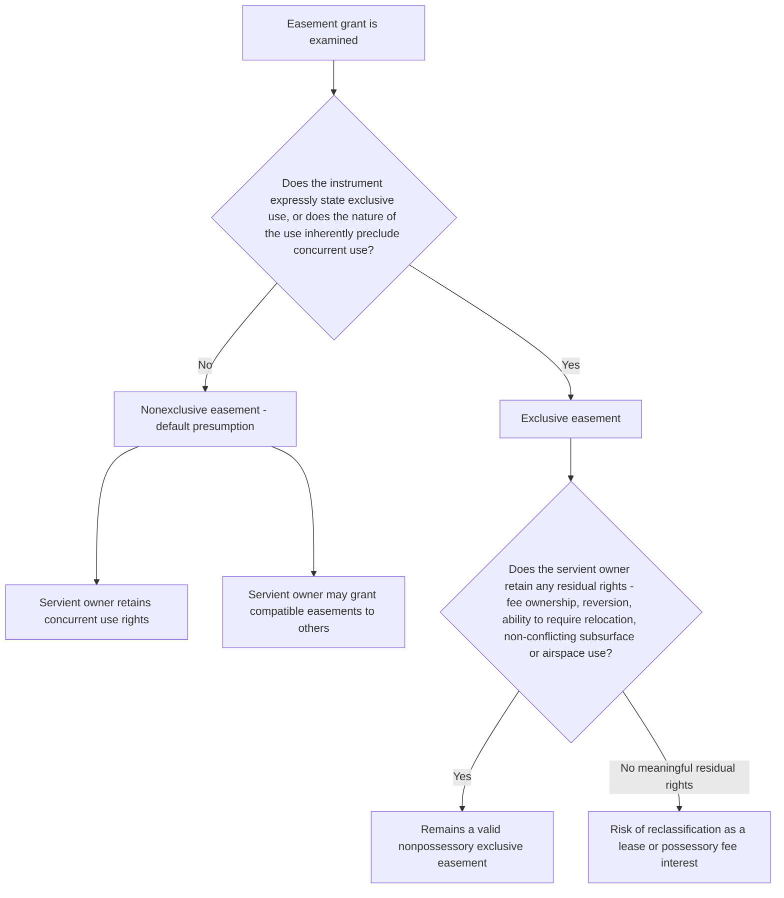

## Exclusive versus Nonexclusive Easements

### Overview

Easements are also classified by whether the servient owner retains the right to use the burdened area concurrently with the easement holder. A **nonexclusive easement** permits the servient owner (and often other easement holders) to continue using the same area for purposes compatible with the easement. An **exclusive easement** grants the holder rights so complete over the burdened area that the servient owner's own use is effectively excluded, at least within that specific area and for that specific purpose. This distinction is doctrinally important because an easement that becomes truly exclusive risks being reclassified as a possessory interest (a fee or a lease) rather than a genuine nonpossessory easement, and it also governs whether the easement holder may exclude third parties or license others to use the area.

### Nonexclusive Easements (the Default Rule)

**Definition**

A nonexclusive easement allows the easement holder to use the servient land for the specified purpose while the servient owner retains the right to use the same land in any manner not inconsistent with the easement, including granting additional easements to third parties over the same area if those additional uses do not unreasonably interfere with the original easement.

**Key Points**

- Nonexclusivity is the **default presumption** for easements: absent express language or clear circumstances indicating exclusivity, courts presume an easement is nonexclusive.
- The servient owner may continue farming, building non-interfering structures, or granting a second easement over the same right of way to another party (e.g., allowing a neighboring parcel to also use a shared driveway), provided the additional use does not unreasonably burden or interfere with the original easement holder's rights.
- Most rights of way, utility easements, and drainage easements are nonexclusive: the servient owner can still walk across, farm around, or otherwise use the surface consistent with the easement's purpose.

**Example**

A recorded right-of-way easement allows Owner B to drive across a gravel path on Owner A's land to reach the public road. Because the easement is nonexclusive, Owner A may still use the same path to access other parts of A's own property, may permit a delivery truck to also cross using the same path, and may grant a similar right of way to a different neighbor over the same strip, so long as B's use of the path for access is not unreasonably obstructed.

### Exclusive Easements

**Definition**

An exclusive easement grants the holder such complete and dominant control over the use of the burdened area that the servient owner is effectively excluded from using that specific area for the easement's purpose, and often from using it at all. Exclusivity does not necessarily mean the servient owner loses all rights to the underlying land (they typically retain the fee and residual rights, such as the right to convey the servient parcel subject to the easement), but their practical ability to use the specific burdened area is displaced.

**When exclusivity is found**

- **Explicit language**: The creating instrument states the grantee has the "sole and exclusive right" to use a specified strip or area.
- **Nature of the use**: Some uses are inherently exclusive by their physical character even without express language — for example, an underground pipeline or cable easement occupying a narrow strip in a manner that as a practical matter precludes any other simultaneous use of that exact strip, or a billboard easement granting the exclusive right to install and maintain advertising structures on a defined area.
- **Mineral and utility easements**: Certain mineral extraction easements or utility corridor easements are treated as exclusive because shared or concurrent use by the servient owner or third parties would be physically incompatible with the easement's purpose (e.g., excavation for a mining easement).

**Right to exclude third parties**

A significant practical consequence of exclusivity is that an exclusive easement holder generally has standing to exclude not only the servient owner from interfering with the specific use, but also third parties (including other potential easement holders) from using the same burdened area for a competing or inconsistent purpose — a right that a nonexclusive easement holder typically lacks, since a nonexclusive holder must generally tolerate the servient owner authorizing compatible concurrent uses.

### The Exclusivity/Possession Boundary Problem

**Key Points**

- Courts and the Restatement are careful to distinguish an "exclusive easement" (still nonpossessory, still an easement) from an arrangement so complete that it actually transfers **possession**, which would make it a lease or a fee interest rather than an easement at all.
- The traditional common law rule (still followed in many jurisdictions) holds that a purported "easement" granting truly exclusive, unlimited use of a defined area — such that the servient owner retains no meaningful use of that space for any purpose — may be reclassified as a fee simple determinable, a fee simple subject to condition, or a lease, particularly if the grant lacks the traditional touch-and-concern connection to a dominant estate.
- The seminal cautionary case pattern (illustrated in cases addressing "exclusive easements" for parking or storage) arises when parties label an arrangement an "easement" to avoid landlord-tenant law, tax consequences, or other possessory-interest implications, but courts look past the label to the substance of the rights granted.
- **[Inference]** The Restatement (Third) § 1.2, comment d, addresses this by clarifying that an easement, even an exclusive one, remains nonpossessory if the servient owner retains any residual rights of ownership over the burdened area — such as the right to convey the underlying fee, the right to use the airspace above or subsurface below the easement area in ways not inconsistent with it, or reversionary rights upon termination — whereas an arrangement conferring truly unrestricted use with no meaningful residual owner rights functions as a possessory transfer regardless of its label.

### Comparative Table

| Feature | Nonexclusive Easement | Exclusive Easement |
| --- | --- | --- |
| Servient owner's concurrent use | Retained, subject to non-interference with the easement | Effectively excluded within the burdened area |
| Default presumption | Yes — this is the baseline assumption | No — must be shown by clear language or the nature of the use |
| Servient owner may grant similar rights to others | Yes, if compatible | Generally no, without violating the exclusive holder's rights |
| Holder's standing to exclude third parties | Limited; primarily protects against interference with the specific use | Broader; may exclude third parties from the burdened area for competing uses |
| Risk of reclassification as possessory interest | Low | Higher — courts scrutinize whether it has become a de facto lease or fee interest |
| Typical examples | Shared rights of way, drainage easements, most utility easements | Certain pipeline or cable corridor easements, billboard easements, some parking/storage easements, exclusive-use mineral easements |

### Illustrative Examples

**Example**

*Nonexclusive*: A recorded utility easement grants a power company the right to install and maintain overhead power lines across a rural landowner's property. The landowner may continue to farm the land beneath the lines, cross the area freely, and even grant an additional easement to a telecommunications company to run cables along the same corridor, as long as the additional use does not interfere with the power company's lines. This remains nonexclusive because multiple compatible uses can coexist.

**Example**

*Exclusive*: A commercial building owner grants a neighboring business "the sole and exclusive right to use the rear 10 parking spaces of the lot," specifying that no other party, including the grantor, may park in or otherwise use those spaces. Courts are likely to find this exclusive because of the explicit language and the physically incompatible nature of shared parking use — but a court may also scrutinize whether this arrangement has become a de facto lease of that portion of the lot, particularly if the grantee has been given a key, gate access, or the ability to erect signage excluding all others, since these facts suggest a transfer of possession rather than a mere nonpossessory use right.

**Example**

*Boundary case*: A "utility easement" purports to grant a telecommunications company the exclusive and perpetual right to install, maintain, and exclusively control an entire fenced rooftop area of a building for antenna equipment, with the servient building owner having no access to or use of that rooftop area at all. A court evaluating whether this is truly an easement (even an exclusive one) versus a disguised lease will examine whether the building owner retains any residual rights (such as receiving rent-like periodic payments framed as "easement fees," retaining the right to require relocation of equipment, or retaining the underlying fee with a right of reversion) — the presence of few or no residual owner rights increases the likelihood a court treats the arrangement as a lease rather than an easement, which matters for landlord-tenant law, property tax treatment, and termination rules.

### Diagram: Exclusivity Analysis

### Diagram: Servient Owner's Retained Rights by Easement Type

<svg xmlns="http://www.w3.org/2000/svg" viewBox="0 0 760 300" font-family="Helvetica, Arial, sans-serif">
<text x="380" y="26" text-anchor="middle" font-size="17" font-weight="bold" fill="#1a1a1a">Servient Owner's Retained Use by Easement Type (svg_diagram)</text>

<text x="190" y="55" text-anchor="middle" font-size="13" font-weight="bold" fill="`#2e8b57`">Nonexclusive Easement</text>

<rect x="80" y="70" width="220" height="150" fill="`#e6f7e6`" stroke="`#2e8b57`" stroke-width="2" />

<text x="190" y="110" text-anchor="middle" font-size="11" fill="#333">Servient owner: full concurrent use</text>

<text x="190" y="130" text-anchor="middle" font-size="11" fill="#333">Easement holder: shared, compatible use</text>

<text x="190" y="150" text-anchor="middle" font-size="11" fill="#333">Third-party grants: permitted if</text>

<text x="190" y="166" text-anchor="middle" font-size="11" fill="#333">non-interfering</text>

<text x="580" y="55" text-anchor="middle" font-size="13" font-weight="bold" fill="`#b8322e`">Exclusive Easement</text>

<rect x="470" y="70" width="220" height="150" fill="`#fdf3e7`" stroke="`#b8322e`" stroke-width="2" />

<text x="580" y="110" text-anchor="middle" font-size="11" fill="#333">Servient owner: excluded from</text>

<text x="580" y="126" text-anchor="middle" font-size="11" fill="#333">burdened area's specific use</text>

<text x="580" y="146" text-anchor="middle" font-size="11" fill="#333">Easement holder: dominant, often</text>

<text x="580" y="162" text-anchor="middle" font-size="11" fill="#333">sole control of that area</text>

<text x="580" y="182" text-anchor="middle" font-size="11" fill="#333">Risk: reclassification as lease/fee</text>

<text x="580" y="198" text-anchor="middle" font-size="11" fill="#333">if no residual rights remain</text>

</svg>

**Next Steps**

- The Nonpossessory Nature of Easements and the Possession/Use Boundary
- Distinguishing Easements from Leases: Doctrinal Tests and Consequences
- Servient Owner Rights and Limitations Under Nonexclusive Easements
- Scope and Interference Standards for Shared Rights of Way
- Exclusive Mineral and Utility Corridor Easements in Practice
- Third-Party Exclusion Rights of Exclusive Easement Holders
- Tax and Landlord-Tenant Law Consequences of Easement Mischaracterization
- Restatement (Third) § 1.2 Comment d on the Nonpossessory Nature of Exclusive Easements