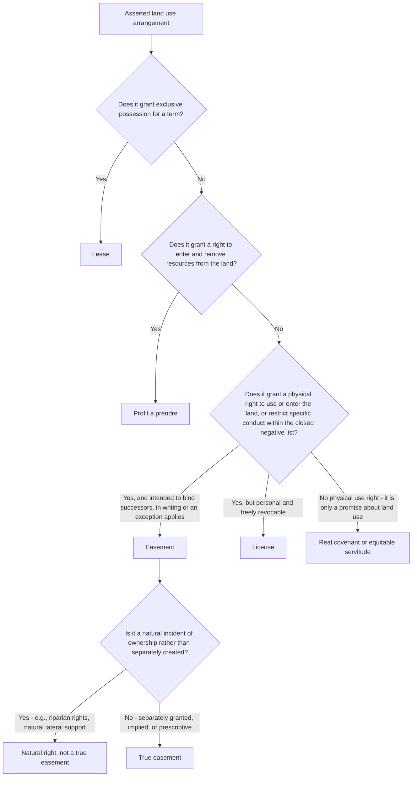

## Easements Distinguished from Other Land Interests

### Overview

Easements sit alongside several related but doctrinally distinct land-use devices: licenses, profits Ă prendre, real covenants, equitable servitudes, leases, and fee interests defeasible on condition. Correctly classifying an arrangement matters because each category carries different rules governing creation formalities, revocability, transferability, remedies for breach, and termination. This entry works through the doctrinal tests courts use to distinguish an easement from each of these related interests.

### Easement vs. License

**Definition of a license**

A license is mere permission to enter or use land that does not create an interest in the land itself. It is personal to the licensee and, at common law, freely revocable by the licensor at will, regardless of the parties' original expectations.

**Key distinguishing factors**

| Factor | Easement | License |
| --- | --- | --- |
| Interest in land created | Yes | No — mere personal permission |
| Revocability | Generally irrevocable absent a termination event | Freely revocable at the will of the licensor |
| Formalities required | Statute of Frauds compliance (writing) for express creation, absent an exception | No writing generally required |
| Runs with the land | Yes, to successors with notice | No — personal to the licensee, does not bind successors or benefit assignees |
| Assignability | Yes, generally (subject to appurtenant/in-gross rules) | Generally no, absent express terms |

**The license-becomes-irrevocable exceptions**

Courts recognize situations where a license, though nominally revocable, becomes functionally irrevocable through:

- **License coupled with an interest**: where the license accompanies a valid property interest (e.g., a right to enter land to remove timber the licensee has purchased) — the license cannot be revoked without also destroying the underlying interest.
- **Estoppel**: where the licensee has made substantial, reasonably foreseeable expenditures in reliance on the licensor's representation or acquiescence, most courts will treat the license as irrevocable for so long as the purpose for which it was granted continues, effectively converting it into something functioning like an easement. This is sometimes described as an "easement by estoppel."

**Example**

Owner A orally tells neighbor B, "Go ahead and run your driveway across the corner of my lot." If B merely uses the corner occasionally with no investment, this is a revocable license. If B, in reliance on A's permission, pours a substantial paved driveway and connects utility lines across that corner, most courts will estop A from revoking the permission, effectively treating the arrangement as an irrevocable easement by estoppel despite the absence of a written grant.

### Easement vs. Profit Ă Prendre

**Definition of a profit**

A profit Ă prendre is the right to enter another's land and remove some part of the soil or its natural produce — timber, minerals, oil and gas, game, crops, or similar resources.

**Key distinguishing factors**

- An easement grants a right to *use* land in a specified way; a profit grants a right to *use and take something away from* the land.
- Historically, profits were treated as a distinct category, but in modern American practice, profits are generally analyzed under the same creation, transfer, and termination rules as easements — the Restatement (Third) § 1.2 treats a profit as essentially "an easement that confers the right to enter and remove things from land."
- **[Inference]** Because profits necessarily involve extraction of value from the servient land (rather than mere passage or use), disputes over profits more frequently implicate quantity limitations, exhaustion of the resource, and whether the right is exclusive (e.g., an exclusive mineral extraction profit may functionally exclude the servient owner from extracting the same resource).

**Example**

A landowner grants a neighbor "the right to enter the north forty acres and harvest timber for the next ten years." This is a profit Ă prendre because it involves removing a natural resource (timber) from the land, not merely passing across or using the land's surface.

### Easement vs. Real Covenant / Equitable Servitude

**Key distinguishing factor: physical use right vs. promise**

- An easement grants the holder the right to *physically enter or use* the servient land (or, for negative easements, to restrict specific physical conduct within the narrow closed-list categories).
- A real covenant or equitable servitude is a *promise* regarding land use — the covenantor promises to do or refrain from doing something — and does not itself grant any right of entry or physical use to the covenantee.

**Practical significance**

- A restrictive covenant preventing construction of a building over a certain height does not give the benefited owner any right to enter the burdened land; it only allows the benefited owner to enforce the promise (typically by injunction or damages) if violated.
- An easement of light, by contrast, is a recognized common law negative easement functioning similarly to a height-restriction covenant, but the closed-list limitation on negative easements means most modern "don't build this way" restrictions are structured as covenants rather than easements.
- Real covenants and equitable servitudes historically required different formation elements (privity of estate, touch and concern) than easements, though the Restatement (Third) has substantially unified the analytical frameworks for creation and validity across all these categories.

**Comparative Table**

| Feature | Easement | Real Covenant / Equitable Servitude |
| --- | --- | --- |
| Grants right of physical entry/use | Yes (affirmative) or right to restrict specific conduct (negative, closed list) | No — grants only a right to enforce a promise |
| Remedy for violation | Injunction, damages, or self-help removal of obstruction | Injunction (equitable servitude) or damages (real covenant at law) |
| Subject matter breadth | Physical use of land | Any lawful promise touching and concerning land use (broader than the closed negative easement list) |
| Historical formation requirements | Grant, reservation, implication, necessity, prescription, estoppel | Writing, intent to run, touch and concern, privity (traditional) or general validity (Restatement Third) |

### Easement vs. Lease

**Key distinguishing factor: exclusive possession**

- A lease grants the tenant **exclusive possession** of the leased premises for a defined term, subject to the landlord's reversionary interest.
- An easement, even an exclusive easement, is nonpossessory: the servient owner (or, in exclusive cases, at least some meaningful residual interest holder) retains underlying ownership and certain residual rights, while the easement holder's rights are limited to the specific use for which the easement was created.

**The boundary problem**

As addressed in the exclusive/nonexclusive easement classification, arrangements labeled "exclusive easements" that grant complete, unrestricted control with no residual owner rights risk reclassification by courts as leases, particularly where landlord-tenant law consequences (habitability duties, security deposit rules, eviction procedures) are relevant to the dispute.

### Easement vs. Fee Simple Determinable / Defeasible Fee

**Key distinguishing factor: nature of the underlying estate**

- An easement is layered *on top of* the underlying fee ownership — the servient owner retains full fee ownership subject only to the specific easement burden.
- A fee simple determinable or fee simple subject to condition subsequent is itself the underlying possessory estate, structured to automatically terminate (determinable) or be subject to termination upon breach (condition subsequent) if a stated condition occurs or ceases.
- **Example distinguishing the two**: "To the City for use as a public park, but if the land ceases to be used as a park, title reverts to Grantor" creates a fee simple determinable — the City owns the entire possessory estate, not merely an easement, though its ownership is conditional. By contrast, "Grantor grants to the City an easement for public park use" would leave underlying fee ownership with the Grantor while the City holds only a nonpossessory use right.

### Easement vs. Natural Rights (Riparian and Support Rights)

Some rights closely resembling easements arise automatically as an incident of land ownership rather than through grant, implication, prescription, or necessity:

- **Riparian rights**: rights to use adjacent water incident to owning land bordering a watercourse, which exist automatically as part of the ownership of the riparian parcel, not as a separately created easement.
- **Natural lateral and subjacent support**: at common law, every landowner has a natural right (not an easement) to have their land supported in its natural, unimproved state by adjoining land — this differs from the *easement* of support, which specifically protects a *building or other improvement* against removal of support and must typically be created affirmatively (by grant, implication, or in limited circumstances, prescription) because natural support rights alone do not protect improvements.

**[Inference]** This distinction matters because natural rights are not true easements requiring separate creation; they exist automatically as incidents of ownership, whereas the extension of support protection to buildings and structures generally requires an actual easement of support to have been created.

### Master Comparative Table

| Interest | Possessory? | Runs with Land? | Requires Physical Entry Right? | Revocable at Will? | Formal Creation Required? |
| --- | --- | --- | --- | --- | --- |
| Easement | No | Yes | Yes (affirmative) or restricts conduct (negative) | No | Yes (Statute of Frauds, or recognized exception) |
| License | No | No | Yes, but personal only | Yes | No |
| Profit Ă prendre | No | Yes | Yes, plus right to remove resources | No | Yes |
| Real covenant / equitable servitude | No | Yes | No — only a promise | No | Yes |
| Lease | Yes | Yes (as leasehold estate) | Yes, exclusively | No, absent breach/expiration | Yes (Statute of Frauds for longer terms) |
| Fee simple determinable/defeasible | Yes | N/A — it is the estate itself | N/A | N/A | Yes |
| Natural rights (riparian, lateral support) | No | Automatic incident of ownership | N/A — inherent, not granted | N/A | No — arises automatically |

### Diagram: Classification Decision Tree

**Next Steps**

- Licenses and the Doctrine of Irrevocable Licenses by Estoppel
- Profits Ă Prendre: Creation, Exclusivity, and Resource Exhaustion Issues
- Distinguishing Real Covenants and Equitable Servitudes from Easements
- The Possession/Use Boundary Between Easements and Leases
- Defeasible Fees: Determinable Estates and Conditions Subsequent
- Riparian Rights and Natural Rights of Lateral and Subjacent Support
- Easements by Estoppel: Elements and Reliance Requirements
- Statute of Frauds Requirements and Exceptions in Easement Creation