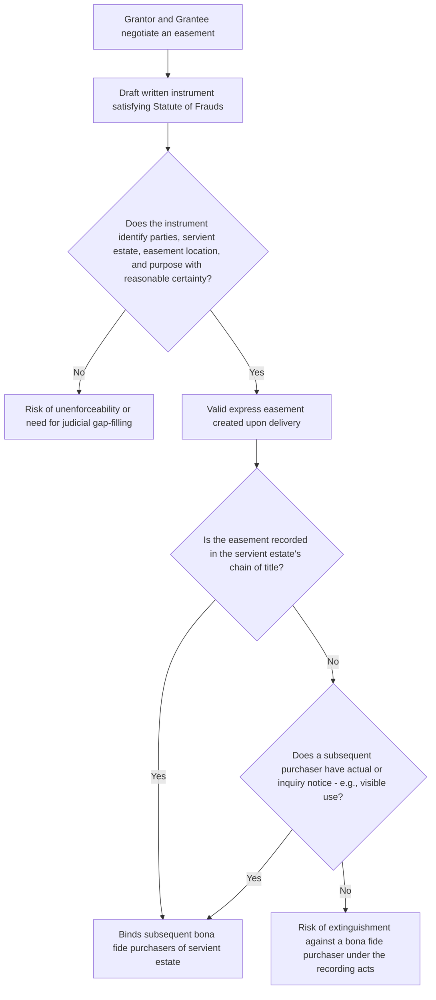

## Express Grant of an Easement

### Overview

An express grant is the most straightforward and legally secure method of creating an easement: the servient landowner affirmatively conveys an easement interest to another party through a written instrument. Because an easement is an interest in land, its express creation is governed by the Statute of Frauds, standard rules of deed construction, and the recording acts. This entry addresses the formal requirements, drafting considerations, and interpretive principles governing express easement grants, and distinguishes express grant from express reservation (its close counterpart, treated separately).

### Statute of Frauds Requirements

**Key Points**

- Because an easement is an interest in land (not merely a contractual right), its express creation must satisfy the jurisdiction's Statute of Frauds, which generally requires:
  - A writing signed by the party to be bound (the grantor/servient owner).
  - Identification of the parties.
  - A description of the servient land sufficient to identify it.
  - A description of the easement's nature, scope, and purpose sufficient for a court to enforce it and for a title examiner to identify it.
- Oral grants of easements are generally unenforceable as express easements, though they may sometimes be salvaged through the doctrine of **part performance** or through **easement by estoppel** if the elements of those separate doctrines are independently satisfied.
- **[Inference]** Courts differ on how much descriptive precision is required; a right of way described only as "a reasonable way across grantor's land" without specifying width or route may be upheld if the grantor's intent is clear and courts can supply reasonable terms, but many courts will look to any subsequent conduct by the parties (e.g., the actual path used) to fix a definite location once a general grant is not further specified.

### Essential Elements of a Valid Express Grant

**1. Competent grantor and grantee**

The grantor must own the servient estate (or an interest sufficient to grant the easement, such as a life estate holder granting an easement limited to the duration of that life estate) and have legal capacity to convey. The grantee must be a legally cognizable person or entity capable of holding the interest.

**2. Present intent to create an interest in land**

The language must manifest a present intent to grant an easement, not merely a promise to grant one in the future, and not merely permission (which would create a license rather than an easement).

**3. Sufficiently definite description of the servient estate**

The instrument must describe the burdened land with enough particularity (by metes and bounds, plat reference, or other legal description) for a title examiner or court to identify it.

**4. Sufficiently definite description of the easement itself**

- **Purpose**: what the easement is for (ingress/egress, utility lines, drainage, etc.).
- **Location and dimensions**: where on the servient estate the easement lies and how wide/large it is, where reasonably ascertainable.
- **Scope of permitted use**: the manner and intensity of use contemplated.

**5. Delivery (and, in most jurisdictions, acceptance)**

As with any conveyance of an interest in land, the instrument must be delivered with intent to convey, and (particularly relevant for a reservation running to a third party who was not the original grantor) acceptance principles may apply.

### Typical Drafting Components of an Express Easement Grant

| Component | Purpose |
| --- | --- |
| Grantor and grantee identification | Establishes the parties and, for appurtenant easements, identifies the dominant and servient estates |
| Legal description of servient estate | Identifies the burdened parcel |
| Legal description of the easement area | Fixes location, width, and boundaries of the burdened strip or area (e.g., by metes and bounds or attached exhibit/plat) |
| Statement of purpose | Defines permissible use (e.g., "for ingress, egress, and utility purposes") and constrains future scope disputes |
| Appurtenant or in gross designation | Clarifies whether the benefit is tied to a specific dominant parcel or held personally/commercially |
| Exclusivity clause | States whether the easement is exclusive or nonexclusive |
| Maintenance and repair allocation | Specifies which party bears responsibility for maintaining the easement area (often paired with an ancillary covenant, since easements alone traditionally cannot require servient owner expenditure) |
| Duration | States whether perpetual, for a term of years, or terminable upon a specified event |
| Assignability provisions | For easements in gross, clarifies whether personal or freely assignable/divisible |
| Indemnification and insurance provisions | Common in commercial utility and access easements to allocate liability |

### Methods of Express Creation

**By deed**

The most common method: a standalone easement deed, or an easement provision included within a deed conveying fee title to another parcel (e.g., "Grantor further grants to Grantee an easement for ingress and egress over the following described strip...").

**By separate easement agreement**

A dedicated instrument solely creating the easement, often used for commercial utility, pipeline, or telecommunications easements, frequently accompanied by a site plan or exhibit depicting the precise easement location.

**By plat or subdivision map**

Easements can be created by dedication on a recorded subdivision plat, where the developer's plat depicts and labels utility easements, drainage easements, or common area access easements; recording and, in many jurisdictions, government approval and public acceptance operate to create these easements without a separate deed for each lot.

**By declaration (common-interest communities)**

Easements for access to common areas, shared amenities, and utility corridors within condominiums and planned communities are commonly created through the master declaration recorded against all units/lots.

### Recording and Priority

**Key Points**

- Although an easement is valid between the original grantor and grantee upon proper execution and delivery even without recording, **recording** in the servient estate's chain of title is critical to bind subsequent bona fide purchasers of the servient estate.
- Under the recording acts (race, notice, or race-notice, depending on the jurisdiction), an unrecorded easement may be extinguished as against a subsequent bona fide purchaser of the servient estate who takes for value without actual or constructive notice.
- **Inquiry notice** may still bind a subsequent purchaser even absent recording if visible evidence of the easement's existence (a paved road, utility poles, a fence line marking a right of way) would prompt a reasonable purchaser to investigate further.
- Easements should ideally be recorded against both the servient and, where applicable, the dominant estate's chain of title, to ensure the benefit and burden are both discoverable.

### Interpretation of Express Grants

**General principle**

Under the Restatement (Third) § 4.1, an express easement is interpreted to give effect to the intent of the parties as manifested in the language of the instrument, read in light of the circumstances surrounding its creation — a departure from the older common law canon of construing easement grants narrowly against the grantee.

**Common interpretive issues**

- **Ambiguous location**: If the instrument grants "a right of way across grantor's land" without specifying exact location, courts typically look to any subsequently designated or historically used path to fix the location; once fixed by mutual conduct, the location generally cannot be unilaterally relocated by either party absent agreement (though the Restatement (Third) § 4.8 permits the servient owner to make reasonable changes to the location under specified conditions, discussed further under scope of easements).
- **Ambiguous scope**: If the purpose clause is broad ("for ingress and egress"), courts generally allow reasonable evolution of use consistent with that purpose (e.g., adaptation from horse-and-carriage to motor vehicle use) but will not permit use for an entirely different purpose (e.g., converting a pedestrian access easement into a commercial delivery route) without a new grant.
- **Appurtenant vs. in gross ambiguity**: addressed via the presumption favoring appurtenant status discussed in the appurtenant/in-gross classification.

### Illustrative Examples

**Example**

*Basic express grant by deed*: "Grantor hereby grants to Grantee, his heirs and assigns, a perpetual, nonexclusive easement for ingress, egress, and utility purposes over, under, and across the following described ten-foot-wide strip of land: [metes and bounds description], appurtenant to and for the benefit of Grantee's adjoining parcel described as [legal description]." This grant satisfies the Statute of Frauds, identifies both estates, states the purpose, fixes dimensions, and clarifies appurtenant status and nonexclusivity.

**Example**

*Commercial utility easement by separate agreement*: A power company and a landowner execute a standalone "Easement Agreement" granting the power company an exclusive easement in gross across a 30-foot corridor for the installation, operation, maintenance, and replacement of electric transmission facilities, including rights of ingress and egress for maintenance vehicles, together with the right to trim or remove vegetation interfering with the lines, recorded in the county land records to bind future owners of the servient parcel.

**Example**

*Subdivision plat easement*: A recorded subdivision plat labels a 15-foot strip along the rear of each lot as a "Utility and Drainage Easement," dedicated to the applicable utility providers and the municipality. Purchasers of each lot take title subject to this easement automatically upon recording and government acceptance, without needing a separate easement deed for each individual lot.

### Diagram: Express Grant Formation and Enforceability Path

**Next Steps**

- Express Reservation of an Easement: Distinctions from Express Grant
- The Statute of Frauds and Its Exceptions in Easement Creation
- Recording Acts and Notice Requirements Affecting Easement Priority
- Drafting Considerations for Commercial Utility and Access Easements
- Interpretation and Scope of Express Easements Under Restatement (Third) § 4.1
- Easements Created by Subdivision Plat and Governmental Dedication
- Fixing and Relocating the Location of an Ambiguously Described Easement
- Maintenance Obligations and Ancillary Covenants Accompanying Easements