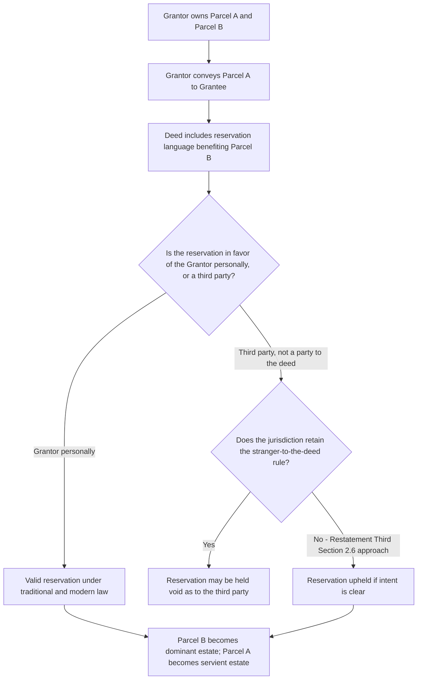

## Express Reservation of an Easement

### Overview

An express reservation arises when a landowner conveys a parcel to another but retains (reserves) an easement over the conveyed land for the benefit of land the grantor keeps. Unlike an express grant, where the grantor creates a new right in favor of the grantee, a reservation works in the opposite direction: the grantor is the one who ends up holding the benefit, while the grantee (the new owner of the conveyed parcel) takes title subject to the burden. Historically, reservations were treated with special formal skepticism because they appeared to require a grantor to convey an interest to themselves, and this history still shapes several modern doctrinal wrinkles, particularly the reservation-in-favor-of-a-third-party problem.

### Basic Mechanics

**Definition**

A reservation is created when a grantor, in the instrument conveying the servient estate to a grantee, reserves for the grantor's own benefit (typically for land the grantor retains) an easement over the land being conveyed.

**Typical structure**

- Grantor owns Parcel A and Parcel B.
- Grantor conveys Parcel A to Grantee, but includes language in the deed reserving an easement over Parcel A for the benefit of Parcel B, which Grantor retains.
- Parcel B becomes the dominant estate; Parcel A (now owned by Grantee) becomes the servient estate.

**Example**

"Grantor conveys to Grantee the parcel described as [Parcel A], reserving unto Grantor, his heirs and assigns, a perpetual easement for ingress and egress over the northern ten feet of Parcel A, for the benefit of Grantor's adjoining Parcel B." Here, Grantee takes Parcel A subject to the burden, while Grantor keeps the benefit appurtenant to Parcel B.

### Historical Distinction Between "Reservation" and "Exception"

Common law historically distinguished:

- **Reservation**: creates a *new* right in the grantor that did not exist before the conveyance (such as a new easement carved out of the estate being conveyed).
- **Exception**: excludes something that already existed from the scope of the conveyance (such as excepting a pre-existing easement, mineral right, or a portion of the land itself from the grant).

**[Inference]** Modern courts generally do not treat this historical terminological distinction as outcome-determinative; most jurisdictions today interpret the substance of the clause (does it create a new right or exclude something already existing) regardless of whether the drafter used the word "reserve" or "except," consistent with the modern preference for interpreting instruments according to intent rather than rigid historical labels.

### The Historical "Stranger to the Deed" Rule

**The traditional common law rule**

At common law, a significant number of jurisdictions held that a grantor **could not reserve an easement in favor of a third party** — someone who was not a party to the deed itself (the "stranger to the deed" rule). Under this rule:

- If Grantor conveyed Parcel A to Grantee "reserving to X (a third party) an easement over Parcel A," many common law courts held this reservation void, because a grantor could only reserve rights back to themselves, not create new rights in a stranger to the conveyance.
- This rule stemmed from feudal-era formalism regarding livery of seisin and the technical mechanics of reservations as retaining something the grantor already held, rather than newly creating rights in someone outside the transaction.

**Modern erosion of the rule**

- A substantial and growing number of American jurisdictions have abolished the stranger-to-the-deed rule, allowing a grantor to reserve an easement in favor of a third party where the parties' intent is clear.
- The **Restatement (Third) of Property: Servitudes § 2.6** explicitly rejects the stranger-to-the-deed rule, treating a reservation in favor of a third party as valid so long as ordinary requirements for creating a servitude (writing, intent, definiteness) are satisfied.
- Some jurisdictions retain the traditional rule or apply it in modified form, particularly for reservations not clearly manifesting an intent to benefit the third party.
- **[Inference]** Because adherence to this rule varies significantly by jurisdiction, an attorney drafting a reservation intended to benefit someone other than the grantor should verify current local law and, where the rule persists, consider structuring the transaction as two separate simultaneous conveyances (grantor conveys to third party, then to the ultimate grantee, each subject to appropriate easements) to avoid reliance on a reservation that a court might invalidate.

### Reservation of an Easement vs. an Interest Already Excepted

Courts also distinguish a reservation of an easement from situations where a grantor conveys the entire fee without any reservation, then separately attempts to create an easement after the fact — this second scenario is not a reservation at all but a subsequent express grant, requiring the new owner's cooperation, since a grantor cannot unilaterally reserve rights in land no longer owned.

### Consideration and Formal Requirements

**Key Points**

- A reservation, like an express grant, must satisfy the Statute of Frauds: it must be in a signed writing (almost always as part of the deed conveying the servient estate itself, though some jurisdictions permit reservation by separate contemporaneous instrument).
- No separate consideration beyond that supporting the underlying conveyance is typically required, since the reservation is understood as part of the overall bargain by which the grantor parted with the servient parcel.
- The reservation must satisfy the same definiteness requirements as an express grant: identification of the servient land, the location and scope of the easement, and its purpose.

### Interpretation Issues Specific to Reservations

**Ambiguity as to scope**

Because the grantor drafted the reservation while retaining the benefit, some courts historically applied a canon construing reservations *against* the grantor (on the theory that the grantor, as the drafter, should bear the risk of ambiguity, similar to *contra proferentem* in contract law), though this canon has weakened under the Restatement's general shift toward intent-based interpretation without an automatic pro-grantee or pro-grantor bias.

**Merger with subsequent conveyances**

If the grantor later conveys the retained dominant parcel (Parcel B, in the earlier example) to a new owner, the benefit of the properly reserved appurtenant easement passes automatically with that conveyance, just as it would for an easement created by grant.

### Comparative Table: Grant vs. Reservation

| Feature | Express Grant | Express Reservation |
| --- | --- | --- |
| Who ends up with the benefit | The grantee (recipient of the conveyance) or the person named in the grant | The grantor (or, where permitted, a third party) |
| Who bears the burden | The servient landowner, who is the grantor of the easement | The grantee of the conveyed parcel, who takes subject to the reserved easement |
| Typical instrument | Deed of the servient estate to the easement holder, or separate easement agreement | Deed conveying the servient estate to a new owner, with reservation language included |
| Historical formal skepticism | Minimal — grants were always straightforwardly recognized | Significant — the stranger-to-the-deed rule historically limited third-party beneficiary reservations |
| Modern trend | Fully recognized without special limitation | Third-party reservations increasingly recognized (Restatement Third § 2.6), though state law varies |

### Illustrative Examples

**Example**

*Simple reservation for grantor's own benefit*: A farmer owns two adjoining fields, the North Field and the South Field. The farmer sells the North Field to a buyer but reserves an easement over the North Field's existing farm road for the benefit of the South Field, which the farmer retains, allowing continued access to the South Field via the road crossing the North Field. This is unambiguously valid under all approaches because the reservation benefits the grantor personally, not a third party.

**Example**

*Reservation in favor of a third party (jurisdiction-dependent)*: A landowner conveys a rear lot to Buyer A but includes language in the deed reserving an easement across the rear lot "for the benefit of my neighbor, Owner C," who was not a party to the deed. In a jurisdiction retaining the stranger-to-the-deed rule, a court might hold this reservation void as to Owner C, since Owner C is a stranger to the conveyance; in a jurisdiction following the Restatement (Third) § 2.6 approach, the reservation would likely be upheld if the grantor's intent to benefit Owner C is clear from the instrument.

**Example**

*Practical workaround given jurisdictional uncertainty*: To avoid relying on an uncertain reservation-to-a-third-party rule, a grantor wishing to benefit a neighbor who is not part of the primary conveyance might instead structure the transaction as a direct express grant of the easement to the neighbor via a separate instrument, executed simultaneously with (or shortly before) the conveyance of the servient parcel to the new owner, ensuring the easement is validly created by grant rather than relying on a potentially invalid reservation to a stranger.

### Diagram: Reservation Mechanics

**Next Steps**

- The Stranger-to-the-Deed Rule and Its Modern Abrogation
- Distinguishing Reservations from Exceptions in Deed Construction
- Restatement (Third) § 2.6 on Third-Party Beneficiary Reservations
- Express Grant of an Easement: Formal Requirements and Drafting
- Interpretation Canons for Ambiguous Reservation Language
- Structuring Simultaneous Conveyances to Avoid Third-Party Reservation Risk
- Merger and Transfer of Reserved Easement Benefits on Resale of the Dominant Estate
- Statute of Frauds Compliance for Easements Created by Reservation