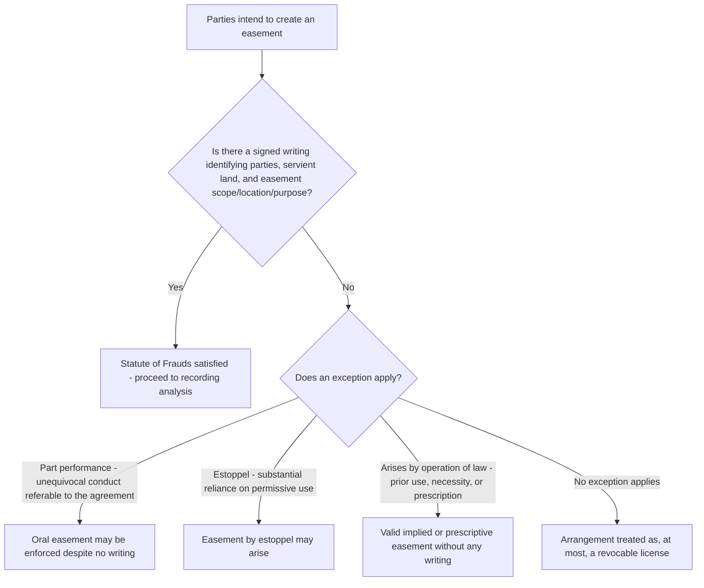

## Statute of Frauds and Writing Requirements

### Overview

Because an easement is a nonpossessory interest in land, its express creation is subject to the Statute of Frauds, which generally requires a signed writing to make the transaction enforceable. This entry examines the statutory basis for the writing requirement, what a compliant writing must contain, the recognized exceptions that allow enforcement of an otherwise noncompliant oral arrangement, and how courts handle partial or ambiguous compliance.

### Statutory Basis and General Rule

**Key Points**

- Every American jurisdiction has adopted some version of the Statute of Frauds, tracing back to the English Statute of Frauds (1677), which requires that any transfer of an interest in land be evidenced by a writing signed by the party against whom enforcement is sought.
- Because an easement is classified as an interest in land (not merely a personal or contractual right), an oral agreement purporting to create an easement is generally unenforceable as an easement, even if the parties clearly intended to create one and both parties have relied on the oral understanding to some degree.
- **[Inference]** The policy rationale is the same as for other Statute of Frauds applications: preventing fraudulent claims of oral land grants, ensuring certainty in land records, and protecting subsequent purchasers who rely on the recorded chain of title.

### Elements of a Compliant Writing

**1. Signature of the party to be bound**

The writing must be signed by the grantor (the servient owner, or the party granting/reserving the easement). Some jurisdictions require signatures of both parties for certain instrument types, but the majority rule requires only the signature of the party against whom the easement is being enforced (typically the grantor of the burden).

**2. Identification of the parties**

The instrument should identify the grantor and grantee (or, for reservations, the retained beneficiary) with reasonable certainty.

**3. Description of the servient land**

A legal description sufficient to identify the burdened parcel — by metes and bounds, lot and block reference to a recorded plat, or other legally sufficient method. A description so vague that the land cannot be identified will render the writing insufficient.

**4. Description of the easement's nature, purpose, and (where applicable) location**

- **Purpose**: what the easement is for.
- **Location**: where within the servient parcel the easement lies, if the parties intend a fixed location (a right of way, for example) as opposed to a floating easement to be located later by agreement or conduct.
- **Scope**: the manner and intensity of permitted use.

**5. Present intent to convey an interest in land**

The language must reflect the grantor's present intent to create a binding property interest, not merely an intent to negotiate further or a promise to grant an easement at a future, unspecified date.

### The Formal Writing Requirement Does Not Require a Particular Document Type

**Key Points**

- A compliant writing satisfying the Statute of Frauds need not be a formal, separately captioned "easement deed." It can be contained within:
  - A deed conveying fee title to the dominant or servient parcel, with an easement provision embedded in the conveyance.
  - A recorded subdivision plat containing express easement dedications.
  - A recorded declaration of covenants, conditions, and restrictions for a common-interest community.
  - A separate written easement agreement or license agreement that, in substance, creates an easement interest.
  - Correspondence or other informal writings, in some jurisdictions, if all required elements are present and the writing is signed by the party to be bound — though this is riskier and more litigation-prone than a formal instrument.

### Recognized Exceptions to the Writing Requirement

Because strict application of the Statute of Frauds can sometimes produce unjust results where parties have acted in reliance on an oral understanding, courts have developed several equitable exceptions that can result in an enforceable easement (or an easement-like right) despite the absence of a compliant writing.

**1. Part performance**

- If a party has taken sufficiently unequivocal action in reliance on an oral easement agreement — such as constructing improvements, making substantial expenditures, or taking possession consistent only with the existence of the claimed easement — courts may enforce the oral agreement despite the absence of a writing.
- **[Inference]** The precise elements and evidentiary threshold for part performance vary by jurisdiction; some require that the claimed conduct be "unequivocally referable" to the alleged oral agreement (i.e., not otherwise explainable), while others apply a more flexible reliance-based standard.

**2. Easement by estoppel**

- Where a landowner grants permission (a license) to use their land, and the licensee makes substantial, reasonably foreseeable improvements or expenditures in reliance on that permission, courts may estop the landowner from revoking the permission, effectively creating an enforceable easement-like right despite the absence of any writing at all.
- This differs from part performance in that it does not require proof that the parties orally agreed to create a permanent easement — it can arise from mere permissive use plus detrimental reliance.

**3. Implied easements (prior use and necessity)**

- Easements implied from prior use or from necessity do not require a writing at all, because they arise by operation of law from the circumstances of a severance of previously unified land, not from an express agreement.
- These are addressed separately as distinct creation doctrines but are relevant here because they represent a structurally different (non-express) pathway that bypasses the Statute of Frauds entirely.

**4. Prescriptive easements**

- Similarly created by operation of law based on a sufficient period of open, continuous, and adverse use, without any writing.

**5. Easements arising from an equitable servitude theory or general plan doctrine**

- In some jurisdictions, courts have recognized implied reciprocal negative easements or servitudes arising from a general development plan even where no individual deed contains express easement language, based on recorded plats, marketing materials, and a consistent pattern of restrictions across a subdivision.

### Effect of Noncompliance: Void, Voidable, or License?

**Key Points**

- An oral or otherwise noncompliant purported easement grant is not necessarily a complete nullity; many courts treat it as creating, at most, a **revocable license**, since a license does not require Statute of Frauds compliance.
- This means that a landowner's oral permission to a neighbor to use a right of way, absent a qualifying exception (part performance, estoppel), remains freely revocable, and the "easement" the parties believed they created has no more binding effect than an ordinary license.
- If the licensee later invests substantially in reliance on the arrangement, the estoppel exception may convert the license into an enforceable, effectively permanent right, illustrating how the exceptions function as a safety valve against purely formalistic unfairness.

### Recording as Distinct from the Statute of Frauds

**Key Points**

- Compliance with the Statute of Frauds (a valid, signed writing) is a separate requirement from **recording** the instrument in the public land records.
- A validly executed but unrecorded easement is enforceable between the original parties, but may be extinguished as against a subsequent bona fide purchaser of the servient estate who takes for value without notice, under the applicable recording act (race, notice, or race-notice).
- Recording does not cure a defective writing that fails to satisfy the Statute of Frauds in the first place; the writing must independently meet the statutory requirements before recording can serve its notice-protecting function.

### Comparative Table: Written vs. Unwritten Creation Pathways

| Creation Method | Writing Required? | Basis for Enforceability Absent a Writing |
| --- | --- | --- |
| Express grant | Yes | Part performance or estoppel exceptions, if elements met |
| Express reservation | Yes | Same exceptions as express grant |
| Implication from prior use | No | Arises by operation of law from severance and apparent, continuous prior use |
| Implication from necessity | No | Arises by operation of law from landlocked severance |
| Prescription | No | Arises by operation of law from statutory period of adverse use |
| Easement by estoppel | No | Reliance on licensor's representation plus substantial detrimental reliance |
| Dedication (plat) | Yes (the plat itself) | The recorded plat serves as the writing |

### Illustrative Examples

**Example**

*Noncompliant oral grant, no reliance*: Neighbor A orally tells Neighbor B, "You can use my driveway to reach your garage whenever you want." No writing is signed. Six months later, A revokes permission. Because there is no writing satisfying the Statute of Frauds and B has not made substantial improvements or expenditures in reliance, this remains a revocable license; B has no enforceable easement.

**Example**

*Oral grant with substantial reliance — estoppel applies*: Same facts, but B, in reliance on A's oral permission, spends significant money paving the shared driveway, installing lighting, and connecting a utility line beneath it, all with A's knowledge and acquiescence. Many courts would estop A from later revoking permission, treating the arrangement as an easement by estoppel enforceable for so long as the purpose underlying the original permission continues, despite the absence of any writing.

**Example**

*Written instrument lacking sufficient description*: A deed states, "Grantor also grants Grantee an easement over Grantor's property," without any description of location, dimensions, or purpose, and without reference to an attached exhibit. Some courts may find this writing too indefinite to satisfy the Statute of Frauds' particularity requirements and could either void the purported easement or attempt to supply reasonable terms based on subsequent conduct (such as the parties' actual, mutually acquiesced-in use of a specific path), depending on the jurisdiction's approach to gap-filling in ambiguous grants.

### Diagram: Statute of Frauds Compliance Pathway

**Next Steps**

- Part Performance and Easement by Estoppel: Elements and Evidentiary Standards
- Recording Acts and Their Interaction with the Statute of Frauds
- Implied Easements from Prior Use and Necessity as Non-Written Creation Pathways
- Prescriptive Easements: Statutory Periods and Adverse Use Requirements
- Drafting Sufficiently Definite Easement Descriptions to Avoid Enforceability Challenges
- Licenses and Their Conversion into Irrevocable Rights Through Reliance
- Interpretation and Gap-Filling for Ambiguous or Indefinite Easement Grants
- Dedication by Plat as a Written Creation Method Satisfying the Statute of Frauds