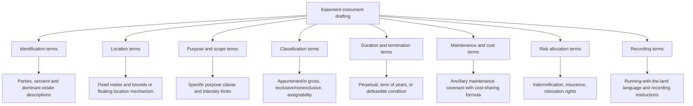

## Drafting Essential Terms in an Easement Instrument

### Overview

Even where the Statute of Frauds and the basic elements of an express grant or reservation are satisfied, the practical enforceability and long-term utility of an easement depend heavily on precise drafting. Poorly drafted easement instruments are a leading source of litigation over scope, location, maintenance responsibility, and termination. This entry catalogs the essential and recommended terms a well-drafted easement instrument should address, with attention to how courts interpret gaps or ambiguities when drafters omit them.

### Core Identifying Terms

**1. Parties and capacity**

- Full legal names of grantor and grantee, with a recital of the grantor's ownership interest in the servient estate.
- For reservations, clear identification of whether the benefit runs to the grantor personally, to a retained parcel, or (where jurisdictionally permitted) to a named third party.

**2. Legal description of the servient estate**

- A complete, recordable legal description (metes and bounds, or lot/block/plat reference) of the parcel being burdened.
- Reference to the recorded deed or plat under which the grantor holds title, to assist future title examiners.

**3. Legal description and location of the easement area**

- **Fixed-location easements**: metes and bounds description or an attached survey/exhibit precisely locating the easement's boundaries within the servient parcel — strongly recommended for rights of way, utility corridors, and any easement where location certainty avoids future disputes.
- **Floating easements**: language explicitly permitting the location to be fixed later by agreement, first actual use, or by one party's reasonable designation — appropriate where the exact route is not yet determined at the time of grant (e.g., a utility easement across an undeveloped parcel to be located upon final site design).
- **Key Point**: Once a floating easement's location is fixed by conduct or subsequent agreement, most courts hold that the location becomes fixed and cannot be unilaterally relocated by either party absent express reservation of a relocation right.

### Purpose and Scope Terms

**4. Statement of purpose**

- A clear, specific statement of what the easement is for (e.g., "for pedestrian and vehicular ingress and egress," "for the installation, operation, maintenance, repair, and replacement of underground electric transmission facilities").
- **[Inference]** Broad purpose language ("for any and all purposes") maximizes future flexibility for the easement holder but increases the servient owner's exposure to unanticipated future uses and is more likely to be scrutinized or narrowly construed by a court if a dispute arises; narrow purpose language provides more certainty but risks the easement becoming functionally obsolete if circumstances change (e.g., a "horse and carriage" easement not explicitly covering motor vehicles, though most courts permit reasonable technological evolution within a stated general purpose).

**5. Permitted manner and intensity of use**

- Specification of use limits (e.g., "for single-family residential access only," "limited to no more than [X] vehicle trips per day," "restricted to non-commercial use") where the parties intend to cap the easement's development beyond what a bare purpose clause would allow.
- Clarification of whether use may expand to serve after-acquired land of the dominant owner, or is strictly limited to serving the described dominant estate (the "no extension to after-acquired land" issue).

**6. Exclusivity designation**

- Express statement of whether the easement is exclusive or nonexclusive, since this affects the servient owner's ability to use the burdened area concurrently or grant similar rights to third parties.
- If exclusive, consideration of whether any residual owner rights should be expressly preserved (e.g., right to relocate, right to receive periodic reports, retained subsurface or airspace rights) to avoid the risk of the arrangement being reclassified as a lease or possessory transfer.

### Classification Terms

**7. Appurtenant or in gross designation**

- Express statement of whether the easement is appurtenant (and, if so, identification of the specific dominant estate) or in gross (and, if so, whether personal or commercial, and whether assignable/divisible).
- This avoids reliance on the default interpretive presumption favoring appurtenant status, which may not reflect the parties' actual intent.

**8. Assignability and divisibility**

- For easements in gross, explicit terms addressing whether the benefit may be assigned to a successor entity (particularly relevant for utility, pipeline, and infrastructure easements likely to be transferred through corporate mergers, acquisitions, or asset sales).
- Terms addressing whether the easement may be divided among multiple holders (relevant to the "one stock" rule) and, if so, under what conditions.

### Duration and Termination Terms

**9. Duration**

- Perpetual, for a term of years, for the life of a named person, or terminable upon a specified condition or event (e.g., "until such time as [servient parcel] is no longer used for [specified purpose]").
- If the parties intend the easement to terminate upon a future contingency, drafting this as a defeasible easement (e.g., "easement shall terminate automatically upon cessation of use of the dominant estate for residential purposes for a continuous period of two years") gives courts a clear textual basis for termination rather than requiring reliance on the more evidentiary-intensive common law abandonment doctrine.

**10. Termination and release mechanics**

- Procedure for voluntary release (e.g., requiring a signed, recorded release instrument).
- Whether merger of the dominant and servient estates automatically extinguishes the easement or whether the parties intend the easement to survive (though most jurisdictions treat merger as automatically extinguishing an easement regardless of contrary intent, since an owner cannot hold an easement over their own land).

### Maintenance, Cost-Sharing, and Improvement Terms

**11. Maintenance and repair obligations**

- **Key Point**: Because a bare easement traditionally cannot obligate the servient owner to expend money or perform affirmative acts, drafters typically pair the easement with an ancillary covenant (an agreement, separate from but recorded alongside the easement) allocating maintenance responsibility and cost-sharing between dominant and servient owners.
- Specification of which party bears responsibility for routine maintenance, repair after damage, and capital improvements, and in what proportions if shared (e.g., pro rata by number of users of a shared driveway).
- Enforcement mechanism for maintenance obligations (e.g., self-help with cost recovery, lien rights, or injunctive relief) since a maintenance covenant, being a promise rather than a use right, is enforced under covenant/equitable servitude principles rather than easement principles.

**12. Right to improve or alter**

- Whether the easement holder may pave, widen, grade, or otherwise improve the easement area, and whether servient owner consent is required for material alterations.
- For utility easements, whether the holder may trim or remove vegetation, install ancillary equipment (transformers, access gates, signage), and under what notice requirements.

### Risk Allocation Terms

**13. Indemnification and insurance**

- Common in commercial and utility easements: provisions requiring the easement holder to indemnify the servient owner for damages arising from the holder's use, and to maintain specified insurance coverage.

**14. Relocation rights**

- Provisions allowing the servient owner to relocate the easement (particularly relevant for utility and access easements) at the servient owner's expense, provided the relocation does not materially impair the easement holder's use — reflecting the flexible relocation approach adopted by the Restatement (Third) § 4.8 in jurisdictions that have embraced it, as an alternative to the traditional rule that a fixed-location easement cannot be unilaterally relocated absent agreement.

### Recording and Notice Terms

**15. Recording instructions and covenant running with the land language**

- Express statement that the easement (and any ancillary covenants) is intended to run with the land and bind successors and assigns of both the dominant and servient estates — helpful evidence of intent even though modern law increasingly infers this from context.
- Instructions or acknowledgment regarding recording in the applicable county or jurisdiction's land records.

### Comprehensive Drafting Checklist

| Category | Essential Term |
| --- | --- |
| Identification | Parties, servient estate legal description, dominant estate legal description (if appurtenant) |
| Location | Fixed metes and bounds/exhibit, or floating easement mechanism |
| Purpose and scope | Specific purpose statement; permitted intensity/manner of use; after-acquired land limitation |
| Classification | Appurtenant vs. in gross; exclusive vs. nonexclusive; assignability/divisibility |
| Duration | Perpetual, term of years, or conditional/defeasible termination event |
| Termination mechanics | Release procedure; merger treatment; abandonment standard if any |
| Maintenance | Responsibility allocation; cost-sharing formula; enforcement mechanism |
| Alteration rights | Improvement rights; relocation rights and procedure |
| Risk allocation | Indemnification; insurance requirements |
| Recording | Running-with-the-land language; recording instructions |

### Illustrative Example

**Example**

A comprehensive shared driveway easement between two residential neighbors might include: (1) a metes and bounds description of the 12-foot-wide driveway strip; (2) a statement that the easement is nonexclusive and appurtenant to both lots, benefiting and burdening each reciprocally; (3) a purpose clause limited to "vehicular and pedestrian ingress and egress for residential purposes"; (4) a maintenance covenant requiring each owner to pay 50% of repaving and snow removal costs, with a lien remedy for nonpayment; (5) a provision stating the easement is perpetual and runs with the land, binding heirs, successors, and assigns; and (6) a release mechanism requiring a signed, recorded instrument executed by both current owners. Without these terms, a dispute over which owner must pay for a needed repaving project would require expensive litigation and reliance on default legal rules that may not reflect either party's expectations.

### Diagram: Drafting Term Categories

**Next Steps**

- Ancillary Maintenance Covenants Paired with Easements
- Fixed vs. Floating Easement Locations and Relocation Rights Under Restatement § 4.8
- Defeasible Easements and Drafting Automatic Termination Conditions
- Scope of Use Limitations and the "No Extension to After-Acquired Land" Rule
- Assignability and Divisibility Clauses for Commercial Easements in Gross
- Indemnification and Insurance Provisions in Utility and Access Easements
- Interpretation of Ambiguous Purpose Clauses and Reasonable Technological Evolution
- Recording Practices and Running-with-the-Land Language in Servitude Instruments