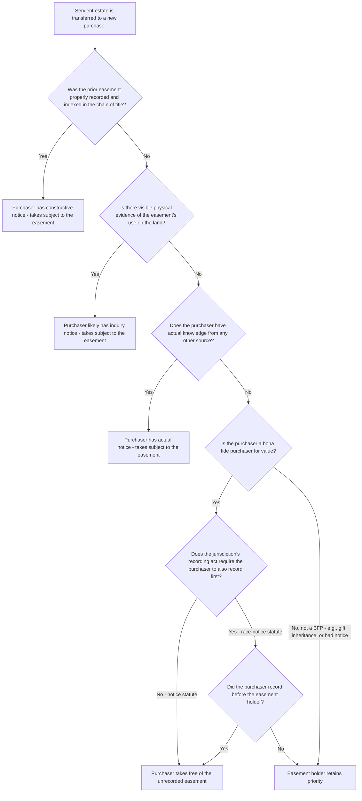

## Recording and Notice Requirements

### Overview

Recording is the mechanism by which an easement, once validly created between the original parties, is made discoverable to and enforceable against future purchasers of the servient estate. While a validly executed easement is binding on the original grantor and grantee without recording, its enforceability against subsequent bona fide purchasers depends on the interplay between the applicable recording act and the doctrine of notice. This entry examines the three recording act frameworks, the categories of notice, and how these principles determine whether an easement survives a subsequent transfer of the servient estate.

### The Purpose of Recording

**Key Points**

- Recording statutes exist to create a public, searchable chain of title so that prospective purchasers and lenders can discover existing interests in land before completing a transaction.
- Recording does not itself create the easement — that occurs upon valid execution and delivery of a compliant instrument — but recording protects the easement's priority against later purchasers and encumbrancers of the servient estate.
- An easement that is validly created but never recorded remains fully enforceable between the original grantor and grantee (and their successors who take with notice), but risks extinguishment against a subsequent bona fide purchaser for value without notice, depending on the jurisdiction's recording act.

### The Three Recording Act Frameworks

**1. Race statutes**

- Priority goes to whichever party records first, regardless of notice.
- A subsequent purchaser who records before the easement holder prevails even if the subsequent purchaser had actual knowledge of the earlier unrecorded easement.
- **[Inference]** Pure race statutes are relatively rare in modern American practice; only a small minority of jurisdictions retain this framework, generally reserved for very narrow categories of instruments.

**2. Notice statutes**

- A subsequent bona fide purchaser for value, without notice (actual, constructive, or inquiry) of a prior unrecorded interest, prevails over that prior interest — regardless of whether the subsequent purchaser records first.
- Under a notice statute, if a purchaser buys the servient estate without any notice of the prior easement, the purchaser prevails over the easement holder even if the purchaser never gets around to recording their own deed.

**3. Race-notice statutes**

- A subsequent bona fide purchaser for value, without notice of a prior unrecorded interest, prevails over that prior interest **only if** the subsequent purchaser also records first.
- This is the most common framework among American states, combining protections of both prior frameworks: the subsequent purchaser must both lack notice and win the race to record.

**Comparative table**

| Recording Act Type | Requires Lack of Notice? | Requires Winning the Race to Record? | Practical Effect |
| --- | --- | --- | --- |
| Race | No | Yes | First to record wins, regardless of knowledge |
| Notice | Yes | No | Bona fide purchaser without notice wins even without recording |
| Race-notice | Yes | Yes | Bona fide purchaser without notice wins only if they also record first |

### Categories of Notice

**1. Actual notice**

The subsequent purchaser has actual, subjective knowledge of the prior easement, however that knowledge was obtained (told directly by a neighbor, saw the recorded document, observed correspondence referencing it, etc.).

**2. Constructive notice (record notice)**

- Notice imputed to a purchaser because the prior easement was properly recorded in the servient estate's chain of title, regardless of whether the purchaser actually searched the records.
- The law presumes that a purchaser who conducts a reasonable title search would have discovered a properly recorded, indexed instrument; therefore, the purchaser is charged with knowledge of it whether or not an actual search was performed.
- **Wild deeds and chain-of-title problems**: an instrument recorded outside the direct chain of title (e.g., recorded by a grantor who does not yet appear as the record owner, or indexed incorrectly) may not impart constructive notice even though it is technically "recorded," because a reasonable title search following the standard chain would not locate it.

**3. Inquiry notice**

- Notice imputed to a purchaser because visible physical evidence on the land, or information reasonably available, would have prompted a reasonable purchaser to make further inquiry, which inquiry would have revealed the existence of the easement.
- **Common triggers for inquiry notice**: a visible worn path or gravel road crossing the property, utility poles or above-ground pipelines, a fence line inconsistent with the recorded boundary, or a neighbor's active, open use of a portion of the servient parcel.
- **[Inference]** Inquiry notice is particularly significant for unrecorded easements created by implication, prescription, or estoppel, since these often arise precisely from visible, long-standing use patterns that a diligent purchaser inspecting the property should have investigated, even though no recorded instrument exists to provide constructive notice.

### The Bona Fide Purchaser Requirement

To claim the protection of a notice or race-notice statute against a prior unrecorded easement, a subsequent purchaser must qualify as a **bona fide purchaser (BFP)**, generally requiring:

- **Purchase for value**: a purchaser who receives the servient estate by gift, inheritance, or other non-value transfer generally does not qualify as a BFP and takes subject to prior unrecorded interests regardless of notice.
- **Without notice**: at the time of the purchase (not afterward), the purchaser must lack actual, constructive, and inquiry notice of the prior easement.
- **Good faith**: the purchaser must not be complicit in any fraud or collusion designed to defeat the prior easement holder's rights.

**Key Point**: Because lenders and mortgagees typically qualify similarly to purchasers under most recording acts (as "purchasers for value" in the broad statutory sense), an easement's priority relative to a mortgage on the servient estate is analyzed under the same recording act and notice framework — an easement recorded before a mortgage is originated generally has priority and survives foreclosure, whereas an easement created after a mortgage was recorded is typically extinguished by foreclosure of a senior lien unless the mortgagee consented or subordinated its interest.

### Recording Mechanics and Indexing

**Key Points**

- Most jurisdictions use either a **grantor-grantee index** (organized alphabetically by the names of grantors and grantees) or, less commonly, a **tract index** (organized by parcel/property description) to record and search instruments.
- Under a grantor-grantee index system, a title searcher must trace the chain of title backward and forward through each grantor's and grantee's name during their period of ownership to locate all recorded instruments affecting a parcel, including easements granted or reserved by prior owners.
- An easement should ideally be recorded (or referenced) in both the servient and dominant estate's chains of title, since a title search of only one parcel might not reveal an easement recorded solely against the other, depending on local indexing conventions and cross-referencing practices.

### Recording Easements Created by Non-Express Means

**Key Points**

- Implied easements (from prior use or necessity) and prescriptive easements arise by operation of law and are not created by a recordable instrument at the moment of their creation; there is often no single document to record establishing them.
- Because these easements typically lack a recorded instrument, subsequent purchasers of the servient estate are more likely to be charged with **inquiry notice** based on visible evidence of the use, rather than constructive (record) notice.
- Once such an implied or prescriptive easement's existence is judicially confirmed (through a quiet title action or declaratory judgment), the resulting judgment or a subsequent confirmatory instrument can and typically should be recorded to provide clear constructive notice going forward and avoid repeat litigation with future purchasers.

### Illustrative Examples

**Example**

*Race-notice jurisdiction, unrecorded easement*: Owner A grants Owner B a right-of-way easement across A's parcel but B never records the instrument. A later sells the same parcel to Purchaser C, who has no actual knowledge of the easement, sees no visible evidence of use (the path has not yet been developed), and promptly records the deed. In a race-notice jurisdiction, C likely qualifies as a bona fide purchaser without notice who also won the race to record, and C would take the servient parcel free of B's unrecorded easement.

**Example**

*Inquiry notice defeats a purchaser's claim*: Same facts, except that by the time C purchases the parcel, a well-worn gravel driveway visibly crosses A's land connecting to B's parcel, and utility markers are visible along the path. Even though B never recorded the easement, a court may find that this visible evidence should have prompted C to inquire about the driveway's use before purchasing, and that reasonable inquiry would have revealed B's easement — placing C on inquiry notice and defeating C's claim to take free of the easement, notwithstanding C's formal lack of actual or constructive (record) notice.

**Example**

*Wild deed problem*: A grantor conveys an easement to a neighbor, but the instrument is recorded under a misspelled or incorrect grantor name, or is indexed against a parcel description that does not match the standard chain of title. A subsequent purchaser conducting a standard title search following the proper chain of title for the correct legal description would not locate this "wild deed," and many jurisdictions hold that such an improperly indexed instrument does not impart constructive notice, potentially leaving the easement vulnerable to a subsequent bona fide purchaser despite technically being "recorded" somewhere in the county records.

### Diagram: Recording and Notice Analysis

**Next Steps**

- Bona Fide Purchaser Doctrine and Its Application to Servient Estate Transfers
- Inquiry Notice from Visible Use: Standards and Illustrative Case Patterns
- Chain of Title Searches and the Wild Deed Problem
- Priority Disputes Between Easements and Mortgages on the Servient Estate
- Recording Implied and Prescriptive Easements After Judicial Confirmation
- Grantor-Grantee Indexing Systems vs. Tract Indexing in Title Searches
- Title Insurance and Easement Disclosure in Real Estate Transactions
- Marketable Title Acts and the Extinguishment of Stale Recorded Easements