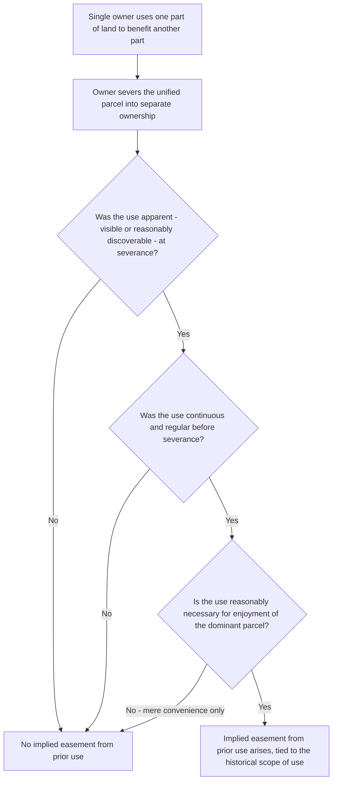

## Easements Implied from Prior Use

### Overview

An easement implied from prior use (sometimes called a "quasi-easement" doctrine) arises by operation of law when a single owner has used one part of their land to benefit another part in an apparent, continuous manner, and later severs the unified parcel into separate ownership without expressly addressing the use in the conveyance. Courts imply an easement to preserve the pre-severance use pattern, reasoning that the parties would likely have intended the arrangement to continue had they turned their minds to it. This doctrine is one of the principal non-written, operation-of-law creation methods for easements, alongside easements by necessity and prescriptive easements.

### The "Quasi-Easement" Concept

Before severance, a single owner cannot hold a true easement over their own land (an easement requires two distinct owners). However, where one portion of a unified parcel is used in a manner that would constitute an easement if the parcels were separately owned, courts describe this as a **quasi-easement**: the portion benefited is the **quasi-dominant estate**, and the portion burdened is the **quasi-servient estate**. Upon severance, if the elements below are satisfied, the quasi-easement "ripens" into a true implied easement.

### Elements Required for Implication from Prior Use

Courts generally require the following elements, though formulations vary somewhat by jurisdiction:

**1. Unity of ownership followed by severance**

The dominant and servient parcels must have been under common ownership at some point, and that unified ownership must be severed by a conveyance of one or both parcels to separate owners (or by partition).

**2. Apparent (visible or discoverable) use at the time of severance**

- The use giving rise to the claimed easement must have been apparent — either actually visible upon reasonable inspection, or discoverable through reasonably diligent investigation — at the time of severance.
- **Key Point**: "Apparent" does not necessarily mean visible to the naked eye at ground level; courts have found underground utility lines, septic systems, and drainage pipes "apparent" where their existence would be revealed by a reasonably careful inspection (such as noticing a septic tank cover, a drainage outlet, or utility connection points), even though the underground portion itself is not directly visible.
- **[Inference]** Jurisdictions differ on how strictly "apparent" is construed; some require something visibly discoverable on physical inspection of the premises, while others allow evidence of the parties' actual knowledge of the use even without physical visibility, softening the apparency requirement where actual knowledge is otherwise proven.

**3. Continuous use**

- The use must have been continuous (or at least regular and consistent) rather than sporadic or occasional, demonstrating that it was a settled, ongoing arrangement rather than an incidental or temporary convenience.
- Continuity does not require constant, uninterrupted use every moment; a driveway used regularly for access, or a drainage pattern that operates whenever it rains, satisfies continuity even though the use is intermittent in a literal sense.

**4. Necessity (or "reasonable necessity") for enjoyment of the dominant estate**

- Most American jurisdictions require the claimed easement to be **reasonably necessary** for the use and enjoyment of the dominant parcel at the time of severance — a considerably lower threshold than the "strict necessity" required for easements implied from necessity.
- Reasonable necessity typically means the dominant estate's use and enjoyment (as it existed at severance, or as reasonably contemplated) would be significantly more difficult, expensive, or inconvenient without the easement, even if alternative access or utility routes theoretically exist.
- **[Inference]** A minority of jurisdictions, particularly for implied easements arising upon severance in favor of a *grantor* who retains land benefited by a use over land conveyed away, sometimes apply a stricter necessity standard than for easements benefiting a *grantee* — reflecting a residual historical skepticism, comparable to the reservation/grant asymmetry, toward implying benefits in favor of the party who drafted the conveyance.

**5. Intent of the parties (inferred from the above circumstances)**

- Courts frame the ultimate inquiry as one of implied intent: given the apparent, continuous, and necessary use existing at severance, would the parties reasonably have intended the use to continue as a legal easement had they specifically addressed it in the conveyance?
- This element is typically satisfied automatically once apparency, continuity, and reasonable necessity are established, since courts treat these three factors as strong circumstantial evidence of the parties' probable intent.

### Distinguishing Implication in Favor of Grantor vs. Grantee

**Key Points**

- Where the claimed easement would benefit the parcel retained by the **grantor** (meaning it burdens the parcel just conveyed to the grantee), this functions similarly to an implied reservation.
- Where the claimed easement would benefit the parcel conveyed to the **grantee** (meaning it burdens the parcel retained by the grantor), this functions similarly to an implied grant.
- Historically, some courts applied a stricter standard for implied reservations (benefiting the grantor) than for implied grants (benefiting the grantee), reasoning that a grantor who drafts the conveyance and wishes to retain a benefit should bear the burden of expressly reserving it, whereas a grantee has less control over the instrument's language and deserves more protection through implication.
- The modern trend, reflected in the **Restatement (Third) of Property: Servitudes § 2.12**, applies the same reasonable necessity standard regardless of whether the claimed easement functions as an implied grant or an implied reservation, treating the historical asymmetry as an outdated formalism.

### Comparative Table: Prior Use vs. Necessity Implication

| Feature | Implication from Prior Use | Implication from Necessity |
| --- | --- | --- |
| Requires prior apparent use before severance | Yes | No — necessity alone can suffice even without any prior use pattern |
| Necessity standard | Reasonable necessity (lower threshold) | Strict necessity (higher threshold — typically requiring the parcel to be landlocked or functionally inaccessible) |
| Duration of the easement | Generally perpetual, tied to the historical use pattern | Generally lasts only as long as the necessity continues; terminates if alternative access becomes available |
| Typical fact pattern | An underground drain, shared driveway, or utility line used before a parcel was subdivided | A landlocked parcel created by a conveyance that leaves it with no access to a public road |
| Governing rationale | Preserving the parties' probable intent based on established use patterns | Public policy against landlocking parcels and rendering land unusable |

### Illustrative Examples

**Example**

*Classic drainage scenario*: A single owner constructs a home with a drainage pipe running underground from the rear of the lot across what is now a neighboring lot, discharging into a municipal storm drain. The owner then sells the rear portion of the property (through which the pipe runs) to a new owner, without mentioning the drainage pipe in the deed. If the pipe's existence was apparent (e.g., a visible discharge point or drainage grate, or would have been revealed by reasonable inspection), was in continuous, regular operation, and its continued function is reasonably necessary for proper drainage of the retained parcel, a court may imply an easement allowing the drainage to continue across the newly conveyed parcel.

**Example**

*Apparent underground utility line*: Before subdividing a large parcel into two lots, the owner ran an underground electrical line from the main service connection on Lot 1 to a detached workshop that ends up on Lot 2 after subdivision. Although the line itself is underground and not visible, a junction box and meter are visible at the workshop, and the connection point at the main panel is discoverable upon inspection. A court is likely to find the "apparent" element satisfied because a reasonably diligent inspection would reveal the connection, even without seeing the buried cable directly.

**Example**

*Failure of the reasonable necessity element*: A prior owner occasionally walked across the back corner of what became a neighboring lot as a shortcut to a public path, even though a perfectly serviceable alternate route existed along the parcel's own frontage. After severance, the new owner of the dominant parcel claims an implied easement for the shortcut. Because an equally convenient alternative already existed, most courts would find the reasonable necessity element unsatisfied — mere added convenience, without more, is generally insufficient to imply an easement from prior use.

### Diagram: Implication from Prior Use Analysis

### Diagram: Quasi-Dominant and Quasi-Servient Estate Before Severance

<svg xmlns="http://www.w3.org/2000/svg" viewBox="0 0 700 300" font-family="Helvetica, Arial, sans-serif">
<text x="350" y="26" text-anchor="middle" font-size="16" font-weight="bold" fill="#1a1a1a">Quasi-Easement Before and After Severance (svg_diagram)</text>

<text x="175" y="55" text-anchor="middle" font-size="12" font-weight="bold" fill="#333">Before Severance (One Owner)</text>

<rect x="60" y="70" width="230" height="140" fill="`#f0f0f0`" stroke="#555" stroke-width="2" />

<line x1="175" y1="70" x2="175" y2="210" stroke="#888" stroke-dasharray="4,3" />

<text x="115" y="145" text-anchor="middle" font-size="10" fill="#333">Quasi-Servient</text>

<text x="235" y="145" text-anchor="middle" font-size="10" fill="#333">Quasi-Dominant</text>

<line x1="130" y1="100" x2="220" y2="180" stroke="`#b8322e`" stroke-width="2" />

<text x="175" y="230" text-anchor="middle" font-size="10" fill="`#b8322e`">Internal use pattern (e.g., drain line)</text>

<text x="565" y="55" text-anchor="middle" font-size="12" font-weight="bold" fill="#333">After Severance (Two Owners)</text>

<rect x="410" y="70" width="115" height="140" fill="`#dfeeff`" stroke="`#2e5cb8`" stroke-width="2" />

<text x="467" y="145" text-anchor="middle" font-size="10" fill="#333">Servient</text>

<text x="467" y="160" text-anchor="middle" font-size="10" fill="#333">Estate</text>

<rect x="525" y="70" width="115" height="140" fill="#e6f7e6" stroke="#2e8b57" stroke-width="2" />
<text x="582" y="145" text-anchor="middle" font-size="10" fill="#333">Dominant</text>
<text x="582" y="160" text-anchor="middle" font-size="10" fill="#333">Estate</text>
<line x1="440" y1="180" x2="595" y2="100" stroke="#b8322e" stroke-width="2" />
<text x="520" y="230" text-anchor="middle" font-size="10" fill="#b8322e">Implied easement preserves the use</text>
</svg>

**Next Steps**

- Easements Implied from Necessity: The Strict Necessity Standard
- The Apparency Requirement and Underground/Concealed Uses
- Reasonable Necessity vs. Strict Necessity: Comparative Standards
- Implied Grant vs. Implied Reservation: Historical Asymmetry and Modern Convergence
- Restatement (Third) § 2.12 on Servitudes Implied from Prior Use
- Termination of Implied Easements When the Underlying Necessity or Use Pattern Ends
- Scope Limitations on Implied Easements Based on Historical Use Patterns
- Prescriptive Easements as an Alternative Non-Written Creation Pathway