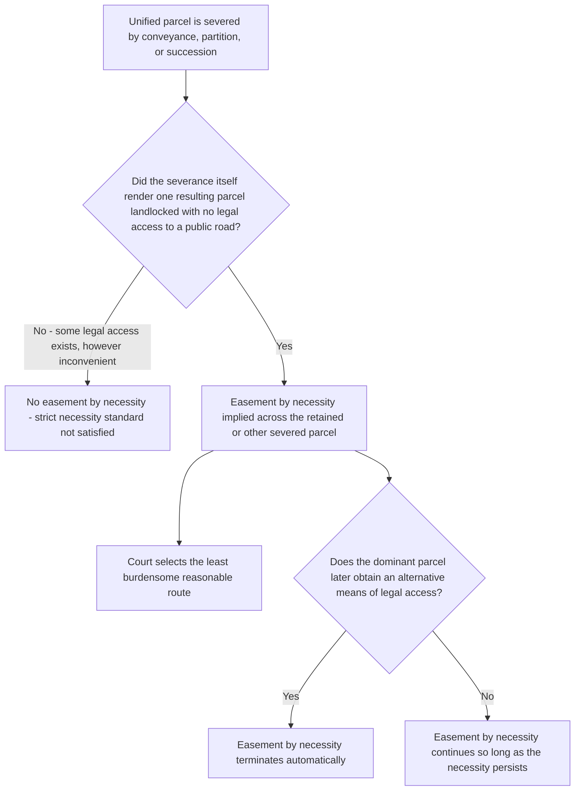

## Easements by Necessity

### Overview

An easement by necessity is an implied easement arising when a conveyance severs a previously unified parcel in a manner that leaves one of the resulting parcels landlocked, with no legally adequate access to a public road. Unlike an easement implied from prior use, an easement by necessity does not require any pre-existing use pattern at all — it is grounded purely in the strict necessity created by the severance itself, reflecting a strong public policy against rendering land unusable. This doctrine is one of the oldest and most consistently applied implied-easement categories across American jurisdictions.

### Elements Required for an Easement by Necessity

**1. Unity of ownership followed by severance**

As with implication from prior use, the dominant and servient parcels must have been under common ownership, with that unity severed by a conveyance of one or both resulting parcels (or by partition among co-owners, devise, or intestate succession) to create the separation giving rise to the necessity.

**2. Strict necessity at the time of severance**

- The claimed dominant parcel must have been rendered landlocked (or otherwise without legally adequate access) *by the severance itself*, not by some later, unrelated event.
- **Strict necessity** requires more than mere inconvenience: the parcel must lack any legally enforceable access to a public road, not merely a less convenient or more expensive route. If an alternative means of legal access exists — even if that access is more circuitous, requires crossing a third party's land under some other legal right, or involves greater expense — most jurisdictions hold that strict necessity is not satisfied.
- **[Inference]** A minority of jurisdictions apply a "reasonable necessity" standard for necessity easements as well (rather than the traditional strict necessity standard), particularly where an existing alternative route is so impractical, costly, or physically difficult (e.g., requiring construction across a steep ravine or wetland) that it does not constitute meaningful legal access in practical terms — but strict necessity remains the majority and traditional rule.

**3. Necessity existing at the time of severance, not created later**

- The necessity must arise from and exist at the moment of severance. If a parcel had adequate access at the time of severance but later lost that access due to a subsequent, unrelated event (such as a later owner's voluntary abandonment of an alternate access route, or a later government road closure), courts generally will not imply an easement by necessity based on that later development, because the doctrine is tied specifically to the circumstances the original conveyance created.
- **[Inference]** Some jurisdictions permit reopening the necessity analysis if the subsequent loss of access is itself traceable to circumstances connected with the original severance, but this is a narrower and more fact-specific inquiry than the core doctrine.

### The Public Policy Rationale

**Key Points**

- The doctrine is grounded in the policy that land should not be rendered useless or unmarketable by being cut off from any legal means of access — courts imply the necessary access because otherwise the landlocked parcel would have essentially no economic or practical value.
- **[Inference]** Because the rationale is public-policy-driven rather than purely intent-based, some courts articulate the doctrine as resting on an irrebuttable (or nearly irrebuttable) presumption that grantors and grantees would not have intended to render any part of the severed land useless, even though this framing blends with the alternative theory that the doctrine exists independent of subjective intent altogether, based purely on public policy against landlocked parcels.

### Location and Scope of the Implied Easement

**Key Points**

- Because an easement by necessity does not arise from any specific prior use pattern, its precise **location** is not predetermined and must be judicially or mutually established after the fact.
- Courts generally select the route that is **least burdensome to the servient estate** while still providing adequate access to the dominant estate, considering factors such as the shortest reasonable distance, existing topography, and minimization of interference with the servient owner's use of their land.
- The **scope** of the easement is generally limited to what is reasonably necessary for access, though courts differ on whether the scope may expand over time to accommodate reasonably foreseeable development of the dominant parcel (e.g., evolving from a footpath-scale easement to one accommodating vehicular access, if such development was reasonably foreseeable at severance).

### Duration and Termination

**Key Points**

- Unlike most other easements, an easement by necessity is generally understood to **last only as long as the necessity continues**.
- If the dominant parcel later gains an alternative means of legal access (for example, through a new public road being built adjacent to the parcel, or the dominant owner acquiring an adjoining parcel with its own road frontage), the easement by necessity terminates automatically once the necessity ends, in most jurisdictions.
- **[Inference]** This self-terminating feature distinguishes easements by necessity from most implied easements from prior use, which typically continue indefinitely (perpetually) once established, regardless of whether the originally motivating use pattern persists — reflecting the different rationale underlying each doctrine (necessity-driven policy vs. preservation of established use and probable intent).

### Comparative Table: Necessity vs. Prior Use Implication

| Feature | Easement by Necessity | Easement Implied from Prior Use |
| --- | --- | --- |
| Requires prior use pattern | No | Yes |
| Necessity standard | Strict necessity (landlocked, no legal access) | Reasonable necessity (significant inconvenience without it) |
| Location determined by | Historical route not required; court selects least burdensome route | Historical, established route of prior use |
| Duration | Terminates automatically when necessity ends | Generally perpetual, tied to the historical use pattern |
| Underlying rationale | Public policy against landlocked, unusable land | Preservation of probable intent based on established use |

### Easement by Necessity vs. Statutory Private Way / Way of Necessity Statutes

**Key Points**

- Many states have enacted **statutory "private way" or "way of necessity" statutes** that provide an alternative, often broader, mechanism for a landlocked owner to obtain court-ordered access across a neighboring parcel, sometimes even where the landlocked condition did not arise from a common-ownership severance (a key requirement for the common law doctrine).
- These statutes frequently require the landlocked owner to pay compensation to the servient owner (unlike the traditional common law implied easement by necessity, which typically does not require ongoing compensation, since it is treated as arising from the original bargain).
- **[Inference]** Because statutory private way procedures and eligibility requirements vary significantly by state — including differences in compensation requirements, procedural steps, and whether a common-ownership history is required — practitioners must consult the specific state statute rather than assume the common law doctrine and any statutory alternative operate identically.

### Illustrative Examples

**Example**

*Classic landlocking by conveyance*: A single owner holds a large tract with frontage on a public road. The owner sells the rear portion of the tract, which has no direct access to any public road, retaining the front portion (which does have road frontage) for themselves. Because the severance itself created the landlocked condition, a court will imply an easement by necessity across the retained front parcel to provide the rear parcel with access to the public road, even though the original deed said nothing about any right of way.

**Example**

*Necessity terminates when alternative access arises*: Years after the easement by necessity is established, a new public road is constructed adjacent to the previously landlocked rear parcel, giving it direct, independent access. Under the majority rule, the easement by necessity terminates automatically once this alternative legal access becomes available, because the necessity that justified the easement's existence no longer exists.

**Example**

*Strict necessity not satisfied — alternative access exists*: A parcel has access to a public road only via a long, winding gravel path across a neighbor's land that is far less convenient than a hypothetical shorter route across a different neighbor's property, but the winding gravel path constitutes legally adequate, if inconvenient, access. A court applying the strict necessity standard would likely deny a claim for an easement by necessity across the more convenient route, since strict necessity requires the absence of *any* legal access, not merely the absence of the *most convenient* access.

### Diagram: Easement by Necessity Analysis

**Next Steps**

- Statutory Private Way and Way of Necessity Procedures Across States
- Determining Location and Scope of an Implied Easement by Necessity
- Termination of Easements by Necessity When Alternative Access Arises
- Easements Implied from Prior Use: Distinguishing the Reasonable Necessity Standard
- Landlocked Parcels Created by Partition, Devise, or Intestate Succession
- Compensation Requirements Under Statutory Private Way Procedures
- Scope Expansion of Necessity Easements for Foreseeable Development
- Common Ownership and Severance Requirements Across Implied Easement Doctrines